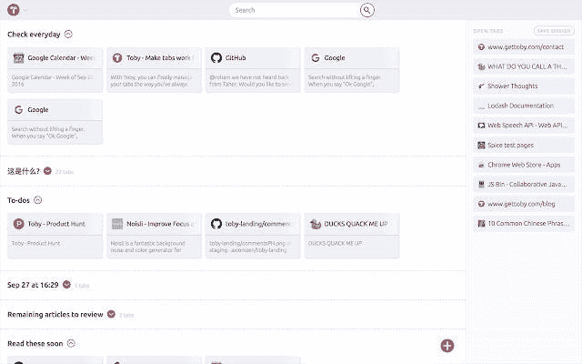
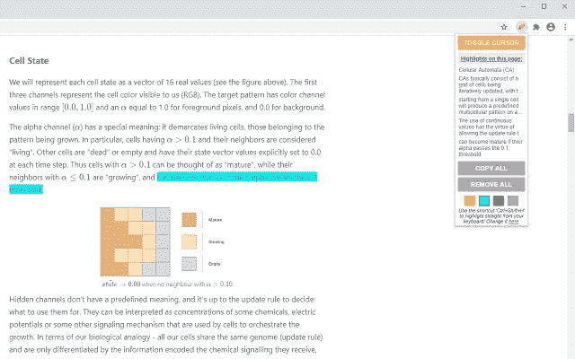
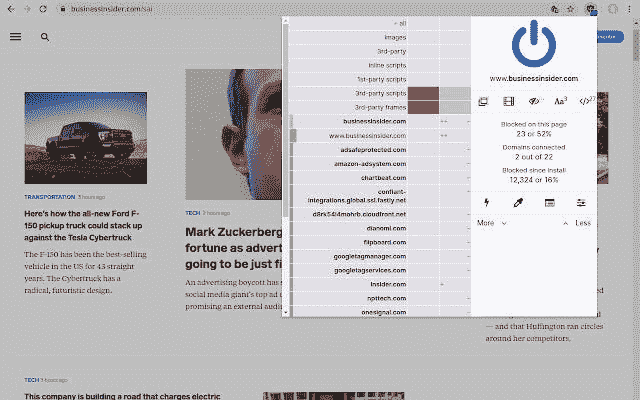

# My 9 必备的 Chrome 浏览器扩展，用于提高开发人员的工作效率

> 原文：<https://betterprogramming.pub/my-9-must-have-chrome-browser-extensions-for-increased-developer-productivity-6188f7561a09>

## 我用来阻挡干扰的浏览器扩展列表

克里斯纳四世在 [Unsplash](https://unsplash.com?utm_source=medium&utm_medium=referral) 上拍摄的照片。

在本文中，我将讨论我作为开发人员用来提高生产力的浏览器扩展。

我已经使用这些扩展有一段时间了，它们提高了我的工作效率，帮助我节省了时间。我可以更好地集中注意力，做更多的工作，更快地完成它。希望他们也能帮到你！

# 1.概念网页裁剪器

保存浏览器书签列表的链接对我来说效率不是很高。原因是链接组织得很差。保存链接后再也找不到了。

因此，我使用了[概念 Web Clipper](https://chrome.google.com/webstore/detail/notion-web-clipper/knheggckgoiihginacbkhaalnibhilkk?hl=en) 扩展来保存链接。你只需把它安装到你的浏览器上，每次你想保存一个链接时，你就点击这个扩展。新保存的链接被添加到现有的概念文档中。或者您可以在保存链接之前创建一个。

那么，为什么要用概念呢？原因是你可以把链接拆分成不同的文档，比如 WebDev 链接，productivity 等等。你也可以用浏览器书签做到这一点，但它组织得很差。此外，您可以向保存在概念文档中的链接添加标签。因此，存储和组织链接变得更加容易。我强烈推荐！

图片来自 [Chrome 网络商店](https://chrome.google.com/webstore/detail/notion-web-clipper/knheggckgoiihginacbkhaalnibhilkk?hl=en)。

# 2.托比

当你在浏览器中打开太多标签页时，很难找到任何东西。Toby 可以帮上忙，因为它可以让你将标签分类。

你可以创建诸如金融、稍后阅读、待办事项或任何你想要的类别。然后，您可以向每个类别添加浏览器选项卡。下图说明了扩展的作用。你可以看到管理你的标签页是多么容易和多么好。除此之外，您还可以搜索特定的选项卡或类别。

图片来自 [Chrome 网络商店](https://chrome.google.com/webstore/detail/toby-for-chrome/hddnkoipeenegfoeaoibdmnaalmgkpip?utm_source=chrome-ntp-icon)。

这个浏览器扩展是我的必需品之一，因为它帮助我保持有序。我强烈推荐！

# 3.区块网站

[BlockSite](https://chrome.google.com/webstore/detail/blocksite-stay-focused-co/eiimnmioipafcokbfikbljfdeojpcgbh?hl=en) 扩展允许你屏蔽互联网干扰，帮助你保持专注。您可以阻止某些网站并将其列入白名单。如果你认为某个特定的网站会分散你的注意力，你可以屏蔽它。另一方面，你可以屏蔽所有网站，只允许访问你列入白名单的网站。

任何时候你试图访问一个被阻止的网站，你都会得到一个错误。因此，这是停止拖延和分心的好方法。这种扩展真正提高了你的注意力和工作效率。

作者截图。

上图展示了当你试图访问一个被屏蔽的网站时你会看到什么！

# 4.荧光笔

图片来自 [Chrome 网上商店](https://chrome.google.com/webstore/detail/highlighter/fdfcjfoifbjplmificlkdfneafllkgmn)。

有时，我发现有价值的信息，我想突出它们，这样我就可以随时回头再看。[荧光笔](https://chrome.google.com/webstore/detail/highlighter/fdfcjfoifbjplmificlkdfneafllkgmn)浏览器扩展允许我这样做。

有了这个扩展，你可以在任何网站上高亮显示文本并保存下来。这意味着当您关闭页面或浏览器时，您不会丢失突出显示的内容。目前，它最适用于博客和其他静态网站。例如，如果你在社交媒体上突出显示文本，效果可能不是最好的。

使用这个扩展来“保存”大量信息，永远不会丢失它们！这是一个伟大而方便的浏览器扩展。

# 5.番茄助手

图片来自 [Chrome 网络商店](https://chrome.google.com/webstore/detail/marinara-pomodoro%C2%AE-assist/lojgmehidjdhhbmpjfamhpkpodfcodef?hl=en)。

番茄工作法是一种流行的时间管理方法。使用这种技术，您可以使用一个计时器将工作分成若干间隔。每个工作间隔的长度是 25 分钟，然后是短暂的休息——尽管番茄工作法建议你可以根据自己的需要调整间隔和休息时间。

所以这个[番茄助手](https://chrome.google.com/webstore/detail/marinara-pomodoro%C2%AE-assist/lojgmehidjdhhbmpjfamhpkpodfcodef?hl=en)扩展可以让你使用番茄功。我已经使用这个技术和扩展一年多了，它提高了我的工作效率。这要归功于工作间隙，在这段时间里，我只专注于我的工作。

# 6.Adblock

在这一点上，我相信大多数人用的是 [Adblock](https://chrome.google.com/webstore/detail/adblock-plus-free-ad-bloc/cfhdojbkjhnklbpkdaibdccddilifddb) 。但是，我每天都在使用它，所以想提一下。它会阻止以下内容:

*   视频广告
*   旗帜
*   弹出窗口
*   跟踪

除了屏蔽所有烦人的广告，它还能加快你的浏览速度。原因是由于广告被屏蔽，它必须加载更少的数据。

# 7.假填充物

如果你是手动的，用假数据测试你的应用是很费时间的。谢天谢地，[假灌装机](https://chrome.google.com/webstore/detail/fake-filler/bnjjngeaknajbdcgpfkgnonkmififhfo?hl=en)在这里为你自动完成。这个浏览器扩展在几秒钟内用随机数据完成字段。

图片来自 [Chrome 网上商店](https://chrome.google.com/webstore/detail/fake-filler/bnjjngeaknajbdcgpfkgnonkmififhfo?hl=en)。

该扩展将通过自动填写带有虚拟数据的字段来节省您的大量时间。

# 8.清除缓存

清除浏览器缓存可能需要一段时间。您需要进入设置，找到选项，然后选择要删除的内容。如果你需要经常这样做，它会变得很乏味。[清除缓存](https://chrome.google.com/webstore/detail/clear-cache/cppjkneekbjaeellbfkmgnhonkkjfpdn?utm_source=chrome-ntp-icon)浏览器扩展允许您一键清除缓存。

此外，您可以定制要清除的数据。您可以选择:

*   应用缓存
*   饼干
*   下载
*   文件系统
*   格式数据
*   历史
*   索引数据库
*   局部存储器
*   插件数据
*   密码

图片来自 [Chrome 网上商店](https://chrome.google.com/webstore/detail/clear-cache/cppjkneekbjaeellbfkmgnhonkkjfpdn?utm_source=chrome-ntp-icon)。

上图显示了扩展的设置。您可以自定义清除的内容和时间段。

# 9.子块来源

我想先提一下，它不像 Adblock。 [uBlock Origin](https://chrome.google.com/webstore/detail/ublock-origin/cjpalhdlnbpafiamejdnhcphjbkeiagm?hl=en) 更强大，在 CPU 和内存上很轻松。除此之外，它是一个内容拦截器，而不是广告拦截器。下面，您只能看到应用程序的一部分，即设置:

图片来自 [Chrome 网络商店](https://chrome.google.com/webstore/detail/ublock-origin/cjpalhdlnbpafiamejdnhcphjbkeiagm?hl=en)。

我最喜欢这个浏览器扩展的地方是，你可以屏蔽网站上的自定义内容。您可以本地或全局阻止 JavaScript，创建自己的规则，隐藏 CSS 元素，等等！这真是一个令人惊叹的强大的浏览器扩展！

# 结论

使用这些浏览器扩展，您可以节省时间，更好地集中精力，并提高您的工作效率。如果你有其他建议，我很乐意看到，所以请在评论中添加它们！

此外，需要注意的是，有些可能适用于其他浏览器，而有些可能不适用！本文中的浏览器扩展被推荐用于 Chrome 浏览器。然而，它们中的大多数也可以在其他浏览器中使用！

*如果对 JavaScript 教程感兴趣，我推荐* [*前端高手*](https://catalins.tech/frontend-masters-membership-is-it-worth-it) *！*

*如果你想用技术写作赚钱，就去查查* [*那些付钱让你写*](https://catalins.tech/websites-that-pay-you-to-write-technical-articles) *技术文章的网站吧！*

*如果你想学习 JavaScript，我推荐这些* [*5 资源作为初学者学习 JavaScript*](https://catalins.tech/5-best-resources-to-learn-javascript-as-a-beginner)*！*

*谈判你的工资是必不可少的——学习* [*作为一名开发者如何谈判你的工资*](https://catalins.tech/how-to-negotiate-your-salary-as-a-developer) *！*

*用* [*Git 别名*](https://catalins.tech/git-aliases-what-are-they-and-how-to-use-them) *加速你的开发。*

*如果你想* [*以开发者身份开博客*](https://catalins.tech/how-to-start-your-blog-as-a-developer) *，我推荐你阅读《* [*如何以开发者身份开博客*](https://catalins.tech/how-to-start-your-blog-as-a-developer) *》一文！*

你是否很难跟上科技领域的最新消息？参见 [*作为开发者保持最新状态的一种方法*](https://catalins.tech/one-way-to-stay-up-to-date-as-developer) *！*

*学习* [*如何在 JavaScript*](https://catalins.tech/how-to-use-asyncawait-in-javascript) *中使用 Async/Await！*

GitHub 简介目前风靡一时。了解 [*如何创建 GitHub 个人资料页面*](https://catalins.tech/how-to-create-a-kickass-github-profile-page) *！*

*查看这 7 个* [*资源，帮你通过求职面试*](https://catalins.tech/7-github-repositories-to-help-you-crush-your-job-interviews) *！*

*查看*[*JavaScript ECMAScript 2021 es 2021*](https://catalins.tech/javascript-es2021-you-need-to-see-these-ecmascript-2021-features)*即将推出的新功能！*

*你是初学程序员吗？查看这些* [*编程项目思路适合初学者*](https://catalins.tech/10-programming-project-ideas-for-beginners) *！*

你是在学习编码还是打算做编码？查看 [*免费学习编程的最佳去处*](https://catalins.tech/20-best-places-to-learn-programming-for-free) *！*

[*用这 9 个浏览器扩展提高你的开发者生产力*](https://catalins.tech/my-9-must-have-browser-extensions-for-increased-developer-productivity) *！*

*如果你是 Node.js 的开发者，我建议你去 Node.js* *查看这些* [*4 个创造性的设计模式！*](https://catalins.tech/the-4-creational-design-patterns-in-nodejs-you-should-know)

*查看这些惊人的*[*JavaScript ECMAScript 2020 特性*](https://catalins.tech/javascript-es2020-the-features-you-should-know) *！*