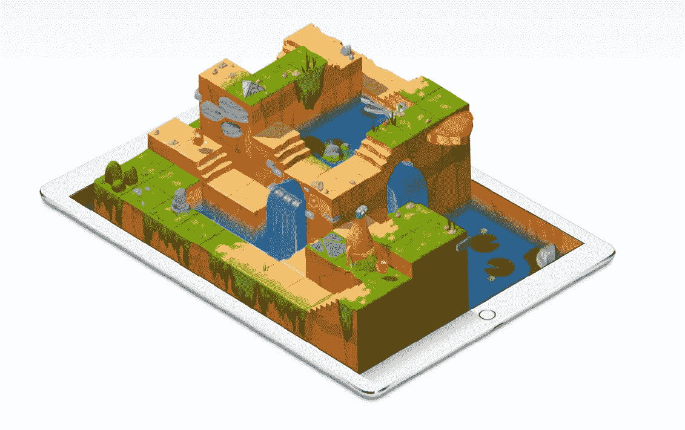

# 我在斯威夫特游乐场的冒险

> 原文：<https://betterprogramming.pub/my-adventures-with-swift-playgrounds-5433b849d552>

## 孩子学习编程的绝佳资源

斯威夫特游乐场

斯威夫特游乐场基本上是一个公园，除了它在天上，也是一座浮动的山。

在这次冒险中，你可能会寻找三个角色:布鲁、霍普和字节。他们喜欢收集宝石和拨动开关。

你还会发现自己告诉你的角色走过入口，走上楼梯。您将学习如何使用基本步骤，如`moveForward()`、`turnLeft()`和`turnRight()`。然后你将学习函数、循环、`if`程序块、`else` / `if`程序块以及许多其他东西。

一旦你开始掌握它，然后它会带你到一些练习回合，在那里你必须测试运行一个代码几次，并确保它对所有的程序都有效。对我来说，很有挑战性。

# **谁可以使用？**

每个人都可以使用它。太好玩了。如果你渴望学习，那么没有年龄限制，但理想情况下 6 岁以上的孩子可以开始这种冒险。

用这个 app 的人以后可以靠编码了，从 Swift 开始。这将有助于每个人理解编程，并为从事技术职业做好准备。现在成年人也可以用这个了，可以用电脑编程加强能力，提神醒脑。

# **我为什么要用它？**

我使用 Swift Playgrounds 是因为我想以一种更简单的方式理解编程和编码。当我爸爸向我介绍斯威夫特游乐场时，我在想*这是一个公园吗？我开始尝试，并且非常喜欢。我不想停下来，因为它不仅仅是一个看起来像公园的应用程序，而是一个年轻人的游乐场，就像我这个年龄组的人一样，了解编程到底是什么，并学习基础知识。*

除了我越来越擅长计算机编程之外，另一个重要原因是我减少了看电视的时间。当我使用它的时候，我甚至不会想到什么时候停止。我只是坚持下去，直到我可能饿了，或者因为我意识到我必须马上去睡觉。我并没有因为这个而停止我的其他爱好。我还是会做玩手艺，在外面玩，做做家务，和调皮的哥哥姐姐一起玩，所以不要觉得我是全职的电脑呆子。

# 为什么我认为你可以使用它？

当你做 Swift 的时候，你可以学到这么多编程的基础知识，这是理解技术概念所需要的。无论你是否成为程序员，了解编程的基本知识都将是我们未来的基本需求，就像你需要了解数学、科学、社会学、英语等基础知识一样。

也请阅读我的早期文章，它可以给你更多的想法。

 [## 一个 10 岁孩子对计算机编程的看法

### 先说编码！

medium.com](https://medium.com/better-programming/a-10-year-olds-perspective-about-computer-programming-c8556a9cb747) 

# **我在斯威夫特游乐场的冒险经历**

当你想到一个游乐场或公园时，我们都知道那是一个你可以娱乐同时也可以冒险的地方。

Swift Playgrounds 是一个你可以体验很多冒险的地方，一旦你进去了，那就像“Jumanji”电影一样，他们有很多障碍要跨越，试图不受伤，并试图通过让他们思考如何解决这些挑战来解决挑战。你可以通过学习和理解编程来解决这些挑战。然后，你在 Swift Playground 中对它们进行编码，以解决问题并进入下一个级别。

现在，我在 Swift Playgrounds 的冒险就像有一个水滴，它穿过入口，跳到一个开关上。我喜欢学习的其他内容是如何调试、使用循环和创建函数。我也是初学者，所以我不知道很多专业人士知道的关于计算机编程的事情，但我确实喜欢调试和使用循环。

使用循环真的很有趣，因为我可以让事情变得更有效，更容易阅读和处理。调试也很酷，因为你可以重做事情，在编程中，这真的很重要，因为你希望它工作，相信我，你可能会犯错误。

当你在 Swift 中出错时，会有一个框显示你做错了什么，错在哪里，这样你就可以改正了。有时候它不会告诉你你犯了一个错误，所以你只需要在你按下播放按钮时发现，看看你的角色是否会进入下一关。关于我为什么喜欢调试，我稍后会再多告诉你一点。

有很多东西要写，但是可能需要单独的一篇文章。我建议你们都开始看看它，并就如何在 Swift Playgrounds 寻找冒险提出自己的看法。

我希望你能像我一样在操场上玩得开心！