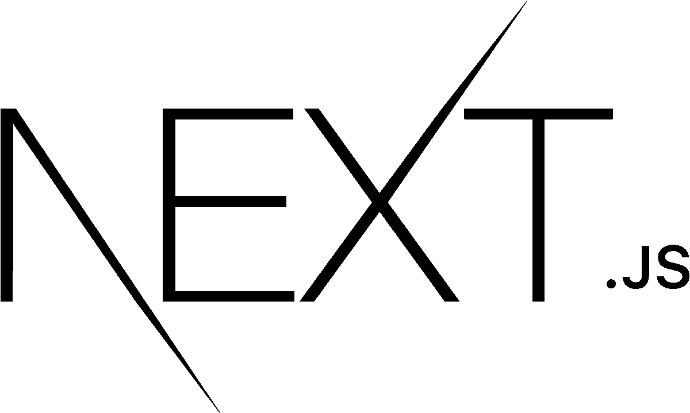
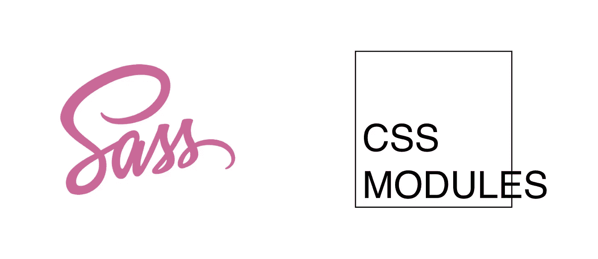
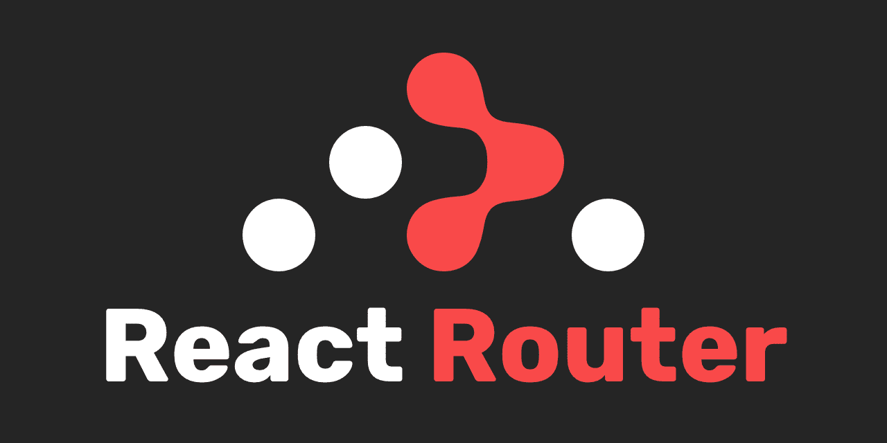
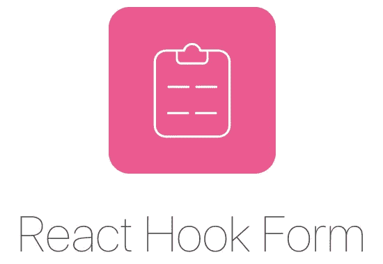
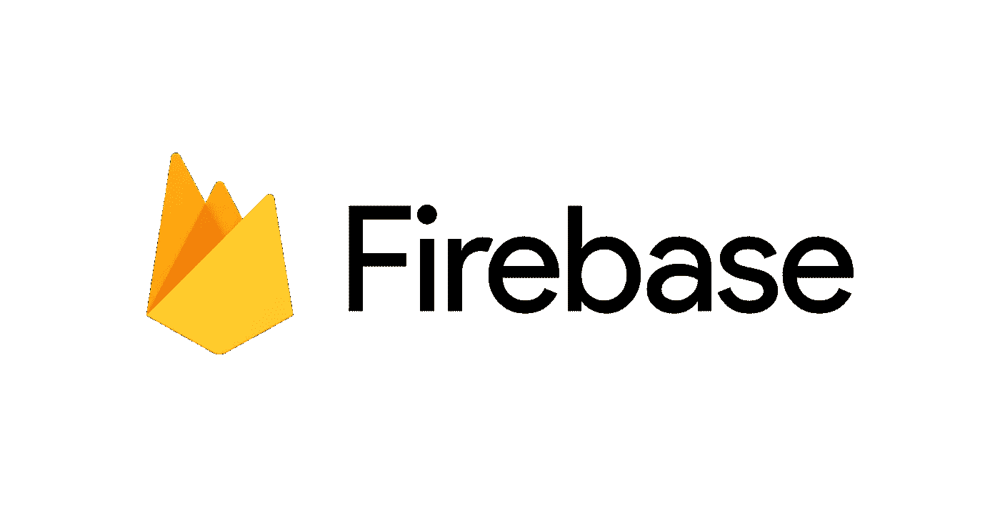

# 我的全明星反应堆

> 原文：<https://betterprogramming.pub/my-all-star-react-stack-3c9b853d4c41>

## 我在设置新的 React 应用程序时使用的所有东西

由 [Unsplash](https://unsplash.com?utm_source=medium&utm_medium=referral) 上的[思想目录](https://unsplash.com/@thoughtcatalog?utm_source=medium&utm_medium=referral)拍摄的照片。

如果你像我一样是 React 开发人员，那么当涉及到框架、库、工具等时，你基本上被宠坏了。与 Angular 等成熟的固执己见的框架相比，React 更加棘手。React 自称是一个用于构建用户界面(UI)的 JavaScript 库。

有了大量的选项，对于下一个 React 项目使用什么技术感到困惑是很自然的。今天，我将分享我最喜欢的图书馆，以及它们如何让我的生活变得如此简单！

# 启动一个项目(基础)

图片来自 [Next.js](https://nextjs.org/) 。

要启动一个项目，我最喜欢的选项是 [Next.js](https://nextjs.org/) ！

Next.js 提供了现成的服务器端渲染、基于文件系统的路由、内置的 CSS/SCSS 支持等等。使用 Next.js，您几乎可以在几秒钟内启动并运行，而不必担心工具问题。

## 可供选择的事物

引导 React 项目的默认方式是使用 [Create React App](https://reactjs.org/docs/create-a-new-react-app.html) 。然而，请相信我:Next.js 实在是太棒了，而且对开发者更加友好。它允许您专注于代码而不是设置。

另一个受欢迎的选项是 [Gatsby](https://www.gatsbyjs.org/) ，它更加以 SEO 为中心。然而，Gatsby 更侧重于静态站点生成，对于可能迅速膨胀为大型代码库的项目，我不习惯使用它。对于博客之类的项目，我更喜欢盖茨比。

我的建议是，对于未来可能变得更大甚至企业级的项目，用 Next.js。如果你想要一个更加 SEO 优化的、面向公众的网站，比如博客或静态信息网站，那么选择 Gatsby。

# CSS 框架

照片来自[布尔玛](https://bulma.io/)。

我最喜欢的 CSS 框架是布尔玛。这是一个基于 Flexbox 的开源框架，已经获得了超过 200，000 名开发者的广泛关注。

我选择布尔玛的一个重要原因是它简单而美丽。它附带了几个 UI 组件，这些组件设计得非常好，重点是移动响应能力。

## 可供选择的事物

说到 CSS 框架，我们不能忽视曾经流行的 [Bootstrap](https://getbootstrap.com/) 。这绝对是一个令人惊叹的框架，但是说实话，它已经变得有点无聊了。随着许多网站使用 Bootstrap，风格和组件似乎单调。然而，对于那些已经熟悉 Bootstrap 的人来说，Bootstrap 是一个不错的选择，它也有一个非常值得信赖的开发人员社区来提供支持。

[顺风社](https://tailwindcss.com/)目前是镇上的热门话题。Tailwind 允许你在不离开 HTML 代码的情况下设计任何东西。有一个 CSS 类可以处理所有的东西——颜色、大小、字体、阴影等等。我个人不喜欢代码中有太多的 CSS 类。我喜欢基于组件级 CSS 来分离和模块化我的代码。也就是说，对于喜欢框架提供的自由的开发人员来说，Tailwind CSS 可能是一个很好的解决方案。

# 式样

作者照片。

我的风格选择是使用 [Sass](https://sass-lang.com/) 和 [CSS 模块](https://github.com/css-modules/css-modules)。这在 Next.js 中是默认支持的，在这里我们将 CSS/Sass 文件从代码中分离出来，并在需要的地方简单地将其导入 React 文件。

Sass 比使用纯 CSS 更有效，因为它帮助开发人员重构他们的代码，并防止重复的样式。开发人员可以在整个项目中快速提取、重构和重用他们的代码。

## 可供选择的事物

一个流行的选项是[样式化组件](https://styled-components.com/)，它允许你用 JS 编写 CSS。虽然这很容易编写，但我讨厌在 JS 代码中结合样式的想法。我更喜欢关注点的分离和将样式从我的 JS 代码中分离出来。

# 航行

如果你像我一样使用 Next.js，那么导航绝对不是问题。使用基于文件系统的路由，目录的层次结构也变成了实际的文件路径和路由！

图片来自 [React 路由器](https://reactrouter.com/)。

如果你用的是 React，那么 [React 路由器](https://reactrouter.com/)是最好的选择。它是可靠的，经过良好的测试，几乎没有错误，并且简单易用。哦，它在 GitHub 上有 42.3K 颗星星！

# 形式

照片来自[反应钩形态](https://react-hook-form.com/)。

几乎每个 web 应用程序都需要一个表单。为了给我的应用程序添加一个表单，我使用了 [React Hook Form](https://react-hook-form.com/) 。

React Hook Form 采用 React Hooks 作为库的核心，极其简单易用。事实上，有一个表单构建器可以用来构建表单，并将代码复制粘贴到 React 项目中。

图片来自 [Formspree](https://formspree.io/) 。

如果你需要的只是一个静态表单(例如联系我们)，那么[forms spree](https://formspree.io/)可能是你的选择。它不需要任何服务器代码，是简单表单的绝佳选择。

## 可供选择的事物

这里一个流行的选项是 [Formik](https://github.com/formium/formik) 。Formik 是一个发电站——它包含了数量惊人的特性，并拥有广泛的开发者粉丝群，GitHub 上有超过 25.8K 个明星！但是，我感觉 Formik 有时候会矫枉过正。当你所需要的只是一个简单、漂亮的带有几个字段的表单时，React Hook Form 可以满足你。

# 快速后端

照片来自 [Firebase](https://firebase.google.com/) 。

我知道这篇文章是关于前端反应堆。然而，我想我应该把这个加进去——特别是对于那些你希望有一个快速后端来集成的项目。 [Firebase](http://firebase.google.com/) 和 [Firestore](https://firebase.google.com/docs/firestore) 是这个用例的绝佳选择。我不会对此深究太多，因为这本身就是一个完整的话题。

## 可供选择的事物

如果你需要一个快速的后端，那么一些其他的选项是 [Google Sheets](https://docs.google.com/spreadsheets/) 和 [Airtable](https://airtable.com/) ！两者都像 Excel 表格一样简单，但在需要时可以变得像小型数据库一样强大。

# 最后的想法

接下来就是:Next.js、布尔玛、萨斯、CSS 模块、React Hook Form、Firebase 和 Firestore。这是我典型的 React 堆栈，适用于我正在从事的几乎所有项目。

感谢阅读。请在下面留下你最喜欢的图书馆的评论。

黑客快乐！