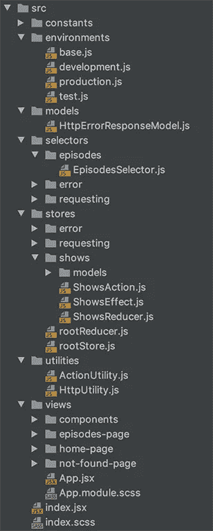

# 我的超赞反应/还原结构

> 原文：<https://betterprogramming.pub/my-awesome-react-redux-structure-6044e5007e22>

## 了解如何以优雅的方式构建 React/Redux 应用程序


[西蒙朱](https://unsplash.com/@smnzhu?utm_source=unsplash&utm_medium=referral&utm_content=creditCopyText)在 [Unsplash](https://unsplash.com/?utm_source=unsplash&utm_medium=referral&utm_content=creditCopyText) 上拍照

我想展示我是如何构造 React/Redux 应用程序的。我将为我的许多文件使用 JavaScript ES2015 类。我认为类有助于构建你的代码。

如果您不喜欢类，那么请查看其他源代码示例:

*   [React/Redux(类型脚本—类)](https://github.com/codeBelt/react-redux-architecture/tree/TypeScript)
*   [React/Redux(JavaScript-classes)](https://github.com/codeBelt/react-redux-architecture/tree/JavaScript)
*   [React Hooks/Redux(TypeScript-functional)(箭头函数)](https://github.com/codeBelt/react-redux-architecture/tree/ts/arrows)
*   [React Hooks/Redux(TypeScript-functional)(常规函数)](https://github.com/codeBelt/react-redux-architecture/tree/ts/function)
*   [React Hooks/Redux(JavaScript-functional)(常规函数)](https://github.com/codeBelt/react-redux-architecture/tree/js/function)

# 概观

本文将涵盖以下主题:

*   应用程序工作流(最佳实践)
*   文件夹结构(很棒)
*   视图(简化)
*   商店(冗余)
*   动作(应用程序通信)
*   效果(API 请求)
*   缩减器(数据管理)
*   选择器(查看业务逻辑)

参见与本文对应的[示例应用程序](https://codebelt.github.io/react-redux-architecture/)工作。


# 应用程序工作流程

在我的职业生涯中，我做过许多应用程序。从 [ActionScript](https://www.adobe.com/devnet/actionscript.html) 到最现代的 JavaScript 框架和库。一路走来，我学到了很多。

以下是我一路走来形成的一些模式、策略和观点。

以下是理想的应用程序生命周期:

*   `View`急件`Action`。
*   `Action`称之为`Effect`。
*   `Effect`处理 API 调用，净化输入数据或返回错误。
*   `Action`从`Effect`接收净化的模型或错误，并分派它。
*   `Reducer`从`Action`接收模型或错误，并将它们添加到商店。
*   `Selector`获取`Reducers`数据并为`Views`创建特定数据。
*   `View`直接从商店或`Selector`获取数据并显示出来。
*   剩下的就是内部沟通和状态管理。


应用程序生命周期图

# 文件夹结构

我真的很喜欢下面的文件夹结构，它非常适合任何规模的项目。



React/Redux 文件夹结构

*   `constants`:不变的静态数据。
*   `environments` : [API 端点，可能在不同
    环境中变化的静态信息](https://blog.usejournal.com/my-awesome-custom-react-environment-variables-setup-8ebb0797d8ac)。
*   `models`:共享模型/接口。
*   `selectors`:为视图生成的业务逻辑代码、模型/接口。
*   `stores` :
    - `models` : API 相关型号。
    - `actions`:触发应用变更的事件。
    - `effects` : [处理 API 并清理响应数据](https://medium.com/swlh/protect-your-javascript-applications-from-api-data-401a73c7c80b)。
    - `reducers`:添加/删除/编辑全局存储中的数据。
*   `utilities`:帮助器代码，抽象代码，防止重复。
*   `views`:所有视图组件。

# 视图

视图应该简单，没有转换数据的逻辑。

您的视图需要做的就是显示数据和管理它们自己。应用程序的其他部分可以完成繁重的工作。

我为之奋斗的一件事是“让你的代码读起来像一本书”。最好从顶部开始，从左到右阅读文件，以理解代码在做什么。

像一本书一样从顶部开始，您可以看到视图将使用什么数据。然后，看着`componentDidMount`，你会看到视图会`dispatch`一个`SomeAction.requestSomething`动作。

之后，我们来看重要的`render`方法代码，最后，任何像`_onClick`这样的辅助方法都被放在文件的底部，重要的代码放在文件的顶部。

父组件不再为您的子组件做任何事情。让您的子组件获得它们自己的数据并进行它们自己的动作调用。

只要组件不会在其他组件中重用，我更喜欢连接组件，而不是让父组件获取数据并传入 props。

如果你把组件想象成乐高积木，如果父母不为孩子传递数据或管理回调，移动它们就容易多了。

查看下面的组件，我们可以很容易地将`<Actors />`移动到另一个组件，而不改变`HomePage`中的任何逻辑。

```
class HomePage extends React.Component {
  render() {
    return (
      <div className={styles.wrapper}>
        **<MainOverview />**
        **<Actors />**
      </div>
    );
  }
}
```

让子组件更加独立的一个方法是使用`Selectors`来创建特定于视图需求的数据，并限制视图中逻辑代码的数量。

# 商店(冗余)

在 Redux 中，`store`是跟踪应用程序当前状态的单个对象。您使用减速器来管理整个`store`的各个部分。

我有一个`stores`目录，包含各个动作、效果和 reducers 文件的文件夹。这实际上构成了管理单个对象`store`的较小部分。

文件夹结构示例:

```
┣━ src/
┃   ...
┃   ┗━ stores/
┃      ┣━ shows/
┃      ┃  ┣━ models/
┃      ┃  ┣━ **ShowsAction**.ts
┃      ┃  ┣━ **ShowsEffect**.ts
┃      ┃  ┗━ **ShowsReducer**.ts
┃      ┣━ episodes/
┃      ┃  ┣━ models/
┃      ┃  ┣━ **EpisodesAction**.ts
┃      ┃  ┣━ **EpisodesEffect**.ts
┃      ┃  ┗━ **EpisodesReducer**.ts
┃      ┣━ rootReducers.ts
┃      ┗━ rootStore.ts
┃   ...
```

根据经验，我按照 API 域来划分我的存储。

例如，如果我有一个类似于[http://api.tvmaze.com/shows/74](http://api.tvmaze.com/shows/74)的 API，我会创建一个`ShowsAction`、`ShowsEffect`和`ShowsReducer`。

使用[http://api.tvmaze.com/episodes/1](http://api.tvmaze.com/episodes/1)，我将创建一个`EpisodesAction`、`EpisodesEffect`和`EpisodesReducer`。

我喜欢这样做，因为如果应用程序的某个功能被删除，我可以删除单个文件夹，而不是去顶级文件夹(操作、reducers 等)。)并逐个删除文件。

# 行动

动作是应用程序中的核心通信，它提供了一种触发副作用并将数据传递给 reducers 的方式。

## 通量标准行动(FSA)

说到动作，我遵循[通量标准动作](https://github.com/acdlite/flux-standard-action)模式来确定动作对象的结构:

*   `type`(必需):一个唯一的字符串标识符，用来告诉消费者(reducers、sagas、middlewares 等)。)行动的意图。
*   `payload`(可选):要随动作和属性一起发送的数据可以是任何类型的值。
*   `error`(可选):如果设置为`true`，动作代表一个错误，`payload`应该包含某种错误数据。
*   `meta`(可选):用于任何不属于有效负载的额外信息，该属性可以是任何类型的值。例如:可能不包含在有效载荷本身中的“ID”。

一个动作*不能*包括除`type`、`payload`、`error`和`meta`之外的属性，这样你所有的动作都是一致的和可预测的。

## 动作的静态类

我发现静态类对动作很有效。请参见下面的示例:

我发现以这种方式编写代码可以使代码自文档化。例如，我可以清楚地看到我正在从`SomeAction`商店部分调用`normalAction`:

```
this.props.dispatch(**SomeAction.normalAction()**);
```

在下面的例子中，不清楚它属于操作的哪个存储部分，代码读起来不像一本书:

```
this.props.dispatch(**normalAction()**);
```

同样，当在 reducer 中使用它时，使用哪个动作和动作组是很清楚的:

```
switch (action.type) {
  case **SomeAction.*NORMAL_ACTION***:
    return {
      ...state,
      someProperty: action.payload,
    };
  default:
    return state;
}
```

## **强制执行通量标准动作(FSA)**

为了确保您团队中的每个人都在他们的操作中使用 FSA，让我们创建一个`ActionUtility`并添加一个`createAction`方法。

唯一需要的参数是第一个，即`type`。其余的设置为默认值:

让我们更新`normalAction`方法以使用`ActionUtility.createAction`。

让我们也更新一下`thunkAction`方法:

现在我们所有的行动都会一致。

## **API 请求动作的约定**

谈到管理 API 请求的加载和错误逻辑，我非常喜欢下面的约定。这归结于你的行动如何命名，以及你和你的团队将遵循的惯例。

任何以`REQUEST_`开头的动作都是开始动作:

```
**SomeAction.*REQUEST_SOMETHING***
```

然后，一个动作以`REQUEST_`开始，以`_FINISHED`结束，这个动作就完成了:

```
**SomeAction.*REQUEST_SOMETHING_FINISHED***
```

这样，您可以创建逻辑来确定某个动作的加载状态是`true`还是`false`。如上所述，当我使用通量标准动作时，我们也可以将`error`属性设置为`true/false`。

这允许我们在操作完成或重新启动时显示或删除错误消息。您可以在示例应用程序中看到这一点。

## **带 Redux-Thunk 的动作**

看看下面的例子，你会发现我使用了上面提到的动作命名约定。

注意，在我调用`ShowsEffect.requestShow(74)`之前，我调度了开始的动作，然后，一旦我从请求中获得数据，我就调度完成的动作。

还要注意我是如何设置错误状态的。我的`ShowsEffect`要么返回一个有效模型，要么返回一个`HttpErrorResponseModel`。

现在，我们可以将这个约定/模式用于所有的请求操作。我们可以做的一件事是将一些样板代码抽象成一个实用程序。让我们在`ActionUtility`上创建另一个名为`createThunkEffect`的方法。

让我们用`ActionUtility.createThunkEffect`重构`requestShow`动作方法。

从相应的[样本代码](https://github.com/codeBelt/react-redux-architecture)中查看完整的`ShowsAction`:

在本节中，我谈到了 [Redux-Thunk](https://github.com/reduxjs/redux-thunk) ，但是如果您需要处理复杂的逻辑，比如有序的结账流程，我会考虑将 [Redux-Saga](https://github.com/redux-saga/redux-saga) 添加到您的应用程序中。

# 效果(API 请求)

Effects 负责获取数据，并确保数据在传递到应用程序之前经过清理。

让我们来看看下面的`ShowsEffect`片段。请注意，这里有一个端点，它发出一个`GET`请求，并从响应中返回来自 API 或`HttpErrorResponseModel`的成功数据。

效果也应该净化你的数据，这就是`ShowModel`正在做的。查看我的文章[保护您的 JavaScript 应用程序免受 Api 数据的影响](https://medium.com/swlh/protect-your-javascript-applications-from-api-data-401a73c7c80b)以了解更多信息。

再一次，让我们重构并最小化我们需要编写的样板代码的数量。

我已经创建了一个包含一个`getToModel`方法的`EffectUtility`类。该方法发出一个`GET`请求，并用响应数据创建一个新模型。

在下面的例子中，如果请求失败，它将创建一个`ShowModel`或返回一个`HttpErrorResponseModel`。这和上面的一样，但是更干净。

不要修改特定视图的 API 数据。将其直接传递给 reducer，让`Selectors`为视图转换 API 数据。

我曾经经历过这样的混乱，当 API 数据为一个特定的视图而改变时，几个月后才意识到相同的 API 数据将被用于一个完全不同的视图。

帮自己一个忙，保持 API 所提供内容的一对一映射，这样每个人都可以更容易地从原始结构中查看数据。

你可能已经注意到了一些例子中的`[HttpUtility](https://github.com/codeBelt/react-redux-architecture/blob/JavaScript/src/utilities/HttpUtility.js)`。我不打算详细介绍它，但在幕后它使用了 [axios](https://github.com/axios/axios) 。

这允许我将 API 错误转换成一个`HttpErrorResponseModel`,它有助于确定动作是否有有效的负载。此外，如果我想的话，修复 bug 或更改到另一个库也很容易，因为我只需要更改一个文件。

`HttpUtility`也是标准化数据的好地方。阅读我的文章[不要让 Api 数据结构化你的 JavaScript 应用程序](https://medium.com/swlh/dont-let-api-data-structure-your-javascript-application-7fa7fd5a590f)以获得更多信息。

如果你想知道`environment.api.shows`是关于什么的，看看[我的令人敬畏的自定义 React 环境变量设置](https://blog.usejournal.com/my-awesome-custom-react-environment-variables-setup-8ebb0797d8ac)。

# 还原剂

Reducers 是较小的代码段，通过动作添加、删除或编辑数据来管理全局`store`。

reducers 很简单，它们监听在存储区中添加、删除或编辑数据的操作。

下面，我有一个名为`ShowsReducer`的静态类，它有一个`initialState`属性和一个将数据添加到存储中的`reduce`方法。我想指出的是，我不在同一个 reducer 中处理错误动作。

有一个`ErrorReducer`将处理错误，你可以阅读我的文章 [React/Redux API 加载&错误](https://medium.com/@robertsavian/react-redux-api-loading-errors-e783972c5424)。

让我们把上面的减速器做的更干净更快。我们将使用*继承*，在这里我们抽象出一些逻辑，并专注于必要的东西。

下面，通知如何`ShowsReducer` `extends` `BaseReducer`。这允许我们将上面例子中的`reducer`方法移动到它自己的文件(`BaseReducer`)中，这样不是所有的 reducer 文件都必须包含它。

与上面的一个重要区别是我去掉了前缀`static`，使它成为一个普通的类，这样它就可以扩展`BaseReducer`。注意我们是如何使用 action `type`常量作为方法名的:

`[ShowsAction.REQUEST_SHOW_FINISHED](state, action){}`

看上面的`BaseReducer`，就会看到`reducer`的方法。

*   `Line 5`:获取与`action.type`匹配的类方法的访问权。
*   `Line 7`:如果找不到方法(`!method`)或者动作错误(`action.error`)，则返回当前`state`。
*   `Line 11`:用`state`和`action`参数调用找到的方法，该方法将返回 Redux 将使用的修改后的`state`。

## 减根剂

下面是使用 Redux 的`combineReducers`的文件，在`line 12`上你可以看到如何设置/添加使用`BaseReducer`的减速器。

我尽量保持我的减速器简单，把繁重的代码工作留给`Selectors`。

如果你需要在你的 reducers 中做一些额外的逻辑，创建一个类似下面的(`_complicatedToSimple`)的 helper 方法，或者把它抽象成一个可以重用的工具文件。

# 选择器(查看业务逻辑)

选择器包含将`store`数据转换成特定视图数据的业务逻辑，因此您可以将不必要的逻辑排除在视图和归约器之外。

`Selectors`是您为视图生成不同数据对象的大部分逻辑的地方。

我甚至在我的 [Thunks](https://github.com/reduxjs/redux-thunk) / [Sagas](https://github.com/redux-saga/redux-saga) 中使用选择器来创建复杂的请求对象，这样我的视图调度动作就不必在视图中构建有效负载。

如果你看下面的代码，我使用一个静态类来组织我的逻辑，在最底层，我有一个[重选](https://github.com/reduxjs/reselect)。

我喜欢将两者分开，这样我就可以清楚地看到哪个 reducer`createSelector`关心，而让静态类只关心它需要对数据做什么。

如果有一件事我想强调的话，那就是总是尝试在`Selectors`中完成你的大部分逻辑，而你的应用程序的其余部分只是传递和显示数据。

感谢阅读。如果你看到你喜欢的东西，请给我留言。

我在这篇文章中已经介绍了很多，但是如果你想了解更多的细节，请查看我的相关文章:

[](https://medium.com/@robertsavian/react-redux-api-loading-errors-e783972c5424) [## 反应/减少 API 加载和错误

### 我建议从示例源代码中寻找，但是我的所有操作都是与“效果”文件一起工作的(例如 ShowsEffect)…

medium.com](https://medium.com/@robertsavian/react-redux-api-loading-errors-e783972c5424) [](https://blog.usejournal.com/my-awesome-custom-react-environment-variables-setup-8ebb0797d8ac) [## 我很棒的自定义 React 环境变量设置

### 我想展示如何为我的 JavaScript 项目设置环境变量。这种技术不仅用于创造反应…

blog.usejournal.com](https://blog.usejournal.com/my-awesome-custom-react-environment-variables-setup-8ebb0797d8ac) [](https://medium.com/better-programming/improving-redux-reducers-in-3-ways-bf297743b21e) [## 从 3 个方面改进 Redux 减速器

### 对象、类和函数式编程

medium.com](https://medium.com/better-programming/improving-redux-reducers-in-3-ways-bf297743b21e) [](https://medium.com/swlh/protect-your-javascript-applications-from-api-data-401a73c7c80b) [## 保护您的 JavaScript 应用程序免受 Api 数据的影响

### 在这篇文章中，我将谈论开发客户端时你可以做的最重要的事情之一…

medium.com](https://medium.com/swlh/protect-your-javascript-applications-from-api-data-401a73c7c80b) [](https://medium.com/swlh/dont-let-api-data-structure-your-javascript-application-7fa7fd5a590f) [## 不要让 Api 数据构造您的 JavaScript 应用程序

### 当我创建应用程序时，一致性对我来说很重要。所以我喜欢遵循的一个标准是将我所有的代码放在…

medium.com](https://medium.com/swlh/dont-let-api-data-structure-your-javascript-application-7fa7fd5a590f) 

如果你喜欢这篇文章，请分享它，关注我，阅读我的其他[文章](https://medium.com/@robertsavian)和/或使用下面我的推荐链接注册 Medium。谢谢！

[](https://medium.com/@robertsavian/membership) [## 通过我的推荐链接加入 Medium—Robert S(代码带)

### 作为一个媒体会员，你的会员费的一部分会给你阅读的作家，你可以完全接触到每一个故事…

medium.com](https://medium.com/@robertsavian/membership)