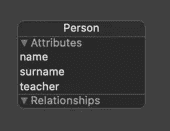
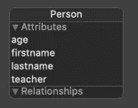
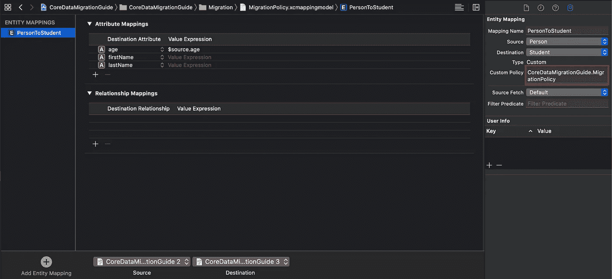

# 我的核心数据迁移(测试)

> 原文：<https://betterprogramming.pub/my-coredata-migration-test-53402ea2a363>

## 轻量级和重量级迁移演练

当我在`CoreData`上工作时，我通常能够执行到新模型版本的轻量级迁移。但是每当遇到更复杂的用例时，我都在努力寻找解决方案。

这就是我写这篇文章的原因。

但是首先，轻量级迁移和重量级迁移有什么区别？

# 轻量级迁移

> 核心数据通常可以执行自动数据迁移，称为轻量级迁移。轻量级迁移根据源和目标托管对象模型之间的差异来推断迁移。

 [## 使用轻量级迁移

### 核心数据通常可以执行自动数据迁移，称为轻量级迁移。轻量级…

developer.apple.com](https://developer.apple.com/documentation/coredata/using_lightweight_migration) 

对我来说，这意味着简单的用例，比如添加和重命名变量，或者创建新的关系和对象。

# 重量级迁移

> 当对数据模型的更改超出轻量级迁移的能力时，在极少数情况下使用重量级(手动)迁移。

 [## 重量级迁移

### 在极少数情况下，当对数据模型的更改超出轻量级的能力时，使用重量级(手动)迁移…

developer.apple.com](https://developer.apple.com/documentation/coredata/heavyweight_migration) 

# 从轻量级迁移的测试开始

先说一个简单的`CoreData`模型。我们有一个人，他有一个名字，一个姓氏，以及他是否是老师的信息(作为一个布尔人)。

模型 1

然而，我们很快意识到这个模型不足以满足我们的新目的。新模型更改了变量名，并添加了变量“年龄”。

模型 2

因为这个修改是通过轻量级迁移完成的，所以我们现在已经完成了新模型版本的创建。但是如果我们在 XCUnitTests 的帮助下测试迁移，我们会感觉好很多！

下面是执行此操作的代码:

## 标志 1:

加载`ManagedObjectModel`并用包含 SQLite 文件 URL 的`PersistentStoreCoordinator`初始化`NSManagedObjectContex`。

## 标志 2:

为迁移添加一些测试数据。在这种情况下，它是一个人是一名教师。

## 标志 3:

加载作为迁移目的地的`ManagedObjectModel`。对于轻量级迁移，我们必须设置以下选项:

*   `NSInferMappingModelAutomaticallyOption`
*   `NSMigratePersistentStoresAutomaticallyOption`

这使得`CoreData`知道它应该尝试自动迁移。
然后我们创建`PersistentStoreCoordinator`并添加一个`PersistentStore`。使用与第一个模型版本相同的 URL 很重要。

## 标志 4:

我们现在可以测试迁移，我们可以看到变量已被重命名，并添加了“age”。

# 重量级迁移

因为我们知道每个人是否是一个`teacher`，我们想把他们分成`teachers`和`students`。为此，我们需要创建一个新对象`Person(teacher: true)`->-`Teacher & Persons(teacher: false)`->-`Student`。
我们将通过添加新的 CoreData 模型版本 3 来实现这一点。

为了执行这个迁移，我们需要一个映射模型和一个定制的迁移策略。您可以删除除一个实体映射之外的所有实体映射。现在我们需要为迁移添加一个自定义策略。确保在自定义策略类名前面添加项目名称。

接下来，我们需要`EntityMigrationPolicy`。

## 标志 1:

检查实体是否是一个`person`。

## 标志 2:

从实体中获取名称

## 标志 3:

创建一个`teacher`或一个`student`并再次添加`values`。

## 测试重量级迁移

## 标志 1:

正如`LightWeight`迁移一样，我们将读取旧模型并创建`ManagedObjectContext`。

## 标志 2:

这里我们添加了应该迁移的新元素

## 标志 3:

在这里，我们迁移到新的模型版本。因此，我们需要获得映射模型，并用旧模型和新模型创建`MigrationManager`。然后，我们在管理器和映射模型的帮助下运行迁移。然后我们加载新的`ManagedObjectContext`。

## 标志 4:

最后，我们添加一些测试来验证迁移是否成功。

我希望这篇文章能帮助你测试你的`CoreData`迁移代码！

 [## Monntay/CoreDataMigration

### 此时您不能执行该操作。您已使用另一个标签页或窗口登录。您已在另一个选项卡中注销，或者…

github.com](https://github.com/Monntay/CoreDataMigration)