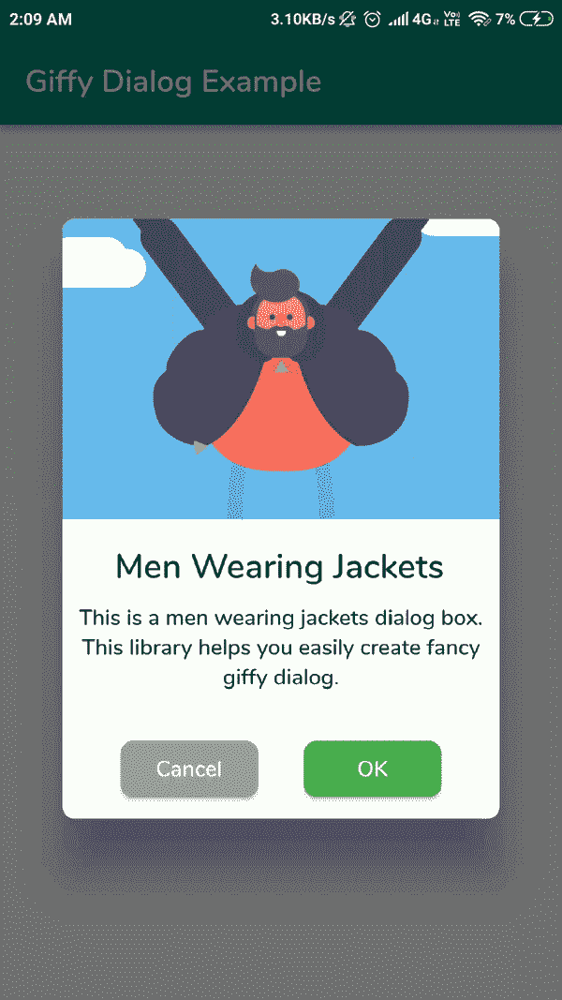
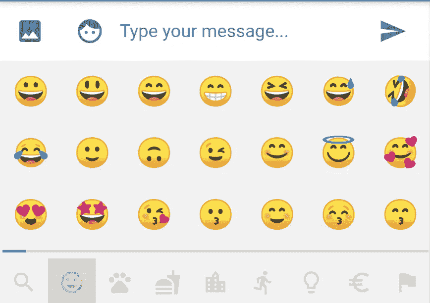
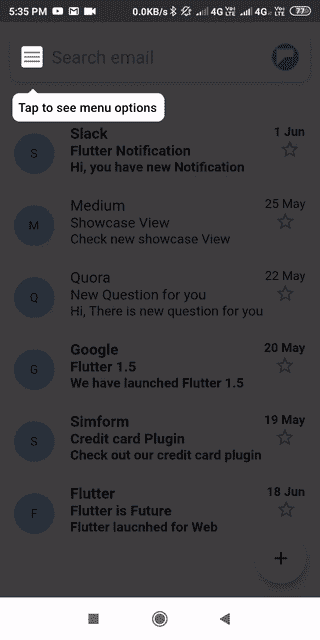

# 我十二月对颤振包的建议

> 原文：<https://betterprogramming.pub/my-december-recommendations-for-flutter-packages-d463cbb257cf>

## 探索颤动——第 14 周

## 我在 2020 年 11 月发现的最好的包

由[亚采克·迪拉格](https://unsplash.com/@dylu?utm_source=unsplash&utm_medium=referral&utm_content=creditCopyText)在 [Unsplash](https://unsplash.com/?utm_source=unsplash&utm_medium=referral&utm_content=creditCopyText) 拍摄的照片

又到了外套、帽子、工艺品、雪、可口可乐广告中的圣诞老人的时候了，也到了我 12 月份推荐飘动包装的时候了。以下是我与这个话题相关的五大发现。

# 1.警报，警报，伟大的警报对话框！

有各种各样的警告对话框包，但是我会挑选出这个，你可以在警告文本旁边显示一个图像或 GIF。不知道是不是因为我普遍喜欢图纸和动画，但在我看来，这从用户的角度来看效果要好得多。

[https://pub.dev/packages/giffy_dialog](https://pub.dev/packages/giffy_dialog)

 [## giffy_dialog | Flutter 包

### 一个漂亮的自定义警告对话框，灵感来自 FancyAlertDialog-Android。源代码是 100%…

公共开发](https://pub.dev/packages/giffy_dialog) 

# 2.您可以使用或不使用 BuildContext 来制作您的 Toast 消息三明治

说到用户通知，这里有一个很棒的 toast 消息包。很酷的一点是，它支持 toast 消息，您不必提供`BuildContext`。

[https://pub.dev/packages/fluttertoast](https://pub.dev/packages/fluttertoast)

 [## 颤动吐司|颤动包装

### 现在这个 Toast 库支持两种类型的 toast 消息，一种需要 BuildContext…

公共开发](https://pub.dev/packages/fluttertoast) 

# 3.表情键盘

即使我是一个好的旧文本表情符号的粉丝，如果你正在开发一个聊天应用程序，你很可能会想在用户点击表情符号图标后打开表情符号键盘。

对于所有不是老式表情符号类型的人，这里有一个包。

 [## emoji_picker | Flutter 包

### 一个提供表情键盘部件的 Flutter 包。查看和选择 390 个表情符号 6 个类别可选添加…

公共开发](https://pub.dev/packages/emoji_picker) 

# 4.强调以正确的方式介绍你的应用的步骤

为了让用户更好地了解应用程序的功能，您可以选择 showcase 原则。使您更容易应用这一原则的包是 showcaseview Flutter 包。

 [## 展示视图|颤振包

### 一个 Flutter 包允许你一步一步的展示/突出你的小部件。它的灵感来自 Fluttery 的扑动…

公共开发](https://pub.dev/packages/showcaseview) 

# 5.遵守规则，因为这样更容易

lint 包非常适合在使用标准规则时识别错误，因为这个规则集合遵循[有效 Dart: Style Guide](https://dart.dev/guides/language/effective-dart/style) 。记住，这个包根据它所知道的规则分析你的代码的风格和编程错误。

 [## 棉绒|省道包装

### lint 是为 Dart 和 Flutter 项目精心挑选的、开源的、社区驱动的 lint 规则集合。一套…

公共开发](https://pub.dev/packages/lint) 

# 结论

如果你是涵盖各种 Flutter 主题的简短有趣文章的粉丝，并且你想养成在接下来的 15 周内和我一起学习 Flutter 的习惯，你可以每周二阅读我的文章。

如果你对这篇文章有任何问题或评论，请在评论区告诉我。

对于那些想加入我们的颤振之旅的人，可以在下面找到前几周的链接:

*   [第 11 周](https://medium.com/better-programming/customize-default-splash-screen-in-flutter-4f0a3d872377)——“自定义 Flutter 中的默认启动画面”
*   [第 12 周](https://medium.com/better-programming/arrange-buttons-in-a-row-with-togglebuttons-flutter-widget-3e28b1ad51bb)——“用 ToggleButtons 小工具将按钮排成一行”
*   [第 13 周](https://medium.com/better-programming/stateful-widget-lifecycle-a01c44dc89b0)——“有状态小部件生命周期”

下周见。不要打破记录！:)