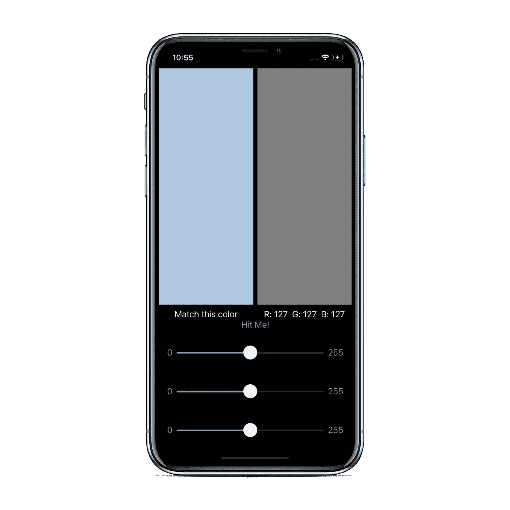
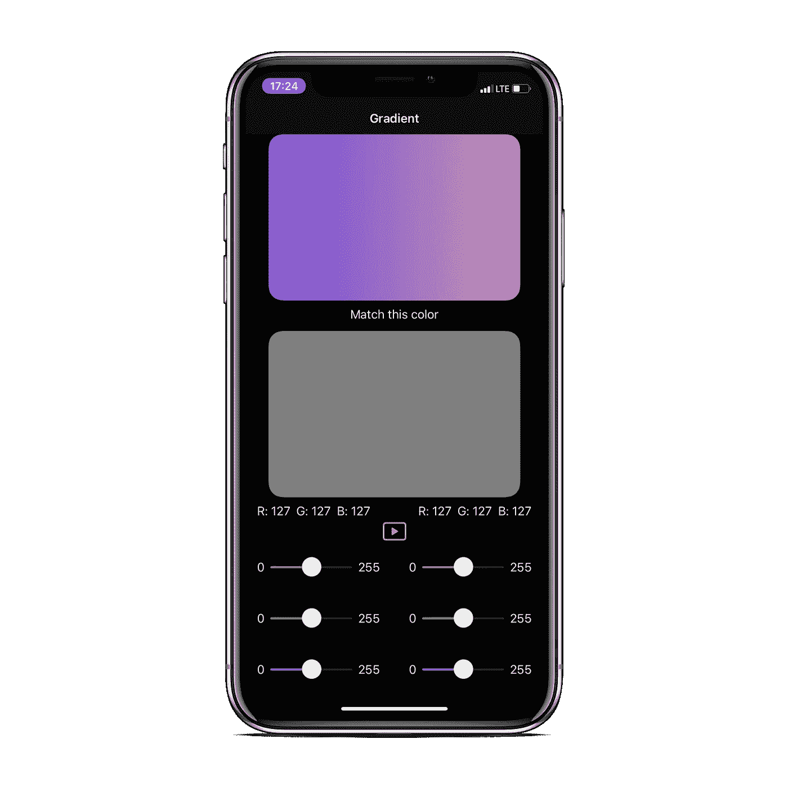
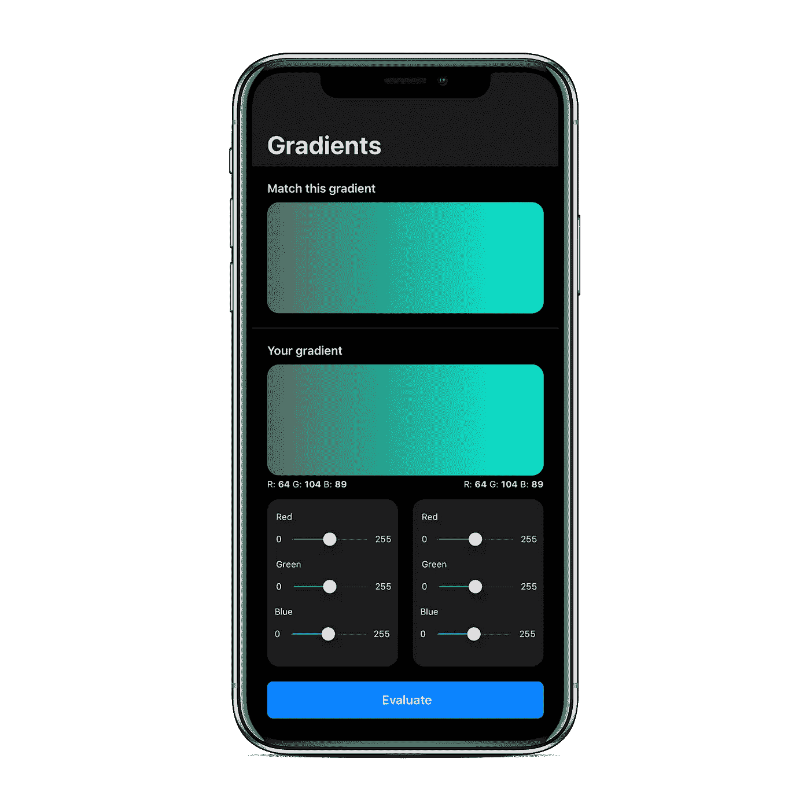
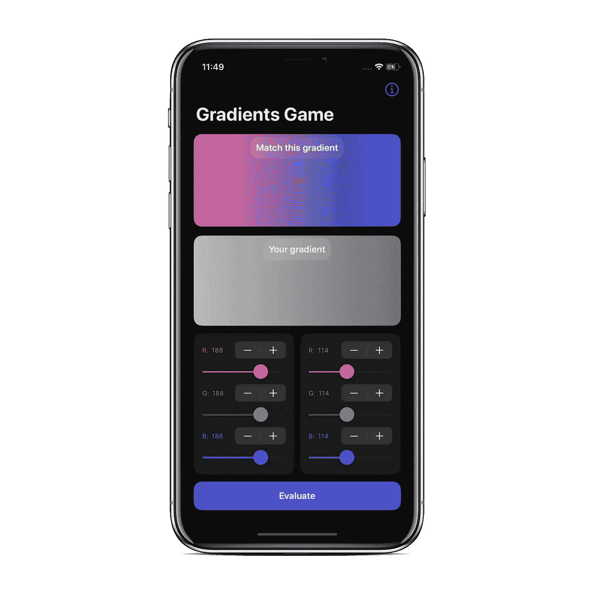

# 我逃离教程岛的经历

> 原文：<https://betterprogramming.pub/my-experience-of-escaping-the-tutorial-island-3b83ae0342c6>

## 根据教程创建我自己的产品来提高我的技能

法比安·格罗斯在 [Unsplash](https://unsplash.com?utm_source=medium&utm_medium=referral) 上拍摄的照片

在跟随无止境的指导之后，其中一个指导者在他的机器上键入一些随机的代码，你复制它，你没有取得很大的进步。

你去过那里，是吗？

我最近也陷入了这个陷阱。

苹果发布了他们最新的 iOS 开发框架 SwiftUI，我做了无数“初学者”级别的教程来开始使用它。

但是发行后的几个月，我没有取得太大的进展。我没有自己的**产品。一些我喜欢做的事情。**

我决定做点什么。这是我的计划:

*   从教程开始。
*   想想我能做些什么来让它变得有创意，让它成为我愿意花几个月时间去做的事情。
*   根据 Twitter 上的 iOS 社区和用户的反馈，无休止地工作。

我正在做 SwiftUI 入门的教程，我们通过移动 RGB 滑块来创建一个匹配给定颜色的游戏。

这是一个很棒的教程，我真的从中学到了很多。

 [## SwiftUI:入门

### 在这个 SwiftUI 教程中，您将学习如何通过声明和修改视图来布局 UI，以及如何使用 state…

www.raywenderlich.com](https://www.raywenderlich.com/3715234-swiftui-getting-started) 

这是最终的应用程序:

但是，我想在这方面做进一步的工作。使用 SwiftUI 是一次很棒的经历，熟练掌握这个特殊的框架将帮助我快速起步于其他开发人员。

所以我决定逃离这个教学孤岛，开始我自己的项目。

# 思维能力

在这个游戏中，我们处理的是单一颜色的搭配。

如果我们把它变得更复杂，改为匹配一个渐变呢？

两套滑块，用于两种不同类型的颜色！

我为此花了一天时间，想出了这个设计:

好吧…它工作了！

但是这个设计并不吸引人。

我的朋友，[帕万](https://twitter.com/_pawanpreet)向我伸出手，给我发来了一个用草图创作的更好的设计。

这比第一个版本好得多。终于，我离开了海岸辅导岛！

我还有很长的路要走，所以利用了 Twitter 社区的**力量！**我在推特上发布了关于设计的建议，并提供了该应用的测试链接。我收到了数量惊人的黄金推荐。

我一个接一个地处理这些建议，在另一个屏幕上展示我的**“自有”产品的介绍和特点。**

为了精确，更大的渐变和简单漂亮的设计，我添加了一个步进器。

这是目前 app 的最终设计，也是我的第一个产品——[渐变游戏。](https://apps.apple.com/us/app/gradients-game/id1479784361?ref=producthunt)

我还有很长的路要走，但是我用我的创造力建立了一个教程，成功地逃离了教程岛的陷阱。我也比我预期的更快地学会了 SwiftUI 的基础！

# 关键要点

*   不要犹豫，继续做一个教程。用你的创造力和时间来修改产品。
*   当你在做自己的项目，而不是被填鸭式喂养的时候**，你会去探索**。在这个过程中，您可以浏览文档、从社区获得帮助、提出问题并学到更多东西。
*   把你的灵魂投入到你热爱的工作中是很有趣的。最终产品，无论成功与否，都是满意度的缩影！