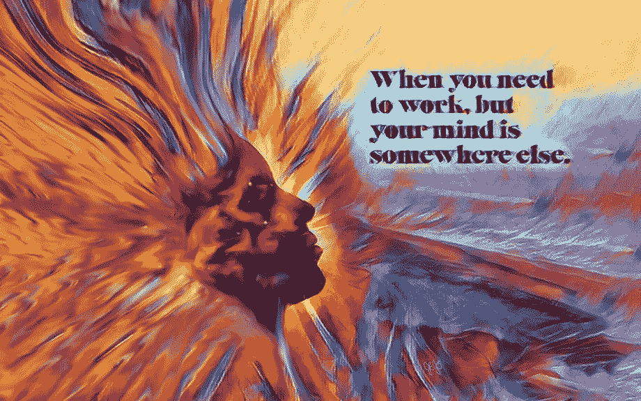
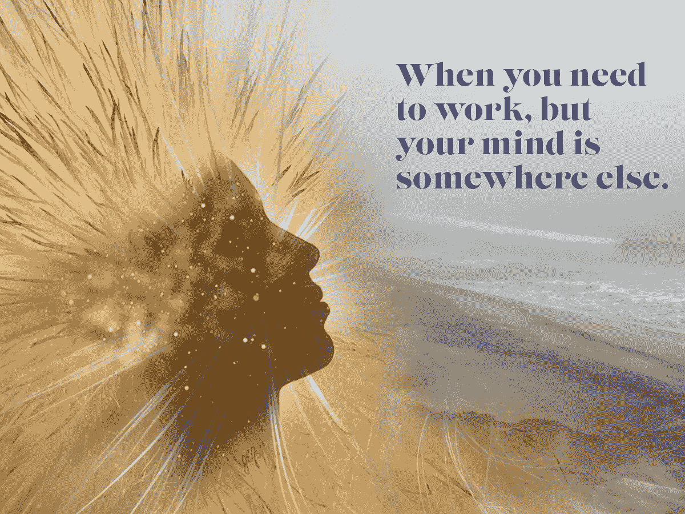
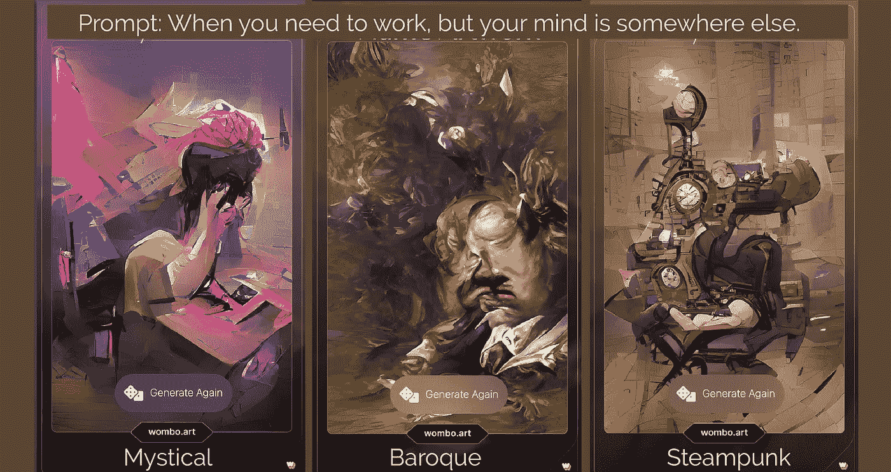
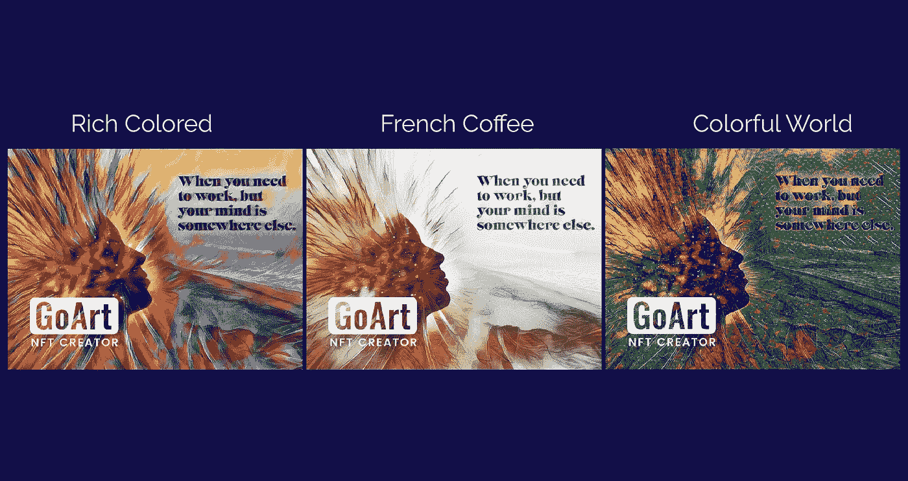

# 我使用生成人工智能作为艺术合作者的经历

> 原文：<https://betterprogramming.pub/my-experience-using-generative-ai-as-an-artistic-collaborator-90e22a9bf3d5>

## 生成式人工智能工具提供了一种快速可视化风格化视角的方法



插图:在 GoArt 丰富的彩色滤镜的帮助下，JEFS 拼贴风格化

作为一名图形艺术家，对于我来说，掌握许多工具来创作和交付有思想的设计是非常重要的。由于近年来随着[生成人工智能(AI)](https://www.frontiersin.org/articles/10.3389/frai.2021.604234/full) 和[不可伪造令牌(NFTs)](https://www.designweek.co.uk/issues/15-21-march-2021/nft-crypto-art/) 的出现，生成数字设计的选项激增，跟上一切的任务可能会令人生畏。

我个人对抗这种不知所措的感觉的方法是做研究，试图理解事物是如何相对于我的工作方式工作的。

我想我会分享一个实际的例子，我如何使用两个不同的公开可用的生成式人工智能平台，WOMBO 的 [Dream](https://app.wombo.art/) 和 Fotor 的 [GoArt](https://goart.fotor.com/) 来增强我自己的一个设计实验。在未来的某个时间，我将与 NFTs 分享我的经验。

## **起始设计**

对于我的生成式人工智能合作，我从原始照片拼贴开始，我使用 Adobe Photoshop 将三张照片组合在一起。

我做了大量的设计实践，根据自己的提示创作编辑作品。在这种情况下，我使用的提示是“当你需要工作，但你的思想在其他地方。”我经常有这种感觉。

这是开始的照片拼贴:



最初的结果有点“离谱”，但它抓住了我对这篇文章的情感。我喜欢植物(我的蓟照片)，住在海滩附近(我的海滩照片)和我的头可以在另一个宇宙(宇宙股票照片)。当我不工作时，我喜欢到大自然中去。

对于这个提示，可能不是每个人都有同感。衡量我对这种情绪的解读是否有共鸣的一个好方法是在社交媒体上发布该学院。

社交媒体的问题在于，反馈可能会受到个人网络规模、受众兴趣以及社交平台算法的限制。

为了获得更多有针对性的概念反馈，我决定使用 WOMBO 的 [Dream](https://app.wombo.art/) generative AI 平台，看看它会从我的提示中创造出什么。

# **第二步:用梦想进行概念测试**

梦生成人工智能平台结合使用了 [CLIP](https://openai.com/blog/clip/) ，一个连接图像和文本的神经网络，和[VQ-甘](https://arxiv.org/pdf/2012.09841.pdf)，一个不包含归纳偏见的生成对抗网络(GAN)

Dream web 应用程序允许你插入一个 100 字或更少的文本提示，并无限生成各种风格的图像，以生成原创艺术(不久，mint 输出为 NFT)。就我而言，我想看看梦如何解释我的“心在别处”的提示

我使用这个提示在提供的 20 种风格中循环，并选择了以下三种作为我的最爱:



插图:Wombo 梦想平台生成的示例

我认为这些作品从各种概念的角度来看都非常酷和有趣，但没有一首作品符合我的个人风格或我想表达的情感。产生的一切看起来沉重，而不是白日梦。

大部分图片确实包含了我的照片拼贴中缺失的常见工作相关物品的视觉印象，如时钟、桌子、便利贴和笔记本。如果我正在为一个客户创造一些东西，这种类型的概念性信息是非常有见地的。

我仍然想用更深层次的造型来改进我原来的拼贴画。接下来，我决定试试 Fotor 的 [GoArt](https://goart.fotor.com/) 平台。

# **第三步:使用 GoArt 进行样式化**

GoArt 是一个基于[神经风格转移](https://arxiv.org/pdf/1508.06576.pdf)的生成性 AI 平台，它将一幅图像的风格赋予另一幅图像的内容。有许多执行艺术风格转移的神经网络模型(见我找到的这篇[评论文章](https://www.researchgate.net/publication/354622667_Neural_Style_Transfer_A_Critical_Review))。GoArt 界面易于使用，并提供超过 50 种艺术风格可供选择。

我上传了我的照片拼贴，并通过每一个可用的艺术风格循环。这里有三个我最喜欢的风格化拼贴画:



插图:GoArts 神经类型转移效果示例

—法式咖啡风格的转移效果与我拼贴的原始色彩口感最契合；然而，造型的变化使图像感觉冬天。

—我喜欢赋予设计的多彩世界风格转移效果的纹理，但调色板和对比度太暗。

—我决定继续前进，使用丰富的彩色风格转移效果来创建我的最终图像，因为大胆的橙色和蓝色符合我喜欢的调色板和以前的创意作品。

GoArt 可以让你免费下载低质量的水印图像，或者注册免费试用以获得优质图像选项。从它的水印可以看出，GoArt 将自己定位为 NFT 创造者。

## **最后一步:个性化丰富多彩的 GoArt 图像**

为了创建最终的图像，我在 Adobe Illustrator 和 Adobe Photoshop 中使用了丰富的彩色 GoART 图像作为输入，对其进行矢量化、平滑、色彩修饰和重新格式化。

这篇文章的封面照片是我和 GoArt 神经风格转移合作的成果。

# **外卖**

首先，我认为 Dream 和 GoArt 的定位是帮助人们在不需要了解太多艺术知识的情况下创作原创艺术，这很棒。创作的自由应该更容易获得。

我分享了这个例子，以提供一些关于如何使用生成性人工智能作为合作者来改进/改变原创艺术作品的见解。作为一名自由艺术家，寻找合作者可能具有挑战性，人工智能有助于填补空白。

感谢您的任何反馈或您可能发现的使用生成式人工智能来重新想象您的原创艺术的方法。

```
**Julia Fletcher** is founder of [JEFS Storytelling Arts](https://www.jefstorytellingarts.com), a graphic design studio, where she uses her unique research skills and artistic talents to create custom visual stories that help clients’ increase engagement and promote the education of their audience.
```