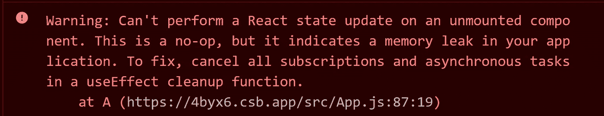
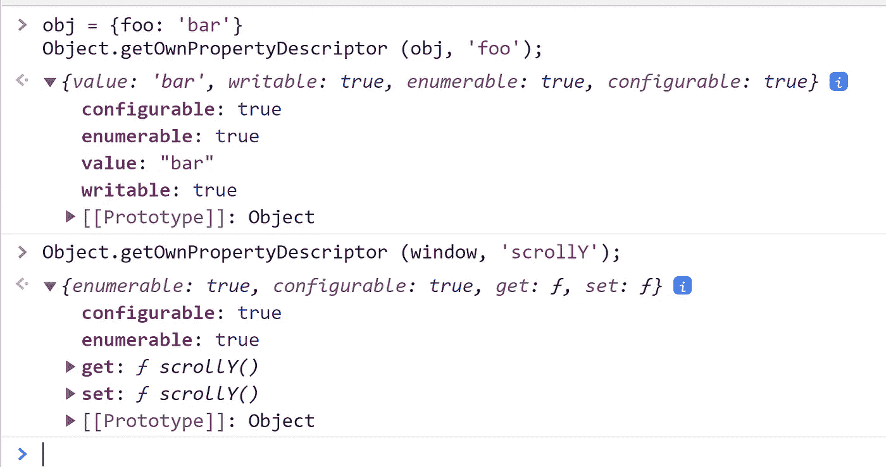

# 我最喜欢的前端开发人员的编码面试任务

> 原文：<https://betterprogramming.pub/my-favorite-coding-interview-task-for-frontened-developers-f3e984fa49e2>

## 显示窗口垂直滚动的实际值

一年前，我的公司首先要求我做一个前端面试。然后我为了自己的话题性想出了这个任务。

任务很简单，检查基础知识。但是，事实证明，其中可能会出现许多有趣的错误。它还包含一些不明显的细节，有经验的开发人员可能也会感兴趣。

出于教学目的，我决定在本文中详细分析这个任务。这篇文章主要针对 react 的新开发者。

# 问题陈述

有一个组件实现需要两件事:

1.  显示窗口垂直滚动的实际值(`window.scrollY`)
2.  挂载后，异步接收一个数字并显示它

找到、解释并解决尽可能多的实施问题。

我强烈建议在继续阅读之前，先解决你发现的所有问题。

# 重要的事情先来

大家正确注意的第一点是`useEffect`没有第二个参数。

应该有一个空的依赖数组，因为我们只需要在挂载时从“服务器”获取一次*号*。并且重复重新订阅滚动事件是没有意义的。

一个常见的错误是像这样传递依赖关系数组:`[scroll]`。如果你也犯了这样的错误，那么回到代码中，确保你不需要当前的滚动值来更新它。

第二个通常被注意到的是回调中的`async`关键字。通常，候选人都有过用这种方式写作的亲身经历。所以，他们知道不能这样做。但是为什么呢？这个问题难倒了某人。

根据 react 文档，回调应该不返回任何东西(`undefined`)或者返回一个清理函数。即只返回 2 个有效值:`undefined` 和`function`。但是，你当然知道`async` 函数总是返回一个`promise` *。*即在当前的实现中，回调并不返回一个清理函数，而是返回那个函数的*承诺*。

我们需要删除`async` 关键字并重做回调工作。一些初学者遇到了问题。最简单的就是用`promise`写:

如果你写过`fetchRandomNumber().then(num => setNumber(num))`，花一分钟去体会`fetchRandomNumber().then(setNumber)` 做的是同样的事情，但是更短更优。

最后一个错误是滚动监听器无论如何都没有被清除。我将尝试给出我自己的类比来解释这个错误。假设你买了一部新手机。你在它上面设置了一个闹钟，让它在早上 5 点起床去海边跑步。然后你改变了主意。

但是你没有关闭新手机的闹钟，而是回到商店，买了另一部相同型号的手机，打开手机中的闹钟设置，在早上 5 点关闭一切(然而，那里没有什么可以关闭的)。

两款手机完全相同，几乎没有明显的区别，但它们仍然是不同的手机。在实现的代码中也写了同样的废话。每当我们编写表达式`() => setScroll(window.scrollY)`，我们就创建了一个新的函数。这个问题通常以一种奇怪的方式解决:

这是可行的，但问题是`handleScroll` 将被为组件的每个渲染创建，但将仅在`useEffect`回调中使用。因此，它将只在第一次渲染时使用。所以，做了额外的工作，代码更加分散。

更正确的方式可能是这样的:

# 不太重要的问题

我要求候选人注意的另一点是状态的初始值。大三学生经常这样写:

有人认为初始值是强制性的。如果这是一个数字，那么`0` 肯定是最好的选择。但是在这种情况下，我们不能给数字`var` 一个合适的初始值，最好不要定义它。

对于 scroll 变量，`0`的初始值是不正确的，因为我们的组件可以在浏览器页面已经向下滚动的时候出现。预期的代码是:

这是相当不错的代码。在这一点上，我通常会转移到面试中的下一个任务。但是如果候选人做得很好，我建议他们多考虑一下代码片段。

如果候选人知道什么是节流并正确运用，这将是一个加分项。比如像这样:

这里的一个好问题是为什么 37 毫秒。变量的值可能更有意义。比如我们可以设置`throttleWait = 1000/60` 因为我们想要 60 [FPS](https://en.wikipedia.org/wiki/Frame_rate) 。但就 FPS 而言，真正先进的解决方案是使用 *requestAnimationFrame* 而不是 *throttle。*

另外我想看到的是[单一责任原则](https://en.wikipedia.org/wiki/Single-responsibility_principle)在*使用效果*中的应用。现在同样的 *useEffect* 负责异步号码检索逻辑和滚动逻辑。结果可能如下所示:

这段代码运行起来会稍微慢一些，但是随着时间的推移，它会更容易阅读和修改。此外，在这一步之后，更容易看到出于相同目的而提取的自定义挂钩:

你在你的主机里见过这样的警告吗？

在大多数情况下，这种警告是完全无害的，但令人讨厌。要移除它，你应该确保你的组件在调用`setState`之前没有被卸载。示例:

## SSR 问题

在这段代码中，我们使用的是`window` 对象。但是 node . js*environment 没有`window` 对象。我们的代码要用 SSR 的话应该是 [*同构*](https://www.lullabot.com/articles/what-is-an-isomorphic-application) 。*

# *不明显的*

*JS 里有个日常工作中很少用到的东西——[描述符](https://developer.mozilla.org/en-US/docs/Web/JavaScript/Reference/Global_Objects/Object/defineProperty)。你可以这样做，当你从一个对象获得一个属性时，一个 getter 函数将被调用，这个调用的结果将被返回。*

*`Object.getOwnPropertyDescriptor`函数可以告诉你一个对象属性是规则的还是用描述符定义的复杂的。所以如果你在控制台中运行`Object.getOwnPropertyDescriptor (window, ‘scrollY’);` ，你会发现 scrollY 属性有一个 setter 和一个 getter*

**

*所以，当我们写`window.scrollY`时，我们将这个 getter 函数添加到[调用栈](http://latentflip.com/loupe/)。因此，如果我们写`useState(() => window.scrollY)` 而不是`useState(window.scrollY)`，那么对于每次渲染，调用堆栈上将会少一个函数(如果你将一个函数传递给`useState`，它将只在第一次渲染时被调用，初始值将是这次调用的结果)。*

*优化！事实上，这样的优化并没有提供任何实际的好处。但在我看来，重要的是对这些过程的意识，有意识地编写每一行代码。将功能传入`useState`的另一个原因是，每一个`[window.scrollY](https://gist.github.com/paulirish/5d52fb081b3570c81e3a/565c05680b27c9cfd9f5e971d295cd558c3e1843)` [都会触发回流](https://gist.github.com/paulirish/5d52fb081b3570c81e3a/565c05680b27c9cfd9f5e971d295cd558c3e1843)。最终的代码看起来会像这样:*

# *奖励练习*

*对于那些喜欢再次开动脑筋的人，我建议找出如何对上一节中的“优化”进行基准测试。我以前从未写过这样的综合测试，但对于一篇综合文章，我给自己设定了这个目标，结果如下:*

*我的笔记本电脑在大约 3500 毫秒内完成 20，000 个组件渲染(对于`useState (window.scrollY))`和大约 3300 毫秒`(for useState (() => window.scrollY)`)*

*我发现我们可以深入这样一个简单的任务是很有趣的。感谢阅读。*