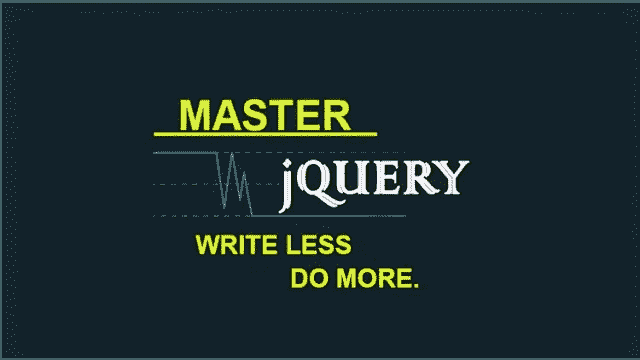
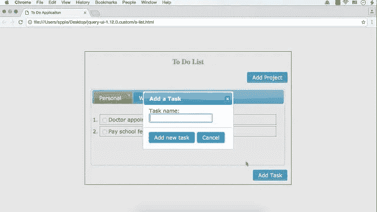
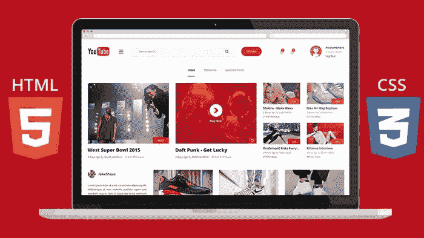
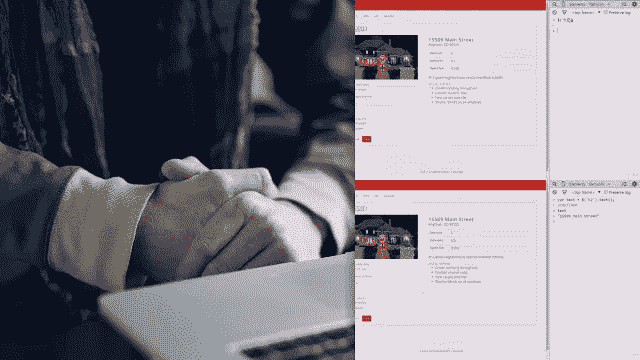

# 面向初学者的 jQuery 学习资源

> 原文：<https://betterprogramming.pub/my-favorite-free-courses-to-learn-jquery-for-beginners-60e126c977ce>

## 我最喜欢的从零开始学习 jQuery 的免费课程。

由 [Unsplash](https://unsplash.com?utm_source=medium&utm_medium=referral) 上 [Greg Rakozy](https://unsplash.com/@grakozy?utm_source=medium&utm_medium=referral) 拍摄的照片

如果你想学习 [jQuery](https://hackernoon.com/tagged/jQuery) ，并且正在寻找一些很棒的免费资源，比如书籍、教程和在线课程，那么你来对地方了。

我将分享一些来自 Udemy 和 Pluarlsightto 的*最好的免费 jQuery 课程*来帮助你学习这个令人敬畏的 JavaScript 库。

以前我在 jQuery 上分享过免费的[书籍](http://javarevisited.blogspot.sg/2017/04/free-ebooks-to-learn-jquery-online-or-download-pdf.html)和[教程](http://javarevisited.blogspot.sg/2017/05/jquery-tutorial-how-to-modify-multiple-elements-in-one-line.html#axzz5D4gR4y2f)，它们是对这些课程的补充。在学习 jQuery 的不同部分时，您也可以看看它们。

披露:这个帖子包括附属链接；如果您从本文提供的不同链接购买产品或服务，我可能会收到报酬。

在我分享这些免费课程之前，让我简单介绍一下 jQuery 是什么以及为什么要学习它。jQuery 是一个 [JavaScript 库](http://www.java67.com/2019/01/top-10-javascript-frameworks-and-libraries-for-web-developers.html)，但不同于任何其他库——它非常强大，使客户端脚本编写变得非常容易。

它提供了 CSS 类型的[选择器](http://javarevisited.blogspot.sg/2013/07/jquery-selectors-examples-ID-Class-Descendent-Child-Multiple-Pseudo-Selector-find-element-DOM.html)，允许你一次选择多个组件，并且只用一行代码就可以修改它们。例如，您可以抓取所有按钮并启用或禁用它们——就像这个示例中的[一样。](http://javarevisited.blogspot.sg/2017/08/how-to-enable-disable-element-using-jQuery-JavaScript-example.html#axzz5D4gR4y2f)

你可以抓取所有的

标签并更好地设计它们。你甚至可以做一些很酷的动画，像淡入淡出和切换按钮和其他元素，就像我们在基于标签的 GUI 例子中做的一样。jQuery 真正改变了使用 JavaScript 进行验证和增加交互性的方式。

jQuery 的流行可以通过一个简单的事实来理解，许多人甚至没有学习过 [JavaScript](http://www.java67.com/2018/04/top-5-free-javascript-courses-to-learn.html) 就使用它。这不是很好，但尽管如此，它还是说明了这个小库是多么有用。这个词，***写得少，做得多***用 jQuery 总结了一切可能。****

****顺便说一下，如果你不介意为学习 jQuery 这样有价值的东西付费，可以查看 [**完整的 jQuery 课程:从初级到高级！**](https://click.linksynergy.com/deeplink?id=JVFxdTr9V80&mid=39197&murl=https%3A%2F%2Fwww.udemy.com%2Fjquery-tutorial%2F) ，学习 jQuery 最好的课程之一。****

**** [## 完整的 jQuery 课程:从初级到高级！

### ⇉:观看宣传视频，看看你今天如何开始使用 jQuery！⇉:这个课程很重要！你收到超过 6+…

www.udemy.com](https://www.udemy.com/jquery-tutorial/?ranMID=39197&ranEAID=JVFxdTr9V80&ranSiteID=JVFxdTr9V80-WexacD.d6GJuk16nVZ8JFw&LSNPUBID=JVFxdTr9V80)**** 

# ****学习 jQuery 的 5 个最佳免费在线课程****

****当学习一个新的框架时，我发现最好先使用在线课程，然后是一本好书。****

****这些来自 [Udemy](https://click.linksynergy.com/fs-bin/click?id=JVFxdTr9V80&offerid=323058.9409&type=3&subid=0) 和[pluar sight](http://pluralsight.pxf.io/c/1193463/424552/7490?u=https%3A%2F%2Fwww.pluralsight.com%2Flearn)的免费 jQuery 课程相当不错——类似于许多付费课程。它们大多是出于宣传或教育目的免费提供的。****

****也有这样的例子，一旦导师达到他们的推广目标，Udemy 上的免费课程就变成了付费课程。注册前检查。****

****此外，我建议您尽早注册，即使您现在没有时间学习 jQuery，但希望在不久的将来学习。一旦你注册了这门课程，你就可以终身免费学习，而且可以随时学习。****

# ****1.面向初学者的完整 JQuery 和 JQuery UI 课程****

****这是学习 jQuery 和 jQuery UI 的最新课程之一，如果你今年正在学习 jQuery，这是一个很好的起点。已经有 9000 多名学生注册了，它仍然是免费的，但它可能不会永远这样。****

****[课程](https://click.linksynergy.com/deeplink?id=JVFxdTr9V80&mid=39197&murl=https%3A%2F%2Fwww.udemy.com%2Fcomplete-jquery-and-jquery-ui-course-for-beginner%2F)分为两个部分:jQuery 简介和 jQuery UI 简介。****

****在第一部分中，您将学习什么是 jQuery 以及如何使用它，然后下载 jQuery 库。****

> ****这里是免费加入本课程的链接— [初学者完整 jQuery](https://click.linksynergy.com/deeplink?id=JVFxdTr9V80&mid=39197&murl=https%3A%2F%2Fwww.udemy.com%2Fcomplete-jquery-and-jquery-ui-course-for-beginner%2F)****

****在 jQuery 简介部分，您将了解基本的 jQuery 概念，如[选择器](http://www.java67.com/2016/09/10-example-of-jquery-selectors-for-web.html)、过滤器、替换内容、处理事件和一些基本的动画效果，如淡入淡出、滑动、切换、隐藏和显示等。****

****jQuery UI 部分重点介绍基本的 jQuery UI 小部件，如日期选择器小部件、工具提示小部件、折叠小部件和选项卡小部件。****

****总的来说，对于今年想学习 jQuery 的人来说，这是一门[很好的入门课程](https://click.linksynergy.com/deeplink?id=JVFxdTr9V80&mid=39197&murl=https%3A%2F%2Fwww.udemy.com%2Fcomplete-jquery-and-jquery-ui-course-for-beginner%2F)。最好有 HTML 和 CSS 的经验，但是你可以通过参加我之前分享的免费前端 web 开发课程来获得。****

********

# ****[2。学习使用 jQuery UI 小部件](https://click.linksynergy.com/fs-bin/click?id=JVFxdTr9V80&subid=0&offerid=323058.1&type=10&tmpid=14538&RD_PARM1=https%3A%2F%2Fwww.udemy.com%2Flearn-to-use-jquery-ui-widgets%2F)****

****jQuery 分为两个库，jQuery 和 jQuery UI。JQuery 是关于验证、选择器和 DOM 操作的，而 jQuery UI 提供了几个很酷的 UI 小部件，您可以在 web 应用程序中使用它们。****

****在本[课程](https://click.linksynergy.com/fs-bin/click?id=JVFxdTr9V80&subid=0&offerid=323058.1&type=10&tmpid=14538&RD_PARM1=https%3A%2F%2Fwww.udemy.com%2Flearn-to-use-jquery-ui-widgets%2F)中，您将学习如何使用标签、手风琴、[日期选择器](http://javarevisited.blogspot.sg/2013/10/how-to-use-multiple-jquery-ui-date.html#axzz5D4gR4y2f)和许多其他小部件。课程从介绍和安装 jQuery UI 开始。****

> ****这里是免费加入本课程的链接— [**学习使用 jQuery UI**](https://click.linksynergy.com/fs-bin/click?id=JVFxdTr9V80&subid=0&offerid=323058.1&type=10&tmpid=14538&RD_PARM1=https%3A%2F%2Fwww.udemy.com%2Flearn-to-use-jquery-ui-widgets%2F)****

********

****之后，它介绍了不同的 jQuery UI 小部件，例如 jQuery 折叠、标签、菜单、工具提示、[日期选择器](http://javarevisited.blogspot.sg/2013/10/how-to-use-multiple-jquery-ui-date.html#axzz5D4gR4y2f)和按钮小部件。在每一节之后，它还包含一些问题来测试您对特定 jQuery UI 小部件的了解。****

****这只是一个很短的课程，但是很有用，而且在 Udemy 上非常受欢迎。超过 32，550 名学生已经注册，它有超过 700 个评级，平均得分为 4.3，这令人印象深刻。****

# ****3.Bootstrap，HTML5 & CSS3:创建一个现代的 Youtube 主页****

****免费课程，你可以通过使用 HTML、CSS 和 Bootstrap 创建响应网站来学习 jQuery。****

****[课程](https://click.linksynergy.com/deeplink?id=JVFxdTr9V80&mid=39197&murl=https%3A%2F%2Fwww.udemy.com%2Fpsd-to-html5css3-build-a-youtube-homepage-from-scratch%2F)从 HTML 5 基础开始，解释创建网站需要的基本东西:图像、字体、链接、样式、表单、单选按钮和[复选框](http://javarevisited.blogspot.sg/2017/07/how-to-checkuncheck-checkbox-using-jQuery-example.html#axzz5D4gR4y2f)。****

> ****这里是免费加入本课程的链接— [**Bootstrap，HTML5 & CSS**](https://click.linksynergy.com/deeplink?id=JVFxdTr9V80&mid=39197&murl=https%3A%2F%2Fwww.udemy.com%2Fpsd-to-html5css3-build-a-youtube-homepage-from-scratch%2F)****

********

****后来它使用 [BootStrap](http://www.java67.com/2019/01/5-free-bootstrap-course-to-learn-online.html) ，一个 CSS 样式库来设计网页的样式。bootstrap 帮助创建响应图像表单，菜单，链接和使用字体牛逼的图标与 BootStrap 等。****

****在最后一节中，您将学习 jQuery 使用类和 id 选择器来提供动画和目标页面元素。****

****您将学习如何使用 jQuery 在一组元素中添加和删除 [CSS 类](https://javarevisited.blogspot.com/2014/02/how-to-create-tab-ui-using-html-css-jQuery-JavaScript-JSP.html)，更改 HTML 文本，关闭和定位父元素和子元素等。****

****简而言之，这是[一个很好的实践课程](https://click.linksynergy.com/deeplink?id=JVFxdTr9V80&mid=39197&murl=https%3A%2F%2Fwww.udemy.com%2Fpsd-to-html5css3-build-a-youtube-homepage-from-scratch%2F)，通过使用 HTML、CSS 和 jQuery 做一个完整的项目来学习 jQuery 的实用方面。它也很受欢迎，超过 13，300 名学生注册了这门课程，有 435 个评分，平均为 4.1 分。****

# ****4.面向初学者的 jQuery 和 AJAX 权威指南****

****这是另一个优秀的[免费在线学习 jQuery](https://click.linksynergy.com/deeplink?id=JVFxdTr9V80&mid=39197&murl=https%3A%2F%2Fwww.udemy.com%2Fjquery-and-ajax-for-beginners-the-definitive-guide%2F) 和 AJAX 的课程。您将学习如何使用 jQuery JavaScript 库制作动态网站。该课程包含 2.5 小时的内容，并提供终身免费课程。****

****在本[课程](https://click.linksynergy.com/deeplink?id=JVFxdTr9V80&mid=39197&murl=https%3A%2F%2Fwww.udemy.com%2Fjquery-and-ajax-for-beginners-the-definitive-guide%2F)中，您将通过构建应用程序学习 jQuery，例如首先创建 HTML 页面，然后构建动态游戏板，添加样式和移动鼹鼠。****

> ****这里是免费加入本课程的链接— [**jQuery for 初学者**](https://click.linksynergy.com/deeplink?id=JVFxdTr9V80&mid=39197&murl=https%3A%2F%2Fwww.udemy.com%2Fjquery-and-ajax-for-beginners-the-definitive-guide%2F)****

********

****当你看到事情发生时，你会喜欢调整和更新代码。****

****谈到社会证明，这门课程有超过 235 个评分，平均 4.3 分，令人印象深刻。此外，超过 6000 名学生注册了这个免费课程来学习 jQuery。****

# ****[5。jQuery 基础知识](https://pluralsight.pxf.io/c/1193463/424552/7490?u=https%3A%2F%2Fwww.pluralsight.com%2Fcourses%2Fjquery-fundamentals)****

****这是一门非常好的从零开始学习 jQuery 的课程。这是一门初级课程，但是它涵盖了使用 jQuery 开发一个引人注目的用户界面所需的大部分内容。****

****本课程将教你如何使用不同的 jQuery 选择器，如 id、class 和 tag 选择器，来选择和操作 DOM 元素，处理事件和应用动画来创建一个响应性的用户界面。****

****它还全面覆盖了 jQuery 选择器和与 DOM 的交互，例如遍历节点、修改单个属性、添加和删除节点、修改样式(如添加或删除 CSS 选择器)等。****

> ****这里是免费加入本课程的链接— [**jQuery 基础**](https://pluralsight.pxf.io/c/1193463/424552/7490?u=https%3A%2F%2Fwww.pluralsight.com%2Fcourses%2Fjquery-fundamentals)****

********

****除了 API 和函数，您还将学习 jQuery 如何工作以及其他一些基本概念。比如为什么使用 CDN 更适合下载 jQuery 库，或者使用 ajax 特性比如从服务器加载 HTML 内容，了解 load()、get()、post()和 AJAX()函数。****

****顺便说一下，如果你是新来的，让我告诉你，我在这个博客上分享了很多免费资源已经有一段时间了——关于 [Spring](http://www.java67.com/2017/11/top-5-free-core-spring-mvc-courses-learn-online.html) 、 [Python](http://www.java67.com/2018/02/5-free-python-online-courses-for-beginners.html) 、 [REST](http://javarevisited.blogspot.sg/2018/02/top-5-restful-web-services-with-spring-courses-for-experienced-java-programmers.html) 、 [Jenkins](http://www.java67.com/2018/02/6-free-maven-and-jenkins-online-courses-for-java-developers.html) 、 [JUnit](http://www.java67.com/2018/02/5-free-eclipse-and-junit-online-courses-java-developers.html) 、 [Docker](http://www.java67.com/2018/02/5-free-docker-courses-for-java-and-DevOps-engineers.html) 、 [PHP](http://www.java67.com/2018/02/5-free-php-and-mysql-courses-for-web-developers.html) 、 [React](http://www.java67.com/2018/02/5-free-react-courses-for-web-developers.html) 、 [Web 开发](http://www.java67.com/2018/03/top-5-free-courses-to-learn-web-development.html)的免费课程和书籍如果你对学习这些技能感兴趣，请随时查看。****

****这就是你自己学习 jQuery online 的一些*最好的免费课程。您可以在舒适的办公室或家中学习这些免费的 jQuery 课程，并按照自己的进度学习。你不需要去任何地方或遵循一个时间表。*****

****再次注意，一旦讲师达到他们的推广目标，Udemy 上的一些免费课程就变成了付费课程。这意味着现在注册比以后注册更好！****

****您可能想探索的其他*免费在线课程*****

****[2019 Web 开发者路线图](https://hackernoon.com/the-2019-web-developer-roadmap-ab89ac3c380e)
[5 门课程学习微服务用 Spring Boot 和春云](http://javarevisited.blogspot.sg/2018/02/top-5-spring-microservices-courses-with-spring-boot-and-spring-cloud.html)
[5 门免费课程学习 Servlet、JSP、 和 JDBC](http://www.java67.com/2018/02/5-free-servlet-jsp-and-jdbc-online-courses-for-java-developers.html)
[10 门免费 Docker 课程面向 Java 和 DevOps 工程师](http://javarevisited.blogspot.sg/2018/02/10-free-docker-container-courses-for-Java-Developers.html)
[5 门课程面向 Java 开发者学习 Maven 和 Jenkins](http://www.java67.com/2018/02/6-free-maven-and-jenkins-online-courses-for-java-developers.html)
[3 本书和课程面向 Java 学习 RESTful Web Services](http://www.java67.com/2018/02/3-books-and-courses-to-learn-restful-web-services-with-spring.html)
[5 门课程面向 Oracle 和微软 SQL Server 数据库](http://www.java67.com/2018/02/5-free-oracle-and-microsoft-sql-server-online-courses.html)
[5 门课程面向 Java 和 C 学习区块链技术](http://www.java67.com/2018/02/5-free-blockchain-technology-courses.html)
[7 门免费 Selenium Webdriver 课程](http://www.java67.com/2018/02/7-free-selenium-web-deriver-courses-for-java-C-developer.html)****

****感谢阅读这篇文章。如果你喜欢这些免费的 jQuery 课程，请与你的朋友和同事分享。如果您有任何问题或反馈，请留言。****

****页（page 的缩写）如果你不介意花几块钱买一个好的资源，那么你也可以看看完整的 jQuery 课程:从初级到高级！，学习 jQuery 的最佳课程之一。****

**** [## 完整的 jQuery 课程:从初级到高级！

### ⇉:观看宣传视频，看看你今天如何开始使用 jQuery！⇉:这个课程很重要！你收到超过 6+…

www.udemy.com](https://www.udemy.com/jquery-tutorial/?ranMID=39197&ranEAID=JVFxdTr9V80&ranSiteID=JVFxdTr9V80-B3qGFfnXKQnPQg4fxIFqlA&LSNPUBID=JVFxdTr9V80)****