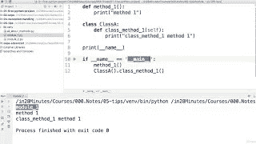
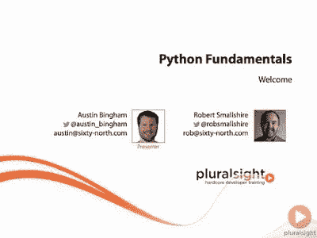

# 2023 年在线学习的 10 大免费 Python 编程课程

> 原文：<https://betterprogramming.pub/my-favorite-free-courses-to-learn-python-in-depth-95eb9508d042>

## 2023 年面向初级和中级程序员在线学习编程和编码的 13 门免费 Python 课程

杰佛森·桑多斯在 [Unsplash](https://unsplash.com?utm_source=medium&utm_medium=referral) 上拍摄的照片

毫无疑问， [Python](https://www.python.org/) 是目前世界上排名第一的编程语言，其最大的优势是它将越来越多的人带入了编程世界。

这几年，我看到学 Python[的人比学其他任何语言的人都多，是的，甚至比学](https://medium.com/swlh/5-free-python-courses-for-beginners-to-learn-online-e1ca90687caf) [JavaScript](https://medium.com/javarevisited/10-best-online-courses-to-learn-javascript-in-2020-af5ed0801645) 的人都多。他们中的许多人正在学习 Python，以探索 Python 提供的一些非常棒的数据科学和机器学习库。

有些人也在为 web 开发学习 Python，还有许多开发人员在为编写脚本和自动化琐碎任务学习 Python。你此刻为什么学习 Python 并不重要，你决定学习 Python 本身就是一件很棒的事情。

尽管我是一名 Java 程序员，并且在我的职业生涯中一直用 Java 编写代码，但我还是看重 Python 的多功能性。

学习 Python 永远是一个好的决定，所以无论你是一个初学程序员还是试图学习 Python 的 [C++](http://www.cplusplus.com/) /Java 专家都不用担心。任何投入的时间或金钱都将大有裨益，并带来丰厚的回报，就像[学习 Unix](https://medium.com/javarevisited/10-best-linux-unix-and-system-programming-books-for-beginners-2fe750951c9f) 、 [SQL](https://medium.com/javarevisited/8-best-resources-to-learn-sql-online-for-free-b00506d88c91) 、[数据结构和算法](https://medium.com/javarevisited/top-10-data-structure-and-algorithms-courses-for-java-developers-25161ee2edc0)一样。

简而言之，Python 将长期存在，我相信它已经度过了关键的 20 多年。

有些人喜欢从免费资源开始。这不是一个坏主意，因为它鼓励你去探索。还有，免费不代表垃圾或者不好。即使它们不像一些付费资源那样全面，但仍然是值得的。

如果你正在寻找一些令人敬畏的资源，那么你来对地方了。我将在这篇文章中与你分享一些学习 Python 的免费课程。

如果你不介意为值得学习的东西付费，你也可以看看何塞·波尔蒂利亚在 Udemy 上的 [**完整 Python 3 Bootcamp**](http://bit.ly/complete-python3-bootcamp) 课程。这是在线学习 Python 最好的课程之一。

事不宜迟，下面是我为初级和中级 Python 程序员列出的 13 门免费 Python 编程课程。

这些课程不仅包含基本的编程课程，还包括使用面向对象程序设计和 Python 数据科学等内容。

# 1.Python 核心和高级

这是一门学习 Python 的综合课程，我们应该感谢导师让它免费。

在本课程中，您将学习如何安装 Python、执行您的第一个 Python 程序、逻辑、编程结构、Python 语法、命令行 Python、面向对象编程以及许多更高级的概念。

以下是加入课程的链接: [Python 核心与高级](https://www.udemy.com/python-core-and-advanced/)。

该课程长达八个小时，教授的主题包括使用正则表达式进行模式匹配、使用文件 API 读写文件以及构建许多免费课程中没有教授的接口。

# 2.面向所有人的编程(Python 入门)

这是 Coursera 上学习 Python 3 的一个很棒的免费资源。本课程旨在教大家使用 Python 进行计算机编程的基础知识。

它涵盖了如何从 Python 中的一系列简单指令构建程序的基础知识。这门课程没有先决条件，除了最简单的数学之外，其他都不学。

这里是免费加入本课程的链接—[**Python for Everybody**](https://coursera.pxf.io/c/3294490/1164545/14726?u=https%3A%2F%2Fwww.coursera.org%2Fspecializations%2Fpython)

任何有一定计算机经验的人都应该能够掌握这门课程的内容。本课程将为大家讲解 [*Python 教材*](https://www.amazon.com/Python-Everybody-Exploring-Data/dp/1530051126) 的一到五章。

一旦学生完成这门课程，他们将准备参加更高级的编程课程。

本课程是 Python for Everybody 专业的一部分，该专业包含另外四门课程，包括 Python for data structure 和使用它访问 web 数据。

该专业的所有课程都是免费审核的，这意味着你可以免费学习，但如果你需要在简历或 LinkedIn 个人资料中包含认证，则需要付费。

# 3.Python 编程:初学者实践入门

这是另一个很棒的课程，顾名思义，它更注重实践训练。

这些课程旨在消除初级程序员在开始使用 Python 时面临的障碍。它从教您如何下载和安装、设置您的开发环境以及编写您的第一个项目开始。

下面是加入课程的链接:[用 Python 编程](https://click.linksynergy.com/deeplink?id=JVFxdTr9V80&mid=39197&murl=https%3A%2F%2Fwww.udemy.com%2Fpython-programming-beginners%2F)。

它慢慢地建立在基础之上，并解释关键的编程概念，如变量和数据类型、数字、运算符、字符串、列表、元组、字典、条件语句、循环、函数和异常处理。

本课程由费宾·乔治教授，帮助你建立一个项目。

# 4.在 CodeCademy 上学习 Python 2

如果你喜欢互动学习，这是最好的在线资源。这门在线互动课程将教你世界上发展最快、最受欢迎的编程语言的基础知识，软件工程师、分析师、数据科学家和机器学习工程师都使用这种语言。

这里是免费加入本课程的链接— [**学习 Python 2**](https://bit.ly/learnpython2withcodecademy)

本课程是对基本编程概念和 Python 的极好介绍。最终，你将能够轻松地用 Python 编程，并将 CodeCademy 平台上的技能应用到你自己的计算机上。

本课程唯一的缺点是它涵盖了 Python 2 而不是 Python 3，但没关系，它仍然是一个很好的资源。你也可以继续加入他们的 [**学习 Python 3 课程**](https://bit.ly/learnpython3codecademy) ，但不是免费提供的。

 [## 学习 Python 3 | Codecademy

### 学习世界上最流行的编程语言的最新和最棒的版本！

codecademy.com](https://bit.ly/learnpython3codecademy) 

# 5.深度学习先决条件:Python 中的 NumPy 栈

这个课程是给我那些正在学习数据科学和使用 Python 进行机器学习的程序员朋友们的。

您将探索一些令人兴奋的 Python 库，如 [NumPy](https://numpy.org/) 、 [SciPy](https://www.scipy.org/) 、 [pandas](https://pandas.pydata.org/) 和 [Matplotlib](https://matplotlib.org/) 栈，它们为探索深度学习、机器学习和人工智能提供了一个完美的基础。

**这里是加入课程**的链接:[Python 中的 NumPy 栈](https://click.linksynergy.com/deeplink?id=JVFxdTr9V80&mid=39197&murl=https%3A%2F%2Fwww.udemy.com%2Fdeep-learning-prerequisites-the-numpy-stack-in-python%2F)

课程是动手操作，比你想象的要深入。你不仅会了解这些库，还会了解各种机器学习模型的优缺点，包括深度学习、决策树、随机森林、线性回归、boosting 等。

# 6.用 100 步学会 Python 编程

这是我最喜欢的，也是逐步学习 Python 3 的一个很棒的课程。它是由一位博客作者兼讲师 Ranga Karnan 创建的，他是一位受欢迎的 Udemy 讲师。

您不仅将了解 Python 编程概念，还将了解 JetBrains 的 [PyCharm](https://www.jetbrains.com/pycharm/) 和 [Python Shell](https://www.python.org/shell/) 等工具和 ide。

下面是加入的链接: [**用 Python 学习编程 100 步**](https://click.linksynergy.com/deeplink?id=JVFxdTr9V80&mid=39197&murl=https%3A%2F%2Fwww.udemy.com%2Fpython-tutorial-for-beginners%2F)

您将有机会解决各种不同 Python 主题的实践练习，如数据结构、OOP 概念、错误处理、文件处理，并且您将开发一个出色的 Python 项目。

最重要的是，这门课程将教你如何作为一名 Python 程序员来思考。

# 7.完全初学者学习 Python 3.6

如果你喜欢通过解决编码问题来学习一门新的编程语言，那么这门课程就是为你准备的。这是一门很好的综合性课程，内容超过六个半小时。

这个课程最大的好处是，它不仅会教你 Python，还会教你如何安装和使用 [Jupyter Notebook](https://jupyter.org/) ，一个流行的 Python IDE。

本课程涵盖编程基础，如数据类型、运算符、控制流语句、循环、函数、错误处理以及常见的字符串操作，如切片、拆分、连接和格式化。

**以下是加入课程的链接:** [学习 Python 3.6 适合完全初学者](https://click.linksynergy.com/deeplink?id=JVFxdTr9V80&mid=39197&murl=https%3A%2F%2Fwww.udemy.com%2Fpython-3-for-total-beginners%2F)

它详细讲解了数据结构，包括列表和范围，元组，字典，然后你有练习题来运用你所学的知识。

一门有趣的免费课程。

# 8.Python OOP

这是 Udemy 上的另一个免费 Python 课程，重点是使用 Python 3 教授面向对象编程。

在本课程中，您将学习基本的面向对象概念，如类和对象、属性和方法、抽象、封装、继承和多态。OOP 的四大支柱以及如何在 Python 程序中使用它们。

**这是加入课程的链接**e:[Python OOP](http://bit.ly/2y3jr25)

您还将构建一个期末项目，使用面向对象的设计技术来模拟一个系统。

# 9.Python 3 新手训练营:开始用 Python 3 编程

如果你喜欢新兵训练营式的课程，那么这是给你的。

这是一个详细、简单、直接的课程，适合初学者学习 Python 3 的基础知识。你是否知道如何编码并不重要，本课程假设你没有编程或编码的经验。

以下是加入课程的链接: [Python 3 新手训练营:用 Python 3 开始编程](https://click.linksynergy.com/deeplink?id=JVFxdTr9V80&mid=39197&murl=https%3A%2F%2Fwww.udemy.com%2Fpython-3-bootcamp%2F)

这意味着，即使你刚刚开始编程和编码，你也可以学习这门课程。它非常适合任何想学习 Python 编程的人。

# 10.试试 Django 1.11 // Python Web 开发

Django 是 web 开发中流行的 Python 库之一。如果您正在学习 Python 来开发 web 应用程序，那么学习 Django 会非常有益。

在本课程中，您将学习 Django 1.11 的基础知识。您将从 HTML 和 Django 模板等 web 开发基础知识开始，然后继续学习表单、视图、模型等更高级的概念。

**这里是加入课程的链接** : [试试 Django 1.11 // Python Web 开发](https://click.linksynergy.com/deeplink?id=JVFxdTr9V80&mid=39197&murl=https%3A%2F%2Fwww.udemy.com%2Ftry-django-v1-11-python-web-development%2F)

总的来说，这是一个很好的快速学习 Django 的免费课程。

# 11.Python 编程简介

对于初学者来说，这是一门非常好的课程。您将从下载和安装 Python 开始，这对于初学者来说总是一项艰巨的任务，然后您将创建您的第一个 Python 项目。

该课程解释了大部分基础知识，如语法、运算符、函数、循环、类、对象和一些标准数据类型。

**这里是加入课程**的链接:[Python 编程入门](https://click.linksynergy.com/deeplink?id=JVFxdTr9V80&mid=39197&murl=https%3A%2F%2Fwww.udemy.com%2Fpythonforbeginnersintro%2F)

该课程受到了超过 170，000 名学生的信任，讲师 Avinash Jain 一直努力定期更新该课程。

# 12.学习 Python:构建虚拟助手

如果你喜欢通过构建有用的东西来学习一门新的编程语言，那么这门课程就是为你而设的。

在本课程中，您将为您的计算机构建一个虚拟助手。您将学习如何从维基百科和 Wolfram|Alpha 获取数据，以及创建 GUI。

**这里是加入课程** : [学习 Python:构建虚拟助手](https://click.linksynergy.com/deeplink?id=JVFxdTr9V80&mid=39197&murl=https%3A%2F%2Fwww.udemy.com%2Flearn-python-build-a-virtual-assistant-in-python%2F)的链接

本课程将帮助你为你的作品集增添一些乐趣，并给你提供使用 Python 的良好实践。通过创建一个真实世界的应用程序，您将从初学者进入中级水平。

# 13.Python 基础

这是一门从零开始学习 Python 编程的课程。

它将教你如何在 Windows、Linux 和 Mac 上安装它，因此不管你的工作环境如何，这门课程都将使你受益。

下面是加入课程的链接: [Python 基础](https://pluralsight.pxf.io/c/1193463/424552/7490?u=https%3A%2F%2Fwww.pluralsight.com%2Fcourses%2Fpython-fundamentals)。

他们提供 [10 天的免费试用](http://pluralsight.pxf.io/c/1193463/424552/7490?u=https%3A%2F%2Fwww.pluralsight.com%2Flearn)而不需要任何承诺，这是免费学习这门课程的好方法。10 天后，你需要一个 Pluralsight 会员资格，费用大约是每月 29 美元或每年 299 美元。

# 结论

这是一些最好的免费 Python 课程。任何想要学习 Python 进行 web 开发、数据科学、机器学习、深度学习或自动化的人都可以从这些免费课程中受益。

我还包含了一些关于 [Django](https://medium.com/javarevisited/my-favorite-courses-to-learn-django-for-beginners-2020-ac172e2ab920) 的课程，这是一个面向 [Python 开发者](https://medium.com/javarevisited/top-10-courses-to-learn-python-for-web-development-in-2020-best-of-lot-efe11fb6d212)的流行 web 开发框架，所以你也可以看看这些课程。

# 结束语

感谢您阅读本文。你可能会想，有这么多东西要学，有这么多课程要参加，但你不需要担心。

很有可能你已经知道了大部分这些东西，而且也有很多有用的免费资源可供你使用。

祝您的 Python 之旅好运！这当然不容易，但是通过遵循这个路线图和指南，你离成为你一直想成为的 Python 程序员又近了一步。