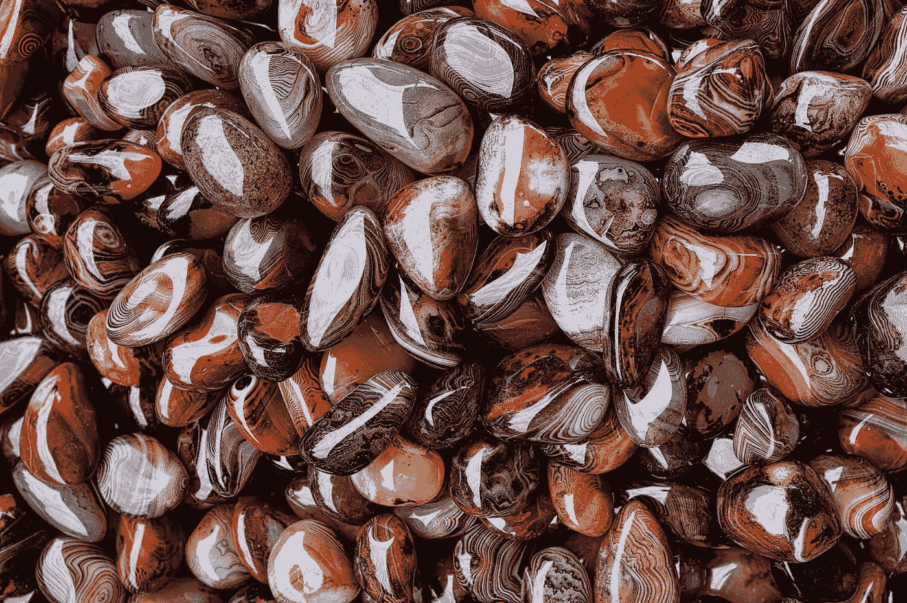

# 我最喜欢的密码一行程序

> 原文：<https://betterprogramming.pub/my-favorite-password-one-liner-2fcf6ce47d95>

## 如何在 macOS 上生成安全的随机密码



照片由[埃里克·普劳泽特](https://unsplash.com/@eprouzet?utm_source=medium&utm_medium=referral)在 [Unsplash](https://unsplash.com?utm_source=medium&utm_medium=referral) 上拍摄

有时你需要一个新密码。例如，您可能正在创建一个服务帐户，您需要在终端或某个地方的文本字段中输入密码。

如果您知道必须多次键入密码，那么您可能倾向于选择这样的密码:

*   容易打字
*   容易记住

但是根据这个标准选择密码并不是一个好主意。这两种品质通常与安全密码无关。最好选择这样的密码:

*   长的
*   随意

这种方法听起来可能需要更多的工作。幸运的是，我们可以使用计算机上已经存在的工具轻松地生成任意长度的安全随机密码，并将其自动复制到剪贴板。

有了剪贴板上的密码，可以很容易地将密码粘贴到另一个终端的提示中，或者粘贴到应用程序或网页的文本字段中。通过粘贴密码，我们根本不用输入密码。

# 一句话

不再拖延，我向您介绍我最喜欢的 shell 一行程序，它用于生成密码并将其复制到剪贴板，并针对 macOS 进行了优化:

```
< /dev/urandom \
  LANG= \
  tr -dc a-zA-Z0-9 \
  | head -c 16 \
  | pbcopy \
  && pbpaste \
  && echo
```

(我使用反斜杠将一行代码拆分成多行，以使其更具可读性。)

运行这个一行程序会生成一个随机的 16 个字符的字母数字( [US-ASCII](https://en.wikipedia.org/wiki/ASCII) )密码，包含小写字母、大写字母和数字。然后，一行程序将密码复制到剪贴板，并打印到终端。

这个一行程序适用于 Zsh 和 Bash，可能也适用于其他 shells。它会生成一个类似“vnQ0fEFU0V2V3asb”的密码

# 一个解释

让我们一点一点地分析一下一行程序的作用:

`**< /dev/urandom**` — 从[非阻塞伪随机设备](https://en.wikipedia.org/wiki//dev/random#macOS_and_iOS)中读取字节，并将其作为第一个命令的输入。为什么是`/dev/urandom`而不是`/dev/random`？很高兴你问了这个问题。

`**LANG=**`:不设置`LANG`环境变量。macOS 上该环境变量的默认值阻止`tr`命令处理来自`/dev/urandom`的原始字节。(或者，有些人把`LC_CTYPE=C`改为。有异曲同工之妙。)

`**tr -dc a-zA-Z0-9**`:删除输入中不在`a-zA-Z0-9`定义的字母数字字符集内的所有字符，然后将它们传递给下一个命令

`**| head -c 16**`:允许输入的前 16 个字符通过。输出是密码

`**| pbcopy**`:将输入的密码复制到剪贴板

`**&& pbpaste**`:将剪贴板中的密码打印到终端

`**&& echo**`:打印新的一行，使打印的密码显示在终端中自己的一行上。

注:`pbcopy`和`pbpaste`命令内置于 macOS 中。如果你使用的是 Linux，你可以用`xclip`来代替它们，如[这个栈溢出问题](https://stackoverflow.com/questions/749544/pipe-to-from-the-clipboard-in-bash-script)中所述。

# 外壳函数

为了便于运行这个一行程序，我在我的`.zshrc`文件中定义了以下 shell 函数:

请注意，`head`的参数有一点变化，因此该函数可以采用一个可选参数来指定所需的密码长度。

该函数的用法如下:

```
pwcopy
```

或者这个:

```
pwcopy 32
```

# 但是安全吗？

字母数字集中有 62 个字符。我选择了 16 个字母数字字符的长度，因为这给了密码[熵](https://en.wikipedia.org/wiki/Password_strength#Entropy_as_a_measure_of_password_strength)的`log₂(62) ✕ 16 ≈ 95` 位，无论从哪方面来看，这都是[充足的](https://security.stackexchange.com/questions/69374/is-an-80-bit-password-good-enough-for-all-practical-purposes)。

有人说长度为 12 的密码有足够的熵，特别是如果你除了字母数字字符外还混合了符号。但我问，为什么要吝啬熵呢？16 个字符的密码真的比 12 个字符的密码更贵吗？所以我说，挥霍一点，选择一个更长的密码。

你可以选择比 16 年更长的时间。我只是喜欢 2 的幂。

如果您使用的服务要求您的密码包含符号字符，当然，继续添加一个。但是，即使你用十个不同的符号替换密码中的十个字母数字字符，数学计算表明，它只会增加大约相当于你在密码长度中增加一个字符的熵。换句话说:

`log₂(72) ✕ 16 ≈ log₂(62) ✕ 17`

所以不要多心！我更喜欢省去奇怪的符号，这样密码更容易选择，如果我需要在 JSON 文件中把它放在引号内，也不需要转义。

不相信我？问问[布鲁斯·施奈尔](https://www.schneier.com/blog/about/),[应用密码学](https://www.schneier.com/books/applied_cryptography/)的作者我的密码建议与他的文章“[选择安全密码](https://www.schneier.com/blog/archives/2014/03/choosing_secure_1.html)”中的建议一致(布鲁斯说他自己使用符号和默认的 12 位密码。)

# 结论

还有许多其他的一行程序可以用来创建密码，但是其中一些依赖于可能并不总是可用的工具，而另一些生成的密码比我喜欢的熵要少。这个适合我。也许对你也有用！

不要忘记将密码保存在某个地方——密码管理器将是一个好的开始。注意安全，各位。