# 我最喜欢的前端开发人员 UI 资源

> 原文：<https://betterprogramming.pub/my-favorite-ui-resources-for-frontend-developers-a9ce0eb86c6>

## 您的前端应得的免费工具和资产

佛罗里达州本土民间艺术家朗达克在 [Unsplash](https://unsplash.com?utm_source=medium&utm_medium=referral) 上拍摄的照片

作为一名开发者和用户，我直接知道一个应用程序的外观可以决定它提供的体验。虽然一个干净的用户界面可以创造一个构建良好的产品的假象，即使它在幕后已经分崩离析，但一个坚固的应用程序如果有一个破旧的用户界面，会不公平地给人相反的印象，并赶走用户。

虽然不是所有的开发者在设计我们的应用程序时都有同样的天赋，但今天仍然有办法让它们至少看起来[还算过得去。在这篇文章中，我将分享一些我多年来收藏的资源，这些资源在许多项目中都派上了用场。](https://24ways.org/2012/how-to-make-your-site-look-half-decent/)

# 核标准情报中心

图标是一种简单的方法，可以让设计从基础变得引人注目。也许比这份清单上的任何东西都重要，伟大的图标可以从许多来源获得。这是我的提纲。

## [图标 8](https://icons8.com/icons)

Icons8 提供了 36 种不同风格的大量免费图标。虽然下载任何图标都需要注册，但如果你想订阅他们的计划，你只需要付费。

*   **收藏数量:**超过 173，000 个免费图标
*   **集成:**
*   **格式:**
*   **图标编辑:**免费([下载](https://icons8.com/lunacy)必选)

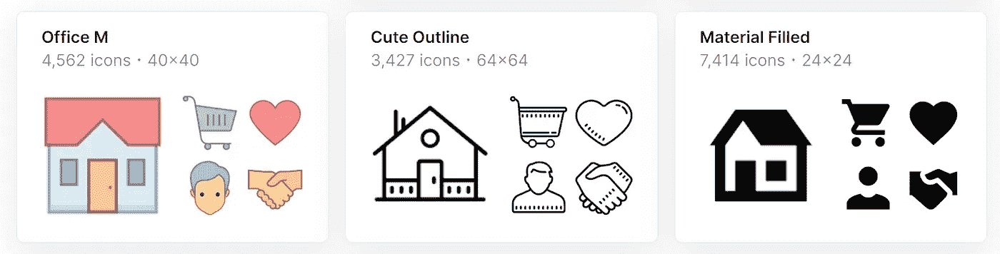

## [图标查找器](https://www.iconfinder.com/)

一大组免费图标、一个在线编辑器和一个慷慨的 API。还需要我多说吗？

*   **收藏规模:**超过 30 万个免费图标
*   **集成:** [API](https://www.iconfinder.com/api-solution)
    (访问所有免费图标，每分钟 60 个请求。，每月 5 万个请求。)
*   **格式:** PNG，SVG，ICO，ICNS
*   **图标编辑器:**免费，在线编辑器

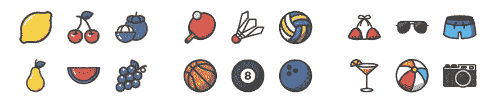

## [Octicons](https://primer.style/octicons/)

GitHub 自己的一套可扩展的手工图标，在他们的网站上使用，任何人都可以免费使用。大多数图标有两种尺寸，16 和 24px，设计在正方形网格上。

*   **收藏大小:**每种大小超过 200 个免费图标
*   **集成:** [多平台](https://primer.style/octicons/packages)
*   **格式:** SVG，PDF
*   **图标编辑器:**不适用

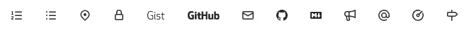

## [简单图标](https://simpleicons.org/)

从 MongoDB 到 AirBnB。流行品牌的数百个免费矢量图标。

*   **收藏数量:**近 2000 个免费图标
*   **集成:** [多平台](https://github.com/simple-icons/simple-icons#simple-icons)
*   **格式:** SVG，PDF
*   **图标编辑器:**不适用

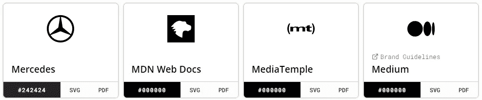

## [扁平图标](https://www.flaticon.com/)

图标的沃尔玛和一大套图形产品的一部分。如果在这里找不到，在别处大概也找不到。

*   **收藏数量:**超过 600，000 个免费图标
*   **集成:** [API](https://developer.flaticon.com/landing?_gl=1*1xv15hs*_ga*MTcyOTE2ODU1OS4xNjIzODY2Njc3*_ga_3Q8LH3P0VP*MTYyMzkxNTAxNy4zLjEuMTYyMzkxODAwMC4w&_ga=2.89069149.735601930.1623866677-1729168559.1623866677) 在免费计划中每天最多有 400 次下载
*   **格式:** **PNG** 、SVG、EPS、PSD、CSS
    (免费计划只提供 PNG 下载)
*   **图标编辑器:**免费在线编辑器(需要注册)

此外，Flaticon 最近推出了 [Uicons](https://www.flaticon.com/uicons) ，这是一组 2000 多个免费的基于矢量的图标，以 24px 设计，并针对 ui 进行了优化。这套可以下载或通过 CDN 访问。与编辑器一样，需要一个免费帐户。

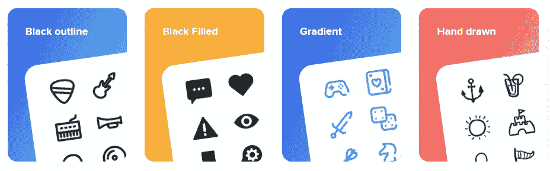

## [字体牛逼](https://fontawesome.com/v5.15/icons)

这是一个深受喜爱的图标集，具有强大的多平台集成。不管你的武器是什么，字体牛逼可能有一个鞘——而且是一个非常漂亮的鞘。

*   **收藏数量:**超过 1600 个自由图标
*   **集成:** [多平台](https://fontawesome.com/start#other-methods)
*   **格式:** SVG
*   **图标编辑器:**不适用

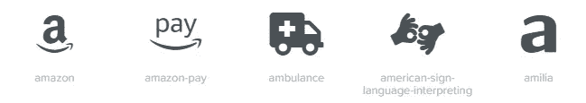

## [FamFamFam](http://www.famfamfam.com/lab/icons/)

最后，我想简单提一下开发者 Mark James 的一组迷人的小图标。这是我正在开发的一个 Android 应用的早期原型，我使用了他的[旗帜图标集](http://www.famfamfam.com/lab/icons/flags/)。

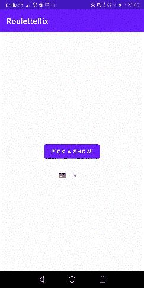

*   **收藏数量:**超过 1000 个免费图标
*   **集成:** [N](https://fontawesome.com/start#other-methods) /A
*   **格式:** PNG，GIF
*   **图标编辑器:**不适用

# 动画图标

众所周知，我们天生对运动反应强烈。这在我们搜索食物的时候是正确的，在今天搜索内容或者食物的时候也是正确的。

简而言之，任何类型的动画都比静态图像更能吸引用户的注意力。

Lordicon 和 [Icons8](https://icons8.com/animated-icons) 是我在这方面的首选网站。它们都提供了有限的免费资源，这应该可以满足大多数开发者的需求。如果没有，付费计划肯定会这样做。

两个网站都有可靠的集成。Icons8 的动画图标可以通过网站的前述图标 API 以编程方式访问，而 Lordicon 提供了多个[选项](https://lordicon.com/help/32-web-lordicon-custom-element)。

Lordicon 值得特别一提，因为它的在线编辑器允许在下载前进行简单的修改。

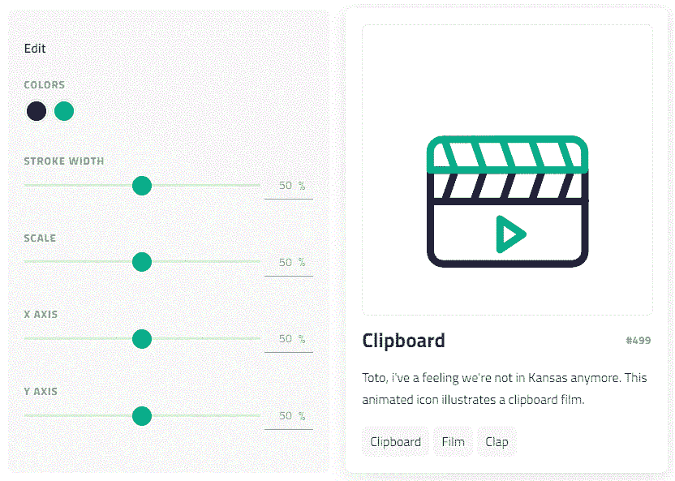

这是我不久前开发的一个简单应用的例子，它使用了 Lordicon 的拍板动画。这里没发生什么事情。每次点击都会从本地存储的列表中随机选择一个节目——这个过程需要几毫秒——并显示出来。但是快板让它看起来好像有一些工作在后台进行，而实际上延迟是模拟的。它还有一个效果，就是让点击按钮看着它做事情变得有趣。

**在继续讨论**之前，我还想提一下 [Rive](https://rive.app/) ，这是一款强大的设计和动画工具，具有强大的多平台集成，包括 web、Android、Flutter 和 [more](https://rive.app/resources/) 。这是我一直想使用的工具，但是还没有找到时间。

使用 Rive 编辑器，您可以创建平滑的动画，这些动画可以通过编程实时操作。哦，而且绝对[免费](https://help.rive.app/admin/pricing)。

如果你还没有准备好开始创作你自己的动画，许多都是由 Rive 社区分享的。请确保您的使用符合资产的许可，因为它们可能会有所不同。

# 向量图形

向量允许您将可缩放图像添加到项目中。vectors 的多功能性意味着使用像 [Gimp](https://www.gimp.org/) 和 [Inkscape](https://inkscape.org/) 这样的免费程序，你也可以组合和编辑它们来创建定制设计。这是给你的项目添加个人风格并让它们脱颖而出的另一个好方法，即使你对艺术不感兴趣。例如，这是我为过去的项目收集的两张图片。

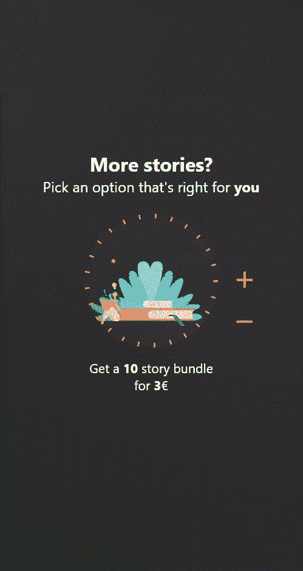

第一张 GIF 展示了我参与构建的一个 web 应用程序中一个屏幕的移动布局。第二张是来自[已经在其中一张图片中戏弄了这个](/build-a-netflix-api-miner-with-python-162f74d4b0df#5af3)。纯色背景会很快变得很无聊。幸运的是，有一个简单的补救方法。

Cssgradient 和 [Coolors](https://coolors.co/) 是我在这里选择的工具。它们不仅允许生成和定制心脏内容的渐变，而且它们还具有流行的、社区生成的渐变，所有这些都可以作为 CSS 或简单的图像下载。

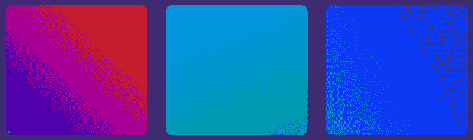

## 主题

Coolors 和 cssgradient 都更进一步，它们还提供了优秀的主题选择工具，在为应用程序设计连贯的调色板时提供帮助或灵感。

另一方面，Happy Hues 是一个专门做这个的网站。除了完成刚才提到的所有主题辅助，它还提供了一些有用的提示，比如术语的解释以及不同的颜色会对用户产生什么样的影响。

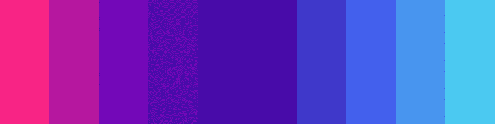

# 最后的评论

现在，在我们分道扬镳之前，我想提到的一个荣誉奖是[卡激增](https://card.surge.sh/)。这是一个免费的在线工具，可以帮助你为网络制作卡片，而且是好看的卡片。开发者还写了一篇很好的[文章](https://medium.com/free-code-camp/launching-a-side-project-in-10-days-615df3b0e808)，总结了构建工具的过程，所以也可以随意查看。

目前就这些。感谢阅读！一定要让我知道你喜欢使用什么 UI 宝石——隐藏的或者其他的。