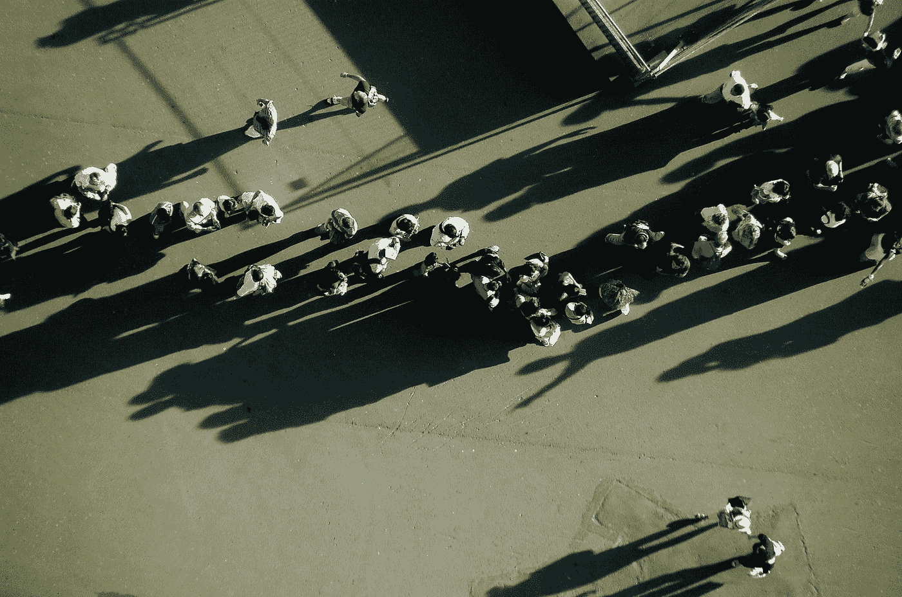
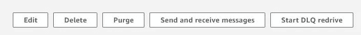
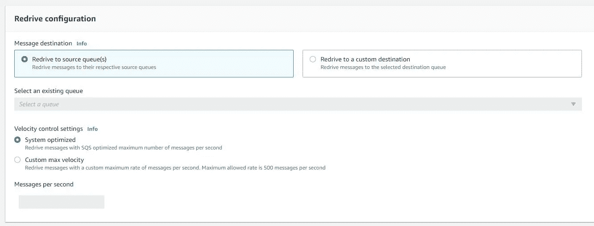

# 我最喜欢的《发明 2021》中 SQS 的新特征

> 原文：<https://betterprogramming.pub/my-favourite-new-features-of-sqs-from-re-invent-2021-3fd59478496>

## 部分批次失败和 SQS Redrive 将使您的生活更轻松

哈尔·盖特伍德在 [Unsplash](https://unsplash.com?utm_source=medium&utm_medium=referral) 上拍摄的照片

你好。AWS Re:Invent 2021 发布了许多公告，在本文中，我们将了解一些关于 AWS SQS 的公告。

# 首先，简单介绍一下 SQS。

什么是 SQS？从服务的概述页面"*亚马逊简单队列服务(SQS)是一个完全托管的消息队列服务，使您能够分离和扩展微服务、分布式系统和无服务器应用程序*

我想通过一个实际的例子来解释这些服务:假设您有一个终端，用户想要导出一个大的 excel，所以您不希望用户等待导出，您想要通过电子邮件发送它。

在这种情况下，您的端点在 SQS 队列中推送消息(或作业), Lambda 函数将从队列中读取消息并处理导出，然后通过电子邮件发送。这是典型的生产者-消费者模式。如果出现错误，可以重新处理消息，或者您可以将消息移动到 DLQ(死信队列)中。

DLQ 队列是与主队列严格相连的 SQS 队列。队列中的每条消息都有一个计数器:您可以设置一个阈值，超过该阈值后，消息将在 DLQ 中移动。简直就是死队列。您可以阅读调试的失败消息，并决定修复您的使用者中的问题，然后重新处理它。

# 批量部分失败

如上所述，当 SQS 的某个元素失败时，它会返回队列并重新处理，但是在几次尝试之后，该元素会被放入 DLQ。

当你用 Lambda 函数处理多个元素时，如果其中一些失败了，那么所有的元素都会在队列中返回，或者你需要从队列中删除成功的元素。

但是随着批处理部分失败，你的 Lambda 响应你将返回失败 id 的列表。自动地，不需要您自己删除元素，您就可以区分成功项和失败项。

# 把 DLQ 重新开到 SQS

在我看来，将元素从 DLQ 转移到主队列是一个关键特征。在引入它之前，您必须使用自定义实现手动完成这项工作，该实现从 DLQ 中读取元素，并将它们放入主队列中。

在 SQS 控制台的左上方，我们可以看到“启动 DLQ 红驱动”。因此，单击会将我们带到重新驱动配置。

> 记住:如果 SQS 队列没有 DLQ，按钮将被禁用！

使用默认设置，DLQ 项目将在 SQS 来源。但是，如果你想在不同的队列中重新驱动或设置不同的速度，你可以在这里编辑。

今天到此为止。我将制作一个小示例项目，其中实现了部分批处理失败，[你会在 GitHub](https://github.com/SalvoCozzubo/AWS-SQS-Partial-Batch-Failure) 上找到它。

别忘了查看[我之前的文章](https://medium.com/better-programming/four-ways-to-improve-your-aws-lambda-1cfd3a3115d6)，后会有期！