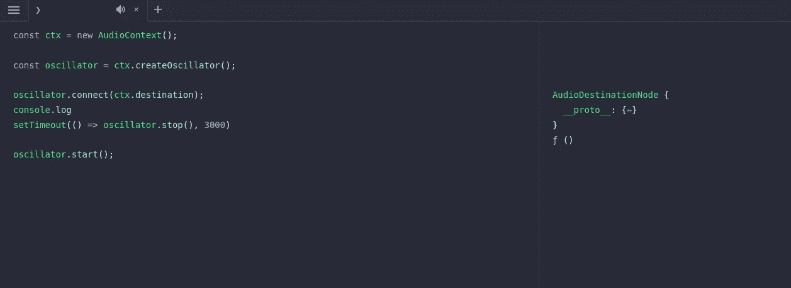

# 我最喜欢的 JavaScript 工具

> 原文：<https://betterprogramming.pub/my-favourite-tools-for-working-with-javascript-84eb836750b0>

## 我每天使用的 5 个不太流行的工具和应用

在 [Unsplash](https://unsplash.com?utm_source=medium&utm_medium=referral) 上由 [Moritz Mentges](https://unsplash.com/@mphotographym?utm_source=medium&utm_medium=referral) 拍摄的照片

我希望这篇文章尽可能地简洁，以便给读者一个结构化的概述，所以我不会过多地介绍这篇文章。这篇文章将讲述我在使用 JavaScript 时最常用的一些工具，作为一名全栈开发人员(目前主要使用区块链), JavaScript 是我每天仍在使用的语言。

虽然我也在使用其他在该领域工作良好的语言，如 Elixir 和 Rust，但我已经开始将我在过去几周学到的关于这种伟大语言的知识付诸实践。

无论如何，我的观点是 JavaScript 仍然是这个行业中最重要的语言之一，我想和你分享一些帮助我简化工作的应用和工具。

开始吧！

# [RunJS](https://runjs.app/)

这个工具现在已经成为我日常前端 JS 工作的必备工具。那么，我们在看什么？

尽管 JavaScript 是一种相对简单的语言，但它有自己的复杂性，这在我们的项目中经常会反映出来(尤其是更复杂的项目)。RunJS 是一个简洁的环境，可以在桌面上运行 JavaScript 代码。

您可以像在浏览器中一样运行 js 代码，但却是在真实的环境中。这个工具现在在我的日常开发工作流程中扮演着重要的角色:当我对刚学到的一个特性没有信心时，或者当我面临一个 bug 时，我就会启动 RunJS，摆弄代码，直到我得到想要的结果。

# [牧马人](https://workers.cloudflare.com/) — [CF 工人](https://workers.cloudflare.com/)

听说过无服务器吗？

Cloudflare workers 允许您以不可思议的简单开发方式部署无服务器 JavaScript 代码，我真的是说不可思议。

您可以在几分钟内构建和部署一个 API，而且是免费的！(只要您不寻求每天超过 100，000 个请求、每个请求更多的墙时间或更多的键值存储。).例如，我现在从事的三个项目中有两个使用了 Cloudflare workers。

如果您想知道什么是 wrangler，它是用于开发、测试和发布您的员工的 CLI 工具。

我推荐它，因为我确信它将帮助几乎所有使用 JavaScript 的读者。即使您只是在前端工作，您也可以使用 worker 作为桥梁或处理程序来重新格式化来自另一个 API 的数据。真的，什么都行。

此外，对于那些真正感兴趣的人来说，除了 JS 之外，CF 工作人员还原生支持 Rust、C++和 C。

# [开发工具](https://developer.chrome.com/docs/devtools/)——一些你可能不知道的事情

大约一年前，当我在搜索 web 应用程序中的错误时，我已经学会了使用 Chrome(或 Firefox)开发工具。我不能强调它让我意识到我没有正确地使用 web 开发工具而错过了多少。无论如何，这篇文章已经变得太长了(如果你到现在还在阅读的话，这是值得称赞的)，所以让我列出我非常喜欢的两个特定开发工具选项卡的几个方面:

*   源代码选项卡—调试，特别是断点和条件断点(基本上，如果满足某个条件，就暂停代码)。
*   网络选项卡—了解应用程序的技术和工作流程，请求复制(以及编辑和重放)。

我想在这里更详细地介绍一下，但是这篇文章不是关于开发人员工具的，尽管我很快会为您准备一篇文章。

# [德诺](https://deno.land/)

当 Node.js(顺便说一句，我也使用它)的创建者意识到 Node.js 的一些东西可以做得更好时，他决定继续用 Rust 构建 Deno。Deno 关注一些关键因素:

*   安全性—代码是沙箱化的，权限必须明确给出。
*   模块——你最后一次通过 URL`import(ed)`一个模块是什么时候？可能永远不会。Deno 的包不依赖于像 npm 这样的注册中心，而是从提供的链接下载模块(然后缓存它们，这样我们就不必每次都下载它们)
*   TS 支持，无需进一步配置。

说到脚本，Deno 在我看来是最好的，但它也出现在更大的用例中。

# [积雪场](https://www.snowpack.dev/)

Snowpack 是一个前端构建工具，实际上构建速度很快，同时由于 ESM 的存在，它非常简单。根据我的经验，没什么好说的。尝试一下，你很可能会对它提供的东西感到满意。可以从这里[开始](https://www.snowpack.dev/tutorials/quick-start)。

这不是一个全面的清单。我花了大量的时间使用 JavaScript，我所使用的工具、库和应用程序的数量甚至无法用一系列文章来描述。

然而，这些是我经常使用的工具，在大多数 JS 文章中没有列出，所以我想我应该给这些工具一些曝光，希望能帮助读者。

你可以看看我写的关于[为什么我会慢慢转用 Emacs 作为编辑器的文章](/emacs-or-vs-code-why-and-how-im-slowly-switching-to-gnu-emacs-ea33c0837ac4)，因为我也用它来编辑 JS ( `web-mode`是你的朋友)。

*感谢阅读！*