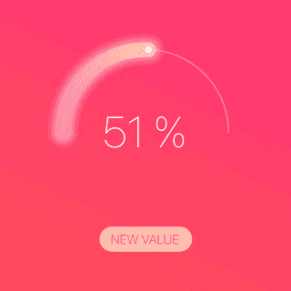
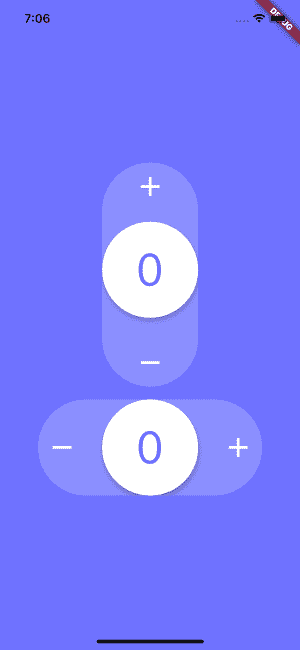
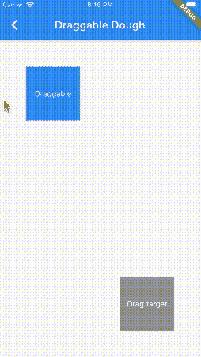
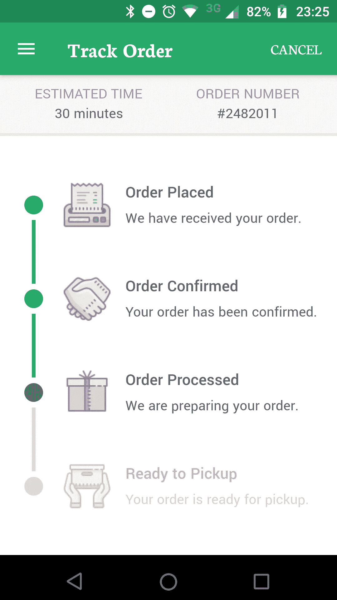

# 我二月份对颤振包的建议

> 原文：<https://betterprogramming.pub/my-february-recommendations-for-flutter-packages-7cd6b597113>

## 发现颤动——第 23 周

## 我在 2021 年 1 月发现的最好的包

约书亚·厄尔在 [Unsplash](https://unsplash.com?utm_source=medium&utm_medium=referral) 上的照片

是时候给我的二月颤振包推荐了。以下是我与这个话题相关的五大发现。

# 1.使用进度条轻松监控您的进度

监控任何类型的进展对于增长都是必不可少的。sleek_circular_slider Flutter 包是一个很棒的库，它提供了一个高度可定制的圆形滑块/进度条和微调器。

 [## sleek_circular_slider |颤振包

### 一个高度可定制的圆形滑块/进度条和微调器。添加圆滑 _ 圆形 _ 滑块:^lastest_version…

公共开发](https://pub.dev/packages/sleek_circular_slider) 

【https://pub.dev/packages/sleek_circular_slider 

# 2.输入步进器很重要

输入步进器始终是一个不可或缺的输入控件，它可以帮助用户下订单、调高或调低音量以及增加或降低特定值。

从用户的角度来看，它们非常容易使用和浏览，这反映了它们在移动应用领域的重要性。

[https://github.com/Rahiche/stepper_touch](https://github.com/Rahiche/stepper_touch)

 [## Rahiche/stepper_touch

### 小工具的概念灵感来自尼古拉·库奇卡罗夫。我扩展了功能，使其在现实世界中更有用…

github.com](https://github.com/Rahiche/stepper_touch) 

# 3.谷歌风格的导航条

如果你是谷歌导航条现代外观的粉丝，那么这就是适合你的软件包。

 [## google_nav_bar | Flutter 包

### 一个现代的谷歌风格的颤振导航条。GoogleNavBar 是一个由 Aurelien Salomon 设计并开发的 Flutter 窗口小部件…

公共开发](https://pub.dev/packages/google_nav_bar) 

[https://pub.dev/packages/google_nav_bar](https://pub.dev/packages/google_nav_bar)

# 4.制作 Widget 面团

作为 Trello 平台的忠实粉丝，我对这个包很感兴趣，因为它可以用来提供一种有趣的方式将卡片从一个列表拖到另一个列表。遇见面团飘动套餐。

 [## 面团|颤动包装

### 这个包提供了一些可以用来创建 smooshy UI 的小部件。这个包提供了 squishy 部件，你可以…

公共开发](https://pub.dev/packages/dough) 

[https://pub.dev/packages/dough](https://pub.dev/packages/dough)

# 5.时间表至关重要

时间线非常有助于组织你的工作，因为它们提供了一个简单的视觉概览。考虑到这一点，如果你的应用程序适合时间表，那么设置时间表总是一个很好的选择。

 [## 时间轴 _ 平铺|颤动包

### 一个帮助在 Flutter 中建立可定制时间线的包。一些用例:时间线由一组…

公共开发](https://pub.dev/packages/timeline_tile) 

[https://pub . dev/packages/timeline _ tile https://pub . dev/packages/timeline _ tile](https://pub.dev/packages/timeline_tile)

# 结论

如果你是涵盖各种 Flutter 主题的简短有趣文章的粉丝，并且你想养成在接下来的七周内和我一起学习 Flutter 的习惯，你可以每周二阅读我的文章。

如果你对这篇文章有任何问题或评论，请在评论区告诉我。

对于那些想加入我们的颤振之旅的人，可以在下面找到前几周的链接:

*   [第 20 周](https://medium.com/better-programming/my-january-recommendations-for-flutter-packages-6fca1557920c)——“我一月份对颤振套件的建议”
*   [第 21 周](https://jelenajjovanoski.medium.com/top-5-reasons-to-learn-flutter-in-2021-128801256335)——“2021 年学习 Flutter 的五大理由”
*   [第 22 周](https://jelenajjovanoski.medium.com/change-screen-orientation-in-flutter-9f56c7d05eed) —“在颤动中改变屏幕方向”

下周见，不要打破记录！