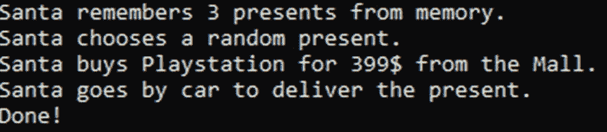
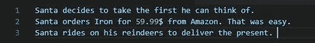

# 通过这个简单的练习学习策略模式！

> 原文：<https://betterprogramming.pub/my-first-coding-dojo-drunk-santa-claus-and-the-strategy-pattern-e7b6529b1ae4>

## 我主持的第一个*编码道场*就在整个团队的圣诞假期之前。所以我准备了一些饼干和一些热潘趣酒，并邀请大家来帮助我们的好朋友圣诞老人！

# 问题是:

当我们所有人都试图与家人共度美好时光时，圣诞老人不得不在平安夜工作。

他的工作总是一样的:

1.  圣诞老人必须凭记忆想出一些好礼物。
2.  圣诞老人必须从他的众多想法中随机选择一个。
3.  圣诞老人必须从商场买礼物。
4.  圣诞老人必须开车送礼物。

# 获取编码！

我给两个小组(两人一组)看了一眼圣诞老人的大脑:

团队现在有大约 15 分钟的时间来编写一个控制台应用程序，绘制以下输出:

# 圣诞老人不高兴

控制台输出不是很方便。一旦圣诞老人关闭应用程序，所有信息都会丢失。

作为我们的应用程序的唯一客户，他希望将输出写入一个文件。他想通过命令行参数来切换该功能。

团队还有 15 分钟来实现这个功能。

一些团队已经对他们的架构进行了大量的讨论，一些团队采取了非常务实的方法，一些团队有意识地全力以赴。如此琐碎的任务有这么多不同的解决方案。

# 第一个转折:圣诞老人喝醉了！

而且不是第一次了！这当然影响了平安夜:

圣诞老人喝醉的时候记不住礼物。他必须从他清醒时创建的文件中获得他的想法:

由于我们永远不知道圣诞老人在平安夜是喝醉了还是清醒的，该团队被指示创建另一个命令行参数来切换该行为:清醒时根据记忆，喝醉时根据文件。

两队还有 15 分钟。

反序列化*。json 文件是小菜一碟。但是一些团队的发展已经有些迟缓了。尤其是快脏团队不得不与自己的设计决策斗争。

# 最后一步:交换代码库！

每个团队将一台笔记本电脑移到右边，剩下的是他们前任的代码。这就像是团队中的新人，看着一大堆遗留代码。

他们现在必须在 25 分钟内实现以下新要求:

当圣诞老人喝醉的时候

*   他不在乎。他总是挑选他在文件中找到的第一件礼物。
*   他不能步行去商场。他只是从亚马逊订购。
*   他不能(也不允许)开车！他只是骑着他的驯鹿。老派。

之后的输出应该是这样的:

所有的团队立刻对新的代码库持否定态度。只是因为它是未知的，有待阅读和理解。我的一个同事甚至在查看快速和肮脏部分的代码时说道:

> 我认为我们应该继续以这种方式实施…

这说明了代码气味的一个主要问题:它们是会传染的。当在有臭味的代码中移动时，编写坏代码的抑制级别下降。整个解决方案变得越来越混乱。这也被称为[破窗理论](https://en.wikipedia.org/wiki/Broken_windows_theory)。

# 拯救战略模式！

所有团队都承认这个练习并不容易，尽管它看起来微不足道。我问他们是否有任何解决方案符合[开闭原则](https://en.wikipedia.org/wiki/Open%E2%80%93closed_principle):没有。

所以我向他们提出了一个解决方案。感谢策略模式。

看一下方法`Run()`。读起来超级容易。它代表了我们的算法，我们的策略。这是圣诞老人每年都会做的程序，不管他是喝醉了还是清醒着。最棒的是:这种方法保持不变:

*   圣诞老人必须从任何一种`IIdeaSource`中获得他的想法。
*   圣诞老人必须以某种方式和 T2 一起做出决定。
*   圣诞老人必须从任何一个`IShop`处购买礼物。
*   圣诞老人必须用任何类型的`IDelivery`来递送礼物。

这个策略非常抽象。这是这个模式的重要部分:

*   这种策略不在乎这些想法是来自记忆、文件、互联网还是他的朋友。它只需要来自`IIdeaSource`的方法`IEnumerable<Present> GetPresents()`。
*   这个策略不在乎圣诞老人是随机选择第一份礼物还是最后一份礼物。它只需要来自`IPresentChooser`的方法`Present ChooseFrom(IEnumerable<Present> presents)`。
*   这个策略不关心圣诞老人是在商场买礼物，从亚马逊、易趣订购，还是自己动手修补。它只需要来自`IShop`的方法`void Buy(Present present)`。
*   这种策略不在乎圣诞老人是开车、骑驯鹿、步行还是在 UPS 的帮助下送货。它只需要来自`IDelivery`的方法`void Deliver()`。

> 平安夜发生的事情总是一成不变。只是做的方式会不时改变。

一切保持不变是我们的策略。这属于我们班`ChristmasEve`。

所有可以改变的东西都通过构造函数作为依赖注入到类中。

这样，我们可以简单地通过注入所需的实现来决定如何执行策略。

仅此而已。这就是战略模式。

# 这些实现看起来怎么样？

短小精悍！这里有两个例子:

# 如果我想增加一个新的商店会怎么样？

简单易行:

1.  我们创建一个新的类，例如`Ebay.cs`
2.  我们让那个类实现`IShop`
3.  我们给`ChristmasEve`一个`Ebay`的实例，而不是`Mall`。
4.  就是这样。我们没有碰任何旧代码。我们只添加了新代码。[开闭原则](https://en.wikipedia.org/wiki/Open%E2%80%93closed_principle)认可。

# 你是如何实现不同的输出的？

这一切都是为了确定战略。

*   你想怎么样？—写东西！
*   你想在哪里写东西？—我不在乎。我只想写作。
*   结论:我们所需要的是一个接口`IOutput`和一个方法`WriteLine(string text)`。

这就是两个实现的样子。两者都短小精悍。您可以看到这些类在没有任何滚动的情况下做了什么。

# 将它们联系在一起

下面是我们的应用程序根可能的样子:

我真的很喜欢这个解决方案。对于这个问题，策略模式确实很有效。所有的班级都很小并且可读。我们可以灵活应对进一步的变化。

> 圣诞节有救了！谢谢帮忙！

# 但是在一个大的应用程序中，我的根类会非常大，而且那样会很乱

在某个必须完成的地方。至少在一个地方是这样。您可以在应用程序的根中交换行为，而不是在整个应用程序中挖掘。

一些聪明人已经帮你解决了这个问题。如果你的根变得太大而无法处理，可能是时候看看 IoC 容器了，比如 [Autofac](https://autofac.org/) 。

你主持过编码道场吗？你的经历如何？让我知道！:-)

感谢阅读！