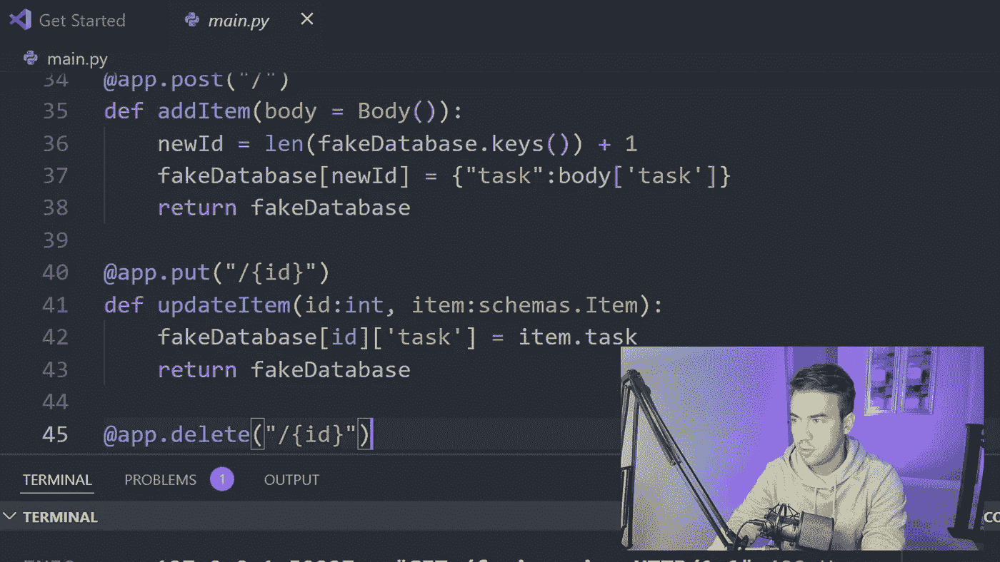
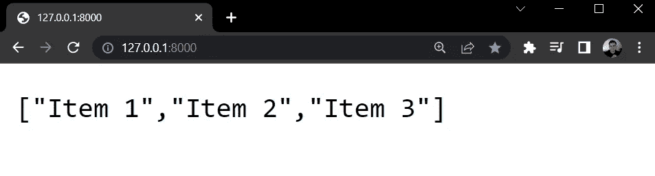
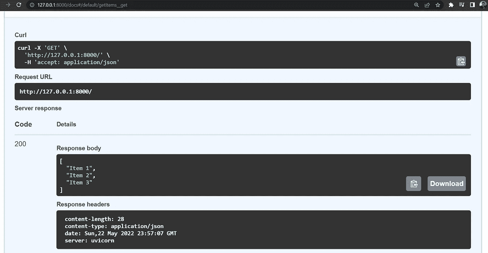
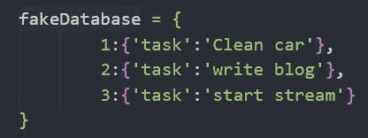
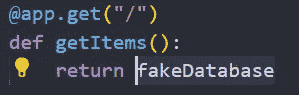
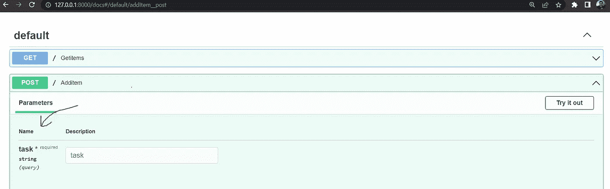
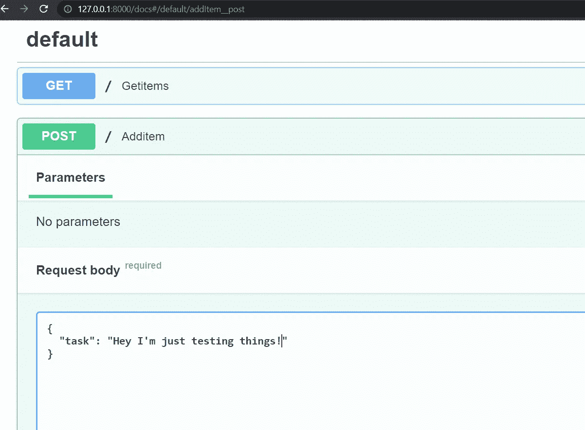

# 我的第一个带有快速 API 的 CRUD 应用

> 原文：<https://betterprogramming.pub/my-first-crud-app-with-fast-api-74ac190d2dcc>

## 循序渐进的指南



作者图片

是我 fast API 直播的前一天。我决定为这个流创建一个指南，并把它变成一篇博文。所以，在这里。

流结构:

*   快速 API vs Django
*   装置
*   创建第一个应用程序和路线
*   Swagger UI
*   路径参数
*   发布、上传和删除请求
*   数据库和模型
*   带有新数据库的 CRUD

# 快速 API vs. Django

很多人可能知道我是姜戈。毕竟，我的频道充斥着 Django 项目和课程。上周我去了加州北部的沙斯塔湖，像往常一样，我厌倦了太多空闲时间，所以我决定学点新东西。

我一次又一次地被问到我对新框架的看法，以及它与 Django 相比如何，直到现在，我一直保持沉默，因为，嗯，我对它了解不多。

一个星期后，我仍然不太了解它，但我已经学会了如何创建一个简单的 CRUD 应用程序，并开始形成自己的观点。老实说，这种观点并不固定，随着我越来越多地使用 fast API，它会发生变化。

这是我截至 2022 年 5 月 22 日的结论。Django 仍然是更强大的框架，也将是我的首选。尽管快速 API 很酷。对我来说，fast API 真正突出的一个方面是对异步的支持，并且不必不断地序列化我的数据。老实说，我讨厌为了呈现一个简单的对象或列表而必须序列化数据。

快速 API 设置起来既快又容易，但你最终会为此付出代价。这就是为什么我通常不喜欢 Flask 和 Fast API 这样的轻量级框架。Django 给了我一个易于配置的数据库、ORM、认证等等。

好了，我的意见说够了。让我们从指南开始吧。

# 装置

我可能已经假设了这一点，但是如果您还没有，请确保您的机器上已经安装了 Python。快速 API 需要 Python 3.6 及更高版本。

一旦安装了 Python，就可以用一个简单的 pip 命令来安装 Fast API

```
pip install fastapi
```

# 创建第一个应用程序和路线

让我们首先创建一个简单的应用程序和 route，它以 JSON 数据的形式返回一个项目列表。

要创建您的第一个项目，只需在您的计算机上创建一个新文件夹。我将它添加到我的桌面上，并将其命名为`myapi`。

用您选择的文本编辑器(对我来说是 VS 代码)打开这个文件夹，创建一个名为`main.py`的文件。这将是把我们的应用程序联系在一起的主要文件。

```
myapi
   main.py
```

在`main.py`文件中，首先导入 FastAPI 类，设置 app 变量，并创建您的第一条路线。下面是实现这一点的代码:

```
#main.py
from fastapi import FastAPIapp = FastAPI()@app.get("/")
def getItems():
    return ['Item 1', 'Item 2', 'Item 3']
```

现在，为了看到这个输出，让我们安装 uvicorn，它是一个 ASGI 服务器。

```
pip install uvicorn
```

现在，要运行服务器，请确保您在项目根目录中，并运行以下命令:

```
uvicorn main:app --reload#Output
INFO:     Uvicorn running on http://127.0.0.1:8000 (Press CTRL+C to quit)
INFO:     Started reloader process [28720]
INFO:     Started server process [28722]
INFO:     Waiting for application startup.
INFO:     Application startup complete.
```

`main`是文件名，`app`是我们的应用程序变量的名称，`— reload`将在我们对代码进行更改时重启我们的服务器，并且只应用于开发中。



作为 JSON 数据的 FastAPI 输出列表

# Swagger UI

Fast API 提供了一个由 [swagger UI](https://swagger.io/tools/swagger-ui/) 带给我们的交互式 API。我就不解释 swagger UI 了，如果你想看的话，我会提供一个链接，但是相信我，这很酷。

要查看它的运行情况，请将`/docs#`添加到我们为第一条路线设置的 URL 的末尾。

```
[http://127.0.0.1:8000/docs#](http://127.0.0.1:8000/docs#)
```

这将为您提供一个很酷的用户界面，这样您就可以与您的 API 进行交互，并获得更多的信息，而不仅仅是一些数据。这将列出您添加的所有路线。

要进行测试，请单击当前可用的路线，然后单击“尝试”，然后单击“执行”

现在，您将看到数据的格式如下:



在进入下一节之前，让我们创建一个表示数据库的对象。我们最终将开始使用 SQLite 数据库，但这将使我们在以后前进之前更容易开始。

在我们的第一条路线上方创建这个对象:



并在第一条路线中呈现项目:



# 路径参数

接下来，我想创建一些动态路由来从数据库中检索特定的对象。为此，我们将创建一个带有路径参数的新路由，然后在视图函数中指定我们需要的参数类型。

这实际上非常简单，使用下面的代码:

```
@app.get("/{id}")
def getItem(id:int):
    return fakeDatabase[id]
```

该路由期望一个整数作为`id`值的路径参数。然后，我们将获取该参数并查询具有该特定 id 的项目。测试时，确保使用数据库中存在的 id。

以下是输出结果:


# 发布、放置和删除请求

是时候发送一些`POST`、`PUT`和`DELETE`请求了，这样我们就可以修改我们的假数据库了。

简单回顾一下，POST 请求用于添加数据，PUT 请求通常用于更新数据，DELETE 请求用于删除数据。

从我们向数据库添加新条目的 POST 请求开始，我们有几种方法可以做到这一点，所以我将测试三个选项。

这是我们需要创建的路线。下面我来分解一下。

```
#Option # 1
@app.post("/")
def addItem(task:str):
    newId = len(fakeDatabase.keys()) + 1
    fakeDatabase[newId] = {"task":task}
    return fakeDatabase
```

您将在“文档”用户界面中看到以下内容:



`app.post` —我们将此路由的 HTTP 请求类型指定为 post 请求。

`/` —这是与`getItems`相同的路线。`addItems`将处理所有发送到这里的 post 请求，而`getItems`将处理所有 get 请求。

函数参数——在函数中，我们指定请求体中有一个`task`,数据类型必须是字符串。

当我们明确指定所需的参数时，这将在 docs UI 中反映为一个表单字段，如上图所示。很整洁，是吧？

现在，假设我们需要在请求体中发送多个值。我们可以将每个字段作为参数添加到函数中，但这会变得非常混乱。

想象一下这样的情况:

```
addItem(“task”:str, “priority”:”str”, “rank”:int, ..........)
```

这可能会永远持续下去，变得一团糟！

因此，我们将使用 pydantic 来设计我们的数据方案，并简单地传入一个指定所需数据的对象。这样会让事情干净很多。

为此，我们将首先安装 pydantic，然后创建一个名为`schemas.py`的新文件，并添加以下代码:

```
pip install pydantic
```

创建`schemas.py`文件

```
myapi
   main.py
   schemas.py
```

`schemas.py`

```
from pydantic import BaseModelclass Item(BaseModel):
    task: str
```

然后，我们将把我们的模式导入到我们的`main.py`文件中，并更新我们的 addItem route，如下所示。

```
from fastapi import FastAPI
import schemas…………#Option # 2
@app.post("/")
def addItem(item:schemas.Item):
    newId = len(fakeDatabase.keys()) + 1
    fakeDatabase[newId] = {"task":item.task}
    return fakeDatabase
```

您的文档的用户界面应该如下所示:



好的，选项 1 和 2 工作得很好，但是你们中的一些人可能不知道要立即发送什么数据，或者你们可能只是想访问发送的整个请求体，并根据需要提取每个项目。我将向您展示如何做为选项 3。

同样，我们将修改 addItem 路由，但这次我们需要从`main.py`中的 Fast API 导入`Body`

```
from fastapi import FastAPI, Body
```

接下来，我们将使用`Body`类，并将其作为参数添加到我们的路由中。一旦我们将其作为参数添加，我们就可以将请求体作为字典来访问，并提取出`task`的值。

```
#Option #3
@app.post("/")
def addItem(body = Body()):
   newId = len(fakeDatabase.keys()) + 1
   fakeDatabase[newId] = {"task":body['task']}
   return fakeDatabase
```

就是这样！

这种方法的缺点是不能在 docs UI 中指定字段。您将看到的只是一个字符串值，因此您必须自己创建整个请求正文。老实说，这不是什么大问题，因为你通常必须在前端创建请求体，但这是需要考虑的事情。此外，确保您使用的是双引号，而不是单引号。这将确保字符串能够在接收端被解析。

# 更新数据

在`main.py`中，我们添加以下更新数据的路径:

```
@app.put("/{id}")
def updateItem(id:int, item:schemas.Item):
    fakeDatabase[id]['task'] = item.task 
    return fakeDatabase
```

我们使用与`getItem`相同的 URL 路径，但是这个路由将专门处理`put`请求。您可以使用我们用于 post 请求的三个选项之一。在我的例子中，我决定走 pydantic 路线(选项 2)。

# 删除数据

让我们再添加一条路由，这条路由将处理发送到`/{id}`的删除请求。我们需要的唯一参数是`id`,因为我们所做的就是找到我们需要的商品并将其从数据库中删除。

```
@app.delete("/{id}")
def deleteItem(id:int):
    del fakeDatabase[id]
    return fakeDatabase
```

# 数据库和模型

好了，我们完成了占位符数据库。是时候建立真正的联系，建立我们的`models`档案了。在这个例子中，我们将使用 SQLite 作为我们的数据库。

```
pip install sqlalchemy
```

我们首先添加一个`database.py`文件来建立连接，然后在新文件中添加以下代码。

```
myapi
   main.py
   schemas.py
   database.py
```

`database.py`

```
from sqlalchemy import create_engine
from sqlalchemy.ext.declarative import declarative_base
from sqlalchemy.orm import sessionmaker#Create sqlite engine instance
engine = create_engine("sqlite:///todo.db")#Create declaritive base meta instance
Base = declarative_base()#Create session local class for session maker
SessionLocal = sessionmaker(bind=engine, expire_on_commit=False)
```

一旦我们配置了数据库连接，我们将需要创建数据库模型来表示我们的 db 表。

```
myapi
   main.py
   schemas.py
   database.py
   models.py
```

`models.py`

```
from sqlalchemy import Column, Integer, String
from database import Baseclass Item(Base):
    __tablename__ = 'items'
    id = Column(Integer, primary_key=True)
    task = Column(String(256))
```

现在，让我们在`main.py`中初始化数据库，这样我们就可以开始使用它了。

[https://gist . github . com/better programming/83 edee 29166269 f0e 622 f 81 ca 85 E6 a1f](https://gist.github.com/BetterProgramming/83edee29166269f0e622f81ca85e6a1f)

# 使用我们的数据库

好，让我们进行第一次数据库查询。

让我们更新我们的`getItems`视图，查询我们数据库中的所有条目，如下所示:

```
@app.get("/")
def getItems(session: Session = Depends(get_session)):
    items = session.query(models.Item).all()
    return items
```

这将以 JSON 列表的形式返回所有项目。此时，我们没有任何条目，所以让我们通过更新我们的`addItem`视图来改变这一点。

```
@app.post("/")
def addItem(item:schemas.Item, session = Depends(get_session)):
    item = models.Item(task = item.task)
    session.add(item)
    session.commit()
    session.refresh(item)
    return item
```

现在检索单个项目。

```
@app.get("/{id}")
def getItem(id:int, session: Session = Depends(get_session)):
    item = session.query(models.Item).get(id)
    return item
```

和更新项目。S

```
@app.put("/{id}")
def updateItem(id:int, item:schemas.Item, session = Depends(get_session)):
    itemObject = session.query(models.Item).get(id)
    itemObject.task = item.task
    session.commit()
    return itemObject
```

最后，删除一个项目。

```
@app.delete("/{id}")
def deleteItem(id:int, session = Depends(get_session)):
    itemObject = session.query(models.Item).get(id)
    session.delete(itemObject)
    session.commit()
    session.close()
    return 'Item was deleted'
```

好了，就这样吧！

你可以在 [GitHub](https://github.com/divanov11/Fast-API-CRUD-App-Live-Stream-Code) 上找到完整的代码或者在这里观看视频:[https://www.youtube.com/watch?v=FOZNYBu8u18](https://www.youtube.com/watch?v=FOZNYBu8u18)