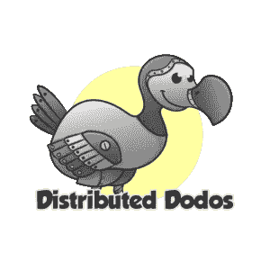

# 我的第一个开源贡献

> 原文：<https://betterprogramming.pub/my-first-open-source-contribution-eb8057bcd6c1>

## 我是如何参与开源的，你也可以

法比安·伊尔萨拉在 [Unsplash](https://unsplash.com/s/photos/woc-in-tech?utm_source=unsplash&utm_medium=referral&utm_content=creditCopyText) 上的照片

# 关于我

我叫什拉德哈·沙里格拉姆。我是一名计算机科学研究生，学习是我的第一热情。我期待成为一名终生学习技术的学生。我一直致力于我的个人项目，专注于 web 开发领域，或者更确切地说，一些传统的实习。这是我第一次从事开源工作。我必须承认，作为一个初学者，这确实是一个令人生畏的过程。

好了，我说的够多了！

作为国际学生在美国获得实习机会需要付出很多努力，有数百万来自世界各地的学生在这里学习。由于新冠肺炎的情况，我所有的实习面试都暂停或取消了。我在一个脸书小组上看到了 [MLH 奖学金](https://fellowship.mlh.io/)的申请，[重写代码的女人](https://www.facebook.com/groups/RewritingTheCode)，我就想试一试。我很高兴地说，现在我是 MLH 研究员的一部分，在那里我为用打字稿写的开源项目做贡献。

我可能每天都要花四到六个小时准备实习面试，钻研 Leetcode。但是你从来没有机会谈论你所做的事情有多重要。我终于在科技领域产生了一些影响，这种影响可能会让人们的生活变得轻松。

# 为什么要开源？

开源是一种很好的方式，可以让你在家中舒适地获得真实世界的软件开发经验。开源社区非常有用，鼓励新开发人员加入他们的组织。您获得了曝光率，测试了您的技能，获得了知识，并与社区建立了联系，从而产生了有助于全世界人民的高质量代码。您编写的代码有益于用户社区。

# 什么是 MLH 奖学金？

正如 GitHub 的[欢迎来到 MLH 研究员的首届班级](https://github.blog/2020-06-24-welcome-to-the-inaugural-class-of-mlh-fellows/)所说:

> “学生开发人员是软件的未来。他们对工具的品味，他们对代码的习惯，他们正在学习的东西——所有这些驱动因素将在未来几年塑造技术和文化。对于许多因 GitHub 赞助的 COVID-10 而失去实习机会的学生来说，这是一个实习选择。
> 
> [“美国黑客大联盟(MLH)](https://mlh.io/) 与脸书、加拿大皇家银行、DEV、Ovio、PlutoVR、亚马逊网络服务、Twilio、纽约科技人才管道和 Techtonica 等公司联盟合作，提供一种新的行业体验: [MLH 伙伴关系](https://github.blog/2020-05-04-announcing-the-mlh-fellowship-powered-by-github/)。
> 
> “今年夏天，来自世界各地的 144 名学生正在为不同的开源项目做出贡献。这是一个遥不可及的机会，但却为学生提供了一个展示技能的全球平台。”

# 它是如何工作的？

*   在项目开始时，研究员被分成几个小组，根据兴趣和空闲时间被称为 pod *s、*。
*   每个 pod 包含八到十名学生、一名专业导师和/或三名开源项目维护人员。我们还被介绍给了我们的导师 Ian Jennings，他在整个项目中提供了巨大的动力，并帮助我们每个人在技术和软技能方面都取得了更大的成就。
*   每天与导师一起讨论日常目标和同事可能面临的障碍。在我们第一次站立时，我们决定我们的吊舱的名字将被分配渡渡鸟，因为我们的命名主题是基于海洋动物。
*   还组织了与同事的结对编程会议和与导师的办公时间，以协同工作来解决一些问题或一起修复一个 bug。我还和我的导师伊恩进行了一对一的谈话，这真的很有教育意义。我得到了一些人生经验和指点，关于如何成为一名更好的软件开发人员，并从我的学习经历中获得最大收益。
*   每周举行两次特别会议。在每周一次的展示和讲述中，来自 pod 的任何人都可以展示他们的个人项目或谈论他们感兴趣的任何话题。每周回顾会议让所有同事有机会讨论他们的红色(他们被阻止的任务或面临的任何挑战)、绿色(他们在那一周完成的任务)和黄色(改进的领域和对工作出色的 pod 队友的表扬)。
*   附加讲座将持续一周，一些经验丰富的行业专业人士将分享对最新技术堆栈的见解。我们还有一些实践研讨会，在那里你可以卷起袖子，通过现场编码构建迷你项目。例如，我们有一次由[卡西迪·威廉姆斯](https://www.linkedin.com/in/cassidoo/)做的关于在网络开发领域寻找工作的精彩演讲。她讨论了软件工程面试、简历和求职信格式的各种细微差别，以及如何在远程工作中提高效率。

Pod 的名称

# 我参与了什么项目？

[总部位于柏林的公司 n8n](http://n8n.io/) (8.1K GitHub stars 和 560 GitHub forks)建立了一个公平代码工作流自动化平台，让开发人员快速集成他们用来自动协同工作的任何应用程序——从标准的第三方 API 到开发人员自己创建的内部工具。你也可以在这里阅读[的一个用例](https://medium.com/n8n-io/tephlon-talks-about-n8n-on-raspberry-pi-23dc6d44642)。

n8n 开发者社区在为他们的产品做贡献方面真的很棒。维护人员总是通过他们惊人的代码评审来推动我们达到最好。

# 我的第一个贡献

具体到 n8n，我们要开发新的功能，比如整合不同的[节点](https://n8n.io/integrations)像 Instagram、Gmail 等等，来拓展产品的使用场景。在两周的时间里，我合并了两个拉请求，创建了一个 [MessageBird](https://github.com/n8n-io/n8n/pull/660) 节点和一个 [Google Tasks](https://github.com/n8n-io/n8n/pull/680) 节点。我需要为我的 Google Tasks 节点和 Zoom 节点添加 OAuth2，这有点难以理解。维护人员非常有帮助和耐心，让我的 OAuth2 概念变得清晰。我添加了所有节点的 CRUD 操作。我们最初忽略了许多次要的代码库约定。但在提交 PR 时，我们必须遵守他们的编码标准，并做出相应的修改。因此，我们汇编了我们学到的所有最佳实践，并在 GitHub 上记录了它们。

我还研究了创建 Google 日历和 Google 任务节点的参考文档。我为我的同事的工作做代码审查，并不断尝试发展我的 Git 技能。在如此短的时间内，这是一个强化学习的过程。

由于新冠肺炎的情况，大多数公司已经过渡到远程工作。许多公司正在使用 Zoom 进行会议、站立和大会。与 n8n 进行急需的 Zoom 集成肯定会对大多数公司产生巨大的积极影响，使会议安排、网络研讨会等实现自动化。我的缩放节点即将合并。

由于我的 Git 有点弱，我在为如此大的代码库做贡献时挣扎了很多，尤其是当我面临一些合并冲突时。

# 我整个夏天的工作

我将使用 Vue.js 框架改进 UI 功能，根据 [n8n 用户社区](https://community.n8n.io/)的要求向 [n8n 集成](https://n8n.io/integrations)添加更多功能，并为一些核心 n8n 功能做出贡献。

# 我的开源经验

我对开源社区的参与无疑提高了我的编程和交流技能。开源项目的设计、实现和维护方式总是教导您如何在企业级进行项目开发。它提供了一种真正在行业中工作的感觉。它还帮助我培养了团队合作、人际交往能力、在截止日期前工作以及坚持编码标准等品质。

开源也是认识在优秀公司工作的行业专家的好方法。这导致了人际关系网，这在要求推荐实习和全职职位时至关重要。我可能也需要一个。

# 我学到了什么？

这些是我从我的第一篇开源文章中学到的要点:

*   如何与来自不同时区的队友进行[异步远程协作](https://github.com/MLH-Fellowship/async-remote/blob/master/README.md)
*   如何理解由成千上万个 LOC 组成的庞大代码库
*   如何在我们的项目中遵循一些[最佳 Git 实践](https://github.com/MLH-Fellowship/n8n/wiki)
*   如何与另一个开发人员结对编程来修复 bug
*   如何进行代码评审
*   如何编写有意义的提交消息——相信我，这真的很重要！

# 最后的想法

如果你是编程新手，我建议你考虑参与一个开源项目。乍一看可能有点可怕，但确实如此。但是 MLH 奖学金使它完全值得！

你正走出舒适区，进入未知领域。这是真正的学习发生的地方。

感谢阅读！