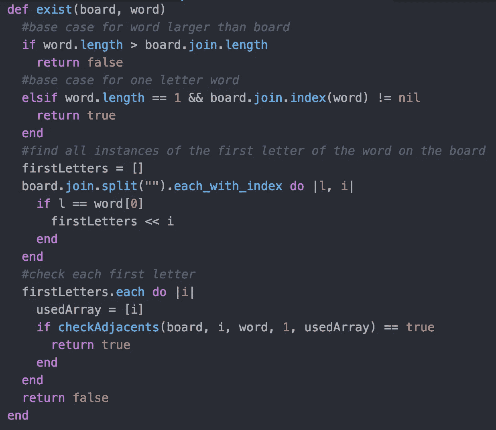
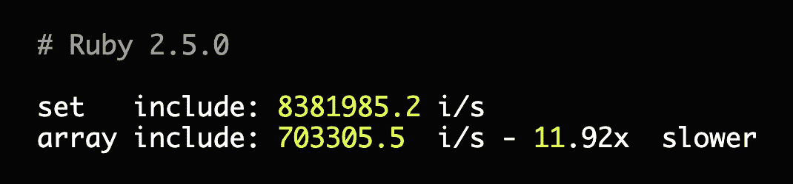

# 优化我在 Ruby 中的第一个递归函数

> 原文：<https://betterprogramming.pub/my-first-recursive-function-in-ruby-part-2-722e27243912>

## 犯了错误，吸取了教训

几天前，我决定重温我在 [LeetCode](https://leetcode.com/) 遇到的单词搜索问题。

这是我在 [Ruby](https://www.ruby-lang.org/en/) 中尝试的第一个递归问题，也是我尝试过的第一个返回布尔值的递归函数。几个小时后，我终于找到了解决办法。

不幸的是，在所有可接受的答案中，它在运行时处于倒数第 15 个百分点。虽然我对我的解决方案很满意，但我认识到还有很大的改进空间，并决定尝试重构这个问题。

重构前存在函数

我做的第一件事是寻找不必要的代码来删除。虽然我不认为这会节省我很多运行时间，但在我进入优化之前，我需要使我的解决方案更干净。

我注意到在我的 exist 函数中有一些基本情况，这很不寻常，因为 exist 甚至不是递归的。虽然我一度需要这些案例，但自从写了这些案例后，我的递归得到了改进，我预测我将不再需要它们。我是对的。

重构后存在函数

去掉前两个案例后，我只剩下两个循环。一个是找出棋盘上与第一个字母相匹配的字母，另一个是尝试对每个字母进行递归。

我意识到没有必要有两个循环。虽然，最初，我认为我很聪明地找到了我应该开始的索引，但没有理由为它做一个单独的循环。

然后我将两个循环合并成一个，留给我一个更干净的 exist 函数。然而，正如所料，这些变化并没有为我节省任何运行时间。

我看了一眼我的`checkAdjacents`函数，最重要的部分。

使用与之前相同的逻辑，我删除了另一个不必要的基本用例来清理代码。但是，我找不到其他可以删除的东西，所以我转而使用我的助手函数，`getAdjacents`。

我立刻注意到我用了四次`.include?`方法。这可能会降低我的速度，所以我尝试了一些其他方法来检查现有的对象。

比较集合和数组的运行时

首先，我尝试使用散列来代替。我知道在 hash 上使用`has_key?`是一个常量时间，但是即使有这样的变化，我的函数仍然很慢。

好吧，有什么数据类型的查找速度比哈希快吗？

经过一些快速的互联网搜索，我发现了 set，它基本上模仿了一个数组，但没有重复的值。我把我的散列换成了集合，并再次尝试运行这个函数。

但是，再一次，速度几乎没有任何变化。甚至删除我的评论对运行时也有更好的影响。最后，我意识到我其实是在浪费时间。

include 方法丝毫没有降低我的速度，因为我检查的数组并不大。如果数组很大，那么切换到 hash 或 set 会有所不同，但对我来说不是这样。

又过了 30 分钟，我仍然没有找到在不改变递归逻辑本身的情况下改进我的运行时的方法。我想在不触及递归部分的情况下重构我的函数。

我花了很长时间才想出这个逻辑，这让我不愿意尝试改变它。当我终于开始弄乱它的时候，我一直在破坏代码。总之，我一事无成。

然而，我确实学到了一些宝贵的经验。

1.  如果你有一段时间没练过递归，就不要拿着复杂的问题去捡。
2.  如果你对搜索算法生疏了，回去复习一下。我应该检查一下 DFS 和回溯。
3.  如果你没有实践过很多优化，回顾一下复杂性，并尝试在一个较小的问题上使用尾部调用优化。

我想我想说的是，你能解决一个问题并不意味着你应该马上去做。

试着让你自己尽可能地轻松，一步一步来，事先做好适当的研究。