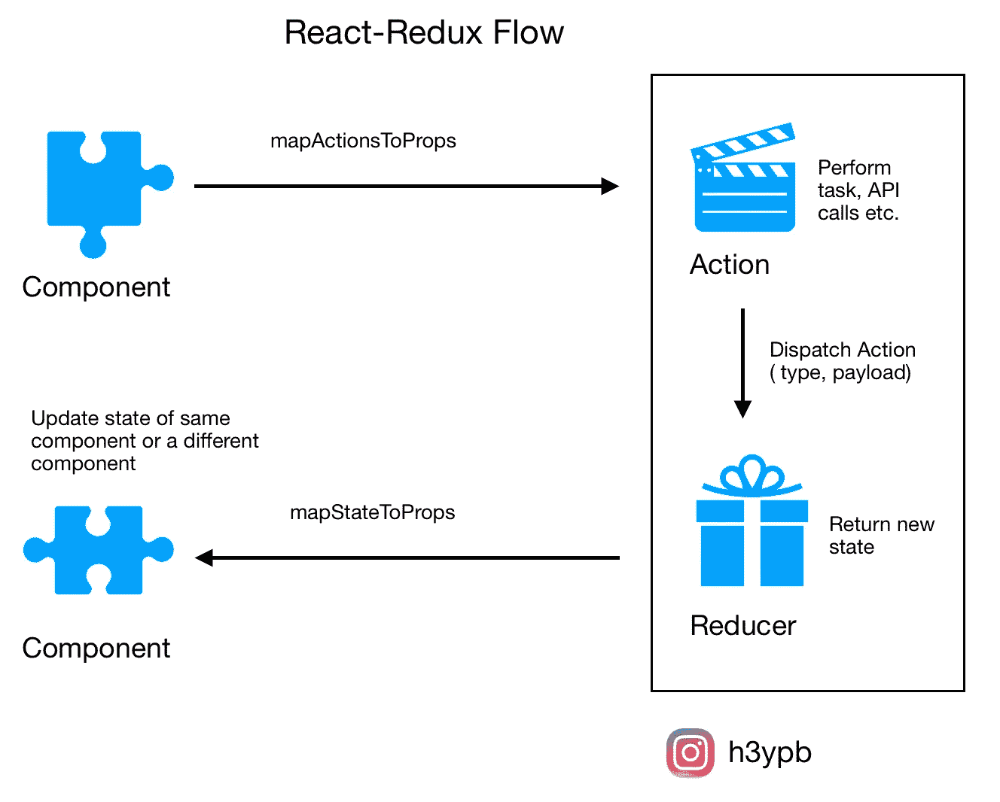

# 我对 React 中的上下文 API 感到失望

> 原文：<https://betterprogramming.pub/my-frustrations-with-the-context-api-in-react-26189fcd5371>

## 以及为什么我的下一个项目会选择 Redux

来自 [Pexels](https://www.pexels.com/photo/man-showing-distress-3777572/?utm_content=attributionCopyText&utm_medium=referral&utm_source=pexels) 的[安德里亚·皮亚卡迪奥](https://www.pexels.com/@olly?utm_content=attributionCopyText&utm_medium=referral&utm_source=pexels)拍摄的照片。

React 中的状态管理已经走过了漫长的道路。Redux 是长期的行业标准，但是在引入了[上下文 API](https://reactjs.org/docs/context.html) 之后，许多人认为 Redux 的时代已经结束了。

嗯，我有幸与这两者一起工作，并在大型项目中使用它们。

我可以理解上下文 API 带来的好处，但是我的下一个项目将使用 Redux。

某种程度上，这是一封写给 Redux 的情书。我们开始吧！

# 中间件支持

中间件是我工作流程的重要组成部分。我使用它们来显示基于远程 API 调用响应的警报，而不会将结果返回给组件。其他一些使用案例包括:

*   记录
*   崩溃报告
*   与异步 API 对话
*   按指定路线发送

下面是如何用 Redux 做到这一点:

商店. ts

这些都是在大多数大型项目中很难忽略的特性。

用上下文 API 实现它们是可能的，但是 Redux 使它变得更加容易。不幸的是，我发现用上下文来实现它是不必要的复杂。

# 供应商地狱

无论您使用的是上下文 API 还是 Redux，为了更好地理解，建议保持每个 reducer/上下文的大小较小。

对于 Redux 来说，这不是问题，因为我们可以使用`combineReducer()`将多个 reducers 合并到一个单独的存储中，并用它包装我们的整个应用程序。

但是在上下文 API 中，您必须用组件实际需要的上下文来包装组件。当您的应用程序变大时，它会创建一个*提供者地狱*。

是的，我知道有一些巧妙的技术可以避免这个问题，比如用所需的上下文创建一个特设，并用该特设包装组件。

但是想象一下，在编码的时候，你必须记住多少不同的考虑。当其他人试图挖掘您的代码时，情况会变得更糟。

那么我们为什么要让自己的生活更艰难呢？

# 熟悉的数据流

Redux 已经被如此多的项目使用，以至于大多数初级开发人员在他们职业生涯的某个时候都有很大的机会遇到它。

一个典型的 Redux 数据流是这样的:组件->动作->中间件-> Reducers ->组件。

代码的工作流和结构是可预测的。我认为这是一个巨大的优势，因为在一个大型项目中，开发人员经常来来去去。

当使用上下文时，你不知道你的上下文在哪里。每个开发人员都有自己的组织方式。这可能会给其他人带来一些不必要的开销，代价很高。

# 表演

你预见到了。上下文具有已知的性能问题，因为每当上下文的任何部分被更新时，整个子树都会重新呈现。

假设我们用一个上下文包装了两个组件。这个上下文包含两个值:`userDetails`和`orderList`。

`UserComponent`取决于`userDetails`的值，而`OrderComponent`取决于`orderList`。

现在如果`userDetails`更新，那么两个组件都重新渲染(虽然和`OrderComponent`没有关系)。

您看到大型应用程序如何滥用上下文并产生巨大的性能问题了吗？

是的，有一些解决方案，比如在更新之前拆分上下文或者记忆组件。但是有了`[selectors](https://redux-toolkit.js.org/api/createSelector)`的帮助，我们完全可以避免这个问题。为什么要重新发明轮子？

# 清晰分离

Redux 创建了一个清晰的关注点分离。您可以从组件中移除几乎 100%的数据操作。

无论如何，大多数现代应用程序都依赖于某种远程数据。因此，通过使用选择器，您可以在数据进入组件之前对其进行预处理。

来源:[黑客正午](https://hackernoon.com/https-medium-com-heypb-react-redux-workflow-in-4-steps-beginner-friendly-guide-4aea9d56f5bd)

在每个人都知道数据来自哪里以及数据是如何被修改之前，开发一个大型应用程序是一个巨大的胜利。

在上下文中，你没有特权这样做——或者至少实现起来有点棘手。

# 排除故障

在调试方面，Redux 提供了一个很好的工具包，让调试变得轻而易举。

随着 [redux-toolkit](https://redux-toolkit.js.org/api/configureStore) 的推出，这变得更加容易。你打开它，剩下的由 Redux 处理。

有了上下文，就很难想象会发生什么变化。然而，您可以通过保持您的上下文非常小且可预测来缓解这个问题。

# 插件支持

Redux 拥有丰富的插件支持，可以促进许多耗时且难以维护的辅助功能。

你可以想到几乎任何事情，并且惊喜地发现别人已经为你实现了解决方案。一些最受欢迎的是:

*   redux-持久化
*   还原-thunk
*   还原形式
*   重新选

这些插件可以提高你的应用程序的质量。你确实需要学习一些额外的东西，但是从长远来看，它们可以减少很多麻烦。

# 大小

就大小而言，您可以认为 Redux 需要额外的资源来运行，从而增加了包的大小。

我同意这一点，但是当你拥有丰富的开发者经验和受人尊敬的社区的好处时，这真的那么重要吗？

# 最后的想法

不要误解我的意思:如果你能以正确的方式使用上下文，那么大多数问题都是可以解决的。有些人可能会认为这是一个更安全的选择，因为它是内置的。

我同意这一点，但是库和包的存在是有原因的。对于较小的项目，上下文 API 就可以了。但是对于更大的，我认为用 Redux 是更安全的路线。

请在评论中告诉我你的想法。祝您愉快！

**通过** [**LinkedIn**](https://www.linkedin.com/in/56faisal/) **或我的** [**个人网站**](https://www.mohammadfaisal.dev/) **与我取得联系。**

## 资源

*   Redux 工具包:[https://redux-toolkit.js.org/](https://redux-toolkit.js.org/)