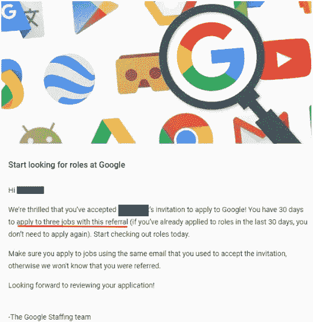
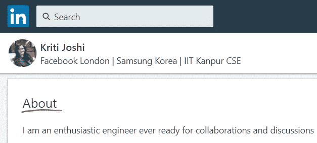
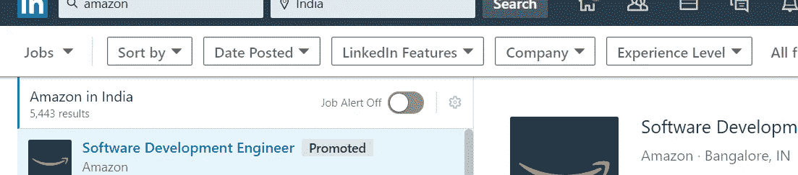
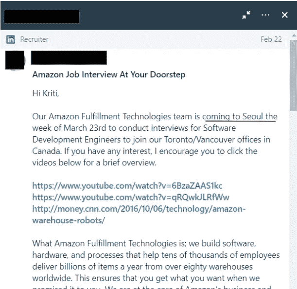

# 我的游戏，我的规则

> 原文：<https://betterprogramming.pub/my-game-my-rules-386cf151d3d>

## 我在谷歌、脸书、亚马逊和彭博面试的故事

来源:彭博

在我找工作的过程中，我采访了一些科技巨头。面试过程非常相似，但面试经历却大相径庭。公司有他们看重的候选人的个人意识形态和技能，因此了解差异并做好相应准备是有益的。

这里有五件事非常重要。

# 1.应用进程

从传统的求职门户到网站源代码中隐藏的求职链接，求职的渠道多种多样。让我们根据我的经验来讨论一下每个渠道对于不同公司的有效性。

## **谷歌**

**求职页面**:谷歌在世界各地有很多办公室，所以浏览它充满职位空缺的求职页面是一种享受。确实有很多人通过谷歌的招聘页面获得了工作。你可能不会立即得到回复，但你的简历会保留在谷歌的数据库中，过一段时间(对我来说是两年)你可能会得到回复。我想说这是申请实习和全职机会的好来源。

员工推荐:推荐是在应聘者中脱颖而出的好方法。谷歌在一名员工提交推荐后发送一封邮件，选择三个职位空缺并申请。但可能需要一段时间才能收到招聘人员的回复。

对员工推荐的回应(来源: [Vaibhav Devmurari](https://medium.com/u/ab77b555f00d?source=post_page-----386cf151d3d--------------------------------) )

**Foobar challenge** :这是谷歌的秘密招聘渠道，浏览器在这里与“*被选中者对话*确切的触发条件不得而知，但大致基于用户在谷歌搜索引擎上搜索的关键词。一旦挑战触发，浏览器上就会出现一些有趣的动画，你会遇到五个问题需要解决。有趣的是，解决第三个问题后，你可以与招聘人员分享你的详细信息，并选择职业机会。

*注意:*人们已经想出了触发挑战的技巧，所以这个渠道现在不是那么秘密了，可能也不像以前那么有效了。下面的视频展示了开始挑战的技巧之一。

我是如何触发 Google foobar 挑战的

## **脸书**

员工推荐:推荐可以保证招聘人员会看你的简历，但不能保证你在招聘电话中的进展。根据你是否适合所申请的职位，你会收到一封接受或拒绝的邮件。

**在 LinkedIn 上联系招聘人员**:对我有用的一个技巧是在 LinkedIn 上给招聘人员写邮件或信息(信息可以在招聘人员的 LinkedIn 页面上找到)。

*提示:* 通常，招聘人员会在他们的 LinkedIn 个人资料(关于和经历部分)中提到他们要招聘的团队。当你联系他们的时候，附上一个项目或者你与团队工作相关的技能，以增加你得到回复的机会。

LinkedIn 上的关于部分

提示:如果你申请微软，去找团队经理，而不是招聘人员。他们反应更快，让你的面试从招聘人员开始。推荐和工作门户对微软来说不是很好。

# **亚马逊**

员工推荐:推荐在亚马逊工作得非常好。您将很快收到亚马逊在线评估的测试链接。候选人必须在收到链接的两周内完成测试，并清除它导致招聘人员的电话。

LinkedIn 上的招聘信息:亚马逊是一家大公司，新的职位空缺不断出现在 LinkedIn 上。这些招聘信息会引来招聘人员的电话，值得申请。

*提示:* 订阅 LinkedIn 上的职位提醒系统，获取有关公司或职位空缺的通知。

LinkedIn 上的工作选项卡

InMail 招聘人员:许多亚马逊招聘人员在 LinkedIn 上联系候选人，特别是当他们在海外参加一些大学的校园招聘时。始终在 LinkedIn 个人资料中更新您的位置。

邮件中的招聘人员

## **彭博**

在 LinkedIn 上联系招聘人员:你可以在 LinkedIn 上联系彭博的招聘人员，安排一次招聘电话。彭博一直在寻找精通 C/C++的候选人，所以不要忘记把它作为一项技能。

职业页面:这是新毕业生进入面试阶段的一个积极途径，有机会被召集到伦敦参加一个现场会议。

邮件中的 LinkedIn:与亚马逊类似，彭博也使用 LinkedIn 来获得潜在的候选人。最好更新您的个人资料。

# 2.重要的技能

谷歌:面试问题旨在检查你的思维过程，因此问题有时是开放式的。对候选人的评判是基于他的思考过程和与面试官的讨论，因此，即使你还没有找到解决方案，也有必要直言不讳。

*注:*谷歌侧重于思维过程，这意味着当你给出一个解决方案时，你不需要一步一步地从低效的解决方案走向优化的解决方案。如果你知道最佳解决方案，那就直接去做——越快越好。

脸书:问题比谷歌简单，但脸书要求解决方案高度完美。如果你申请 E4 的职位，系统设计是非常重要的。

**亚马逊:**该公司同样重视技术和行为技能。该公司以其[14 条领导原则](https://customerthink.com/the-14-leadership-principles-that-drive-amazon/)而自豪，几乎在每次面试中，行为问题都会被问到 15-30 分钟。

彭博:除了算法技能，候选人还必须擅长面向对象编程(OOP)，包括理论和应用。我真的很喜欢他们的编码环节，因为他们问的问题与公司的工作有些关联。采访者讨论了一个问题的多种解决方案，以及在各种现实生活场景中一种解决方案如何胜过其他解决方案。

# 3.面试阶段

## 谷歌

*   招聘人员电话
*   技术电话面试
*   另一个技术电话面试(以防面试官在第一次后不确定)——包括三个编码测试，一个系统设计测试，和一个行为测试。
*   最后，一次现场面试和两次编码/系统设计测试(以防面试官对候选人没有把握)。

*注:*除了介绍性的聊天，谷歌招聘人员还会问一些与算法(及其时间复杂性)和数据结构相关的问题。这些问题很基本，即使你犯了一两个错误也没关系，除非你搞砸了。

*注:* 谷歌最多面试八次就要做出决定。在一次审判中，一个人不能接受八次以上的采访。

## 脸谱网

*   招聘人员电话
*   技术电话面试
*   技术电话面试(以防面试者一开始不确定)包括两个编码测试，一个系统设计测试和一个行为测试。
*   现场面试和两次编码/系统设计测试(以防面试官不确定候选人，但这种第二次机会很少)。

## 亚马孙

*   在线评估测试
*   招聘人员电话(可能/可能不会发生)
*   两次编码测试、一次系统设计测试和一次行为测试的技术电话面试。
*   现场面试。

*注:* 亚马逊的面试阶段差异巨大。有时他们有两个编码和两个系统设计测试。最好和招聘人员确认一下。

## 彭博

*   技术电话面试
*   技术和行为视频屏幕(一个行为测试和两个编码测试)(现场)

**注:**彭博的现场回合取决于你申请的球队。我申请了两个团队，所以早上我和第一个团队进行了三次面试，午饭后我和另一个团队进行了三次面试。

# 4.面试过程的节奏

招聘人员慷慨地提供长达几个月的准备时间，因此候选人可以决定他希望多快安排面试。但一旦面试结束，通常需要很长时间才能得到招聘委员会的反馈和明确答复。

**脸书:**公司的面试流程挺快的，从排期到反馈再到起草 offer letter。

**亚马逊:**亚马逊每年都会收到大量的申请，因此获得第一次电话面试的最初过程很慢，但之后的过程很快。

彭博:面试以极快的速度进行。有时你可以在几个小时内得到反馈。

# 5.团队选择

Google: 面试结束后会进行团队配对。你的个人资料会分发给团队经理，然后他们会安排一次与候选人的电子会议。请注意，即使你与一个团队匹配，这并不意味着你会收到一个报价。等待招聘委员会说是或不是。

**脸书:**对于脸书工程部门来说，团队匹配发生在加入公司后，为期六周的训练营中。

**亚马逊:**候选人通过推荐或工作门户申请特定团队。因此从一开始团队就被决定了。

**注意:**有时会有多个团队参与面试过程，根据面试表现，候选人或招聘经理会选择最终的团队。也有这样的情况，当一个候选人被发现适合不同的团队，并已被转移。

**彭博:**应聘者会申请某个特定的团队，但在面试过程中，有些团队可能会对你的个人资料感兴趣，并打电话给你，让你去现场面试。这是一个很好的场景，因为团队的任何一个接受都会产生一个提议。

虽然技术知识是面试的基础，但对招聘过程的全面了解有助于起到画龙点睛的作用。我希望这篇文章能给我的求职伙伴带来清晰和理解。