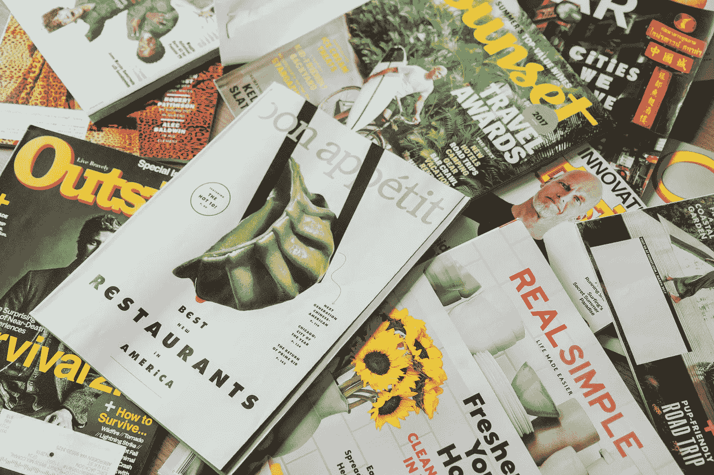

# 紧跟 Web 发展趋势和新闻的指南

> 原文：<https://betterprogramming.pub/my-guide-to-staying-up-to-date-with-web-development-trends-and-news-7110fd913a5e>

## 为忙碌的设计师提供快速简单的资源

真实故事:《好胃口》是我仍然订阅的唯一一本杂志。

2019 年的网页设计感觉像是一场不断追赶的游戏。眨眼之间，你就会错过一个新的 JavaScript 库，一种接近 API 的新方法，一场改变一切的会议(或者他们是这么告诉你的)。但是也有不好的一面——如果你把所有的时间都花在了解最新的新闻和博客上，那么你就没有时间写代码了。

当你的桌子看起来像这样时，你需要不止 1 杯咖啡。

那么你如何决定在哪个上面花最多的时间呢？对我来说，我尽量把 70% — 30%的时间花在创作和学习上。最近，我进入了像 [JavaScript30](https://javascript30.com/) 这样的每日挑战网站，在那里我可以花 20 分钟解决一个问题，并从中学到一些东西。否则，如果我在阅读文章或浏览文档，有时很难感觉到我从中获得了一些切实的东西。

以下是我发现的最有用的资源列表，可以让你及时了解现代网络发展趋势和新闻。

# 播客

好吧，说实话，我并不热衷于科技播客。我更愿意听[传说中的超自然故事](https://www.lorepodcast.com/)或者 [Pod Save America](https://crooked.com/) 的家伙们的戏谑，因为对我来说，播客是关于逃避现实，而不是关于工作。但是如果我听科技播客，那就是这两个节目。它们提供了我在项目中推动自己或发现新工具所需的内在动力。我刚刚了解了语法上的*美化*，它极大地改进了我在文本编辑器中编码的方式。

## [语法](https://syntax.fm/) —开发者工具

Syntax 是由 Wes Bos 和 Scott Tolinski 主持的播客。不要让他们令人畏缩的口号“成为拥有最美味的网络开发服务的播客”让你失去兴趣；这些家伙真的很精明。他们是 javascript 爱好者，对入门有很好的建议，学习像 React.js 这样的新框架，以及成为自由职业者的建议。

## [20 分钟 VC](http://www.thetwentyminutevc.com/) —风险投资&启动资金

20 分钟 VC 最好的部分是，嗯，每集只有 20 分钟。但与此同时，你会觉得自己吸收了大量的信息。该播客的主持人哈里·斯特宾斯(Harry Stebbings)有着极具感染力的英国式热情(如果这是真的话)。倾听客人的声音——无论他们是风险投资合伙人还是初创公司的创始人——是给你内在动力继续做你所做的事情的事情之一。

# 设计

## [粉碎杂志](https://www.smashingmagazine.com/articles/) —最新设计趋势

我不是设计师，但我一直告诉自己，我最终会学习 CSS 网格。我喜欢 Smashing Magazine 从可用性的角度来设计——它没有过多的技术性，它首先关注用户体验。

# 科技新闻

## [纽约时报](https://www.nytimes.com/column/bits)——科技周

这算不算出轨？也许吧。我知道有很多更好的出版物直接关注技术。Wired、Tech Crunch、Mashable——仅举几例。但我喜欢《纽约时报》科技专栏的一点是，它们对我需要阅读的所有内容进行了简要但有意义的概述，没有任何干扰。

> 注:最后更新 2019 年 5 月。这是一个相对较短的列表，因为我不想包括那些我只是为了这篇文章而查找的、我实际上并不是每天都阅读的蹩脚的来源。这是一项正在进行的工作，我会继续更新，因为我发现更多的牛逼资源。