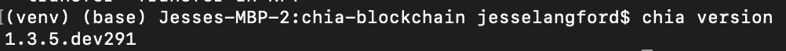
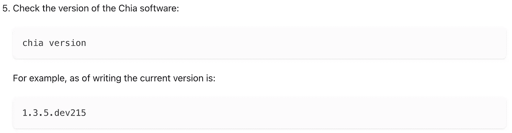
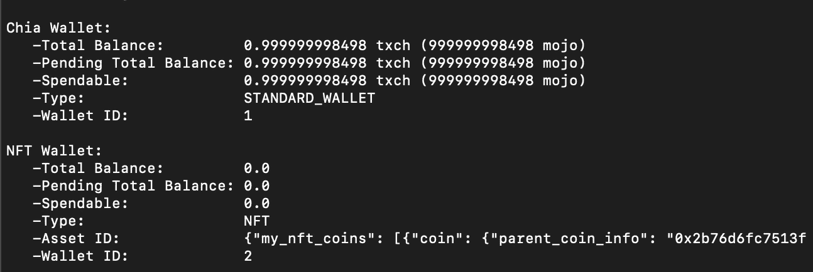

# 中国 NFT0 标准初探

> 原文：<https://betterprogramming.pub/my-initial-review-of-chias-nft0-standard-efcd7a061b02>

## 和提示来帮助您完成安装

Chia 上周发布了他们的 NFT 新标准。我有时间检查初始版本并测试所有可用的端点。我想给出一些关于整个过程的想法和我对未来版本的一些疑问。我所有的信息都来自 Chia [博客](https://www.chia.net/2022/05/11/our-vision-for-chia-nfts.en.html)、[开发者指南](https://docs.chia.net/docs/15resources/nft_dev_guide/)，以及我自己在 Chia testnet 上发布 NFT 的经历。

# **设置**

要进行设置，您需要通过克隆他们的`chia-blockchain`存储库的特定分支来安装 Chia 的开发版本，暂停或卸载任何正在运行的 Chia 实例，并切换到他们的 testnet。此外，如果您没有已经同步的 testnet，您将被指示下载 Chia 同步的 testnet 节点。建议您的计算机上至少应该有 50 GB 的可用空间。

我有在其他项目中遵循这些说明的经验，所以对我来说没什么大不了的。然而，我可以看到经验较少的开发人员努力完成这个设置，或者无法满足需求(我不确定是否每个人都有 50 GB 的空间用于区块链 testnet 节点)。

我认为这主要是标准时代的一个功能。这是全新的，正在积极工作。随着时间的推移，我确信这些指令会变得更容易，尤其是一旦它进入了他们的主网。

## 版本

安装后，文档会要求您检查您的 Chia 版本。我的版本与开发者指南中发布的版本不同。

我的版本:

Chia 开发人员指南版本

版本之间的不匹配并没有破坏我的体验，但当我看到它时，它确实给了我一种不安的感觉。过去，我花了几个小时调试演练，因为所记录的版本和最新版本之间有变化。我的猜测是，一旦新的 NFT1 标准发布，这个文档就会更新。

您只能在 Chia testnet 上发布 NFT0 令牌。目的是为开发人员提供一个早期访问令牌，让他们尝试并给出反馈。

## 端点

一旦我安装并配置好了所有的东西，所有的端点都可以正常工作了。我能够创建一个 NFT 钱包，铸造一个令牌，列出我的令牌，转移令牌，并添加一个 URI 令牌没有问题。这些命令本身很容易理解，并且在 CLI 中有很好的记录。

你需要做的第一件事是创建一个 NFT 钱包。Chia 中的每个公钥/私钥对可以有多个钱包。创建完成后，当您运行`chia wallet show`命令时，您将能够看到一个新的钱包。

我不介意目前每个钥匙对有不同的钱包。我唯一担心的是，这将如何与 Chia 希望提供的钱包数量成比例。我们必须等着瞧。

我对多个钱包的另一个担心是代币转账。以 NFTs 为例。如果我需要一个 NFT 钱包来存放 NFT 令牌，如果我试图将 NFT 转移到一个没有 NFT 钱包的地址，会发生什么情况？

谢天谢地，Chia 的开发人员已经考虑到了这种情况。如果您将 NFT 转移到没有 NFT 钱包的地址，Chia 将自动为该地址创建一个 NFT 钱包。

# 包扎

一旦我通过了初始设置，NFT0 标准就可以直观地使用了。终点很简单，并且有据可查。根据 Chia 的说法，他们的 NFT 标准的第一个生产版本将面向美术垂直。我有兴趣了解他们计划解决的其他垂直市场。

我的一个更大的问题是关于存储在 NFT 中的元数据或属性。您在 OpenSea 等市场中看到的大多数 NFT 都具有用于描述 NFT 的属性。属性存储在链外，通常在 IPFS 的 JSON 文件中。

我希望 Chia 可以采取下一步措施，在 NFT 有效载荷中存储属性。我认为 Chia 为他们的 NFT 属性定义标准是明智的。否则，不同的令牌提供者将有他们自己的标准。

如果您对使用 NFT0 标准感兴趣，我强烈建议您尝试一下。

感谢阅读。敬请关注更多内容！