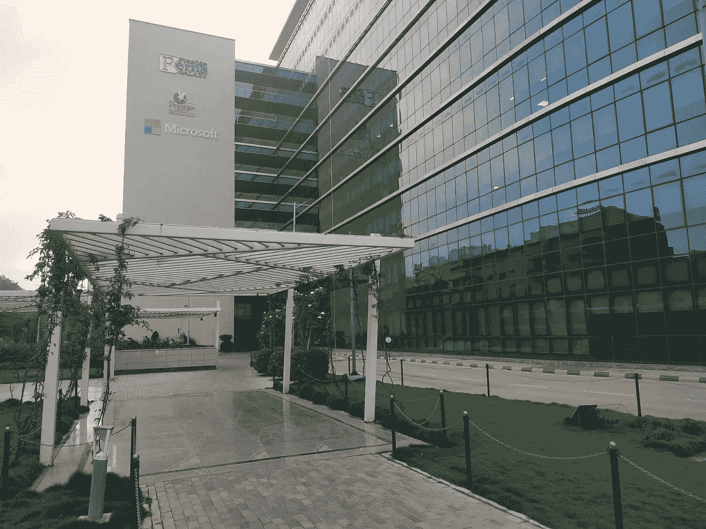
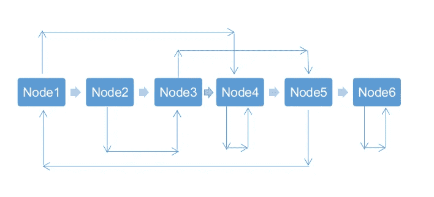

# 我在微软的面试经历

> 原文：<https://betterprogramming.pub/my-interview-experience-with-microsoft-754039df9103>

## 破解编码面试的技巧

照片由 [Alex wong](https://unsplash.com/@killerfvith?utm_source=unsplash&utm_medium=referral&utm_content=creditCopyText) 在 [Unsplash](https://unsplash.com/?utm_source=unsplash&utm_medium=referral&utm_content=creditCopyText) 上拍摄

大约两三个月前，我在 Linkedin 上看到微软员工的一系列消息。这是关于微软在最后一年招聘 SDE 暑期实习生的事情。我对此非常兴奋，不想错过这个机会。

我已经把我的简历，包括我所有的项目、成就和经历，寄给了微软的 15-20 个人，希望至少有一个人会推荐我参加在线编码测试。

**要点:**

1.  联系陌生人之前不要犹豫。归根结底，这都是为了建立关系网。你拥有的越多，你就越容易完成工作。
2.  联系某人时，不要说“嗨！你能介绍我去那家公司吗？”相反，写一封好的邮件解释你的项目、经历、成就，并给他们推荐你的理由。

在邮件发出的 1-2 小时内，我收到了微软的第一轮面试邀请，这是一轮纯粹的编码面试。

那是 2019 年 9 月 22 日，我第一轮。

我得到了三个解决问题的问题，给我的时间足够了。

其中一个问题是:

> 给定一个大小为 *n* 的数组，按照偶数和奇数按升序交替排列的方式重新排列数组的数字。

附注:这是最简单的问题。

在这一轮中，当只剩下 5 分钟时，我的笔记本电脑崩溃了。这可能是最糟糕的事情，但幸运的是，我可以在一段时间内恢复测试。

我能够编写所有三个问题的代码，通过所有的测试案例——包括边界案例和复杂的测试案例。

我对第一轮非常乐观，并急切地等待结果。

结果在 10 月 11 日公布，是的，我被选中参加第二轮。

下一轮应该是在线视频面试。我认为面试主要是关于数据结构的，并且已经开始准备了。

面试安排在 10 月 14 日。一开始是简单的介绍，然后面试官开始测试我关于哎呀的概念。我很高兴，因为这是我在大学生活中从未准备过的一个话题，因为我的概念从 10+2 开始就很清楚了。

有人问我继承中的一些概念，比如多态性、方法重载和方法重写之间的区别、虚拟关键字和抽象。

**要点:**

1.  如果你不知道一个事实概念，那么与其给出不着边际的答案，不如接受它。并且试着问他们更多的问题。它给人一种你愿意学习新事物的好印象。我不知道虚拟关键字*、*，我没有含糊其辞地回答，而是告诉他我从未听说过，我们就此进行了 2-3 分钟的讨论。

接下来是面试的后半部分，是解决问题。他们的主要目的是测试我们如何思考，以及我们解决新问题的方法。因此，说出你的想法是绝对重要的。

给出的问题是:

> 假设有一个 3D 数组，它以下列螺旋方式排序:
> 
> 01 02 03 04
> 12 13 14 05
> 11 16 15 06
> 10 09 08 07
> 
> 现在，在这种数组中搜索一个数的最好方法是什么？

一开始想不出好的方案，就提出了最坏的方案(O(n))然后开始想优化的方案。

因为我在大声说话，所以面试官也在帮助我，给了我足够好的提示，让我找到正确的方法。

**要点:**

1.  大声说出来。让面试官知道你在想什么，他可能会帮助你往正确的方向想。
2.  向面试官提问，让问题变得清晰，以便更进一步。
3.  从最差的解决方案开始，然后开始优化。
4.  无论你提出什么样的解决方案，他们都希望你也能编码，所以要做好准备。

附:我以一个复杂度为 O(n)的解开始，以 O(log(n))结束，而达到这一点后的满足感是无法用单纯的文字来定义的。

我对这一轮真的很乐观，幸运的是，我收到了下一轮校园活动的邀请。

11 月 17 日，在期末考试期间，我去了微软班加罗尔办公室，只是因为我不想错过这个大好机会。

老实说，他们的校园只是一个梦想的工作场所。真的很神奇！

微软班加罗尔

因为我来早了，所以我在接待处等着，研究 GeeksforGeeks 的常见数据结构问题。

很快我们被带到迎新室，并被告知这批大约 20 名学生是在 11K 份在线申请中被选中的，这让我感觉很好。

迎新会后开始面试。

**第一轮**

这一轮主要是基于简历的。面试官说他们真的很喜欢我的简历。他们就我的项目向我提问，试图更好地了解我现在和以前做过的工作。

**要点:**

1.  你应该了解简历中的每一个字。
2.  不要写任何你只是模糊意识到的东西。

他们很快开始测试我的思维能力，问了两个常见的数据结构问题。

其中之一是如何反转链接列表。昨晚在公交车上，我在 GeeksforGeeks 上读到过这个问题，并记得部分解决方案。经过一些思考，我也可以向他们解释算法。他们还让我用 C++编写适当的代码，并通过例子进行测试。

附注:微软的目标是追求完美，这一点在每位面试官身上都能看得出来。每一个算法和代码都经过测试用例的正确验证。

另一个问题是假设您有一个修改过的 LinkedList，其中除了普通的数据变量和 next 指针之外，您还引入了一个指向每个节点的指针，这样它就可以指向 LinkedList 的任何随机节点。现在，你的任务是克隆这个数据结构。

链表

在上图中，让每个节点都有一个指向下一个节点的 next 指针，一个数据项即 Node1，Node2… Node5，一个随机指针指向任意一个随机节点。

我发现这个问题很棘手，需要思考一下。

**第二轮**

这一轮基本上是测试更多的编码技能，而不是思考。

我被问了两个问题:

1.  写一个代码，求二叉树的高度。
2.  写一个代码，看看一个二叉树是不是 BST。

我为它们都写了代码，但是不得不考虑调试一些小错误。

这两个问题都可以通过递归来解决。你可以在 GeeksforGeeks 上寻找答案。

**要点:**

1.  如果您刚刚编写了代码，那么您还没有完成。验证是所有事情的重要组成部分！

**第三轮**

这是我的最后一轮面试，由一位在微软工作了八年多的资深专业人士主持。面试从一些关于我简历的问题开始。面试官对我做的一个项目很感兴趣，一个 *IGBTQ CPU 调度算法。我在白板上向他解释了这个项目，以帮助他更好地理解。*

下半部分是解决问题。他给我的问题是:

> 考虑一个从 1 到 n 的数列。
> 
> 现在对于每一次迭代(I ),我们移除每第(i+1)项。
> 
> 例如:
> 
> 考虑 n=20
> 
> 迭代 1:移除每第二个元素
> 
> 1 3 5 7 9 11 13 15 17 19
> 
> 迭代 2:移除每第三个元素
> 
> 1 3 7 9 13 15 19
> 
> 迭代 3:移除每第四个元素
> 
> 1 2 7 13 15
> 
> 诸如此类…
> 
> 给出最后剩下的数字叫做**幸运数字**。
> 
> 任务是找出一个数字“n”是不是一个幸运数字。

经过反复思考，说出解决方案，并听取面试官的意见，我可以找到解决方案中的模式，并且能够编写代码。

接下来是一些关于我和我想为之工作的一般性问题。就是这样！

**要点:**

1.  明确你为什么要加入一家公司。对他们的产品和计划做足够的研究，对什么让你兴奋以及你为什么想在那里工作有一个清晰的认识。
2.  在任何面试之前，都要有一个准确清晰的答案，说明你为什么想加入一家公司，以及这家公司为什么应该聘用你。
3.  不要说“我很自信”或者“我很努力”之类的废话！请给出具体的答案，并举例证明你的观点。

# 结论

最后，我会说这是有史以来最好的面试经历之一。我参加过许多顶级公司的面试，但从未感觉到与面试官和面试过程有如此紧密的联系。其他公司可能只测试你的实际知识，并期待行业水平的答案，但微软也关注你的思维过程和编码技能。这是我从整个面试过程中可以了解到的。

还有，我没被选上。我在博客的最后说这些是因为对于我们这个年龄的人来说，最重要的是学习经历和如何让事情变得更好。在职业生涯开始时，考虑拒绝、薪水和便利性不应该如此重要。但是，为什么我被拒绝仍然是一个谜，我似乎没有一个明确的答案。我进行了一次非常顺利的面试，可能是在期待一些好的东西。

*更新(2021 年 5 月)*:有时候，我们身处情境，却没有意识到事情。大约一年后，当我反思并再次经历我的整个面试时，我意识到面试并不顺利。我在第二轮确实搞砸了一点，甚至在第三轮当面试官问我想做什么时，我也不能给出一个满意的答案。在任何面试之前，一定要确保你有一个清晰明了的答案，说明你为什么想加入这家公司，以及你想从事什么工作。

然而，我失去的是暂时的，但我得到的是永久的和无价的。

*别忘了留下一些掌声，以防你喜欢这个博客:)*

*我们连线吧？*

*领英:*[*https://linkedin.com/in/ashwigoel*](https://linkedin.com/in/ashwigoel)

*网址:*[*https://ashwingoel.com*](https://ashwingoel.com)

*邮件:*[【goelashwin36@gmail.com】T21](mailto:goelashwin36@gmail.com)