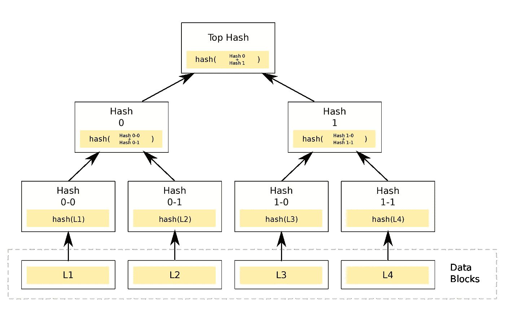
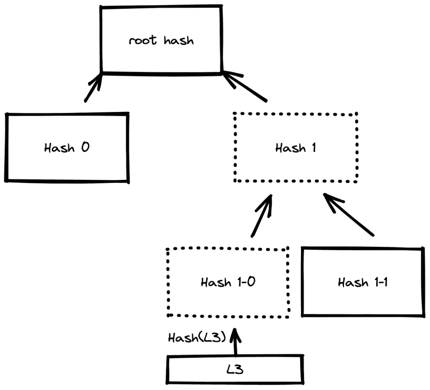

# 我对区块链和 Merkle 树的介绍

> 原文：<https://betterprogramming.pub/my-introduction-to-the-blockchain-and-merkle-tree-6fba6ee853c>

## 通过这个 Go 实现了解区块链


由 [Unsplash](https://unsplash.com?utm_source=medium&utm_medium=referral) 上的 [Shubham Dhage](https://unsplash.com/@theshubhamdhage?utm_source=medium&utm_medium=referral) 拍摄的照片

几个月前，我开始围绕区块链进行游戏和开发，因为最近加密货币和智能合约的实施导致的所有令人难以置信的可能应用程序(如 NFT 收藏、游戏和 DAO)在加密领域引起了轩然大波。我一直对分布式系统非常感兴趣，区块链是最纯粹形式的分布式系统。

这一切都始于最受欢迎的游戏之一，它应用了 Play2Earn 的新概念，其中游戏的资产是代币(ERC-721)，玩家拥有代币并在玩代币时产生利润。他们也可以通过该平台提供的市场与其他玩家进行交易。当我发现市场上有玩家以低于平均水平的价格购买这些资产，然后转售获利时，我的兴趣被激发了。

注意到这一点后，我联系了一位很棒的同事和朋友，因为这代表了两个令人兴奋的好处:首先，了解这项已经谈论多年的技术(尽管如此，我们两人迄今都没有机会或兴趣进入这项技术)；第二，它展示了一个实际的用例，也可以带来经济效益。多么大的激励啊！

我们从简单的迭代开始。我们创建了一个机器人，它可以监听我们感兴趣的特定区块链的事件和交易。每次发现有可以盈利的交易，我们就决定参与。显然，我们不是唯一参与的人，所以我们失败了大多数交易，因为其他人比我们快得多。随着时间的推移，我们调查的越多，我们了解的越多，我们正在进行更有效的实施。我们停止使用公共节点，并使用修改后的协议版本部署多个节点。

区块链是一个以太坊分支，所以我们修改了协议的实现(用 Go 编写，也是我最喜欢的语言),作为我们内部实现的一部分来运行我们的机器人，以加快速度。通过这种方式，我们最终完成了交易的前期运作，并获得了更多的机会。

> *抢先交易是在知道未来交易的情况下将交易放入队列的行为。* [](https://coinmarketcap.com/alexandria/glossary/front-running)

*简而言之，这一切导致我在最近几周更多地参与了区块链开发的整个话题，这也是为什么我决定学习更深入一点，并在做这件事的同时与您分享。因此，我的想法是，我会发布一些关于区块链相关技术的小文章，任何我觉得有趣并且你可能也会感兴趣的东西。*

*为了不再让你厌烦这个介绍，在第一篇文章中，我想谈谈区块链的基本部分，比如 Merkle 树，以及 Go 中的一个简单实现。本文假设您对加密哈希函数和基本二叉树算法有基本的了解。*

# *什么是 Merkle 树？*

*Merkle 树或 hash 树是一种二叉树，其中一个节点只能有零个、一个或两个子节点。每个叶节点都标有数据块的加密哈希(例如，块链事务)，每个不是叶的节点(称为分支或内部节点)都标有其子节点标签的加密哈希。当有一个称为 Merkle 根的节点时，树就是完整的。*

*由于这种设计，这种结构实现了以下特性:*

*   *易于验证数据完整性，因为如果任何数据发生变化，根哈希(Merkle root)也会发生变化。*
*   *单个散列值 Merkle 根代表所有数据块。*
*   *使用 Merkle proof 很容易验证数据是否包含在树中。*

*关于 Merkle 树的构造，值得注意的一点是，由于它是二叉树，其分支是子节点的组合，那么，如果我们有奇数个叶节点，会发生什么呢？如果我们有奇数个分支节点会发生什么？*

*在构建 Merkle 树时，简单的答案是，如果我们在某个特定级别有奇数个节点，我们必须复制最后一个节点，以便与其自身连接。*

**

*假设用户知道 Merkle 树的根 hash，并想检查该树是否确实包含特定的数据，比如事务。在这种情况下，他可以通过使用穿过 Merkle 树的一条路径来完成，这与叶节点的数量成比例，而不是与叶节点的总数成比例。*

*例如，根据上图，我们可以看到用户如何检查`L3`块的完整性，或者它是否出现在树中。如果他们知道`root hash`，并且有`Hash 1-1`和`Hash 0`，他们可以按照以下步骤操作:*

*   *用户首先获得他们想要检查的数据块的散列，在本例中是`L3`块:`Hash(L3)`，以获得`Hash 1-0`。*
*   *然后，它们必须将结果与下一个提供的散列结合起来，该散列必须是作为其对等节点的节点的散列。在这种情况下，它将是`Hash(Hash 1-0, Hash 1-1)`等等，直到我们得到 Merkle 根。*
*   *最后，他们只需要检查获得的根哈希是否等于先前已知的根哈希。如果散列是相同的，那么`L3`块属于树，并且它的数据没有被改变。否则，`L3`不在树中或者它的数据被改变了。*

**

*可以看出，Merkle 树允许快速验证并提供了一个健壮的安全系统，因为如果任何块被修改，其散列的结果是不同的。因此，将其哈希与后续哈希相结合将产生一个与已知哈希不同的根哈希。*

*Merkle 树在许多计算机应用中使用。在比特币和其他加密货币中，Merkle 树特别用于高效安全地维护区块链的状态。*

*一个比特币区块平均有 500 笔交易。如果没有这种数据结构，想要检查一个事务是否在特定块内或其完整性的每个用户/客户端将不得不请求并下载 500 个事务来证明这一点。当使用 Merkle 树实现时，他们只需要下载特定事务的九个节点`ceil(log2(500)) = 9`的路径，并执行前面讨论的流程。有了这个，你就可以检查交易的完整性。*

*即使该块包含 100 万个事务，它也只需要一个包含 20 个节点的路径就能执行验证。*

*如您所见，这种数据结构非常引人注目，并被用于各种系统，例如:*

*   *版本控制系统，例如 Git。*
*   *P2P 中的文件系统。*
*   *数据库。*
*   *区块链。*

# *围棋中的 Merkle 树*

*构建该树的一个简单方法是使用基于指针的策略。有了指针，我们可以很容易地看到节点与其子节点和父节点的关系，并使用这些知识来正确地计算它们的哈希值。同样，这些关系将帮助我们建立证明一个数据的路径。*

*正如我们已经知道的，在这种类型的树中，叶节点是我们想要构建树的数据的散列，因此我们必须使用自下而上的分层构造算法从叶到根构建树。*

*我们将从两个相对简单的结构开始，其中我们将存储树和树的节点以及它们各自的值。*

```
*type Tree struct {
    Root   *Node
    Leaves []*Node
    h      Hasher
}type Node struct {
    Parent *Node
    Left   *Node
    Right  *Node
    Hash   []byte
}*
```

*`NewFromHashes`函数将帮助我们从散列数组中创建一棵树，因为我们已经知道这个结构的叶节点是所需信息的散列。*

```
*func NewFromHashes(hashes [][]byte, h Hasher) *Tree {
    t := &Tree{
        Leaves: make([]*Node, 0, len(hashes)),
        h:      h,
    } // Add leaf nodes.
    for _, h := range hashes {
        t.Leaves = append(t.Leaves, &Node{Hash: h})
    } t.Root = t.buildRoot()
    return t
}*
```

*下一个将遍历每一层节点以形成它们的关系，直到到达根节点。*

```
*func (t *Tree) buildRoot() *Node {
    nodes := t.Leaves
    // We are iterating until we reach a single node, which will be our root.
    for len(nodes) > 1 {
        var parents []*Node // Having an odd number of nodes at this level, we will duplicate the last node to concatenate it with itself.
        if len(nodes)%2 != 0 {
            nodes = append(nodes, nodes[len(nodes)-1])
        } // Pairing nodes to build a parent from the pair
        for i := 0; i < len(nodes); i += 2 {
            n := &Node{
                Left:  nodes[i],
                Right: nodes[i+1], // Compute the hash of the new node, which will be the combination of its children's hashes.
                Hash: t.h.Hash(nodes[i].Hash, nodes[i+1].Hash),
            } parents = append(parents, n)
            nodes[i].Parent, nodes[i+1].Parent = n, n
        }
        // Once all possible pairs are processed, the parents become the children, and we start all over again.
        nodes = parents
    } return nodes[0]
}*
```

*`GetProof`函数接收我们想要验证的数据/事务的散列作为参数，并将返回验证其完整性所需的节点散列。利用节点之间的关系，我们可以很容易地检索这些节点。*

*我添加了一些解释性的注释，我认为这些注释可以阐明我们用指针得到证明的方法。*

```
*func (t *Tree) GetProof(hash []byte) ([][]byte, []int, error) {
    var (
        path [][]byte
        idxs []int
    ) // Find the leaf node for the specific hash.
    for _, currentNode := range t.Leaves {
        if bytes.Equal(currentNode.Hash, hash) {
            // After finding the node, we will scale the tree using the relationship of the nodes to their parent nodes.
            parent := currentNode.Parent
            for parent != nil {
                // If the current node is the left child, we need the right child to calculate the parent hash
                // for the proof and vice versa.
                // i.e:
                // If CurrentNode == Left ; ParentHash = (CurrentNode.Hash, RightChild.Hash)
                // If CurrentNode == Right ; ParentHash = (LeftChild.Hash, CurrentNode.Hash)
                // So we have to add the corresponding hash to the path, and in idxs, we save the hash's position 0
                // for left and 1 for right. In this way, when we want to verify the proof, we can know if
                // the given hash is the left o right child.
                if bytes.Equal(currentNode.Hash, parent.Left.Hash) {
                    path = append(path, parent.Right.Hash)
                    idxs = append(idxs, 1)
                } else {
                    path = append(path, parent.Left.Hash)
                    idxs = append(idxs, 0)
                }
                currentNode = parent
                parent = currentNode.Parent
            }
            return path, idxs, nil
        }
    }
    return path, idxs, errors.New("hash does not belong to the tree")
}*
```

*如果你去仓库，你可以找到函数来验证证明，你也会找到这个简单实现的完整例子。Github 回购。*

```
*package mainimport (
    "crypto/sha256"
    "fmt" "github.com/douglasmakey/mktree"
)type transaction struct {
    from  string
    to    string
    value string
}func hashTrx(t transaction) []byte {
    h := sha256.New()
    h.Write([]byte(fmt.Sprintf("%v", t)))
    return h.Sum(nil)
}func main() {
    trx1 := transaction{from: "mike", to: "bob", value: "100"}
    trx2 := transaction{from: "bob", to: "douglas", value: "250"}
    trx3 := transaction{from: "alice", to: "john", value: "100"}
    trx4 := transaction{from: "vitalik", to: "elon", value: "10000"} data := [][]byte{
        hashTrx(trx1),
        hashTrx(trx2),
        hashTrx(trx3),
        hashTrx(trx4),
    } // Create and verify the tree.
    t := mktree.NewFromHashes(data, mktree.DefaultShaHasher)
    fmt.Println("Hex: ", t.Root.Hex()) // Getting the proof of the first transaction and verify it.
    proof, idxs, err := t.GetProof(hashTrx(trx1))
    if err != nil {
        panic(err)
    }
    fmt.Printf("Verify proof of trx1: %+v \n", trx1)
    p := mktree.VerifyProof(t.Root.Hash, hashTrx(trx1), proof, idxs, mktree.DefaultShaHasher)
    fmt.Println("Proof integrity: ", p) // Change trx1 and try to verify it with the original proof.
    trx1.value = "1000"
    fmt.Printf("Verify proof of trx1: %+v \n", trx1)
    p = mktree.VerifyProof(t.Root.Hash, hashTrx(trx1), proof, idxs, mktree.DefaultShaHasher)
    fmt.Println("Proof integrity with a change trx: ", p) // Modifying the second transaction to send money to me.
    trx5 := transaction{from: "vitalik", to: "douglas", value: "10000"}
    t.Leaves[1].Hash = hashTrx(trx5)
    // We are going to verify the integrity of the tree after the modification
    fmt.Println("Tree integrity: ", t.Verify())
}*
```

*我希望你喜欢这篇文章。感谢您的时间，任何反馈都是受欢迎的。*

# *资源*

*   *[https://www.geeksforgeeks.org/binary-tree-data-structure/](https://www.geeksforgeeks.org/binary-tree-data-structure/)*
*   *[https://en.wikipedia.org/wiki/Cryptographic_hash_function](https://en.wikipedia.org/wiki/Cryptographic_hash_function)*
*   *[https://en.wikipedia.org/wiki/Merkle_tree](https://en.wikipedia.org/wiki/Merkle_tree)*
*   *[https://en.bitcoinwiki.org/wiki/Merkle_tree](https://en.bitcoinwiki.org/wiki/Merkle_tree)*
*   *[https://en . bit coin . it/wiki/Protocol _ documentation # Merkle _ Trees](https://en.bitcoin.it/wiki/Protocol_documentation#Merkle_Trees)*
*   *[https://coin telegraph . com/explained/what-front-running-in-crypto-and-NFT-trading](https://cointelegraph.com/explained/what-is-front-running-in-crypto-and-nft-trading)*