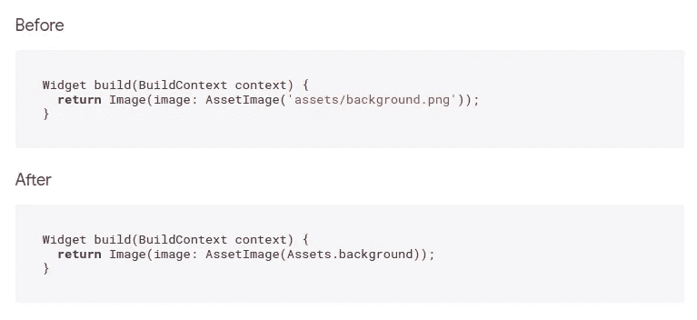
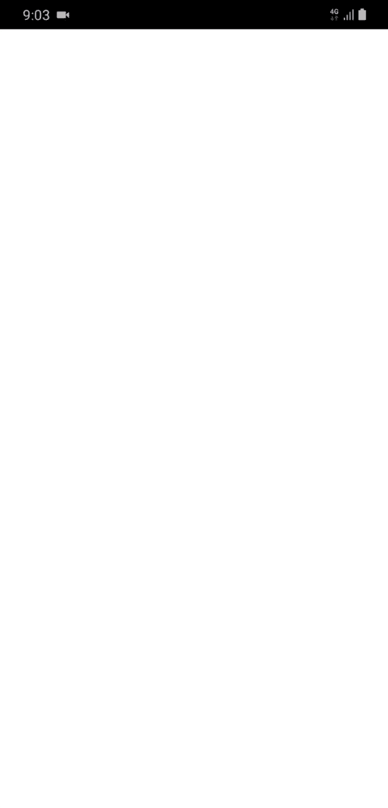

# 我一月份对颤振包的建议

> 原文：<https://betterprogramming.pub/my-january-recommendations-for-flutter-packages-6fca1557920c>

## 发现颤动——第 20 周

## 我在 2020 年 12 月发现的最好的包

西蒙·米加吉在 [Unsplash](https://unsplash.com/?utm_source=unsplash&utm_medium=referral&utm_content=creditCopyText) 上的照片

新的一年带着新的目标和新的愿望摆在我们面前，但我们仍然保持着前四个月获得的传统——最佳颤振包的推荐。

以下是我与这个话题相关的五大发现。

# 1.为你的 Flutter 窗口小部件设计风格，让你的代码可读性更好

如果您只想在多个不同的小部件上重用填充和对齐，该怎么办？

这个包试图将样式从结构中分离出来，你可以轻松提取小部件的样式。

使用这个包的结果是更可读的代码。

 [## 分部|颤振包

### 简单易用但功能强大的风格部件，语法受 CSS 启发。这个产品包的真正力量是一个组合…

公共开发](https://pub.dev/packages/division#getting-started) 

# 2.收视率很重要

在我们这个消费至上的数字时代，收视率是商业中最重要的部分之一。当我们听说一家新的餐馆/俱乐部/劳务公司时，我们通常会在网上查看对那家公司的评论。

来源: [Pub。开发](https://pub.dev/packages/flutter_rating_bar)

考虑到这一点，我研究了是否有一个软件包可以提供经典的评级外观。使用 *flutter_rating_bar* 包，您可以选择一个提供的评级栏布局。

 [## 颤振包

### 一个简单但完全可定制的颤振评级栏，其中还包括一个评级栏指示器，支持任何…

公共开发](https://pub.dev/packages/flutter_rating_bar) 

# 3.在指定资产文件位置时，告别字符串输入错误

当您拥有大量资产时，这个包非常方便，因为它消除了字符串输入错误的可能性。

它生成包含静态常量变量的 Dart 类，可用于在 flutter 应用程序中的任何地方安全地引用资产。

来源: [Pub。开发](https://pub.dev/packages/spider)

 [## 蜘蛛|飞镖包

### 一个小的 dart 库，用于从 Assets 文件夹中生成资产 dart 代码。它生成具有静态常数的 dart 类…

公共开发](https://pub.dev/packages/spider) 

# 4.白天黑夜

我选择这个包是因为它有趣的设计。像这样的包裹总是吸引我的注意力。

也许有人需要一个昼夜开关部件！

 [## 日 _ 夜 _ 开关|颤振包

### 一个日夜切换的小工具。

公共开发](https://pub.dev/packages/day_night_switch) 

# 5.使用登录小部件加速应用程序开发

准备好使用带有各种动画选项的登录/注册小工具绝对可以加快你的速度。

来源: [Pub。开发](https://pub.dev/packages/flutter_login)

 [## flutter_login | Flutter 包

### FlutterLogin 是一个现成的登录/注册窗口小部件，有许多动画效果来演示 Flutter 的功能…

公共开发](https://pub.dev/packages/flutter_login) 

# 结论

如果你是涵盖各种 Flutter 主题的简短有趣文章的粉丝，并且你想在接下来的几周里养成和我一起学习 Flutter 的习惯，你可以每周二阅读我的文章。

如果你对这篇文章有任何问题或评论，请在评论区告诉我。

对于那些想加入我们的颤振之旅的人，可以在下面找到前几周的链接:

*   [第 17 周](https://jelenajjovanoski.medium.com/create-layout-for-the-settings-screen-in-a-flash-in-flutter-9a57cf2c9c3b)——“在颤动中一瞬间创建设置屏幕的布局”
*   [第 18 周](https://jelenajjovanoski.medium.com/combine-multiple-styles-per-line-with-richtext-in-flutter-c6bca0b2acd0)——“在 Flutter 中将多种风格与 RichText 结合起来”

下周见，不要打破记录！