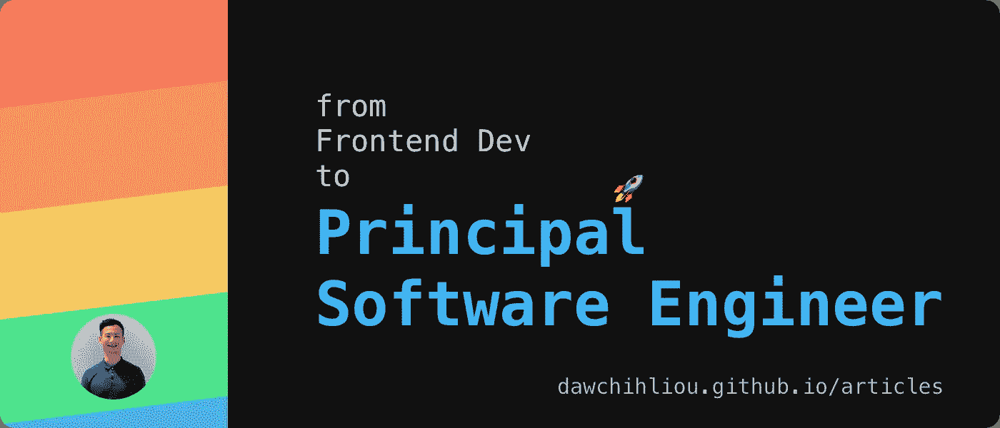
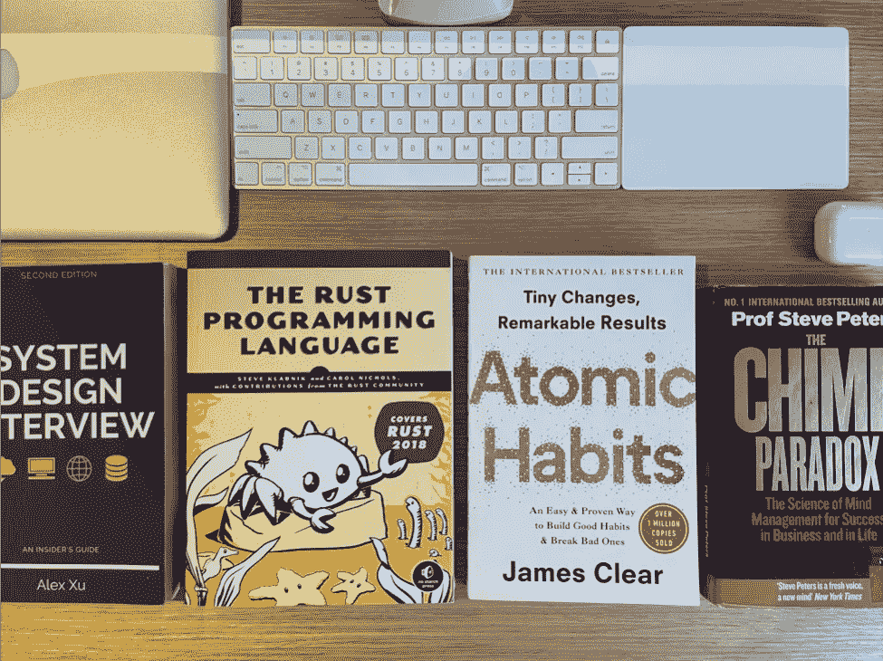

# 我从前端开发人员到首席软件工程师的旅程——通过学习资源

> 原文：<https://betterprogramming.pub/my-journey-from-frontend-developer-to-principal-software-engineer-61d86e88cb70>

## 50 多本书籍和资源帮助了我的科技之旅

我的旅程有点坎坷，但充满了学习。我非常感激这段经历和一路上帮助我的人。

我最近加入了一家欧洲上市公司，担任首席软件工程师。该角色是公司领导模式的一部分，由首席软件工程师和高级工程经理负责。从个人贡献者转变为阿朵的责任，听起来很有挑战性，但我已经做好了准备。我想与大家分享所有对我的技术领导之路产生巨大影响的资源。

我希望，不管你的背景如何，也不管你在职业生涯中处于什么位置，这里的一些资源可以帮助你打开障碍，或者在你需要的时候给你灵感。

# TL；速度三角形定位法(dead reckoning)

*   👯价值关系。不只是和别人，也和你自己。
*   🚀找到你的领导风格。它会让你的影响力倍增。
*   🦄忠于你的手艺。这是你价值主张的基石。

# 重视关系

你与自己的关系和你与他人的关系一样重要，如果不是更重要的话。

在我找到我的中心后，我注意到一种清晰的交流方式。它帮助我在没有自我争论的情况下进行讨论，并在与同事和人才的一对一会谈中提供坦诚的反馈。我能够建立更有意义的关系，更有效地沟通。

家里的一些书

## 帮助我了解自己的书

*   史蒂夫·彼得斯的《黑猩猩悖论:帮助你获得成功、自信和快乐的广受好评的精神管理程序》
*   苏珊·凯恩的《宁静的 T2》
*   [局外人:马尔科姆·格拉德威尔的成功故事](https://www.goodreads.com/book/show/3228917-outliers)
*   安吉拉·杜克沃斯的《惊雷》
*   鲍勃·罗泰拉和鲍勃·卡伦(撰稿人)撰写的《冠军如何思考:在运动和生活中》
*   心态:新的成功心理学
*   [勇敢无畏:脆弱的勇气如何改变我们的生活、爱、养育和领导方式](https://www.goodreads.com/book/show/13588356-daring-greatly)作者:布琳·布朗
*   凯莉·麦克戈尼格尔的《意志力本能:自我控制是如何工作的，为什么它很重要，以及你能做些什么来获得更多的自我控制》

## 帮助我保持一致的书

*   [原子习惯:建立好习惯的简单方法&打破坏习惯&詹姆斯·克利尔著](https://www.goodreads.com/book/show/40121378-atomic-habits)
*   安迪·普迪康布的《冥想的顶部空间指南》
*   整理改变生活的魔法:日本整理和组织的艺术
*   习惯的力量:为什么我们在生活和商业中会这样做
*   [我们为什么睡觉:释放睡眠和梦的力量](https://www.goodreads.com/book/show/34466963-why-we-sleep)马修·沃克著

## 帮助我保持一致的资源

*   [胡伯尔曼实验室](https://hubermanlab.com/)
*   [顶空](https://www.headspace.com/)

## 帮助我与他人建立有意义关系的书籍

*   史蒂夫·彼得斯的《黑猩猩悖论:帮助你获得成功、自信和快乐的广受好评的精神管理程序》
*   激进的坦率:做一个牛逼的老板而不失去你的人性
*   《勇敢无畏:面对脆弱的勇气如何改变我们的生活、爱、养育和领导方式》作者:布琳·布朗
*   15 自觉领导力的承诺

# 找到你的风格

重要的是，要思考如何扩大你的影响力。

我通过帮助一个没有领导头衔的小而重要的项目开始了我的领导之旅。我负责那些没人愿意做的单调乏味的工作，比如整理文件、做会议记录、跟进行动。随着时间的推移，我参与了更大的项目。更多的团队，更高的风险，更长的时间预算，更高的复杂性。我的重点转向如何让所有相关方能够迭代和交付，同时有助于在技术卓越方面保持一致。

对我来说，技术领导力并不是一个通用的标准。我不是最直言不讳的工程师。我听着。我感同身受，彻底，坚定不移，我相信我最好的工作来自孤独。

我毫不怀疑你可以做真实的自己，成为一名杰出的领导者。

## 帮助我找到领导力基础的书籍

*   Jim Dethmer、Diana Chapman、Kaley Warner Klemp
*   苏珊·凯恩的《宁静的 T2》
*   [没有规则规则:网飞和重塑文化](https://www.goodreads.com/book/show/49099937-no-rules-rules)作者雷德·哈斯汀斯，艾琳·梅尔
*   大卫·格根·比尔·乔治的《发现你真正的北方》
*   极端所有权:美国海军海豹突击队队员如何领导并赢得胜利
*   [万亿美元的蔻驰:硅谷比尔·坎贝尔的领导力剧本](https://www.goodreads.com/book/show/42118073-trillion-dollar-coach)作者:Eric Schmidt，Jonathan Rosenberg，Alan Eagle
*   [一件事:非凡结果背后的惊人简单真相](https://www.goodreads.com/book/show/16256798-the-one-thing)加里·凯勒、杰伊·帕帕桑
*   雷伊·达里奥的《原则:生活与工作》
*   [灵感:如何创造顾客喜爱的科技产品](https://www.goodreads.com/book/show/35249663-inspired?ac=1&from_search=true&qid=1o6CU5ZS61&rank=2)作者 Marty Cagan

# 忠于工艺

对我来说，很明显，打造人们喜爱的一致产品与重视卓越技术的公司文化相关。Airbnb 首席技术官 Ari Balogh 写了一篇文章[“对工艺的承诺”](https://medium.com/airbnb-engineering/commitment-to-craft-e36d5a8efe2a)，这篇文章抓住了我的想法。我相信对工艺的追求不仅能促进个人的横向和纵向发展，还能促进公司的经济增长。

> *一直在学习*

我的好奇心驱使我在科技领域疯狂驰骋。

*   我一开始想做漂亮的网站，现在在做包，发布管道，API 网关和服务，CLI 应用。
*   我被训练成一名 UX 研究员，现在我在做性能监控和优化、SEO、CDN 部署和性能营销。
*   有人说我不够好，现在我在技术社区指导、辅导和分享我的经验。

致力于你的手艺。

## 关于 web 架构的资源

*   [高质量的软件值得花费吗？马丁·福勒](https://martinfowler.com/articles/is-quality-worth-cost.html)
*   [airbnben:对工艺的承诺](https://medium.com/airbnb-engineering/commitment-to-craft-e36d5a8efe2a)
*   [领域驱动设计](https://en.wikipedia.org/wiki/Domain-driven_design)
*   [网飞科技博客](https://netflixtechblog.com/)
*   [cloud flare 的 OSI 模型](https://www.cloudflare.com/learning/ddos/glossary/open-systems-interconnection-model-osi/)
*   [系统设计访谈—内部人员指南](https://www.goodreads.com/book/show/54109255-system-design-interview-an-insider-s-guide)作者 Alex Xu
*   [特里瓦格理工学院](https://tech.trivago.com/)
*   [Airbnb 科技博客](https://medium.com/airbnb-engineering)
*   [系统设计入门](https://github.com/donnemartin/system-design-primer)
*   [优步工程](https://eng.uber.com/)
*   [让建筑变得重要——马丁·福勒主题演讲](https://youtu.be/DngAZyWMGR0)马丁·福勒
*   [学习 SEO——免费指南路线图&工具](https://learningseo.io/)
*   [Akamai EdgeWorkers](https://developer.akamai.com/akamai-edgeworkers-overview)
*   [GitHub 动作](https://docs.github.com/en/actions)
*   [综合&真实用户监控由 Catchpoint 解释](https://www.catchpoint.com/guide-to-synthetic-monitoring/rum-vs-synthetic-monitoring)
*   [网飞如何用 GraphQL 联盟扩展其 API(第一部分)](https://netflixtechblog.com/how-netflix-scales-its-api-with-graphql-federation-part-1-ae3557c187e2)

## 关于编程语言的资源

*   [JavaScript Allongé，“六”版](https://leanpub.com/javascriptallongesix/read#leanpub-auto-about-the-author)由 Reg“ragan wald”布莱斯维特
*   [TC39 提案](https://github.com/tc39/proposals)
*   [V8](https://v8.dev/)
*   [Rust 编程语言](https://doc.rust-lang.org/book/)
*   [用过多的链表学习 Rust](https://rust-unofficial.github.io/too-many-lists/)
*   [铁锈示例](https://doc.rust-lang.org/stable/rust-by-example/)

## 关于 UI/UX 的资源

*   [第五十二周的 UX](https://52weeksofux.com/)
*   [材料设计](https://material.io/)
*   [WAI-ARIA 基础知识](https://developer.mozilla.org/en-US/docs/Learn/Accessibility/WAI-ARIA_basics)

# 最后的想法

科技的潜力是无限的。有时你的旅程可能会很艰难，但不要气馁。在你伸手可及的书籍和文章中有如此多的智慧来帮助你实现你的愿景。让我们得到它。

这篇文章最初发布在道智的网站上。