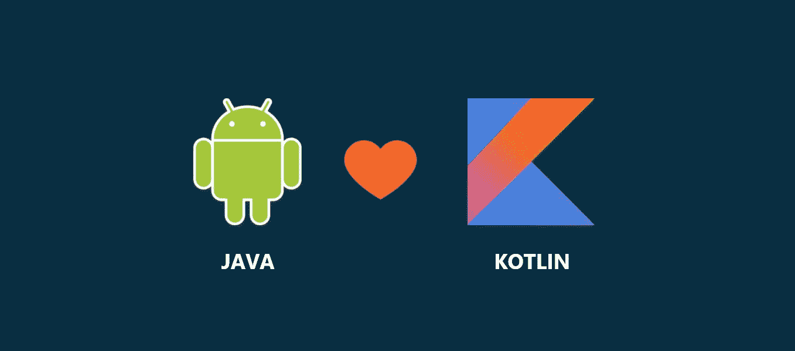
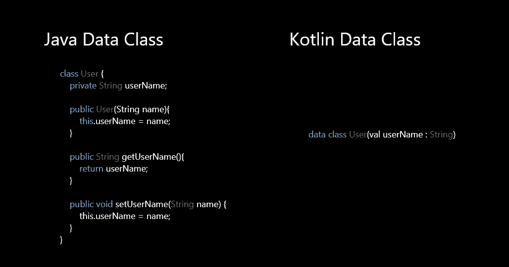
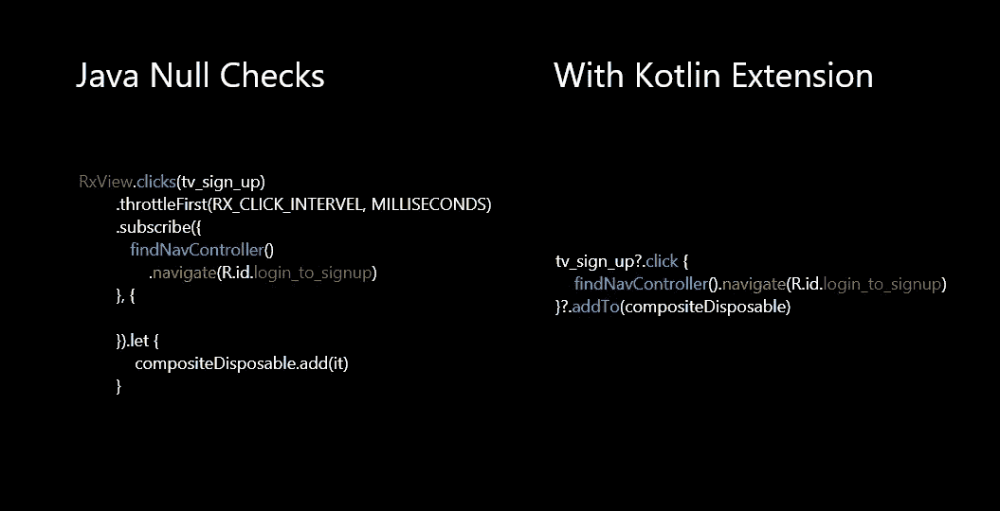
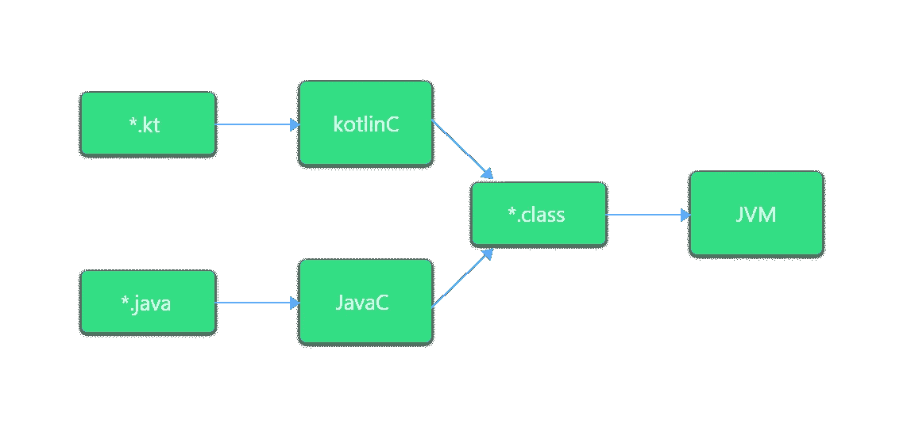
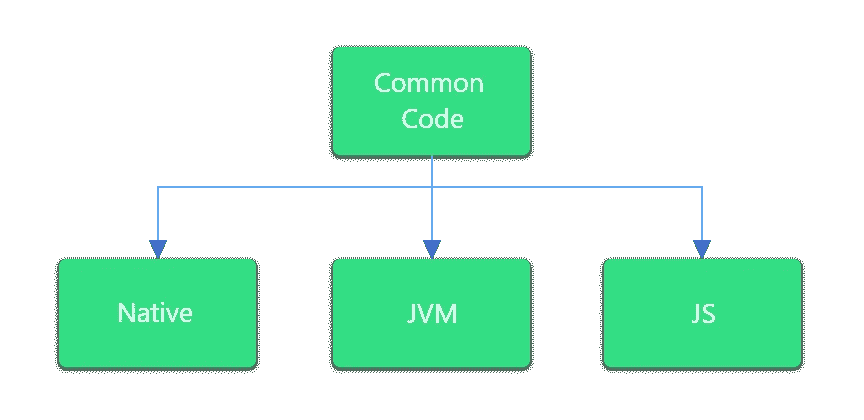

# 我从爪哇到科特林的旅程

> 原文：<https://betterprogramming.pub/my-journey-from-java-to-kotlin-3bfcbcc6b734>

## 欢迎来到下一级函数式编程

在这篇文章中，我将告诉你我为什么和如何开始从 Java 迁移到 Kotlin，以及如何在 Kotlin 下高效和快乐。早在 2015 年，我开始在 Android 上工作，使用 Java 语言进行编程，使用 XML 设计 UI。对我来说没那么难，因为我在大学时代就开始学 Java 了。所以我花了三到四个月的努力，作为一名 Android 开发人员开始了我的载体。

我们生活在一个下一次最重大变革可能即将到来的世界。对我来说，这发生在 2017 年谷歌宣布 Kotlin 为 Android 开发的官方语言之一的时候。一开始，我认为它可能是那些像 C 和 C++一样保持低调的语言之一。

这是我最大的错误:我没有理解的是 Kotlin 是一种 Java 的扩展语言，并且有潜力用于多平台项目。老实说，我担心会脱离我已经学了多年并工作了多年的语言。我担心我不得不重新开始。

但是从 Java 迁移到 Kotlin 的事实更多的是一种进步，而不是彻底的转变(重新开始)。2018 年开始做科特林。互联网上有足够的材料解释 Kotlin 的语法以及如何开始。在我开始学习 Kotlin 时，对我帮助最大的是它的互操作性。

在开始学习 Kotlin 后不久，我开始知道我们可以在同一个项目中进行 Kotlin 和 Java 编码(互操作性)。任何使用过 Kotlin 的人肯定会说这是一种开发人员友好的语言，因为 Kotlin 在编码时为我们提供了杠杆作用。

Android studio 团队在让开发人员更容易用 Kotlin 编写代码方面做得非常出色——比如只需点击一下鼠标，就可以将 Java 文件转换成 Kotlin。当您试图将 Java 代码粘贴到 Kotlin 文件中时，编辑器本身会将代码转换为 Kotlin。最后但同样重要的是，Kotlin 的语法与 Java 非常相似。所有这些特性给了我开始用 Kotlin 编码的信心。

# 科特林的一些东西在一开始给了我信心

到 2018 年底，我对使用 Kotlin 进行 Android 开发很有把握，下面是一些让我相信这一点的原因

## 1.**较少的样板代码**

举个例子，如果你想用 Java 创建一个数据类，那就有点麻烦了，对吧？首先，您需要声明一个变量，然后编写 getters 和 setters。但在 Kotlin 中，这只是一行代码。这种类型的简化编码将提高开发人员的生产力。并排看看 Java 和 Kotlin 代码。

## 2.**简化的空支票**

我不知道你是怎么想的，但在我职业生涯的早期阶段，我经历过无数次撞车事故，但对于科特林，情况就不同了。你可以声明一个变量为`null`或`not null`，这样当你使用一个`null`变量时，编辑器会一直提醒你检查这个变量是否为`null`。

`NullPointerException`崩溃将会减少，而且`null`检查在 Kotlin 中完成的方式也非常乐观。这种类型的特征将增强产品的稳定性。看一看

## 3.**科特林扩展**

有了 Kotlin，我们可以在预定义或库类上编写函数作为扩展，并在任何地方将它们作为普通函数使用。仅这个功能就为我节省了大量时间。有了这个功能，我感觉自己在创造自己的语言。有预定义的扩展，我们也可以创建自己的扩展。

我不能展示我在本文中使用的每一个扩展，但是我将向您展示在视图上实现 Rx `click` listener 时我是如何节省时间的。看一看:

## 4.直接从字符串访问变量

这给编码带来了一点舒适，对我来说，在字符串形式中访问变量比在 Java 中连接更有意义。

这些特性给了我从 Java 迁移到 Kotlin 的最初动力。

# 立刻变成科特林的神话

就在 2019 年之前，我开始在我的企业级编码中使用 Kotlin，我慢慢开始觉得用 Kotlin 而不是 Java 编码更舒服。

所以，只要有可能，我就做一个增量转换——比如在 Kotlin 中构建新功能。或者当你需要重构某个东西的时候，开始用 Kotlin 重构。无论项目是大是小，只要有可能，您都可以进行转换。但是重要的是你应该从现在开始用 Kotlin 写代码。

简而言之，让我告诉你它是如何工作的:你用 Kotlin 编写完整的代码，在编译的同时，Kotlin 编译器编译代码并将其转换成 Java 类和字节码。同样的事情也发生在 Java 编译器方面。所以，最后，不管用哪种语言编写，代码都被转换成字节码，这样 JVM 就可以执行它。Kotlin 和 Java 就是这样在同一个项目中生存下来的。

# 科特林正在大规模进化

就像我一开始说的，我以为 Kotlin 只是 Android 开发中 Java 的替代品，但是有一天，我发现 Kotlin 可以用在 Android 开发之外。

它可以用来代替 web 开发中的 JavaScript 编码，并且它可以在任何具有理解机器代码能力的编译器的平台上使用。Kotlin 编译器很方便；它可以将代码转换成 Java、JavaScript 和机器码。

这很重要，对吧？对我来说，是的。如果你能用一种独特的语言跨平台工作，在这个科技时代，你成长的机会非常高。在开始跨平台编码之前，有些事情我们应该弄清楚，但我要说的是，你不需要再学习核心部分——只需要了解各自平台的基础知识。

# 我对科特林的看法

甚至没有一个 Android 团队的倡导者建议开始用 Java 编写 Android 开发，因为他们知道未来。Kotlin 已经成为 Android 开发的重要入口，并且正在向 web 和 iOS 平台发展(可能不是完整的堆栈，但在不久的将来你会看到它的真正功能)——这是我目前正在学习的。

你知道吗，Kotlin 诞生才五年，它是 2019 年第四大最受喜爱的语言。在像 Java 这样的语言中工作多年后，我们需要比 Java 做得更好的新东西(无意冒犯，它在各种平台上都做得很好)。支持我们进行多平台开发的东西。

当我在 Kotlin 工作时，我完成任务的时间是我在 Java 工作时间的一半。有一天，我想知道为什么。于是我开始用 Kotlin 和 Java 两种语言编写屏幕代码。然后，我发现由于 Kotlin 简洁的函数式编程，我用它编写的代码减少了大约 50%。更简洁的代码需要更少的时间来编写，更少的时间来阅读和理解——这提高了开发人员的生产力。

感谢阅读。