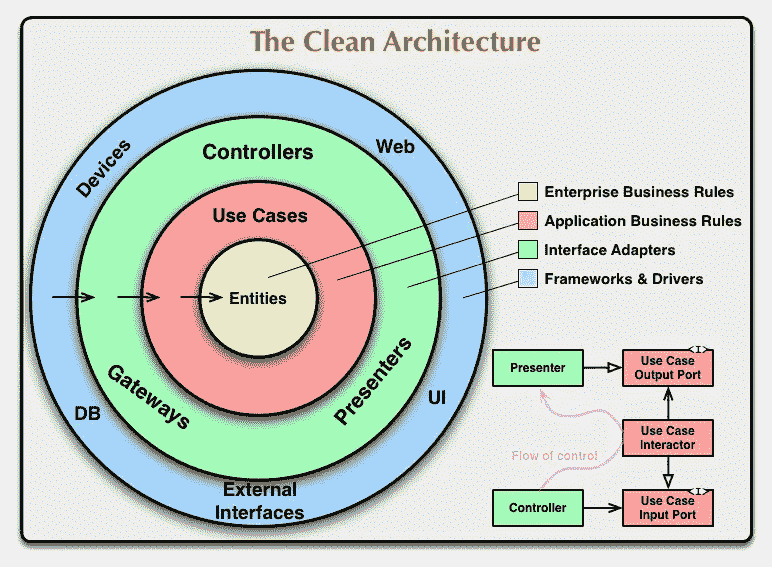

# 我的旅程——五年的 Android 开发

> 原文：<https://betterprogramming.pub/my-journey-of-5-years-with-android-development-fdb96bfcd79a>

## 不断学习和探索

约书亚·索蒂诺在 [Unsplash](https://unsplash.com/s/photos/journey?utm_source=unsplash&utm_medium=referral&utm_content=creditCopyText) 上拍摄的照片

这篇文章是关于我的 Android 开发之旅，它给了我很多教训。我写这篇文章是因为它可能对许多像我一样面临问题的人有所帮助。

回到 2014 年 7 月 7 日，我的第一份工作是安卓开发者。几乎每个人在职业生涯的第一天都会感到兴奋。我也一样。我非常兴奋，脑子里有很多问题，比如公司将会如何发展。

我的角色和职责是什么？诸如此类。但是大约一个星期后，我们都会明白我们需要处理的事情是什么。

我在一家初创公司开始了我的职业生涯，在那里我没有导师来教我学习和实现软件开发的方法。

我知道我们中的许多人不会在顶级公司开始自己的职业生涯，但我们应该把它作为一种优势，因为在这里，我们将以自己的方式学习东西。如果失败了，我们从错误中吸取教训，尝试另一种方式，花更多的时间在工作上。

工作不像电影，我们会花些时间去看，电影结束后再回来。在起点，这是我们一生都要航行的事业。

这就像建立一个强大的基础。在初始阶段，花更多的时间在工作或学习上，否则你将在未来面临一些意想不到的事情。我知道我们每个人都有家庭和其他责任，但要保持平衡。

从每个错误中吸取教训。不要重复它们。

我的一些可以帮助别人的经历。

# 编码前先学习

我们中的许多人，在完成一项任务后，会立即点击 IDE 以获得结果。我们用我们的专业知识来搜索和复制粘贴这些东西。迟早我们会发现，所有的事情都不能用那种方式去做。

所以，如果一个任务或特性被分配去实现，试着尽你所能。首先，想想我们将如何解决这个问题，其次，我们从中学到了什么，最后，这是做这件事的最佳方式吗？

我们每个人都通过编码来得到结果，并且多年来一直做着同样的事情。我也做过同样的事情，直到我遇到一些人，我应该感谢他们让我用不同的眼光看待事物。

在开始使用 IDE 之前，请有效地评估您的工作。无论你做什么，都要尝试从中获得新的学习体验。用不同的方式做事，尝试用新的方式实现旧的东西，这样你就不会感到无聊。

比如我用了`findViewById(R.id.xxx)`快两年了。我已经习惯了。虽然[黄油刀](https://jakewharton.github.io/butterknife/)来缓解一些事情，但我并没有意识到，因为我没有花时间去探索。

我只想让我的代码在手机上运行并得到结果。但是后来，当我开始使用黄油刀，以及后来的[科特林](https://kotlinlang.org/)合成进口，我明白了做事情的轻松。所以，继续探索吧…

不断学习，永不止步。对同一项任务尝试不同的方法。

# 检查优化

总有改进的余地。一旦我们得到想要的输出，我们自己或者 QA(质量保证)团队测试构建并发布到生产中。

但是获得期望的输出并不是我们需要检查的关于我们实现的特性如何影响应用程序性能的唯一最重要的事情。

可能有很多原因，如 CPU 使用不良、不必要的内存消耗、电池资源执行不良等。

为了调试和克服这些问题，在 Android Studio 3.0 中，有一个叫做 [*Profiler*](https://medium.com/better-programming/improve-apps-performance-with-android-profilers-edb240deeb71) *的部分。*性能分析器是一套用于探索、优化和排除性能故障的工具。

使用 Profilers，您可以测量诸如帧、放置和检查视图层次结构等情况下的 UI 性能。缓慢的渲染会造成非常糟糕的用户体验。利用 Profile GPU 渲染、Systrace、布局检查器和`ConstraintLayout`的优势。

查看我在[评测器](https://medium.com/better-programming/improve-apps-performance-with-android-profilers-edb240deeb71)和[提高 UI 性能](https://medium.com/better-programming/android-ui-performance-11b57ac4af8c)上的帖子，了解如何优化您的应用。

养成在发布前衡量应用性能的习惯。这样会有更好的效果。

# 编码标准

编写一些东西并获得输出是每个人都可以做的事情，只需要很少的帮助。但是一开始编写干净且可维护的代码有点困难。

在开始时，我们没有接触过代码，所以用我们的知识，我们按照我们的理解写方法和变量的名字，这对于其他人来说可能很难理解。

在我职业生涯的早期，我也经历了六个月的困难时期。在这六个月里，我每次写东西，都会得到这样或那样的不好的反馈。

我们写的代码应该是团队中每个人都容易理解的，应该很容易修改。不要想什么伟大的名字，这只是一个大家都应该接受的命名问题。

在一些公司，你可以找到一些预定义的命名标准，所以我们只需要遵循它们，而不是创建新的。

对于扩展 Android 组件的类，类名应该以组件名结尾。比如`LoginActivity`、`SignUpFragment`、`DownloaderService`、`CustomDialog`。

资源文件名用小写下划线表示。例如，对于图像或图标，我们使用`ic_`作为前缀。如果图像是`tickmark`，那么我们将其命名为`ic_tickmark`。

对于布局文件，我们使用`component_class_name`格式。如果有`LoginActivity`，布局名称将为`activity_login`。如果有一个`SignUpFragment`，我们使用`fragment_sign_up`作为布局文件名。

编码标准可以提高代码的可读性和可维护性，降低理解事物的复杂性。

# 测试

如今，测试变得越来越重要。现在大家都在要求边开发边写测试用例。JUnit 测试用例最常用于测试逻辑部分。

测试级别:

*   小测试是验证应用程序行为的单元测试，一次一个类。
*   中等测试是集成测试，用于验证模块内堆栈级别之间的交互或相关模块之间的交互。
*   大型测试是端到端的测试，用于验证跨应用程序多个模块的用户旅程。

在开发我们的应用程序时，我们最好遵循测试驱动开发(TDD) 。我们需要从最初始的阶段开始，而不是在整个产品完成后才进行测试。了解更多关于[爱上安卓测试](https://medium.com/mindorks/falling-in-love-with-android-testing-dd11ffa6ac3e)。

尽管遵循 TDD 并不容易，但是尽可能地将缺陷限制在最大程度上是有用的。

# 建筑模式

直到我们有了两到三年的经验，我们中的一些人可能没有听说过术语*架构*。但是了解建筑是非常重要的。架构只不过是我们实现应用的方式。

通常的情况是，如果在我们开始修复 bug 时加入任何新的组织，那么我们会知道这有多痛苦，并祝福编写这种垃圾代码的大师，但这可能不是在所有情况下都是正确的。

但是，谁知道建筑的重要性会跟随它，所以你会理解的重要性，因为容易改变。

有很多架构，比如 MVC、MVP、MVVM、Clean 等等。决定使用哪种架构完全取决于我们应用程序的复杂性。

请记住，移动设备也是资源受限的，因此在任何时候，操作系统都可能会终止一些应用程序进程，以便为新的进程腾出空间。

开发应用程序时要遵循的最重要的原则是关注点分离。

这些基于 UI 的类，如 activity 或 fragments，应该只包含处理 UI 和操作系统交互的逻辑。通过保持这些类尽可能精简，您可以避免许多与生命周期相关的问题。保持模型类独立于 UI。

了解更多关于 [Android clean 架构](https://medium.com/@pavan.careers5208/detailed-guide-on-android-clean-architecture-9eab262a9011)的信息。

如果将来对已开发的特性或可测试性有任何修改，架构将更有助于可变性。

# 安全实现

作为一名 Android 开发者，你可能知道 APK 解码。

这是一个 APK 文件可以被解码的过程，第三个人可以看到你的类文件和资源文件。我们需要将 [ProGuard](https://www.guardsquare.com/en/products/proguard) 应用到我们的应用程序中，同时生成签名的 APK。

ProGuard 有助于缩小、混淆和优化我们的应用程序。

如果将 ProGuard 应用到你的应用程序中，它会将类文件名重命名为黑客无法理解的短名称，并创建大量垃圾文件。生成了一个映射文件。

通过应用 ProGuard，即使你的类文件得到了一定程度的保护，我们的资源文件还是可以被黑客看到的。市场上有许多付费工具，如 [DexGuard](https://www.googleadservices.com/pagead/aclk?sa=L&ai=DChcSEwjY-ZP2pfDmAhUFDisKHYiUAd8YABAAGgJzZg&ohost=www.google.com&cid=CAESQOD2tPao0SKSWrAC3NULbsy5NOs5R85LH5b9gdR8ScC9X4zJ-gKPk-uhqkXTVx_SlRYAr3_eTT370bONYF6cr60&sig=AOD64_0q9svkW5R1yBdTP0YZZt4GmlsNAw&q=&ved=2ahUKEwi17Y32pfDmAhWC6nMBHeYuBdEQ0Qx6BAgNEAE&adurl=) 甚至可以保护资源文件。

渴望了解更多信息？请查看 [R8 收缩](https://medium.com/better-programming/r8-shrinking-in-android-27f3edbbad9e)。

我们讨论了如何保护我们的代码库。但是还有其他东西，如偏好、数据库和网络，我们需要提供安全性。

AndroidX 家族的本地加密共享首选项库是保护首选项的一种方式。仅支持棉花糖(Android 6)及以上版本。要了解更多关于保护首选项的信息，请查看[保护 Android 中的敏感数据](https://medium.com/android-dev-hacks/securing-sensitive-data-in-android-e261687ab66e)。

为了与服务器进行安全通信并防止中间人攻击，我们需要实现某种安全措施。为了安全地访问在线服务，用户需要向服务认证，他们需要提供他们的身份证明。

我们中的许多人都遵循 OAuth 的安全通信概念。OAuth 提供了一个名为 auth token 的值，它既代表用户的身份，也代表应用程序代表用户获取或向服务器发送数据的权限。

根据身份验证令牌，验证服务器返回响应。另外，请检查[证书销。](https://medium.com/better-programming/secure-communication-with-the-server-from-your-android-client-with-certificate-pinning-5f53cea55972)

未来与安全息息相关，因此不要低估它。

# 学习设计模式

在软件工程中，软件设计模式是对常见问题的通用的、可重用的解决方案。它不是一个可以直接转化为源代码的成品设计。

相反，它是如何解决问题的描述或模板，可以在许多不同的情况下使用。设计模式是形式化的最佳实践，程序员可以用它来解决设计应用程序或系统时的常见问题。

在开发应用程序时，我们会面临一些常见的问题。设计模式只不过是这类问题的一种常见解决方案。我们可以应用它们来解决我们的问题。

设计模式主要分为三类:

*   创造性设计模式提供了创建类和对象(单例、工厂、构建器等)的解决方案。).
*   结构设计模式是关于类和对象的安排(例如，复合、外观、适配器)。
*   行为设计模式给了我们在对象和类(命令、观察者、策略等)之间进行交流的方法。).

要了解更多，请查看 Android 中的[设计模式或其他](https://www.slideshare.net/jkumarr/design-pattern-in-android)[中的帖子](https://medium.com/@pszklarska/android-design-patterns-in-practice-builder-6b044f83e6e9)。

当你不知道该做什么的时候，设计模式非常方便。

# 利用 VCS

版本控制系统帮助我们维护文件版本。版本控制是一种系统，它记录一段时间内对一个文件或一组文件的更改，以便您可以在以后调用特定的版本。对于几乎所有的软件项目，源代码就像是最珍贵的资产，其价值必须得到保护。

不要只考虑在项目中使用 VCS，开始使用它。因为维护不同版本的代码是非常困难和痛苦的。不仅仅是为了维护万一你想比较一个文件在第十版和你的第一版，这将像一个地狱。

但是使用像 Git 这样的 VCS 使得基本命令变得非常简单。如果你还没有开始，请马上开始。查看更多关于 [VCS](https://bitbucket.org/product/version-control-software?_ga=2.214924567.1078313383.1578203216-1041920696.1567333107) 或[吉特](https://git-scm.com/book/en/v2/Getting-Started-About-Version-Control)的信息。

Git 使得源代码维护变得非常容易。

# 不要每次都复制粘贴

我们中的许多人习惯于做复制和粘贴工作。我们只是简单地从其他地方复制代码，如谷歌教程或堆栈溢出或任何以前使用的类，然后粘贴到我们需要的地方。

但是总是这样做不是一个好习惯。从我自己的经验来看，我认为你应该尽最大可能消除这些东西。

我将从我的经历中解释这些东西是如何影响我们的。直到三年前，我习惯于做这些，我得到了解决方案和按时交付的工作。

直到有人问我这些，我才知道到底哪里出了问题。如果我们得到一个异常或者一些你不知道的东西，我们该怎么办？

我们只需打开浏览器，然后谷歌一下，从 Stack Overflow 或任何其他网站找到解决方案，然后从那里复制并粘贴到我们的代码中。同样的事情发生在第二次、第三次等等情况中。

在这里，我们是而不是获取知识，我们只是在做一个外面的每个人都可以执行的数据输入工作。但是想象一下同样的事情如果有人在你的面试中提出同样的问题，那么我们意识到我们做了这件事却不知道我们做了什么，这就会造成负面影响。

解决这个问题的方法是每次都写下所有的内容。不要偷懒。

如果我们有时间限制，那么这样做是好的，但我们已经像这样改变了我们的开发方式。试着把每一行都写下来，这样你可以获得知识，这对面试也有帮助。

每次都要写，不要做傻事。

# 知道引擎盖下发生了什么

了解如何做事是实现一个库或框架的第一步。但是知道幕后发生的事情也同样重要，但是我们大多数人都不重视第二部分。

我们主要集中在第一部分，把东西运出去。随着经验的增加，我们学习的方式也应该改变。如今，我们看到大多数面试官都在钻研事物，而不是外在的实现。

随着经验数的增加，我们需要增加一些知识的额外权重。

了解幕后发生的事情总是为了更大的利益。通过了解更多来获得知识。

# 当自由职业者

作为开发人员，我们每天都有工作要做，但是仅仅这样并不能满足我们的渴望，所以我们寻找更多的事情去做。自由职业就是其中之一。我们在许多网站上寻找自由职业者的工作，但我们大多数人最终什么也没做，因为我们没有投资组合，所以没有被选中。

相反，我们可能会被选中做一两个没有任何成果的小项目。所以，不要累，试着被选中，创造你的空间。尝试不同的网站。

如果你还没有成功做到这些，那就创造你自己的自由职业。创建你的 Play Store 账户，推出一些带有广告或应用内购买的应用，然后做一些社交媒体营销，获得用户，这样你的收入流就会被创造出来。

现在就看你如何改进它了。

没有工作是有保证的，所以从不同的来源建立多种收入来源。

# 构建您的投资组合

尽量不要把所有的精力都放在日常工作上。建立你的个人档案，这是唯一重要的事情。

比如面试，最后一轮有两个家伙，一个是和我们大多数人一样普通院校毕业的人，第二个是顶尖大学毕业的人。

那么，谁抢位的几率会高呢？

很明显，第二个拿到的几率最高。但是随着经验的变化，这也会发生变化。雇主会看你的投资组合**、**，而不是你的大学和百分比。

你的作品集讲述了你做事的能力，建立它。充满激情地工作，建立不同的流程来提高你的技能。尝试不同的事情，如自由职业、指导、教学和发展等。

你可能不会在所有方面都成功，但你会在你拥有高超技能的方面取得成功。尝试不同的技术，不要拘泥于一种。在过去的五年里，我只做了 Android，没有做别的，这造成了更多的痛苦。

尝试不同的事情，找到你的专长。一个投资组合能表达的东西比我们想象的多得多。作为一名应用程序开发人员，在我看来，我们需要在 Play Store 中设立一个展示我们专业知识的角落。

合适的人会创造机会，而不是寻找机会。

就这些了，希望你喜欢阅读这篇文章。

请分享一些你的经验，这些经验可能对其他人有所帮助。

感谢阅读。