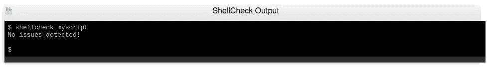

# 我最小的、安全的 Bash 脚本模板

> 原文：<https://betterprogramming.pub/my-minimal-safe-bash-script-template-300759114040>

## 用这个模板编写更好的 Bash 脚本


在 [Unsplash](https://unsplash.com/s/photos/diagram?utm_source=unsplash&utm_medium=referral&utm_content=creditCopyText) 上由 [Ussama Azam](https://unsplash.com/@ussamaazam?utm_source=unsplash&utm_medium=referral&utm_content=creditCopyText) 拍摄的照片

在本文中，我将向您展示我在生产环境中使用了几年的安全 Bash 脚本模板。您将能够根据您的用例轻松地修改代码。

这就是 Bash 模板所涵盖的内容:

*   专注于便携性的 a shebang:`#!/usr/bin/env bash`
*   设置`-o errexit`的快速失效原则。如果您不知道这些选项是什么，请不要担心——我稍后会解释它们。
*   正确处理工作目录
*   完成后清理资源和文件
*   帮助/使用功能
*   长选项，例如:`myscript.sh — option <ARGUMENT>`
*   短选项，例如:`myscript.sh -o <ARGUMENT>`
*   使用配置文件以及如何“获取”它
*   使用 [linter](http://shellcheck.net/) 来分析我们的代码

还有更多！

顺便说一下，这个模板已经被 [ShellCheck](https://www.shellcheck.net/) 验证过了。



Shellcheck 上未检测到任何问题

# **模板**

就是这样。让我们一部分一部分地解释这是怎么回事。

# **Shebang #！/…**

```
#!/usr/bin/env bash
```

每个可执行脚本都可能以一个 shebang 开始。简而言之，shebang 是指示 shell 使用特定 shell 的一系列字符或字符串。在这个模板中，为了增强可移植性，我们使用了`env` 命令。这个命令将确保定位或识别 Bash shell 二进制文件的路径，并使用它来解释我们的脚本源代码。

# **执行“快速失效”原则**

```
set -o errexit
set -o nounset
set -o pipefail
```

理想情况下，你应该很快失败。我鼓励你把这个原则付诸实践。您希望在开发的早期阶段失败，修复 bug，并覆盖角落情况。如果出现错误，第一个选项将导致脚本失败或立即退出。我们为什么想要这个？因为我们想要捕捉错误，所以我们想要注意到它们，并且一看到它们就修复它们。如果有任何未设置的变量，第二个选项(`set -o nounset`)将导致脚本失败。最后一个，`set -o pipefail`在使用管道的时候会很有帮助。

我想给大家举个例子，那么我们来分析一下下面这个小脚本:

```
#!/bin/bashsort "notfound" | uniq && {
    echo "Life is good :)"      
}exit 0
```

这里的输出会是什么？它将是:

```
sort: cannot read: notfound: No such file or directory
Life is good :)
```

正如你所看到的，由`sort` 命令引起的错误被管道和`uniq`命令忽略了。`pipefail`选项将帮助我们捕捉管道问题，如下图所示。

让我们转到下一部分。

# **所需变量**

您可能想知道为什么在某些情况下我使用了内置的`readonly` shell，而在其他情况下却没有。原因很简单:以我的拙见(这是我应用于其他编程语言的东西)，如果我的一个变量不会改变，我看不出有任何理由不保护自己，把它变成一个常量——就这么简单。缺点很明显，代码变得冗长，但这是我愿意付出的代价。

在上面的代码中，您可以看到我正在获取脚本工作目录，并将其分配给一个变量。然后我使用这个变量来引用我的配置文件。稍后我们将看到如何为内部或特定目的读取或获取该文件。

然后我声明一些错误代码变量，它们将与`exit` 选项一起使用。我通常不会在我的脚本中使用`exit 1` 。原因可以在伟大的[高级 Bash 脚本指南](https://tldp.org/LDP/abs/html/exitcodes.html#EXITCODESREF)中找到。

模板使用三个选项，`-a`、`--abc`或`-f/--flag`。如果用户在命令行中使用这些`option_flag`变量，它们将被设置为 1。

# **退出前清理资源**

```
trap clean_up ERR EXIT SIGINT SIGTERM...clean_up() {
    trap - ERR EXIT SIGINT SIGTERM
    # Remove temporary files/directories, log files or 
    # rollback changes.
}
```

如果您的脚本创建了临时目录和文件，由于某种原因，它被中断或因错误而结束，那么您的文件系统中就会有临时文件。当脚本完成、被中断、出错或被终止时，上面的代码将运行`clean_up`函数。

# **如何使用**

## **使用显示功能**

我们简单的使用功能。它显示为 [*手册页*](https://www.kernel.org/doc/man-pages/) *。*我们的包含用法简介、描述和选项部分。

## ***板牙()*功能**

```
die() {
    local -r msg="${1}"
    local -r code="${2:-90}"
    echo "${msg}" >&2
    exit "${code}"
}
```

这个实用函数将帮助我们做两件事:显示一个定制的消息和用一个特定的代码退出我们的脚本。

## **读取我们的配置文件**

```
if [[ ! -f "${conf_file}" ]]; then
    die "error reading configuration file: ${conf_file}" "${error_reading_conf_file}"
fi# shellcheck source=script.conf
. "${conf_file}"
```

上面的代码将检查配置文件是否存在，并在我们的模板中使用它。在配置文件中外部化我们的变量是一个好主意，这样可以保持我们的脚本整洁，并专注于我们的定制逻辑。`shellcheck source`注释是一个指令，它将帮助 linter， [ShellCheck](https://github.com/koalaman/shellcheck) ，包含配置文件并对其进行分析。

## **解析用户选项**

`parse_user_options`支持所有类型的参数、标志、命名参数和位置参数。这意味着您可以使用带有任意参数组合的模板，例如:

```
./bash_template.sh -f
./bash_template.sh -f -a 535
./bash_template.sh -f -a "Hello World"
./bash_template.sh -f -a "Hello World" --abc pi
./bash_template.sh -f -a "Hello World" --abc=3.141592
./bash_template.sh --abc "hello, reader"
./bash_template.sh --abc "hello, reader" -f
./bash_template.sh --abc "hello, reader" -f -a23
./bash_template.sh -a52 -f
```

正如您所见，`[getopt](https://man7.org/linux/man-pages/man1/getopt.1.html)`在解析命令选项方面提供了很大的灵活性。如果用户在命令行中使用 `-a`、`— abc`或`-f`，函数`parse_user_options` 将负责将`flags`变量更改为 1。

## **使用标志和参数**

解析之后，我们只需要将我们的标志和参数用于我们的业务逻辑。

# **使用模板**

要使用此模板，您必须更改以下部分:

*   `usage()`功能
*   `cleanup()`功能(尽管如果你不改变它，它不会影响操作)
*   `parse_user_options()`功能，特别是在`opts`变量声明中
*   检查标志变量是否已设置的逻辑

# **结论**

我们可以对模板做一些改进。我们也许可以把我们的实用函数放在一个单独的文件中，让它更整洁。我已经对模板使用了 linter，它没有发现任何突出的问题，这太棒了！我们还可以添加颜色和日志记录功能，但这可能会使模板变得冗长。请在评论中让我知道你的想法。谢谢大家！

[https://github.com/leogtzr/minimal-safe-bash-template](https://github.com/leogtzr/minimal-safe-bash-template)/