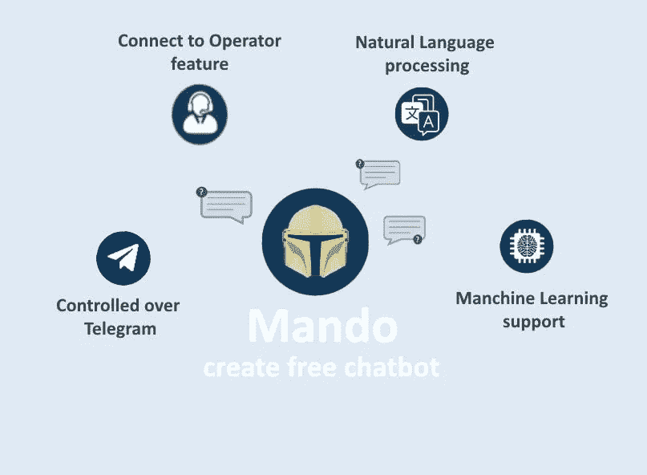
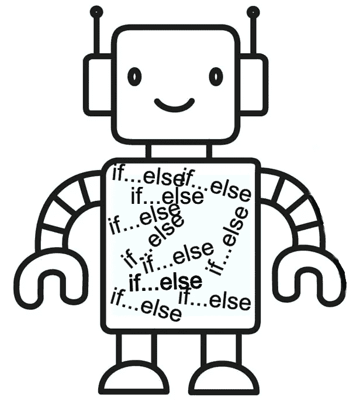

# 我的 NLP 聊天机器人。从创意到 500 多名用户

> 原文：<https://betterprogramming.pub/my-nlp-chatbot-from-idea-to-500-users-3fadce3335b9>

## 我创造自己聊天机器人的有益旅程

作者创造的形象

我花了大约一年的时间来思考它，然后花了一个月的时间来设计、装箱和推广它。我想到了一个聊天机器人构造器的想法，用于创建和管理其他可定制的聊天机器人。

# 适合这项工作的工具

我用 Java 编写了我的机器人，因为我对它有最丰富的背景经验。我还计划用[现代和更有趣的](https://medium.vladmykol.com/best-kotlin-features-that-i-value-most-as-java-developer-part-2-ee2c7bde74ef) Kotlin 来改进/回顾它，因为它相对来说是一件容易做的事情。

如果我是一年前的我，我会开始学习 Python，然后用于我的聊天机器人。Python 有许多人工智能支持的框架，在编写智能聊天机器人时帮助很大。用 Java 的话，就那么几个。

# 消息服务

我用 Telegram 作为信使来启动我的聊天机器人。为什么？嗯，它有一个友好的 API，更重要的是，它有一个简单的机器人注册流程:

 [## 机器人:开发者入门

### 机器人是运行在 Telegram 内部的第三方应用程序。用户可以通过向机器人发送信息来与它们互动…

core.telegram.org](https://core.telegram.org/bots) 

在我的例子中，集成就是在[的机器人父亲](https://t.me/botfather)中注册我的机器人，并从[的 telegram java 客户端](https://github.com/rubenlagus/TelegramBots)实现这个简单的接口:

我还计划将其与 Facebook Messenger 集成，并在我未来的文章中进行描述，敬请关注。

# 让机器人变得聪明

制作聊天机器人最具挑战性的部分是让它变得智能，而不是编写一堆 if-else 语句，所以我决定为它提供一些人工智能功能。

作者创造的形象

最初几天的研究把我带到了这个机器学习库。我意识到，通过[自然语言处理](https://en.wikipedia.org/wiki/Natural_language_processing)，我的聊天机器人可以更好地理解人类语言，并选择最合适的回应。

*主要思想在于基于预先训练的模型对用户的输入句子进行分类*

## 训练机器学习模型

一个好的 ML 模型需要大量的训练数据和强大的计算资源。尽管如此，我还是想保持简单，所以我将用用户提供的几个样本来创建我的模型。顺便说一下，用 OpenNLP 创建模型的最小样本数是 4。

## 使用机器学习模型

一旦模型准备好了，我就用它来对来自用户的任何输入字符串进行分类。

分类的结果是一个带有类别名称及其分数的 SortedMap。我用它来确定最佳方案，如下图所示:

# 部署

我尝试了几家云提供商，但最终选择了用于容器化和部署自动化的 [Hetzner Cloud](/aws-vs-digital-ocean-vs-hetzner-cloud-which-has-the-best-value-for-money-bd9cb3c06dee) 和 [Dokku](https://dokku.com/) 。

以下是我在上一篇文章中所做的更多内容:

 [## 以每月不到 5 美元的价格在云中托管您的应用程序

### 这是一种在云中部署和托管 NodeJs、Python、Java 或 Ruby 应用程序的简单而廉价的方式，几乎不需要任何成本…

better 编程. pub](/host-your-app-in-the-cloud-for-less-than-5-a-month-cba15cdb6cd8) 

# 一些统计数据

不要忘记这不是一个由一个开发者(我)做的商业项目，我很高兴看到所有这些用户都参与进来，并欣赏我的工作，尽管我没有为它做任何营销或推广。

以下是迄今为止使用我的[@ Mando-create-chatbot-constructor](http://t.me/create_free_chatbot)创建的最受欢迎的聊天机器人:

1.  @[Maharashtra _ Helper _ bot](http://t.me/Maharashtra_Helper_bot)—399 个独立用户
2.  @ [ProxenonBot](http://t.me/ProxenonBot) — 110 个独立用户
3.  @ [real_jobs_bot](http://t.me/real_jobs_bot) — 45 个独立用户

# 摘要

在我的日常工作中，我被告知需要做什么，有时甚至需要如何做，但在这里，我有完全的自由，并指定时间来开发每个项目。一路上也学到了很多新东西，包括 NLP、Dokku、Hetzner Cloud。

如果你和我一样是一名软件工程师，我敢打赌你有自己想开发的东西，但没有时间或勇气去开始。也许今天是合适的时机？我保证这将是鼓舞人心和有益的。

如果你想查看我的聊天机器人的完整源代码，可以在我的 GitHub 上找到:

 [## GitHub-vladmykol/mando-Chatbot:Chatbot 构建器平台

### 这是一个免费的聊天机器人构建平台，由 SpringBoot 和 ApacheOpenNLP 库提供支持。使用 Mando 聊天机器人创建和…

github.com](https://github.com/vladmykol/mando-chatbot) 

布里尔。如果你读到这里，你会是一个真正好奇的读者。现在拍拍自己的背，下一轮见。