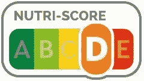
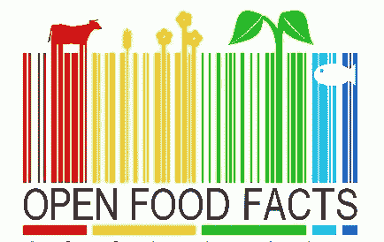

# 我的拓展项目:公开食品事实

> 原文：<https://betterprogramming.pub/my-outreachy-project-1f31e9e0576>

## 做出更好的食物选择

由[布鲁克·拉克](https://unsplash.com/@brookelark?utm_source=medium&utm_medium=referral)在 [Unsplash](https://unsplash.com?utm_source=medium&utm_medium=referral) 上拍摄的照片。

开放食品事实是“食品的维基百科”它影响个人、社会和地球的健康。食物和营养是我们生活中非常重要的一部分。我真的相信，提供关于食物的详细信息，包括它的成分和营养，肯定可以帮助用户遵循健康的饮食，使他们更容易选择最有营养的食物。简单地说，它可以帮助他们做出更健康的食物选择。

# **社区**

开放食品事实社区认为，地球上的每个孩子都有权利获得营养、健康的食物。

不幸的是，今天三分之一的儿童要么营养不良，要么超重。开放食品事实致力于帮助全球公民、决策者和研究人员做出更明智的食品选择。该社区正在与全球各地的研究团队合作，以改善对我们所有人都有益的营养研究。

# **开放食品信息如何帮助你？**

公开食品事实可以在以下方面帮助你。

## **选择对你有益的产品**

*   营养评分等级(从 A 到 E)显示了食物的营养质量:

营养评分等级

*   NOVA 组(从 1 到 4)发现加工最少的食品。

## **食品透明度**

开放食品事实是一个由每个人制作的食品数据库，为每个人服务。你可以用它来做出更好的食物选择，由于它是开放的数据，任何人都可以出于任何目的重复使用它。

## **获取事实**

公开食品信息有助于你理解产品标签上的信息。您将能够找到:

*   碳足迹(二氧化碳排放)
*   产品包装的回收说明
*   Nutri-Score(营养评分)、营养素、脂肪/脂肪含量、饱和脂肪酸、碳水化合物、糖、纤维、蛋白质、盐和钠含量
*   葡萄酒和啤酒的酒精含量
*   可追溯性信息(包装代码、成分来源)
*   品牌，过敏原，标签(生物，无麸质，纯素食，素食，清真，犹太等。)

# **我的项目**

开放式食品事实的后端是用 [Perl](https://www.perl.org/) 编写的。在过去的八年里，开放食品事实代码库已经有机地成长了很多，这使得开发者对贡献并不十分欢迎。它有时还会导致性能问题和错误。

公开食品事实

根据 2020 年初[的统计](https://www.statista.com/statistics/793628/worldwide-developer-survey-most-used-languages/)，JavaScript (67.7%)和 HTML/CSS (63%)是使用最多的编程语言，而 Perl 是开发者使用最少的语言之一(3.1%)。因此，未来的主要任务之一是用模板系统取代 Perl 代码中的 HTML 生成，这样不懂 Perl 的开发人员仍然可以为项目的前端做出贡献。

另一项任务包括重新构建 Open Food Facts Perl 模块和函数，可能会使其中一些更加通用。这可以帮助解决性能问题，也可以使开发人员更容易理解代码并做出贡献。

我们还旨在扩展单元测试的覆盖范围，以减少代码中未被发现的软件错误的机会。我们都知道代码文档的重要性。为了让其他开发人员理解代码，我们计划扩展 POD (Plain Old Documentation)来记录 Perl 模块和函数。我们还将关注如何使开放式食品事实开发环境的安装更加容易。

## **我的项目将如何帮助社区？**

由于该项目是关于提高开放食品事实后端的代码质量，它可以帮助增加能够为该项目做出贡献的开发人员的数量。为模块添加更多的文档也将帮助开发人员更好地理解代码。我们正在努力寻找实现目标的正确方法。我们已经开始进行小的增量更改，并以最小的风险逐步部署。

感谢阅读！