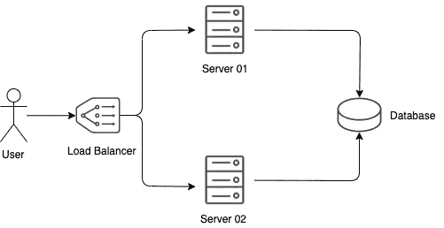

# 我的 PHP 应用程序越来越受欢迎，现在呢？

> 原文：<https://betterprogramming.pub/my-php-application-is-getting-really-popular-now-what-68160c42f90>

## 如何水平缩放 PHP 应用程序的概述

由[玛利亚·莫利内罗](https://unsplash.com/@mariamolinero?utm_source=unsplash&utm_medium=referral&utm_content=creditCopyText)在 [Unsplash](https://unsplash.com/?utm_source=unsplash&utm_medium=referral&utm_content=creditCopyText) 上拍摄的照片——放大

根据我的经验，PHP 受到了很多人的讨厌。如此憎恨以至于我几乎不敢说我喜欢这门语言。版本 7 解决了很多问题，我特别喜欢增加的类型检查功能。

而且，如果你使用流行的 [Laravel 框架](https://laravel.com/)，PHP 所有丑陋的部分都会被隐藏起来，你可以使用 Laravel 为你提供的漂亮的库。

当我谈论 PHP 时，经常出现的一个论点是可伸缩性。似乎有一种观念认为 PHP 应用程序不可伸缩。

在本文中，我将向您展示扩展 PHP 应用程序需要什么。

# 垂直缩放

到目前为止，扩展应用程序最简单的方法是购买更好的服务器。添加更多的 CPU 和内存将会加快你的网站，但这是有代价的，因为购买高端服务器是昂贵的。

此外，很难用这种方式动态地扩展应用程序。假设您晚上几乎没有用户，而白天有大约一百万用户，那么您有一个非常昂贵的服务器，而您只使用一半的时间。

这种缩放方法称为*垂直缩放*。

# 水平缩放

几乎所有的大型 web 应用程序都使用*水平缩放*。这意味着增加更多的服务器来扩展网站，而不是购买更好的服务器。

通常，有一个负载平衡器将用户重定向到其中一个应用服务器。

将数据库与应用服务器分开是很重要的。这样，每个应用服务器都可以访问同一个数据库。

# PHP 会话

但是这种方法有一个问题。服务器必须是无状态的。

PHP 使用会话来跟踪用户的状态。如果用户在`Server 01`登录，那么服务器知道用户已经登录。但是如果负载均衡器向`Server 02`发送下一个请求，那么这个服务器将不会知道用户已经登录。

## 解决方案 1。将会话存储在数据库中

您可以配置 PHP 会话以将会话数据存储在数据库中。

然而，这意味着对于每个请求，必须进行数据库查询。这很难扩展，因为数据库通常是大型 web 应用程序的性能瓶颈。

## 解决方案 2。将会话存储在 Redis 服务器中

[Redis](https://redis.io/) 是一个速度极快的内存键值数据存储。您可以设置一个 Redis 服务器来存储所有 PHP 会话数据。查看[这篇文章](https://joshtronic.com/2013/06/20/redis-as-a-php-session-handler/)，获得如何做到这一点的实用指南。

## 解决方案 3。将你的应用分离成后端和前端

您可以选择根本不使用 PHP 会话。很多网站都有一个无状态 API 作为后端，并使用 JSON web 令牌作为认证系统。

在我看来，这是最具伸缩性的解决方案，因为所有的会话管理都是在客户端完成的。

# 添加更多数据库

大多数应用程序执行的读查询比写查询多。您可以使用这些信息通过添加只读数据库来扩展您的数据库。

为了保持数据一致，这些只读数据库与单个*只写*数据库同步。

如果您需要添加更多的*只写*数据库，您就进入了数据库分片的领域，这非常复杂，我不建议您自己动手。如果你想了解更多关于分片的知识，请查看这篇文章。

# 处理上传的文件

如果用户上传文件到`Server 01`，那么`Server 02`也需要知道文件已经上传。

一个解决方案可能是使用 [Gluster](https://www.gluster.org/) 。Gluster 会自动同步网络中多个节点上的文件系统。

另一个解决方案是创建一个单一的对象存储服务器，这个服务器的唯一目的是存储静态文件。另外，您可以创建多个对象存储服务器，并使用 Gluster 来保持它们的同步！

# 云计算

成功地扩展 web 应用程序需要做大量的工作。这就是为什么大多数公司转向云计算来扩展他们的应用程序。

有了[谷歌云](https://cloud.google.com/)平台，你可以将谷歌云数据库作为你的数据库服务器。使用[云运行](https://cloud.google.com/run/)来托管您的应用服务器。创建一个[谷歌存储](https://cloud.google.com/storage/)桶来存放静态文件。使用 Google Cloud [Firestore](https://firebase.google.com/docs/firestore) 作为键值会话服务器。

神奇的是，谷歌云平台会自动*动态缩放*你的应用。不需要你做任何工作！

# 结论

希望本文很好地概述了扩展 web 应用程序所需的不同组件。最简单的方法是使用云提供商，让他们为您处理扩展！

但是，自己设置组件肯定会很有趣。