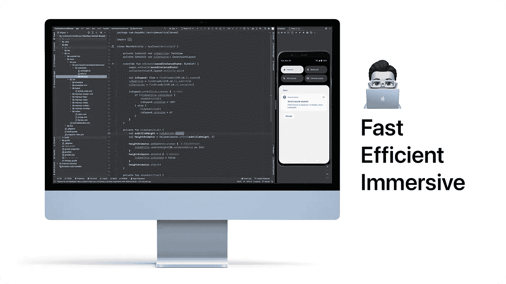
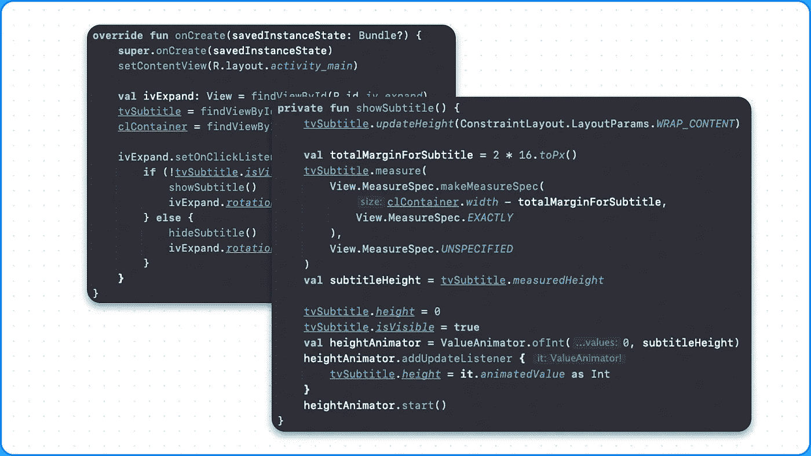
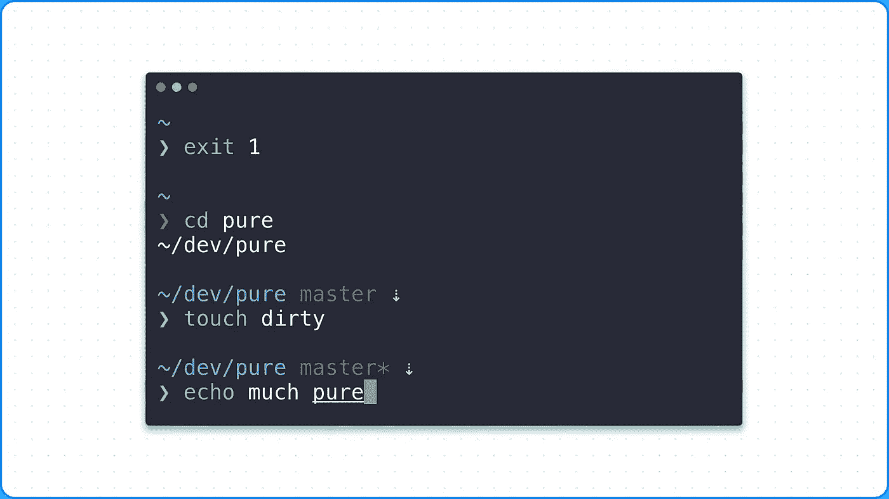
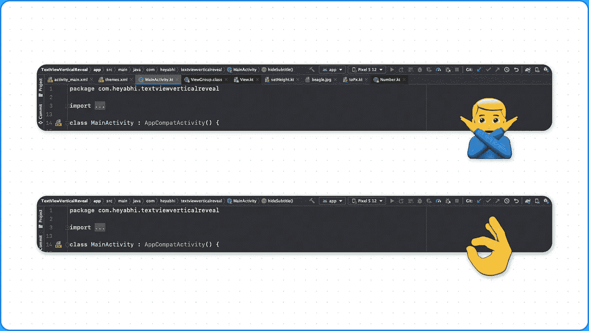
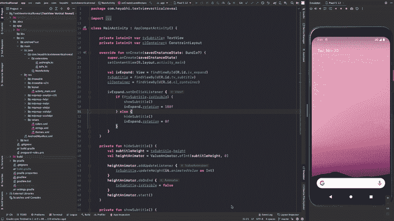

# 我最高效的 Android Studio 设置

> 原文：<https://betterprogramming.pub/my-productive-android-studio-setup-9dd3774a3b91>

## 基于 3 年的实验和学习



作者图片

在这个非常特别的博客中，我想分享我的 Android 开发编程设置。这些技巧、诀窍和诀窍是我作为一名 Android 开发人员在 Gojek 和我自己的项目中工作了 3 年多的结晶。

该设置专注于工作时的快速、高效和身临其境。有很多事情要讨论，我会尽量保持简洁，但如果我在某个时候开始喋喋不休，请原谅我。

*免责声明:我仅将 macOS 用于开发工作。这不是最好的，但我很满意。如果您在不同的平台上，提到的这些点可能需要一些额外的步骤来实现。*

我们开始吧

# 主题——形式与功能



我想从一个潜在的惊喜开始，我现在最喜欢的 Android Studio 主题是 [Xcode-Dark 主题](https://plugins.jetbrains.com/plugin/13106-xcode-dark-theme)。我一直很喜欢 Xcode 的外观，颜色对比鲜明，但很舒服。非常好的支持 Kotlin 的颜色编码和基于上下文的不同文本风格。

在此之前，我曾经是[德古拉主题](https://draculatheme.com)的忠实粉丝，很多人在与我进行代码配对时都会询问主题。它比 Intellij 自带的`Darcula`主题要好很多。

# 字体——优雅明快


为了读写代码，我使用苹果旧金山的[等宽版本。我觉得很舒服，从来没有问题。](https://developer.apple.com/fonts/)

在此之前，我使用的是 [Fira 代码](https://github.com/tonsky/FiraCode)，这是一个有点花哨，非常好的选择。Jetbrains 有他们自己的字体，但是我不喜欢用那种字体看起来那么高。

# **终端独立且功能丰富**



我会很快解决这个问题。 [iTerm 2](https://iterm2.com) 是 mac 行业中非常受欢迎的选项，我将它与 [ZSH](https://en.wikipedia.org/wiki/Z_shell) 配对使用。该设置支持分割窗格，标签，反向搜索和所有我需要的。iTerm 也有 Xcode-Dark 主题的补充版本。

大多数情况下，我也是通过终端而不是 Android Studio 来构建代码。通过 Android Studio 进行构建并不冗长，终端日志可以让你更好地了解正在发生的事情，对于大型项目来说，终端构建通常会更快。此外，特别提到，出于某种原因，取消一个正在运行的版本需要在 Android studio，终端永远更容易。

我还使用终端完成所有与 git 相关的任务，比如提交、推送、重置基础……这是常见的情况。对开发者来说，不使用特殊的 IntelliJ 特性就能以原始的方式完成这一切是非常重要的。

# 选项卡—不再有



这可能会再次令人惊讶，但在过去的 2 年里，我已经在 Android Studio 中完全禁用了标签，我不认为我会回去。

标签占据空间，带来混乱，并且操作缓慢。我使用键盘快捷键在文件间跳转、打开新文件、搜索等。在我们的新兵训练营，我们被教导键盘快捷键的真正价值，我记得 Sidu Ponnappa 对此所说的话:

> 任何人都可以在直道上跑得很快，冠军会在比赛中尽量节省弯角时间。类似地，在软件开发中，就是这些小角落，比如导航 UI，编辑代码，键盘快捷键可以让你快很多。

还不服气？[步骤在这里提到](https://medium.com/u/7bef290f1d79#run-emulator-studio)。

*   在这些设置中设置仿真器作为一个单独的窗口[打开。](https://www.jetbrains.com/help/idea/viewing-modes.html)*   在拆分视图中打开 Android Studio，[步骤在这里提到](https://support.apple.com/en-in/HT204948)。*   使用仿真窗口作为分割的另一面。

它导致了这个美丽的设置，工作室和模拟器是并排打开的，你可以移动手柄来一起调整它们的大小☺️



# 多方面的

我将 Caps Lock 按钮映射到 Ctrl，这样点击它就容易多了。尤其是在 MacBook 键盘上，Ctrl 是隐藏在左下角的一个小键。

## **选项卡部分以外的快捷键**

1.  `Ctrl + backtick` —快速访问一些常见的 Android Studio 设置。
2.  `Ctrl + t` —打开重构菜单。我最喜欢在 XML 编辑器中将布局提取到新文件中。
3.  双按 shift 全局搜索。
4.  `Cmd + ,` —当前应用程序的打开设置打开，在 macOS 上有效。
5.  `Cmd + ;` —打开项目设置。
6.  `Shift + F6` —快速重构。

这一个就到此为止。如果你想了解更多的细节，或者你想分享一些你最喜欢的技巧和窍门，让你的设置更加高效和舒适，请告诉我！

```
**Want to Connect With the Author?**Follow me on [Twitter](https://twitter.com/__heyabhi).
```