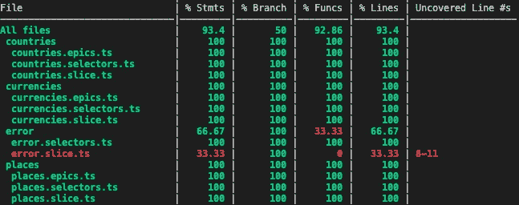

# 我的 React 应用程序单元测试策略

> 原文：<https://betterprogramming.pub/my-react-app-unit-testing-strategies-18ebe55cd078>

## 用一套可靠的单元测试来强化你的代码库


图为[贝托·马卡里奥](https://unsplash.com/@bertomacario?utm_source=medium&utm_medium=referral)在 [Unsplash](https://unsplash.com?utm_source=medium&utm_medium=referral)

无论应用程序有多小，单元测试对于开发都是至关重要的。这篇博客文章将介绍我是如何为这个示例应用程序编写单元测试的:

[](https://github.com/xiongemi/white-label-airline) [## GitHub-Xiong EMI/white-label-airline:使用 Nx React 创建的白标航班搜索应用程序

### 这个项目是一个使用 Nx 生成的样本航班搜索应用程序。

github.com](https://github.com/xiongemi/white-label-airline) 

Github 页面:[https://xiongemi.github.io/white-label-airline](https://xiongemi.github.io/white-label-airline)

它将解释我对 React 应用程序不同部分的一些单元测试策略:

*   服务
*   表象成分
*   智能/容器/连接组件
*   还原文件
*   钩住


React 应用程序的单元测试策略

# 技术堆栈

以下是我使用过的库的列表:

*   测试框架: [Jest](https://jestjs.io/)
*   DOM 测试: [@testing-library/react](https://testing-library.com/docs/react-testing-library/intro/)
*   林挺:[诚信通](https://eslint.org/)
*   ESLint 插件:[lint-plugin-testing-library](https://github.com/testing-library/eslint-plugin-testing-library)和 [eslint-plugin-jest-dom](https://github.com/testing-library/eslint-plugin-jest-dom)
*   可访问性测试: [jest-axe](https://github.com/nickcolley/jest-axe)

# ESLint 插件

添加林挺将有助于开发人员在编写单元测试时避免一些错误。要安装 ESLint 插件[lint-plugin-testing-library](https://github.com/testing-library/eslint-plugin-testing-library)和 [eslint-plugin-jest-dom](https://github.com/testing-library/eslint-plugin-jest-dom) ，输入以下命令:

```
*# npm*
npm install --save-dev lint-plugin-testing-library eslint-plugin-jest-dom*# yarn* yarn add lint-plugin-testing-library --dev
yarn add eslint-plugin-jest-dom --dev
```

在文件`.eslintrc`中，添加你需要的规则。例如，在`extends`中添加推荐规则:

```
"extends": [
  "plugin:jest-dom/recommended",
  "plugin:testing-library/react",
],
```

# 易访问性的单元测试

单元测试也可以审计可访问性，我们可以使用库 jest-axe:

```
*# npm*
npm install --save-dev jest-axe*# yarn*
yarn add jest-axe --dev
```

要设置它，在根目录下创建一个名为`jest.setup.js`的文件，内容如下:

```
import { toHaveNoViolations } from 'jest-axe';expect.extend(toHaveNoViolations);
```

在 Jest 配置文件(`jest.config.js`或`jest.config.ts`)中将该文件指定为设置文件:

```
setupFilesAfterEnv: ['./jest.setup.js']
```

下面是检查 React 组件的可访问性违规的单元测试:

可访问性的单元测试

# 模拟进口

有时候我们不能建立一个测试用的库或服务，但我们总是可以嘲笑它。它将对从这个库或服务返回的内容进行粒度控制。

## 模拟图书馆

**例如:**

作为一个例子，我使用了库`react-i18next`，在我的组件中有这个导入:`import { useTranslation } from ‘react-i18next’;`。然而，我真的不需要设置它来进行测试——我可以模仿它:

在我的单元测试中，我只需要将这个模拟文件导入到`jest.setup.js`文件中。

**例如:** `**react-router-dom**`

我用了库`react-router-dom`，我用了这个库中的组件`<Link />`:`import { Link as RouterLink, useLocation } from ‘react-router-dom’`。当我试图运行单元测试时，我得到了这个错误:`[Error: Invariant failed: You should not use <Link> outside a <Router>]`。

嘲笑它:

```
jest.mock('react-router-dom', () => ({
  ...jest.requireActual('react-router-dom'),
  Link: ({ children }) => <div>{children}</div>,
  useLocation: jest.fn().mockReturnValue({ pathanme: '/outbound' }),
}));
```

## 模拟服务

举个例子，我得到了一个名为`countriesService`的函数服务。我需要在我的单元测试中模拟这个服务。下面是这个服务文件的样子:

国家/地区.服务. ts

这是我在单元测试文件中模拟它的方式:

```
countriesService.getCountries = jest
        .fn()
        .mockImplementation(() => Promise.resolve(mockCountriesResponse));
```

# 服务

例如，对于`countriesService`，我使用`fetch`来发出网络请求:

国家/地区.服务. ts

## 模拟`fetch`

为了测试这个文件，我需要模拟出`fetch`函数。为此，我安装了库`[jest-fetch-mock](https://github.com/jefflau/jest-fetch-mock)`:

```
# npm
npm install jest-fetch-mock --save-dev# yarn
yarn add jest-fetch-mock --dev
```

要设置它，将这些行添加到`jest.setup.js`:

```
require('jest-fetch-mock').enableMocks()
```

## 单元测试

在单元测试文件中模拟成功的 fetch 调用，键入:

```
fetchMock.mockResponseOnce(JSON.stringify(*<mock response>*));
```

要模拟失败的 fetch 调用，请键入:

```
const response = new Response(null, {
  status: 401,
});
fetchMock.mockReturnValueOnce(Promise.resolve(response));
```

下面是上述服务的实际单元测试文件:

国家/地区.服务.规格

# 表象成分

表示组件仅根据从其父组件传入的属性来显示数据——它们不连接到任何状态。

在我看来，对于表象组件，我不需要检查传入的道具是否相应显示。大多数时候，我只是做一个可访问性检查的单元测试。

# 智能/容器/连接组件

智能/容器/连接组件连接到状态。在我的例子中，我使用 Redux 进行状态管理。我没有建立真正的 Redux 商店，而是使用库`[redux-mock-store](https://github.com/reduxjs/redux-mock-store)`模拟它:

```
*# npm*
npm install redux-mock-store @types/redux-mock-store --save-dev*# yarn*
yarn add redux-mock-store --dev
yarn add @types/redux-mock-store --dev
```

要设置模拟商店:

以下是我平时写的测试:

*   传入不同类型的存储状态，并查看数据是否正确显示:

*   检查当某个事件发生时，派单是否由正确的操作触发

```
expect(store.dispatch).toBeCalledWith(<expected action>);
```

下面是我为智能组件编写的一个实际单元测试文件的例子:

# 还原文件

**注意:**在下面的例子中，对于要测试的 Redux 文件，我使用了 [Redux Toolkit](https://redux-toolkit.js.org/) 和 [redux-observable](https://redux-observable.js.org/) 。

## 还原剂

减速器是易于测试的纯函数，通常遵循以下模式:

```
const action = <any action>;
const state = reducer(<initial state value>, action);
expect(state).toEqual(<expected state value>);
```

下面是一个减速器单元测试的例子:

减速器的单元测试文件

## 选择器

与 reducers 类似，选择器是纯函数，通常遵循以下模式:

```
const actual = selectorFn(<mock state value>);
const expected = <expected selector return value>;expect(actual).toEqual(expected);
```

下面是一个选择器单元测试文件的例子:

选择器的单元测试文件

## 史诗

我使用`[redux-observable](https://redux-observable.js.org/)`作为中间件来处理异步动作。肯定还有其他方式，比如`[Thunk](https://redux.js.org/recipes/writing-tests#async-action-creators)`或者`[redux-saga](https://redux-saga.js.org/docs/advanced/Testing.html)`。

在本例中，单元测试遵循以下模式:

```
describe('<epic name>', () => {
  let action$: ActionsObservable<Action>; beforeEach(() => {
    action$ = new ActionsObservable(
     of(<triggered action>)
    );
  }); it('should map to certain action', (done) => {
    epicFn(action$).subscribe({
      next: (action) => {
        expect(action).toEqual(<expected action>);
        done();
      },
    });
  });
});
```

下面是一个 epic 的单元测试文件的例子:

# 钩住

为了测试[自定义的 React 钩子](https://reactjs.org/docs/hooks-custom.html)，我们需要使用库`[@testing-library/react-hooks](https://github.com/testing-library/react-hooks-testing-library)`:

```
*# npm*
npm install --save-dev @testing-library/react-hooks react-test-renderer*# yarn*
yarn add @testing-library/react-hooks --dev
yarn add react-test-renderer --dev
```

我在我的自定义钩子中使用了另一个库中的钩子:

```
import { useFormikContext, getIn } from 'formik';const { touched, errors, isSubmitting } = useFormikContext();
```

对于我的单元测试，我是这样模拟的:

```
jest.mock('formik', () => ({
  useFormikContext: () => {
    return {
      touched: { fieldName: true },
      errors: { fieldName: 'random error' },
      isSubmitting: true,
    };
  },
  getIn: (context: Record<string, unknown>, fieldName: string) => {
    return context[fieldName];
  },
}));
```

下面是我的定制钩子及其单元测试的一个例子:

# 覆盖阈值

既然我已经写了一些单元测试，我需要设置一个覆盖率阈值。在我的`jest.config`文件中，我添加了这几行:

```
 collectCoverage: true,
  coverageReporters: ['text', 'html'],
  coverageThreshold: {
    global: {
      branches: 50,
      functions: 60,
      lines: 60,
      statements: 60,
    },
  },
```

在终端中，它应该输出覆盖报告:



单元测试-终端中的覆盖报告

在我看来，对于一个 app 来说，没必要试图达到超高的覆盖数。数字越大并不意味着代码越好。我只是在这里添加了一些数字，作为继续编写有意义的单元测试的提醒。

## 提交前挂钩

然而，我还需要设置一个预提交挂钩，以确保单元测试在每次提交之前运行并通过。

*   安装`[husky](https://github.com/typicode/husky)`
*   在您的`package.json`中，添加以下几行:

```
 "husky": {
    "hooks": {
      "pre-push": "npm run lint && npm run test"
    }
  }
```

# 结论

谢谢你一直读到最后。下面是我在一个 React 应用程序中使用的测试策略。它可能不适合每个项目的需求。

有时候，更多的单元测试并不意味着更好的代码。我见过一些单元测试很脆弱，经常出错。单元测试应该小到只测试一个文件，而不应该成为集成测试。好的单元测试易于维护和阅读，也是好的代码文档。

测试愉快。