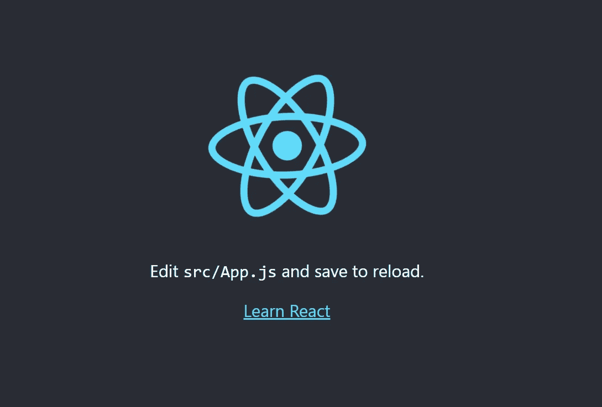
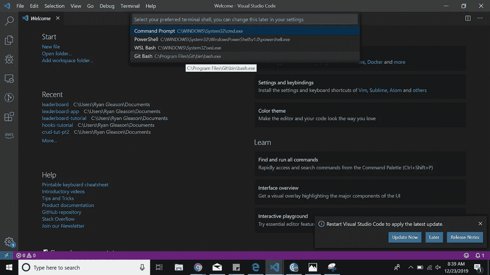
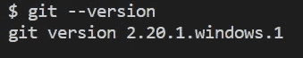

# 我的 React 开发环境设置

> 原文：<https://betterprogramming.pub/my-react-dev-environment-setup-ded7cedb87a>

## 一本入门书，确保您拥有在 React 应用程序开发中取得成功所需的工具



我们的最终产品

目标:在设置本地开发环境后启动一个简单的 React 应用程序。

这些是您将在本教程中安装的工具:

*   Visual Studio 代码(VS 代码):这当然不是创建 React 应用程序的要求，但它是我推荐的文本编辑器。我相信它使软件开发变得更加愉快和高效。
*   Git [Bash](https://www.gnu.org/software/bash/) : Git 是一个非常流行的管理源代码的工具，尤其是当你在一个大型开发团队中工作的时候。VS 代码允许您集成 Git Bash 终端，这使得将您的代码推送到 Git 存储库非常方便。此外，它允许您在模拟 Bash 环境时使用大多数标准的 UNIX 命令。
*   node . js:JavaScript 运行时环境。脸书建议我们在创建 React 应用程序时使用最新版本的 Node.js。
*   npm:节点包管理器。这与 Node 一起使用，以便我们可以轻松地共享打包的代码模块。

# 下载 VS 代码

从 [Visual Studio 代码](https://code.visualstudio.com/)下载稳定的构建版本。

这是一个非常简单的下载。微软在简化这个应用程序的安装过程方面做得很好。

# 在 VS 代码中使用 Git Bash

从 https://git-scm.com/downloads 的[下载适合你的特定操作系统的 Git Bash。](https://git-scm.com/downloads)

当你点击 Git 安装程序时，我建议使用所有默认的安装设置，除非你真的知道你在做什么。

我们现在将 Git Bash 作为集成终端添加到 VS 代码中。

*   在 VS 代码中打开一个新的终端(Ctrl + Shift +`)或者终端→新终端。
*   打开命令选项板(Ctrl + Shift + P)或视图→命令选项板。
*   键入“终端:选择默认外壳”。
*   您应该会看到下面的选项:



*   选择 Git Bash。
*   在终端窗口中选择+按钮。


您应该会看到类似这样的内容。

检查点 *:* 输入下面的命令，确保已经正确安装了 Git。

```
git --version
```



根据您安装的版本，这应该会出现。

# 安装 Node.js

去这个链接下载: [Node.js](https://nodejs.org/en/) 。

我选择了“推荐给大多数用户”选项，然后使用 Node.js 设置中的所有默认设置。

检查点:安装完成后，在命令行中输入:

```
node -v && npm -v
```

它应该是这样的(你的版本可能比我的更新):


如果您成功安装了 Node 和 npm，请跳到下一节。

如果它没有出现在你的 Git Bash 中，不要烦恼！重新启动计算机。

如果这不起作用，请在 PowerShell 中键入相同的命令，或者只在 Windows 命令行中键入，您应该会在那里看到它。

要使用 Git Bash，您需要将它添加到您的路径中。该路径告诉您的操作系统在哪里寻找可执行文件，以响应来自用户的命令。下面是在 Windows 上如何做到这一点:

*   打开“查看高级系统设置”。
*   单击“环境变量”。
*   在系统变量下，选择路径，然后选择编辑按钮。
*   添加这个 C:\Program Files\nodejs\。
*   如果上述文件路径不正确，您可以通过在 Windows 命令行中键入以下命令来轻松找到它:

```
where node
```

*   在检索到节点目录的正确路径并将其添加到 path 系统变量后，选择“确定”。
*   重新启动计算机。

检查点:现在，尝试在 Git Bash 中键入以下命令:

```
node -v && npm -v
```


# 使用 create-react-app 启动您的第一个项目

在命令行中键入以下命令。

```
npx create-react-app hello-world
```

这将需要几分钟时间。

现在，我们将在一个新的 VS 代码窗口中打开项目。

```
cd hello-world && code .
```

上面的命令执行两个命令。我们正在你的新 React 应用中改变目录，然后在 VS 代码中打开它。

现在，打开一个新终端(Ctrl + Shift +` ),键入以下命令启动节点服务器并运行您的应用程序:

```
npm start
```

检查点:当您导航到 localhost:3000:


# 回顾

您已经安装了以下工具，可以开始创建 React 应用程序。

*   VS 代码
*   饭桶狂欢
*   节点. js
*   npm

就是这样！您的开发环境已经设置好了，可以开始了！