# 我在“UIScrollView”上的恶作剧

> 原文：<https://betterprogramming.pub/my-shenanigans-with-scrollview-ffb3a3ee5e37>

## 我发现的一些有趣的事情改变了我的方法

图片由 [Pikrepo](https://www.pikrepo.com/fvsqs/white-scroll-of-paper-on-brown-wooden-surface) 提供

关于`UIScrollView`的一些事情使我不愿意使用它。如果有选择的话，我总是更喜欢在`ScrollView`之上的`TableView`、`CollectionView`或`StackView`。然而，在深入研究之后，我发现我的一些同行开发人员擅长于此。他们试图解释`ScrollView`背后的 ABC。尽管如此，不知何故，我总是以模糊的约束结束。

几个月前，当我在 Xcode 11 中实现`ScrollView`时，我发现了一些有趣的事情，改变了我对它的态度。当把`ScrollView`放到故事板中时，两个东西出现在`ScrollView`下面:`Content Layout Guide`和`Frame Layout Guide`。

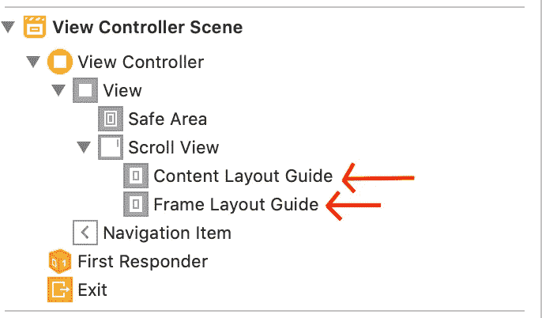

现在，它们到底是什么意思？苹果是这样解释的:

> `Content Layout Guide` ***:*** 基于滚动视图的未翻译内容矩形的布局指南。当您想要创建与滚动视图的内容区域相关的自动布局约束时，请使用此布局指南。— [苹果文件](https://developer.apple.com/documentation/uikit/uiscrollview/2865870-contentlayoutguide)
> 
> "`Frame Layout Guide` *:* 基于滚动视图的未变换框架矩形的布局指南。当您想要创建明确涉及滚动视图本身的框架矩形而不是其内容矩形的自动布局约束时，请使用此布局指南。— [苹果文档](https://developer.apple.com/documentation/uikit/uiscrollview/2865772-framelayoutguide)

现在，如果你不想要这些，我们可以在故事板中删除它们。(不过，我强烈建议你不要这么做。原因？下面我深入解释一下。)移除后，我们可以通过取消选择大小检查器中的内容布局参考线来使用旧方法:

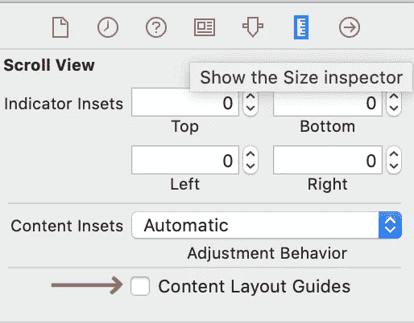

但是相信我，保留这些会有很大的不同。通过这些，苹果在故事板中为我们提供了对`ScrollView`的内容和框架的直接访问，因此我们可以向它的子视图添加约束——这是之前所缺少的。

有了这个新的访问，我们现在可以向`ScrollView`添加子视图，并根据内容或框架进一步为其定义约束。当然，它可以在不同的场景中以多种方式使用，我将解释我实现它的方法之一。

首先，我没有给`ScrollView`中的所有子视图添加约束，而是添加了一个`UIView`作为`ContentView`。(它基本上是一个`UIView`——我只是把它改名为`ContentView`。)这使得添加约束变得容易。

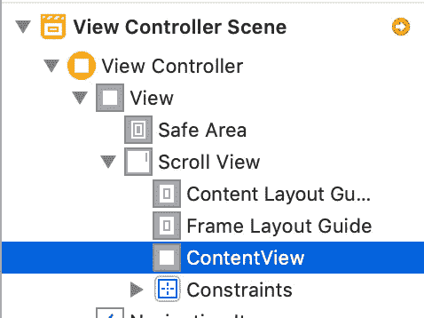

将`ContentView`放入`ScrollView`后，通常我们通过选择添加新约束来添加约束:

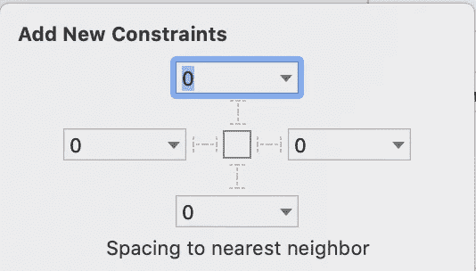

这将向`ScrollView`添加约束，例如`Leading`、`Trailing`、`Top`和`Bottom`，这是我们不需要的。相反，我们将使`ContentView`根据内容和大小可扩展，同时相对于水平或垂直滚动固定在框架上。

坚持住，我保证到最后，你会明白我们为什么这么做。继续前进。

现在，我们必须通过将`ContentView`固定到我们的`Content Layout Guide`来开始添加约束...

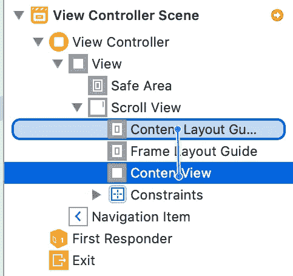

…并添加`Leading`、`Top`、`Trailing`和`Bottom`约束，使此`ContentView`可扩展。

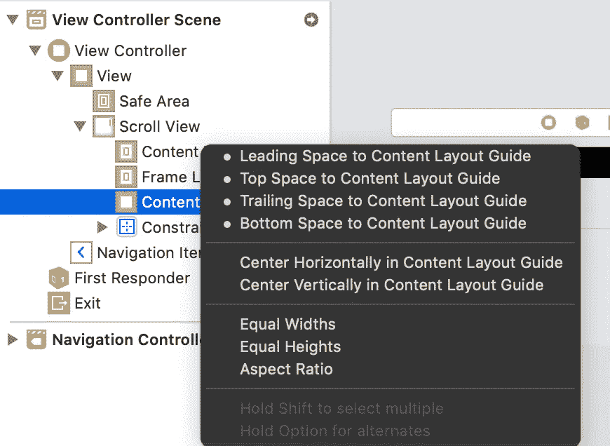

我们访问每个约束的大小检查器并进行更改，如下所示:

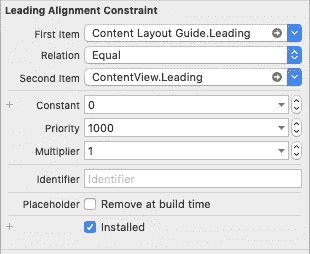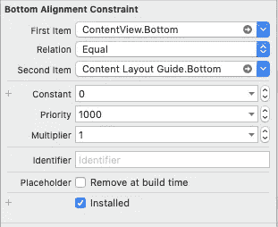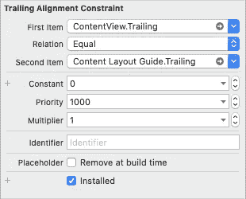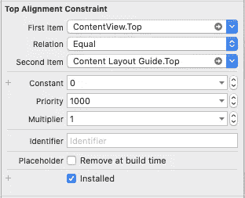

现在，我们必须决定`ContentView`的框架。对于这个场景，我想让`ScrollView`垂直滚动，我通过将`ContentView`固定到`Frame Layout Guide`并增加相等的宽度来实现。

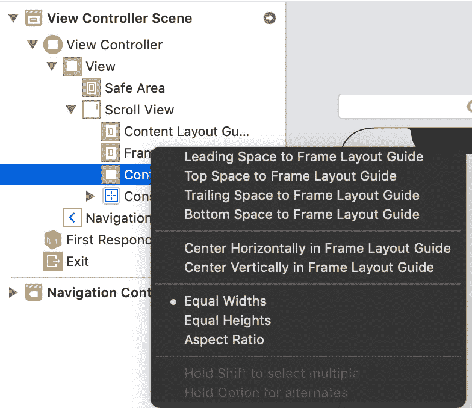

这将根据`ScrollView`的框架固定`ContentView`的宽度。如果我们想固定高度并使宽度可扩展(水平滚动)，那么我们可以将其设置为相等的高度。

在“大小”检查器中操纵宽度约束(垂直滚动)以进行相应的更改:

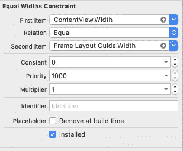

现在，对于最后一步，只需将一个`UILabel`放入`ContentView`中，将行数设置为`0`，并将`Leading`、`Trailing`、`Top`和`Bottom`约束设置为 20。运行应用程序，瞧！我们现在有了一个带标签的合适的`ScrollView`。

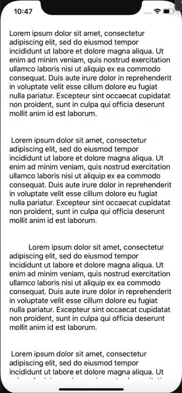

如果你已经走了这么远，感谢你阅读这篇文章，希望这篇文章能让你对这个令人生畏的`ScrollView`有更多的了解。