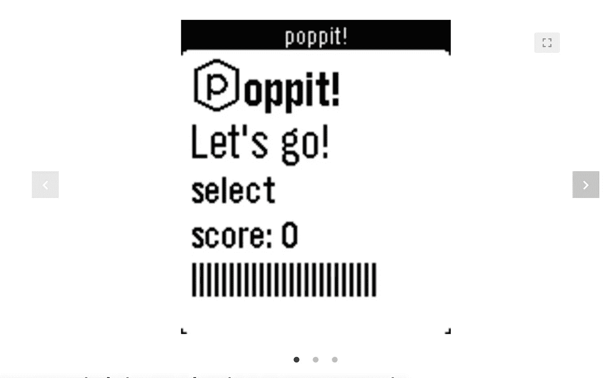
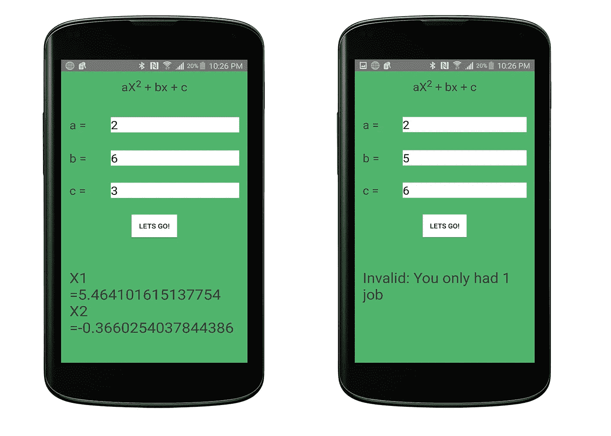
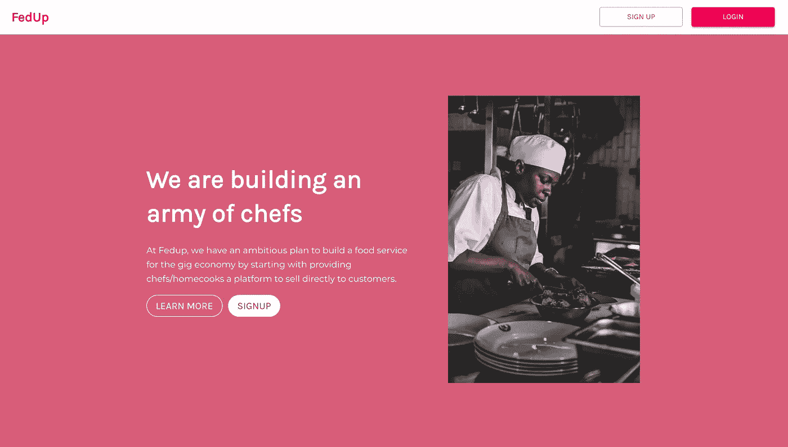

# 我的副业项目驱动的职业生涯回顾

> 原文：<https://betterprogramming.pub/my-side-project-driven-career-journey-in-review-6687af0f8787>

## 看看我的副业背后的故事，学到的教训，以及我如何从中受益

马库斯·温克勒在 [Unsplash](https://unsplash.com/s/photos/project?utm_source=unsplash&utm_medium=referral&utm_content=creditCopyText) 上的照片

做兼职项目是练习和学习新技能的好方法。有很多文章都是关于做副业的好处的。在这篇文章中，我将采取不同的方法。我将深入探讨我从事的几个副业项目，以及它们所带来的技能和机会。希望你们中的一些人能感同身受，得到启发，或者得到娱乐。

# Poppit (2013 年)

[Poppit](https://devpost.com/software/poppit-n2l58) 是我第一次在黑客马拉松上尝试构建东西。这是一款针对 Pebble 手表的游戏，用户必须在特定时间内按下按钮才能前进。

## 背景

当我开始上大学的时候，我不知道什么是编程。我所拥有的只是我的好奇心、毅力(当然，还有帅气的外表)。我一直在寻找练习技巧的方法。然后有一天我在一个[大联盟黑客](http://mlh.io)脸书小组里看到一个帖子，关于一辆巴士去加拿大参加[黑客北方](https://hackthenorth.com/)加拿大最大的黑客马拉松。我甚至不知道什么是黑客马拉松，但我准备尝试一下。他们让我注意到了“免费食物和赠品”

在去黑客马拉松的路上，我遇到了很多聪明的孩子，他们有着有趣的想法和令人印象深刻的兼职项目组合。我感觉自己坐在一辆载满年轻科技首席技术官和首席执行官的巴士上。经过几次讨论后，很明显，这些孩子看起来很聪明，因为他们已经从黑客马拉松中获得了大量的实践，并在兼职项目中工作。

在黑客马拉松上，我和一群在公车上遇到的孩子组成了一个团队。我们决定为 Pebble 智能手表开发一款游戏，因为它在当时很受欢迎。(这是在苹果和安卓手表热卖之前，小朋友们！)我们用的 SDK 是 JavaScript 里的。当时，我唯一知道的语言是 Java，但是在 Pebble 的一些工程师的指导下，我们能够完成它。我们能够按时提交我们的项目，并演示给[山姆·奥特曼](https://twitter.com/sama?s=20)。

我们在这次黑客马拉松中没有赢得任何奖项，但这是我人生中的一个关键时刻。我体验了为乐趣而建造的感觉，并找到了一种我会用余生去追逐的快感。

## 结果

*   我交了很多朋友，这些朋友激励我提高自己的技能。
*   我学会了如何使用 JavaScript 和 Pebble SDK。

# Calctus (2014 年)

Calctus 是一款帮助解决常用数学方程式的安卓应用。

## 背景

在黑客马拉松之后，我在寻找一种方法，用我所知道的东西来建造一些很酷的东西。“Hello World”和命令行应用程序很酷，但我想要一些可以向我的非技术朋友炫耀的东西。当时，我唯一知道的语言是 Java，所以我四处搜索，发现我可以使用 Java 来构建 Android 应用程序。

我最终通过在黑客马拉松上认识的一个朋友发现了树屋。我喜欢教程的风格。这是视频、问题和编码挑战的完美结合。我跟着他们学完了他们的 Android 开发课程。

在整个课程中，我构建了一个故事和一个天气应用程序。我想在不经历的情况下建造一些东西，这就是 Calctus 的由来。这是我为自己开发的一个应用程序，用来解二次方程和其他常见方程。

我没有在 app store 上发布它，但我当时正在上很多数学课，所以我在手机上有它，只要我能，就用它来学习和做作业。我也分享给我的朋友，并根据我收到的反馈进行迭代。

快进几个月后。我面试了沃尔玛的实习生职位。我得到了这份工作，非常高兴。猜猜实习生项目是什么？安卓应用开发！该项目旨在为商场员工打造一款支持语音的应用。

我在语音识别方面做得不多，但我在 Android 开发方面的知识给我的实习生团队带来了巨大的价值。由于我的 Android 开发技能，我们能够很快制作出一个 MVP。我们按时完成了项目，并在一些商店进行了测试，得到了很好的反馈，这导致了大学毕业后的全职职位。

这是我第一次尝到由副业促成的成功。我相信我仍然可以得到全职的角色，但是我从第一个兼职项目中获得的知识使我能够表现出高水平。我非常兴奋，并受到鼓舞去追求更多的副业。

## 结果

*   我学会了如何构建 Android 应用程序。
*   我从这个项目中学到的技能帮助我在实习结束后在沃尔玛找到了一份全职工作。
*   这是一个有趣的项目，当时我很自豪地向我的朋友展示，它帮助我快速完成了数学作业。

# 奢华(2015)

来自 Wayback machine 的【makemeposh.com 截图

POSH 是一项化妆礼宾服务，客户可以方便地为任何场合预约化妆师。

## 背景

我和[纳塔林·努努](https://medium.com/u/973f747777f?source=post_page-----6687af0f8787--------------------------------)一起做《时尚》杂志，她是我们上大学时的化妆师。每次我从演唱会上接她回来，我们都会讨论市场的低效。像大多数自由职业者市场一样，服务提供商和客户之间的知识差距很大。这导致了一些问题，比如客户低估了服务的时间和成本，化妆师没有按时得到报酬，或者客户只是订错了人。

经过几次讨论，我们决定开始为化妆师提供礼宾服务。我们将其命名为豪华，并购买了域名 makemeposh.com。我们的 MVP 基本上是一个[类型的表单](https://www.typeform.com/)，链接到一个登录页面，上面有关于客户想要什么和预订信息的问题。我们的承诺是，我们会根据您的需求，为您提供您所在地区最好的化妆师。

我们被预订了更多的演出，从时装秀和摄影到婚礼派对，还有那些想打扮得漂漂亮亮去约会的人。这是一项非常精简的业务，在短时间内实现了正现金流。

我在公交车上认识的一个来自 Hack the North 的朋友向我们介绍了 [Startup Shell](https://startupshell.org/) ，这是马里兰大学的一个学生运营的孵化器。我们申请了，并在介绍了我们的登陆页面后进入了孵化器。

在孵化器里，我们得到了很好的指导和很酷的资源列表来推动我们的项目。除了发展我们的项目，我们还建立了许多良好的关系，这些关系至今对我的职业生涯有益。我还从大学的工作中获得了一份工作，为 IT 支持呼叫中心的员工建立一个调度系统。唯一让他们有信心雇佣我的是我之前的兼职项目。

## 结果

*   我赚了一点钱——不是很多，但是知道有人愿意为我建立的服务付费是令人兴奋的。
*   我学会了如何与用户打交道，并能够应用我在大学课堂上学到的一些设计思维原则。
*   通过这个项目，我得到了一份工作，帮助 UMD IT 部门的员工建立一个排班系统。

# Compair (2017 年)

Compair 是一款比较亚马逊和沃尔玛价格的网络应用。

## 背景

我与伊萨亚斯和安多姆一起工作。我们基本上建立了一个 web 应用程序来搜索沃尔玛和亚马逊的产品。这是一个文字比较游戏，因为我们想建立一个简单的方法来比较两个市场的价格。我们并没有打算将它商业化。我们刚刚听说了 React，并利用这个辅助项目来学习和实践我们的 React 技能。

该搜索由亚马逊和沃尔玛的公共 API 提供支持。我当时 JavaScript 不是很强，但是这个项目让我爱上了 JavaScript。与我在日常工作中编写的冗长的 Springboot Java 应用程序相比，JavaScript 有趣多了。

这个项目让我在 JavaScript、React 和 NodeJS 方面变得更加强大。这为我其他的兼职项目奠定了基础。我们还能够利用从这个项目中学到的技能获得一份自由职业合同。

## 结果

*   与[伊萨亚斯和安多姆](https://medium.com/u/284e548ac5e4?source=post_page-----6687af0f8787--------------------------------)一起工作很开心。
*   我爱上了 React，它成了我最喜欢的前端框架之一。
*   Esayas 和我利用在 Compair 上获得的技能从事自由职业。

# Fedup.co(2019 年)

fedup.co 截图

[Emmanuella Aninye](https://medium.com/u/6a8ef2c7cb61?source=post_page-----6687af0f8787--------------------------------) 当我们意识到家庭厨师和厨师在 Instagram 上直接销售食物的激增时，我看到了餐饮服务软件的缺口。要点菜，你必须给他们发一份 DM，根据厨师的不同，这个过程会变得非常冗长。

通过 [Fedup](https://fedup.co/) ，厨师们可以创建一个账户，设置一个带图片的菜单，并与客户分享点餐链接。这使得顾客点餐和厨师在一个地方管理他们的订单变得很容易。

经过几个深夜，使用[Mom 测试](http://momtestbook.com/)的用户研究，以及[创业学校](https://www.startupschool.org/)的课程，我们部署了我们的 MVP。由于艾曼纽拉·阿尼耶领导的积极的 Instagram DM 活动，我们很快就有了一些用户。我们从厨师那里得到的反馈大多是正面的。他们非常兴奋，他们很惊讶我们免费提供这项服务。

老实说，我们只是想更快地得到我们的非洲食物。我们目前在全国有超过 90 名厨师使用 Fedup 接受订单，并努力将该平台扩展到一个合法的食品市场，用户可以在那里找到他们所在地区的美味家常菜。即使不在你的区域，也有厨师愿意出货。

## 结果

*   我们在烹饪行业交了很多好朋友。
*   我们学到了很多关于收集用户反馈和做用户研究的知识。
*   我们很高兴被邀请参加烹饪活动，与厨师互动。
*   我在构建 GraphQL APIs 和使用 React 方面变得更好，并且我从这些知识中获得了一份工作，尽管我从未在专业上使用过这些技能。

# 结论

兼职项目是提高你的技能、赚点外快或搔搔痒的好方法。不是每个人都有机会做兼职项目，但是如果你有，不要站在泳池边想水是不是很好，投入进去吧！

我希望我的故事对那些对兼职项目犹豫不决的人有所帮助。

感谢阅读！