# 我的 12 大 Web 工具让开发者的生活更轻松

> 原文：<https://betterprogramming.pub/my-top-12-web-tools-to-make-developers-life-easier-a8794be85d7f>

## JWT、EpochConverter、freepik 等等

杰夫·霍普在 [Unsplash](https://unsplash.com?utm_source=medium&utm_medium=referral) 拍摄的照片

在这个互联网时代，几乎任何免费工具都可以在网上找到，解决开发者每天面临的常见问题。你说出它的名字，有人已经建造了它。

在这个故事中，我将分享我最喜欢的 12 个 web 工具，它们让您的开发生活变得更加轻松。我只关注网站，因为它们不需要安装就可以使用。我的偏好是:

*   出现在谷歌搜索结果的顶部。
*   拥有干净直观的用户界面。
*   提供有用的信息。

# 1.正则表达式

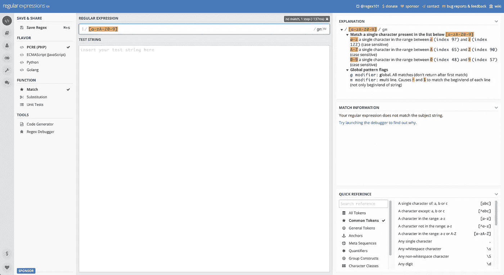

[https://regex101.com/](https://regex101.com/)

正则表达式(regex)是验证用户输入、替换单词或符号以及以特定模式提取信息的最佳方式之一。不经过测试和验证，一次性正确编写复杂的正则表达式并不容易。这就是正则表达式 101 的用处。

即使您不熟悉 regex，这个工具也能清楚地解释每个标记、限定符和标志。该工具不仅显示了输入字符串的哪些部分与您的正则表达式匹配，还告诉您正则表达式中每个部分的含义。用得越多，学得越多。

# 2.Crontab

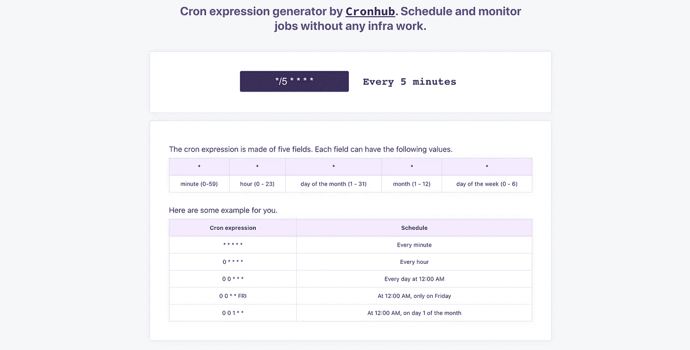

[https://crontab.cronhub.io/](https://crontab.cronhub.io/)

在后端，您可以通过定义一个 cron 表达式来安排一个作业以特定的时间间隔重复运行。Cron express 由五个或六个字段组成，这取决于它运行的框架或操作系统。比如一辆 cron 快车长这样`0 0/10 * * * *`，可以解释为每十分钟**。**

虽然 cron 表达式并不是最难读或写的东西，但是如果你不熟悉它，你需要一个像 **crontab.cronhub.io** 这样的工具来帮助你阅读其他开发人员编写的 cron 表达式并验证你自己的表达式。该网站支持五个和六个字段。

# 3.EpochConverter

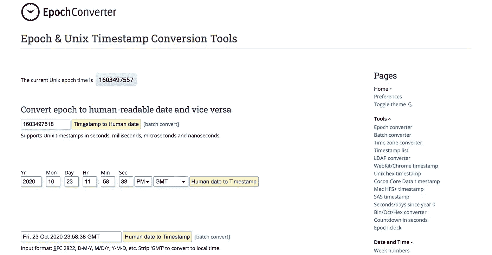

[https://www.epochconverter.com/](https://www.epochconverter.com/)

能不能快速分辨这个时间戳 1603497518 是过去还是未来？是秒还是毫秒？ **EpochConverter** 将 Unix 时间戳转换为人类可读的日期时间，反之亦然。

最棒的是，它支持秒、毫秒、微秒，甚至纳秒，并告诉你它是什么，所以你不必猜测你粘贴到框中的值。

# 4.URL 编码器

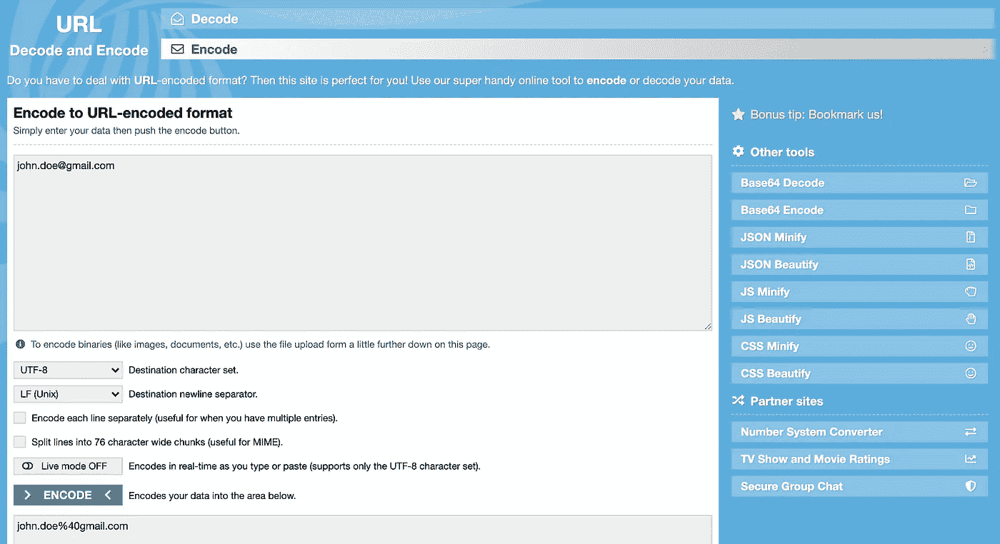

【https://www.urlencoder.org/ 

**URL 解码和编码器**允许你解码和编码 URL 中使用的字符串。通常，在测试一些 API 时，您需要这个工具来编码一个查询参数以转义特殊字符。

# 5.JWT

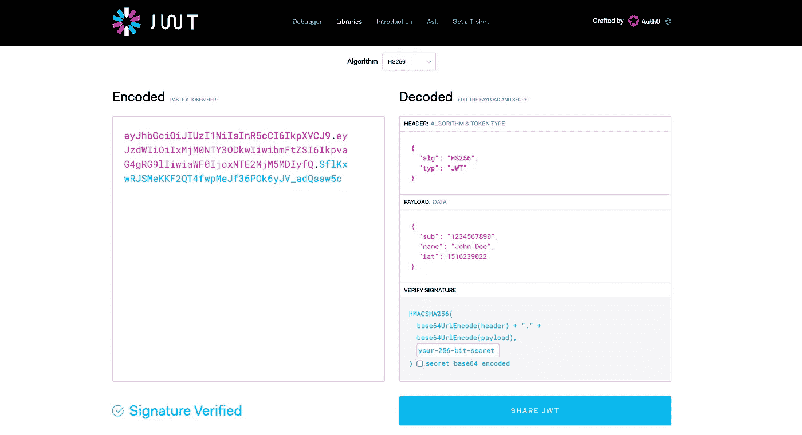

[https://jwt.io/](https://jwt.io/)

JSON web 令牌通常用于身份验证，以提供安全的 API 调用，而不必每次都将用户名和密码传递到请求中。如果您不熟悉 JSON web 标记，理解它们的最佳方式是查看解码后的内容。

**JWT。IO** 允许您解码、验证和生成 JWT。它将您的令牌分割成三个部分，并分别显示它们的有效负载。您可以使用它通过检查`iat`和`exp`时间戳来调试令牌，这样您就可以知道令牌是何时发出的以及它是否过期。

# 6.JSON 格式器和验证器

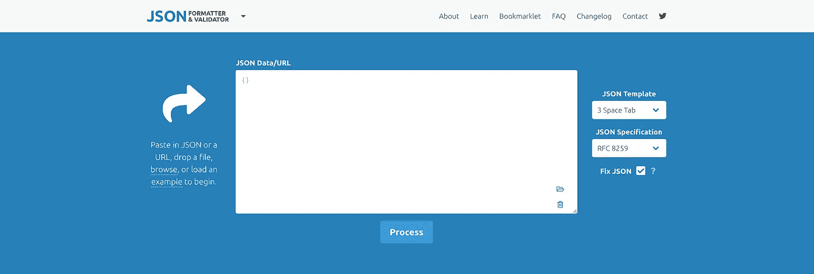

[https://jsonformatter.curiousconcept.com/](https://jsonformatter.curiousconcept.com/)

不管是在后端还是前端工作，你通常会在一堆无格式的 JSON 中看到对象或日志，无论是来自 logs 还是 Chrome network inspect。

你要做的第一件事就是把它格式化，以便于阅读。 **JSON 格式化器&验证器**允许你用不同类型的间距美化 JSON。它还能够修复字符串化 JSON 中的小错误，比如尾随逗号或缺少引号。

# 7.文字对比！

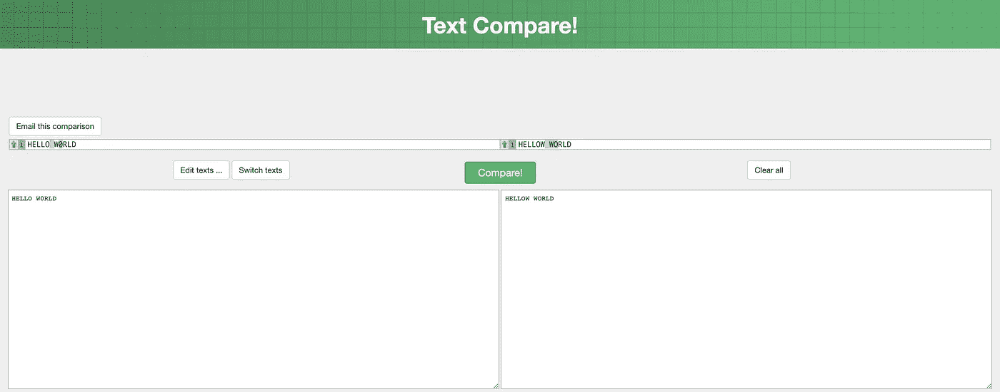

[https://text-compare.com/](https://text-compare.com/)

Github 提供了两次提交之间的并行比较视图，但有时您需要比较来自两个完全不同来源的代码。用肉眼一行一行找差异太繁琐了。

**文字对比！**提供两个文本块之间的并排比较视图。它突出了不同的部分。不仅仅是为了代码。你可以请别人来编辑你写的文章，然后你就可以用这个工具很容易地浏览编辑过的部分。

# 8.扁平图标

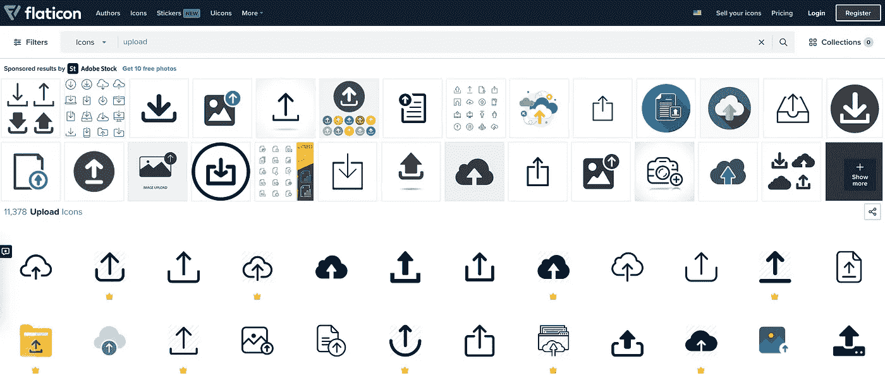

[https://www.flaticon.com/](https://www.flaticon.com/)

通常，设计师的工作是为前端 UI 寻找或创建资产。如果你非要脱下开发者的帽子，戴上设计师的帽子， **Flaticon** 是最好的网站，为你提供不同大小、不同格式(PNG 和 SVG)的免费图标。

如果你使用本网站的任何图标，请务必在你作品的某处注明作者。

如果你不确定哪个图标用于哪个动作，只需在搜索框中输入动作词。对于简单的图标，可以直接在网站上改变颜色，下载后不需要安装任何软件来改变颜色。

值得一提的是 https://ionic.io/ionicons 的**，一套用于网络、iOS、Android 和桌面应用的开源图标。**

# **9.弗里皮克**

**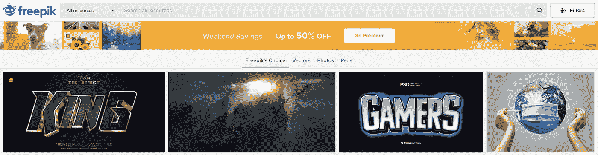**

**[https://www.freepik.com/](https://www.freepik.com/)**

**类似于 Flaticon， **freepik** 提供了一系列免费图片，你可以用在你的前端。再次，确保给作者适当的信任。您下载的图像是 zip 格式，其中可能包含可以在 Adobe Illustrator 中编辑的 eps 格式。**

**如果你在讲故事或入职时需要资产，我强烈建议你去 https://www.freepik.com/stories[或 https://storyset.com/](https://www.freepik.com/stories)[看看。](https://storyset.com/)**

****

**[https://www.freepik.com/stories](https://www.freepik.com/stories)**

# **10.说出那种颜色**

**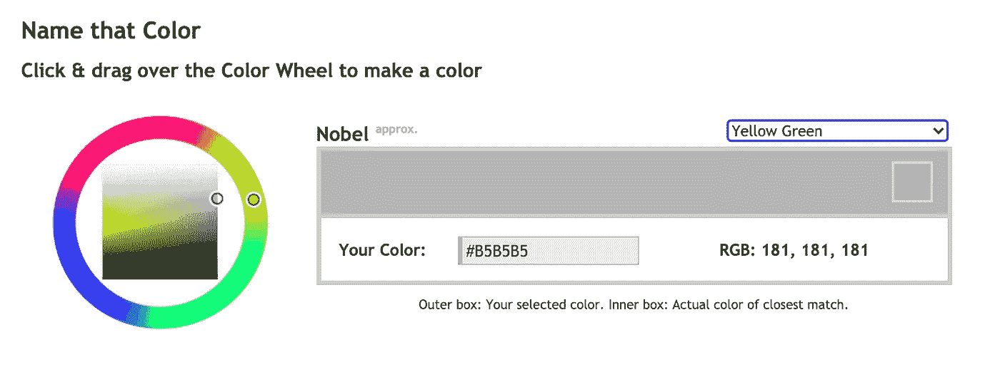**

**[https://chir.ag/projects/name-that-color/](https://chir.ag/projects/name-that-color/)**

**如果说命名变量是编程中最难的事情，那么命名颜色可能是第二难的事情。你通常如何命名你的颜色资产中的 50 种灰色？**

*   **灰色、浅灰色、浅灰色、深灰色、深灰色**
*   **灰色-100，灰色-300，灰色-500，灰色-700，灰色-900**
*   **背景灰色、阴影灰色、文本灰色、边框灰色**

**如果在你已经有的名字之间又有了一个新的灰色调，那该怎么办？如果你不想自己给颜色命名，为什么不让一个网站给你命名呢？**

****命名颜色**给出与你粘贴到十六进制颜色输入域的颜色最接近的名称。对于不同的灰色阴影，现在你有:**

*   **画廊、水星、中音、银色、鸽灰、蝎子、巨石等。**

**等等，是灰色还是灰色？**

# **11.云转换**

**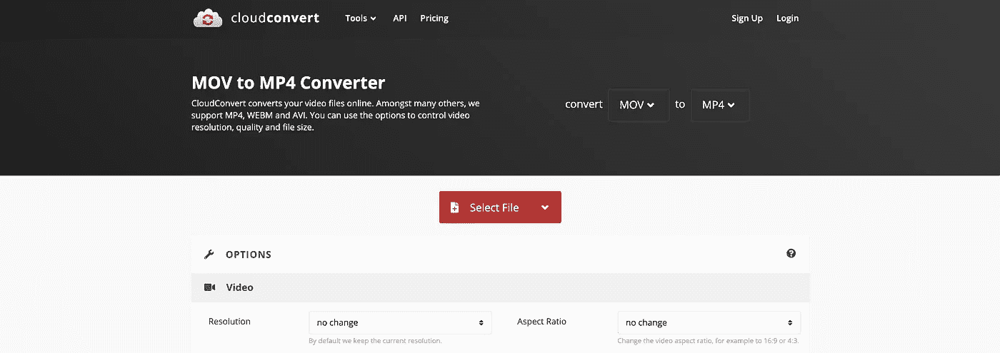**

**[https://cloudconvert.com/](https://cloudconvert.com/)**

**在过去，将视频从一种格式转换成另一种格式并不容易，你必须购买软件并找到合适的编解码器。使用 C **loudConvert** ，您可以选择所有文件扩展名和不同的视频输出选项。**

**如果您想演示您在 pull 请求中创建的一个很酷的动画，您可以使用 C **loudConvert** 将屏幕记录转换为 GIF。在你的 PR 描述下面附上 GIF。你的同事会印象深刻。**

# **12.应用程序图标**

**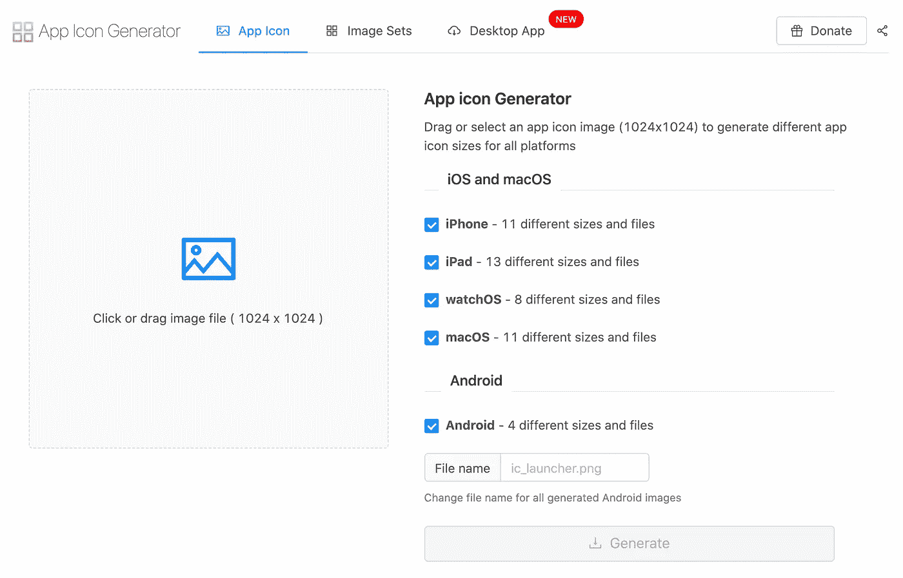**

**【https://appicon.co/ **

**如果你是一名移动开发者，你应该知道 Xcode、Android、App Store 和 Play Store 需要不同大小的应用程序图标，例如 60x60、80x80、120x120、512x512、1024x1024 等。**

**使用 Photoshop 多次调整大小并保存它们的副本是很乏味的。幸运的是 **App 图标生成器**为你简化了繁琐的工作。你需要准备的就是最大的图标图像，1024x1024。**

**对于 Android 你可能不需要这个，因为 Android Studio 有自己的自适应图标生成器。**

# **你能从这里带走什么**

**如果你觉得这些网络工具有用，我准备了以下 HTML，这样你就可以把它导入你的 Chrome 书签管理器了:**

**Chrome 书签**

*   **在 Chrome 上，进入**书签管理器**(MAC 上的⌘⌥B)。**
*   **点击右上角的 **⋮** 图标。**
*   **选择**导入书签**选项。**
*   **从上面的要点中选择你下载的 HTML 文件。**
*   **根据您的喜好重新排列文件夹。**

**所有提到的网络工具在同类中绝对不是独一无二的。你可能知道其他具有相同功能的网站，而且可能更好。还有其他的 VSCode 插件或 Chrome 扩展也可以做同样的事情。欢迎在下面的评论区提出你最喜欢的工具。干杯🍻！**