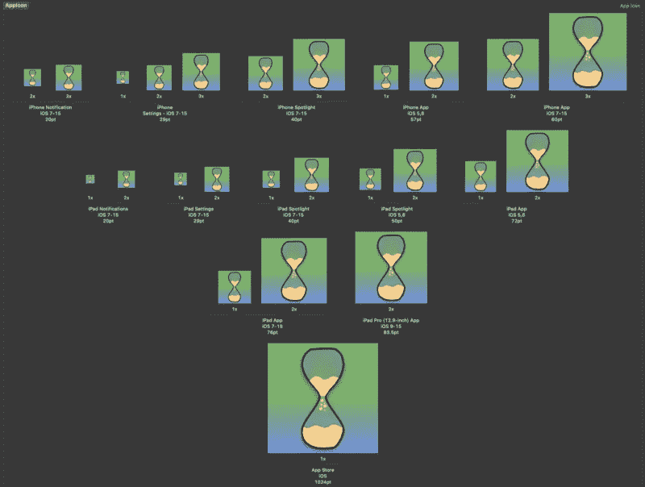
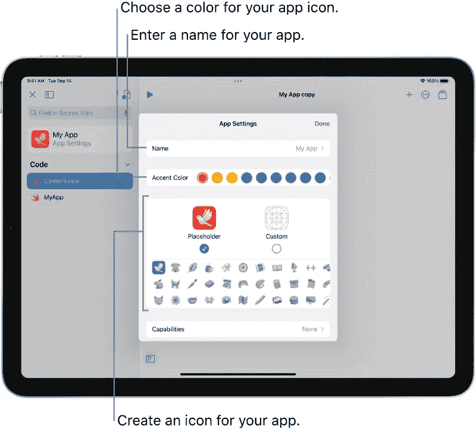
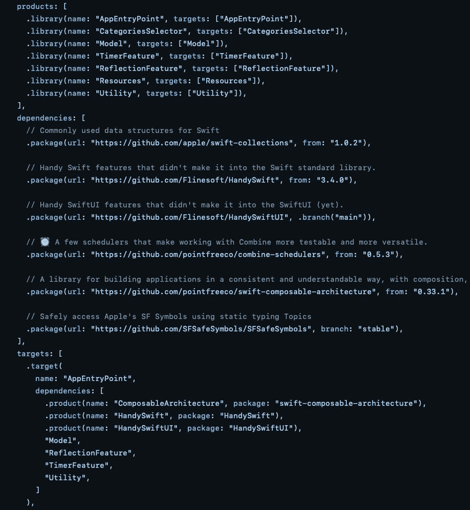
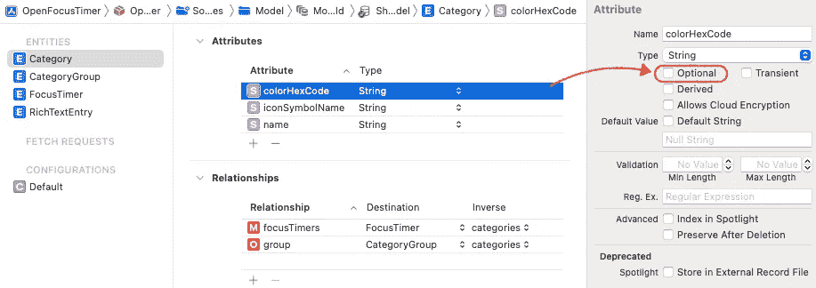

# 我对 WWDC 2022 的三大愿望

> 原文：<https://betterprogramming.pub/my-top-3-wishes-for-wwdc-2022-cdb7ca39e9e7>

## 随着苹果[宣布今年 6 月 6 日至 10 日的](https://www.apple.com/newsroom/2022/04/apples-worldwide-developers-conference-returns-in-its-all-online-format/) WWDC 周，让我们深入了解我希望看到哪些新的框架、API 和工具亮相，以及使用它们的示例感觉如何。


照片由[迈克·阿尼](https://unsplash.com/@mikearney?utm_source=medium&utm_medium=referral)在 [Unsplash](https://unsplash.com?utm_source=medium&utm_medium=referral) 拍摄

每年都有一个非常特殊的时刻，一群特定的人会许下愿望，对各种各样的事情抱有希望。有些人与他人分享他们的愿望，有些人只是把愿望藏在心里，以免未能实现时过于失望。我曾经属于后一类人，但这一次我想分享我的愿望，以提高它们实现的概率——如果今年没有，那么也许明年会有。毕竟，圣诞老人可能在听。

我将跳过几乎所有 iOS 开发者列表中最常见的话题，例如更稳定的 Xcode、更无 bug 的 Swift、更完整的 SwiftUI 或更可靠的 SwiftUI 预览。我们开始吧！

# #3:从一张图片导入各种尺寸的应用图标

## 问题

每个应用程序都需要有一个应用程序图标。Xcode 要求我们提供几十种不同大小的应用程序图标，但不支持调整它们的大小。虽然有许多应用程序和工具可以帮助实现这一目标，但只有少数几个支持最新的尺寸，因为苹果喜欢随着时间的推移添加新的尺寸。这对于刚起步的新开发者来说是不必要的障碍。



我的[自动对焦定时器](https://github.com/FlineDevPublic/OpenFocusTimer)应用的临时应用图标集

## 解决办法

当拖放一个 1024x1024 的图像到`AppIcon`集合或其中的`App Store`条目时，Xcode 会询问我们是否要使用它作为参考图像来生成所有其他大小的图像。同样的情况也可能发生在拖拽 SVG 文件的时候，尽管我已经很满意 1024 倍的大小了。

拖放的一种替代方法是在选择名为“存档时生成大小”的`AppIcon`图像集时，在右侧窗格中选择一个选项，这样您只需提供甚至提交一个大小，Xcode 就会在为某个版本存档时动态生成其他大小。

## 可能性

与 Xcode 5 一起在 2013 年推出。从那以后，他们没有得到太多的爱，所以我怀疑这一天会到来。另一方面，[iPad 上的 Swift Playgrounds](https://support.apple.com/en-gb/guide/playgrounds-ipad/itc8ff20cba7/ipados)似乎确实能够从一张“图片”中生成所有尺寸的图片。虽然这在技术上可能适用于矢量图形，但也许我们会在 Xcode 中看到完全相同的图标生成器？



在 iPad 上的 Swift Playgrounds 中创建应用图标

# # 2:Xcode 中的应用模块化支持

## 问题

在包含大量文件的应用程序目标中工作很简单，但也有缺点，这些文件被分组到文件夹中，以松散地表示属于一起的功能。例如，为了测试出最小的代码变化，您需要构建整个项目。这也带来了 SwiftUI 预览工作不太可靠，或者需要很长时间来显示您的更改。虽然增量构建没那么慢，但实际上你也在其他地方做了更改，然后 Xcode 不得不构建比需要更多的内容。或者你明确地告诉 Xcode 进行一次干净的构建，因为，好吧，不知何故 Xcode 的行为不像预期的那样。

但是构建时间并不是单一目标项目的唯一问题。在一个`main`模块中拥有你的所有类型意味着你可以从任何地方访问所有类型，因为 Swift 默认为`internal`访问级别——这个[不好](https://en.wikipedia.org/wiki/Coupling_(computer_programming))，因为它会使你的代码更难重用和测试。即使你想用较低的访问级别显式地标记你所有的属性&函数，你也不能在你必须从一个其他文件访问它们的时候使用`private`或`fileprivate`——也很容易忘记添加它们。

我个人目前使用的解决方法由来自 Point-Free 的 Stephen 和 Brandon 在视频[中详细解释。虽然它解决了上述两个问题，但手动更新`Package.swift`文件是一个麻烦。看看我的(目前)单屏幕对焦定时器应用程序的清单文件](https://www.pointfree.co/episodes/ep171-modularization-part-1)。



手动模块化应用程序“Package.swift”清单的一小段摘录。

## 解决办法

苹果可以在 Xcode 中提供一个新的 UI，允许为我们的应用程序模块创建包，而不必像上面提到的那样做任何变通。我认为最简单的方法是增加对现有“目标”UI 的支持，但要为 Swift 包增加一个额外的部分，并将 SwiftPM 作为底层技术。此外，每当我引用一个模块中的类型时，Xcode 会警告我正在访问一个不可访问的模块，并询问我是否要将它作为一个依赖项添加到当前模块中。

这甚至可能会让 Xcode 问我们是想创建基于 Xcode 项目的应用程序还是基于 SwiftPM 的应用程序。虽然我不期望(或要求)今年用一个`Package.swift`文件完全替换`.xcodeproj`文件(在 SwiftPM 中还有一些工作[要做，比如添加构建脚本等等。)，我认为至少可以将包的链接迁移到基于 SwiftPM 的基础上。](https://forums.swift.org/c/development/swiftpm/6/l/top)

## 可能性

尽管今年我很想看到，但我认为在 SwiftPM 准备好完全取代`.xcodeproj`文件之前，苹果不会在这个方向上做太多。我认为他们在这个领域“孤注一掷”，所以我对今年不抱什么希望。但也许明年会有一面测试旗可供选择？

# #1:新的 Swift 专用数据库框架

## 问题

核心数据是苹果在 2005 年与 Mac OS X 10.4 Tiger 一起推出的，目的是为开发者提供一个比使用 SQL 指令更好的 API。它很快成为了本地应用程序开发的首选数据库框架，现在依然如此。但它显然是为目标 C 写的。请看这个简单的模型:

注意，所有这些字段在核心数据中都被指定为非可选的[:](https://github.com/FlineDevPublic/OpenFocusTimer/blob/main/Sources/Model/Model.xcdatamodeld/Shared.xcdatamodel/contents)



但无论如何都是作为 Swift 代码中的`Optional`类型生成的。这和整个`NSManagedObjectContext` API 设计感觉相当过时，不太“ [Swifty](https://www.swift.org/about/) ”(比如“不安全”)。是时候来点新鲜的了！

## 解决办法

苹果可以引入一个新的仅支持 Swift 的框架(如`SwiftUI`)，命名为类似`SwiftData`的东西，它提供一个高级 API 来定义和管理持久模型。定义模型可能如下所示:

对于存储在 iCloud 中的模型，您需要在`actor`前面加上`distributed`。通常访问`actor`的任何属性都需要`await`关键字，但是一些神奇的属性包装器可以简化为:

从外部写入一个`actor`属性是不可能的，但是`@Persisted`属性包装器可能有一些`Binding`魔法允许这样做:

我不得不承认，我还没有在实践中使用过演员，所以如果上面的一些例子没有任何意义，请原谅我。但是我有一种感觉，演员可以在安全访问的框架中扮演重要的角色。

此外，Xcode 可以附带一个 UI，使数据模型版本化变得容易，并提供一个图形迁移工具，可以用声明性 Swift 语法编写，并在右侧作为 UML 图预览(像 SwiftUI 预览一样)。但也许我在这里开始梦想太大了…

## 可能性

在过去的两年里，许多人都在期待这一点，因为这是 SwiftUI 之后合乎逻辑的下一步。但是今年，随着 Swift 5.5 中已经发布了 [Actors](https://github.com/apple/swift-evolution/blob/main/proposals/0306-actors.md) ，并且最近刚刚接受了[分布式](https://github.com/apple/swift-evolution/blob/main/proposals/0336-distributed-actor-isolation.md) [Actors](https://github.com/apple/swift-evolution/blob/main/proposals/0344-distributed-actor-runtime.md) (用于 iCloud 支持)，该技术可能会在 9 月份发布第一个版本。

# 结论

苹果会在六月宣布很多事情，以上只是我个人的愿望。但在过去，我总是对至少一两个框架感到惊讶，比如 2019 年的 [SwiftUI](https://developer.apple.com/videos/play/wwdc2019/216/) ，2020 年的 [WidgetKit](https://developer.apple.com/videos/play/wwdc2020/10028/) ，2021 年的 [DocC](https://developer.apple.com/videos/play/wwdc2021/10166/) 。今年会是什么呢？我迫不及待地想知道！

```
**Want to Connect?**You can find me also on 👾 [Twitch](https://www.twitch.tv/Jeehut), 🎬 [YouTube](https://www.youtube.com/channel/UCtg6Ck7oYa_9k1oSTmFGNRw), and 🐦 [Twitter](https://twitter.com/Jeehut).
```