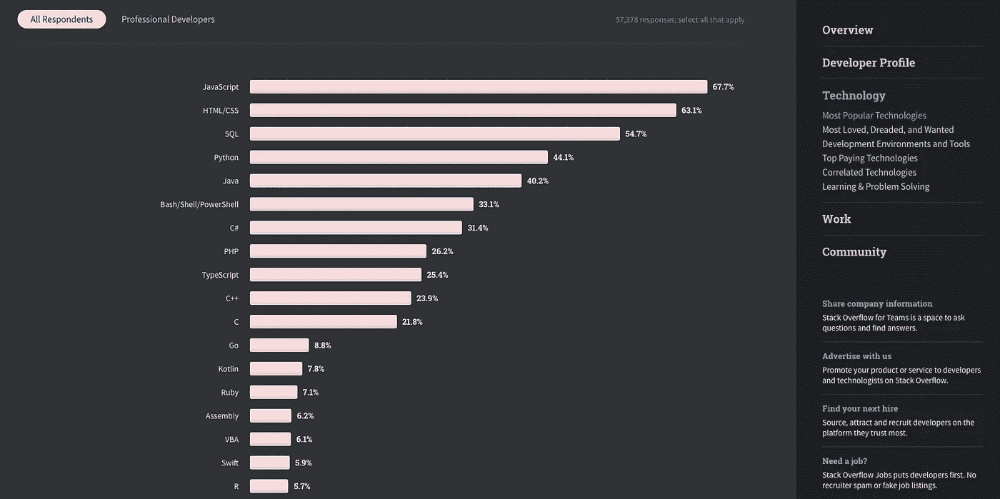
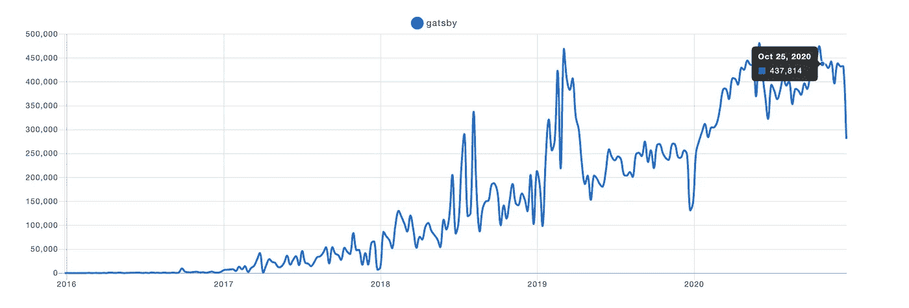
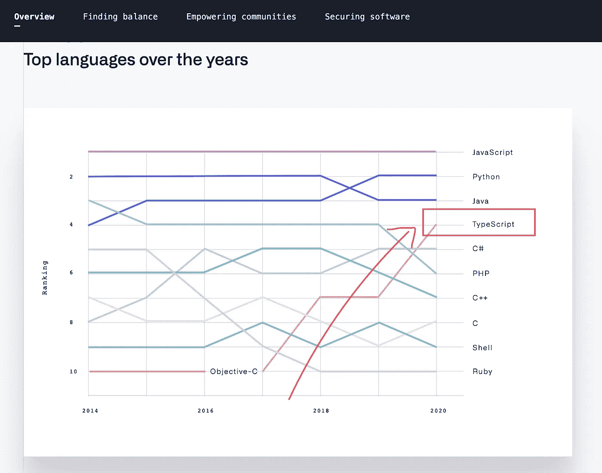
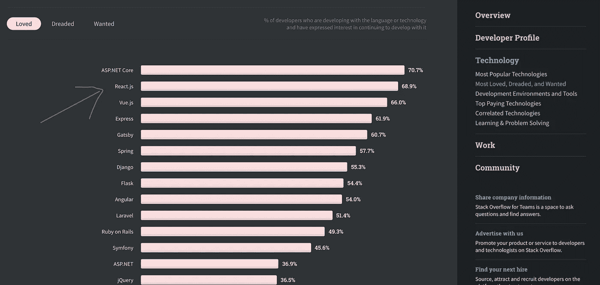
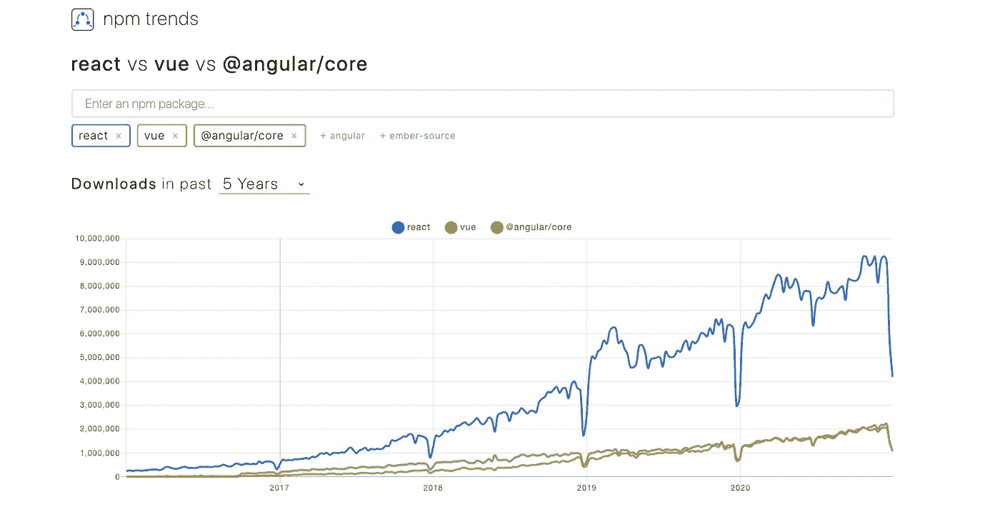
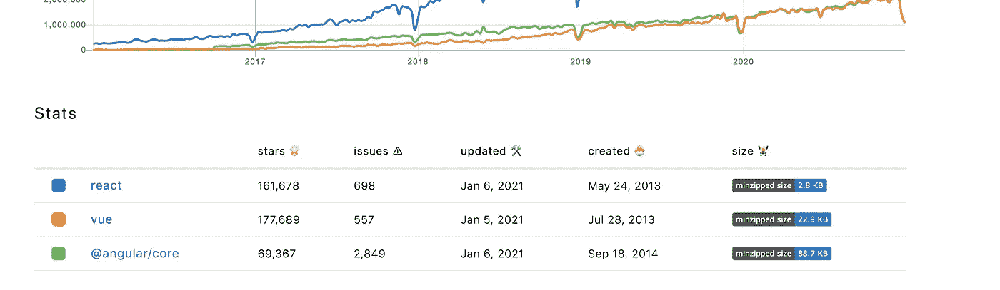
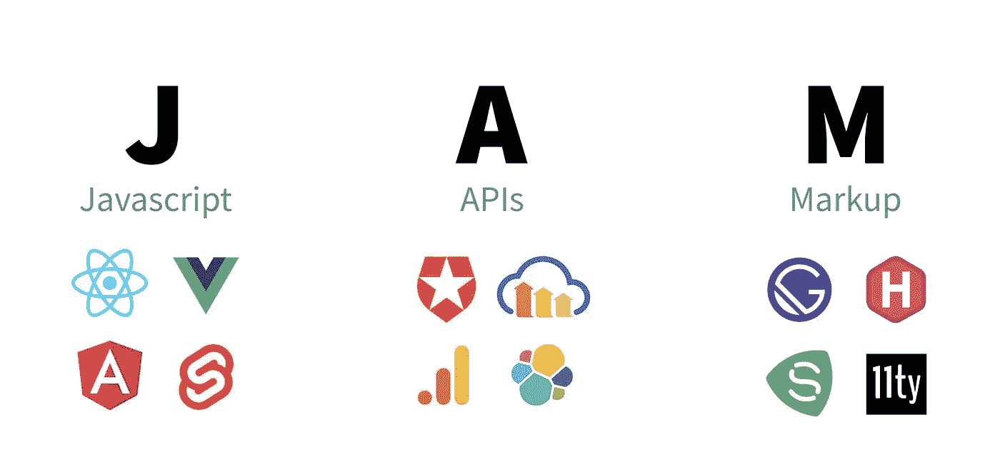
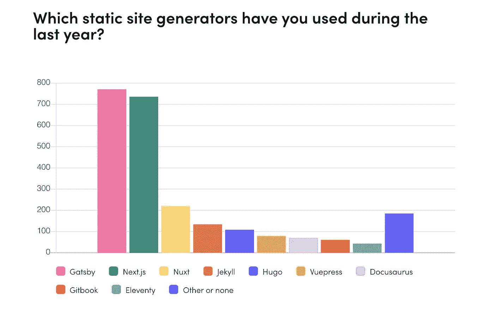

# 我对 2021 年的 6 大前沿趋势和预测

> 原文：<https://betterprogramming.pub/my-top-6-frontend-trends-and-predictions-for-2021-72201e6c9026>

## 关注他们，学习他们，并做好准备

作者照片。

亲爱的读者，新年快乐！我喜欢前端技术。因此，在每一年的年底或年初，提出来年最前沿的趋势和预测已经成为一种传统。

2021 年的机会来了！

这样做的真正目的是让你意识到趋势，并帮助你理解它们将如何在前端领域发挥作用，以及它们将对你的发展旅程和职业生涯产生的影响。

事不宜迟，我们开始吧！

# 这些预测和趋势从何而来？

我不是巫师，我的朋友。我们在这里将要谈论和强调的所有趋势和预测都来自可靠的来源，如[堆栈溢出调查、](https://insights.stackoverflow.com/survey/2020)[JS 状态](https://2019.stateofjs.com/)、[前端状态](https://tsh.io/state-of-frontend/#developers)、我自己的经验以及前端专家的意见。

# 1.JavaScript 将继续其统治地位

鸣谢: [2020 堆栈溢出开发者调查](https://insights.stackoverflow.com/survey/2020#most-popular-technologies)

每一年，JavaScript 都变得越来越强大。根据 [2020 Stack Overflow 开发者调查，](https://insights.stackoverflow.com/survey/2020#most-popular-technologies) JavaScript 已经连续八年成为世界上最广为人知和研究最多的编程语言。

基于这一点，我认为 JavaScript 将在 2021 年保持巅峰状态，并继续统治多年。

这真的很好，因为每天都有越来越多的开发服务需要 JavaScript 技能。这意味着越来越多的工作机会。

因此，它的使用增加了，所以越来越多的人要么刚刚开始使用它，要么更深入地使用它。

## 如何用正确的方法学习它

这里列出了学习它的宝贵资源。尽管它们中的大部分是为那些刚刚起步的人准备的，但是让更有经验的开发人员也看看它们也无妨。

## 书籍和 GitHub 知识库

*   [你还不知道 JS 第二版](https://github.com/getify/You-Dont-Know-JS)
*   [JavaScript:好的部分](https://www.amazon.com/JavaScript-Good-Parts-Douglas-Crockford/dp/0596517742)
*   [雄辩的 Javascript](https://eloquentjavascript.net/)
*   [清理代码 JavaScript](https://github.com/ryanmcdermott/clean-code-javascript)

## 免费 JavaScript 课程

*   [学习 Javascript — Codecademy](https://www.codecademy.com/learn/introduction-to-javascript)
*   [Javascript 要点](https://www.udemy.com/course/javascript-essentials/) — Udemy

# 2.服务器端呈现(SSR)和静态站点生成器(SSG)

盖茨比来自 npmtrends.com 的数据。

随着单页面应用程序(SPAs)的出现，Web 开发发生了永久性的变化。我们见证了他们如何让网络变得更加动态和强大。

然而，水疗有一个很大的局限性。他们不是搜索引擎优化(SEO)的朋友。人们认为它们不能很好地与搜索引擎配合。

这是一个杀手——尤其是涉及到 SEO 的时候。如果你现在想在网上有一个强大的存在，这真的很重要。

搜索引擎优化对所有在线业务至关重要。近年来，我们注意到它对于博客作者、作家、内容创作者等是多么重要。他们渴望利用 SEO。

像 [Next.js](https://nextjs.org/) 和 [Gatsby](https://www.gatsbyjs.com/) 这样的解决方案的创造者看到了这个问题，并采取措施解决它。这就是服务器端呈现(Next.js)和静态站点呈现(Gatsby)出现的地方。

2021 年，Gatsby 和 Next.js 的使用率和受欢迎程度都将继续增长。

话虽如此，我敢打赌，盖茨比将继续其在静态网站渲染领域的统治地位。

这主要是因为它提供了很好的开发者体验。根据 [W3 Techs 技术市场报告(2020 年 5 月)](https://w3techs.com/technologies/report/cm-gatsby)，Gatsby 是增长最快的单一框架。

## 如何学习盖茨比

*   GatsbyJS 官方文档—教程
*   [盖茨比辅导与项目课程](https://www.udemy.com/course/gatsby-tutorial-and-projects-course/)
*   [盖茨比 JS & Shopify:盖茨比电子商务网站【2020】](https://www.udemy.com/course/gatsby-ecommerce-shopify/)

## 如何学习 Next.js

*   [官方文件](https://nextjs.org/learn/basics/create-nextjs-app)
*   [用 React &节点完成 Next.js 漂亮的作品集 App](https://www.udemy.com/course/awesome-nextjs-with-react-and-node-amazing-portfolio-app/)

# 3.打字稿将越来越多地被采用

鸣谢: [GitHub 2020 年十月状态报告](https://octoverse.github.com/)

如果您想编写可读性更强、更清晰、更易维护的代码，您肯定会使用 TypeScript。

TypeScript 带来了面向对象范例的所有功能:接口、类、枚举和泛型，以及对静态类型和模块的支持。

这些就是近年来人们发现 TypeScript 如此强大的主要原因。结果带来了人气和使用量的巨大增长。

根据最新的[堆栈溢出调查](https://insights.stackoverflow.com/survey/2020#most-loved-dreaded-and-wanted)，61.7%的受访者认为 TypeScript 是最受欢迎的编程语言。事实上，它在名单上排在第二位。

这意味着那些人非常有兴趣继续使用它。

此外，在 GitHub 的 2020 年 Octoverse 报告中，你可以清楚地看到 TypeScript 在过去四年中的指数增长。

随着微软成为 TypeScript 背后的老大，我们可以预计它将在 2021 年继续增强其所有功能。

## 如何用正确的方法学习它

*   [打字手册](https://www.typescriptlang.org/docs/handbook/intro.html)(正式文件)
*   [理解打字稿:2021 版](https://www.udemy.com/course/understanding-typescript/)马克西米利安老师
*   [打字稿:完全开发者指南【2020】](https://www.udemy.com/course/typescript-the-complete-developers-guide/)
*   打字稿 3 基础，v2—FrontendMaster.com
*   Brian Holt 著 [Intermediate React，v2](https://frontendmasters.com/courses/intermediate-react-v2/)——(如果你是 React 开发人员或者你只想结合 React + TypeScript)

# 4.React 将继续其霸权

信用:[堆栈溢出调查](https://insights.stackoverflow.com/survey/2020#technology-most-loved-dreaded-and-wanted-web-frameworks-loved2)

毫无疑问，React 将在 2021 年继续其在 JavaScript 框架和库领域的统治地位。

尽管 Vue.js、Svelte 和 Stencil 等下一代反应式框架快速增长和流行，但这种霸权仍将继续。

当然，这些反应式框架的使用有了显著的增长。但如果我们依靠数据，最新的 [Stack Overflow 调查](https://insights.stackoverflow.com/survey/2020#technology-most-loved-dreaded-and-wanted-web-frameworks-loved2)表明 React 是最受欢迎的 web 框架，68.9%的受访者正在使用它或有兴趣在不久的将来使用它。

## NPM 前端框架趋势

信用: [NPM 趋势](https://www.npmtrends.com/react-vs-vue-vs-@angular/core)

正如你在这个 NPM 图表中看到的，React 已经以一种相当大的方式超过了其他框架。数据基本上是过去五年中每个框架的下载次数。

## Vue 的成长。JS 也是势不可挡

信用: [NPM 趋势](https://www.npmtrends.com/react-vs-vue-vs-@angular/core)

尽管 Vue.js 下载量低于 React，但有一点我们一定不能忽视就是 Vue 在撰写本文时所拥有的 GitHub stars 数量。所以也要关注它。

# 5.Jamstack

信用:[免费代码营](https://www.freecodecamp.org/news/what-is-the-jamstack-and-how-do-i-host-my-website-on-it/)

> "建立能提供更好性能的网站和应用程序."— [Jamstack](https://jamstack.org/)

Jamstack 代表 Javascript、API 和标记。

它是一种软件架构，利用前面的元素来构建安全、可伸缩、廉价和高性能的网站和应用程序。

它是 web 开发领域的新生事物。每天，越来越多的开发者和公司使用这种现代高效的方法来构建他们的网站和应用。

根据 Frontend 2020 的[状态，近三分之一的受访者最近建立了 Jamstack 网站或 app。](https://tsh.io/state-of-frontend/#jamstack)

基于此，我确信 Jamstack 架构将在未来几个月内被广泛采用。

此外，下图显示了静态站点生成器的使用趋势:

信用:[前端状态](https://tsh.io/state-of-frontend/#jamstack)

## 如何用正确的方法学习它

*   [学习 Jamstack —官方资源](https://jamstack.org/resources/)
*   [什么是 JAMstack，我该如何开始？](https://www.freecodecamp.org/news/what-is-the-jamstack-and-how-do-i-host-my-website-on-it/)
*   【https://buttercms.com/blog/what-is-jamstack 号

# 6.微前端

微前端是什么鬼？

> "一种架构风格，其中可独立交付的前端应用程序被组合成一个更大的整体."— [马丁·福勒](https://martinfowler.com/articles/micro-frontends.html)

换句话说，把一个网站或 web 应用程序想象成由独立团队拥有的功能组合，这样他们就可以彼此独立地工作。

令人难以置信的是，近年来越来越多的组织使用这种架构风格。

这是美国运通、宜家、Spotify 和星巴克的情况，仅举几例。

## 微前端的一些好处

*   更小、更内聚、更易维护的代码库。
*   更具可扩展性的组织，具有分离的自治团队。
*   弹性网站。即使 JavaScript 失败或尚未执行，您的特性也应该是有用的。

2021 年，它的使用和采用必将在更多的组织中爆发。

## 如何用正确的方法学习它

*   [微前端架构:介绍、设计、技术&技术](https://www.amazon.com/Micro-Frontends-Architecture-Introduction-Techniques/dp/1097927989)
*   [Martin Fowler——这种架构的倡导者](https://martinfowler.com/articles/micro-frontends.html)

# 最后的想法

我真的很喜欢前端的东西，尽管我知道它们在不断变化。眨眼间，越来越多的库和框架出现了。

然而，我们不应该被这些变化淹没。我们应该接受并研究它们，尽我们所能做好准备。

我们也不需要全部消化。这是一个对我们来说最重要的阅读和实践的问题。

感谢阅读！我希望这有所帮助。