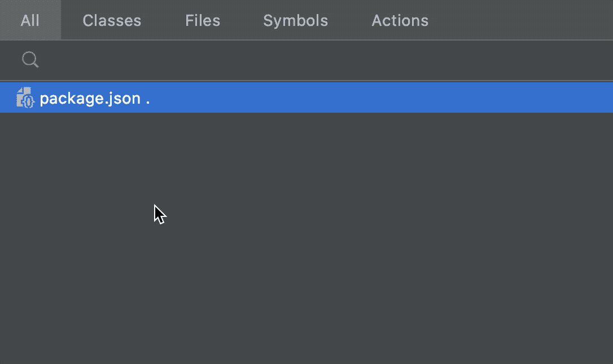
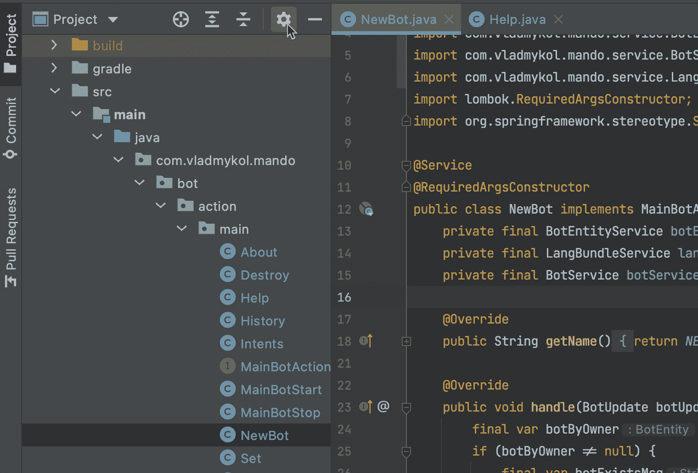
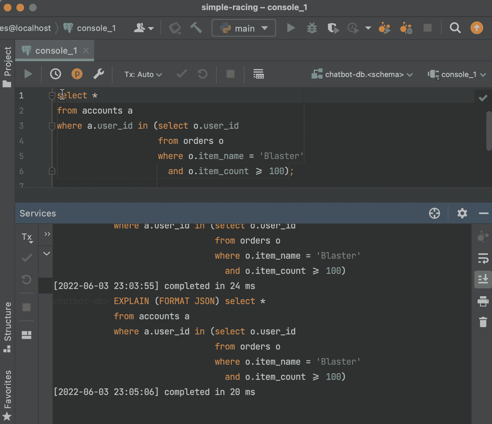
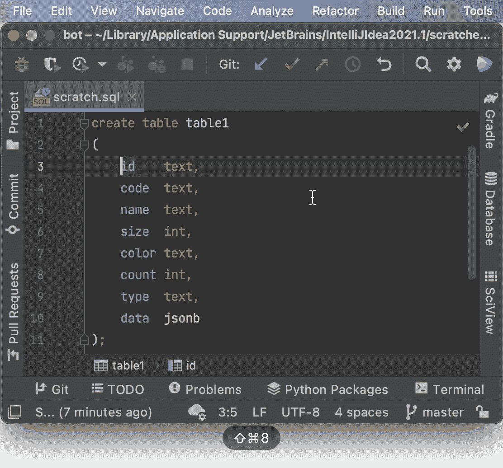
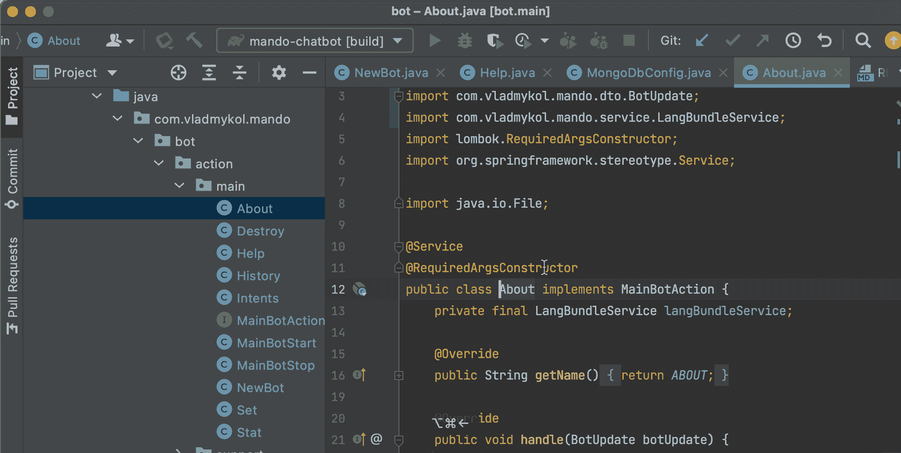
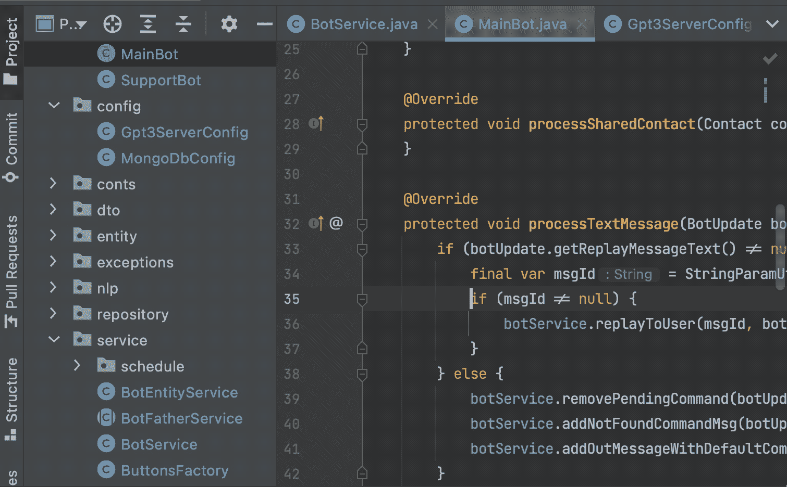
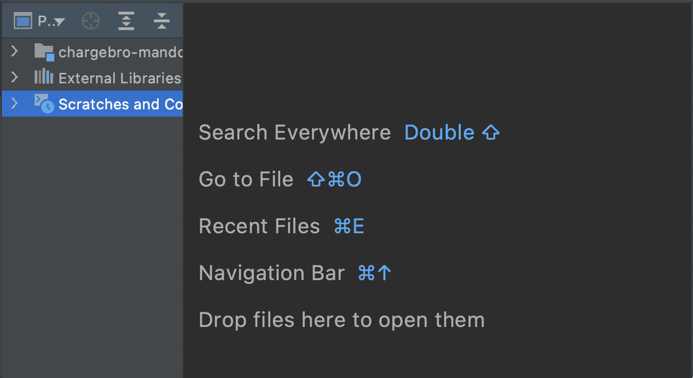

# 我认为最被低估的 7 个 IntelliJ IDEA 特性

> 原文：<https://betterprogramming.pub/my-top-7-most-underrated-intellij-idea-features-572b0b706bd6>

## 多年以后，我仍然会遇到一些新朋友，当他们发现这些功能时，他们会觉得很有趣

作者创造的形象

# 1.找到什么了吗

很难记住每一个组合键并跟踪 IntelliJ IDEA 能做的每一件事。这也是我经常在 IntelliJ IDEA 里面“谷歌”的原因。它帮助我在一个地方找到正确的菜单选项、工具、设置甚至文件。

**⇧Shift+⇧Shift.找到所有**

# 2.知道你在哪里

在我发现这个功能之前，我使用“选择打开的文件”按钮来显示我的项目树中当前编辑的文件。

“选择打开的文件”按钮

现在 IntelliJ IDEA 为我做到了。这不是默认选项，所以您需要为每个新的或现有的项目设置它。

总是选择打开的文件

# 3.SQL 优化

您知道 IDE 中的默认数据库插件不仅仅是一个 SQL executor 吗？考虑到持久层(输入/输出)总是应用程序中最慢的部分，当使用关系数据库时，我总是确保我的 SQL 查询有一个好的[执行计划](https://en.wikipedia.org/wiki/Query_plan)。

SQL 执行计划

# 4.多行编辑

您可能以前在 Sublime 文本编辑器中使用过它，但是现在您不必再使用它了。

多行(列)编辑: **⇧⌘ 8** *(对于 Win/Linux 为 alt+shift+ins)*

老实说，我只使用多行编辑，但还有很多。如果你感兴趣，可以去看看下面这篇文章。

 [## IntelliJ IDEA 13.1 RC 引入了崇高的文本风格多重选择| IntelliJ IDEA 博客

### 提前获取计划的特点今天我们有两条激动人心的消息要告诉您。首先，IntelliJ IDEA 13.1 RC 是…

blog.jetbrains.com](https://blog.jetbrains.com/idea/2014/03/intellij-idea-13-1-rc-introduces-sublime-text-style-multiple-selections/) 

# 5.后退/前进

我真的经常通过点击“后退”或“前进”按钮来导航到我之前去过的地方

后退/前进: **⌥⌘+Left/Right 箭头***(win/Linux 下 ctrl+alt+左/右箭头)*

要打开最近的文件，请按⌘e(*ctrl+e for win/Linux)*)

# 6.书签

我将代码的重要部分标记为书签，以便随时快速跳转到它们。

添加书签: **⌃⇧+ <编号>** *(对于 Win/Linux 为 Ctrl+Shift+ <编号>)*

要转到书签，请按⌃+ <number>*(Ctrl+ <数字>***表示 Win/Linux)。**</number>

*我需要说的是，我不会同时使用 3 个以上的书签，因为那样就很难记住它们是用来做什么的。*

# *7.一个编辑器供所有人使用*

*我曾经打开其他文本编辑器，比如 Visual Studio Code 或 Sublime 来保存部分代码、JSON、XML 等。以便日后参考。它并不是代码库(项目)的一部分，当你试图创建或编辑这样的东西时，IntelliJ IDEA 清楚地说明了这一点。然后我看到我的一个同事在用 Snippets，意识到它有多高明。*

**

*新的代码片段文件: **⇧⌘N** (对于 Win/Linux，*shift+ctrl+n**

*片段在所有项目窗口中可用并同步。我经常用它来格式化我从其他地方得到的一些 JSONs 或 SQL，以便更接近它。*

# *我的秘方*

*即使是现在，IntelliJ IDE 也会定期更新，所以通常情况下，很难跟上这种变化。这就是为什么我强烈推荐不时阅读这类文章，从某个领域的其他专家那里学到一些有用的东西。*

*蛋糕上的一颗樱桃和一个节省我每天打字时间的特性是:*

> *[Tabnine](https://plugins.jetbrains.com/plugin/12798-tabnine-ai-code-completion-js-java-python-ts-rust-go-php--more) —基于人工智能的 Intelijii IDEA 代码编译插件*

*现在，它是免费的，每个月有相当长的一段时间是免费的，前面没有订阅，但是快点，我不认为它会持续很久。*

*布里尔。如果你读到这里，你会是一个真正好奇的读者。现在拍拍自己的背，下一轮见。*