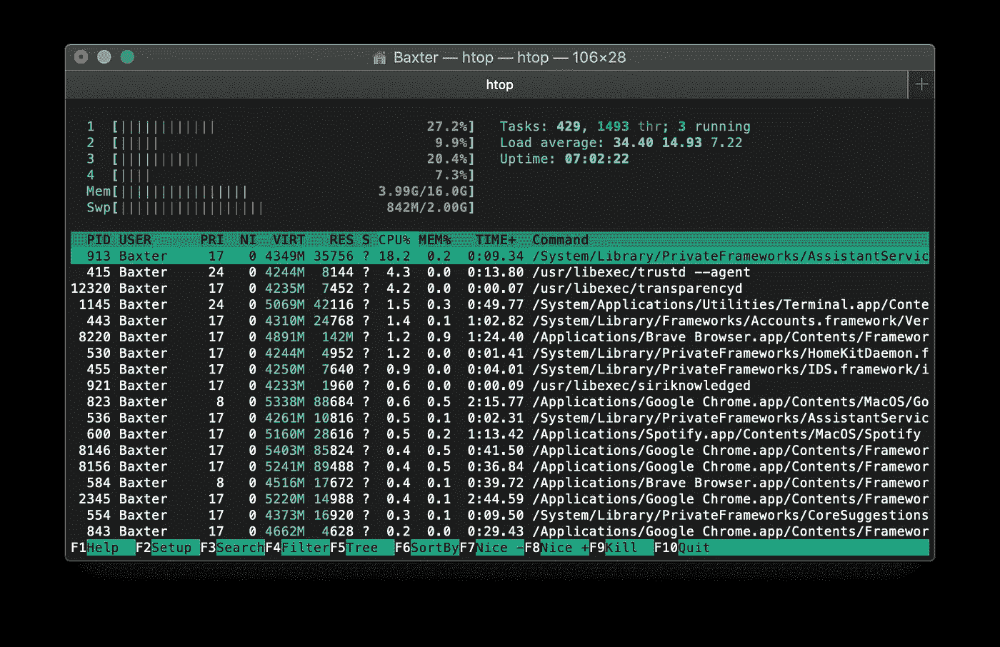
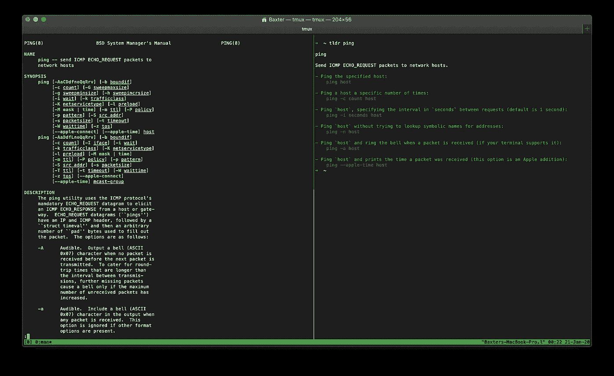
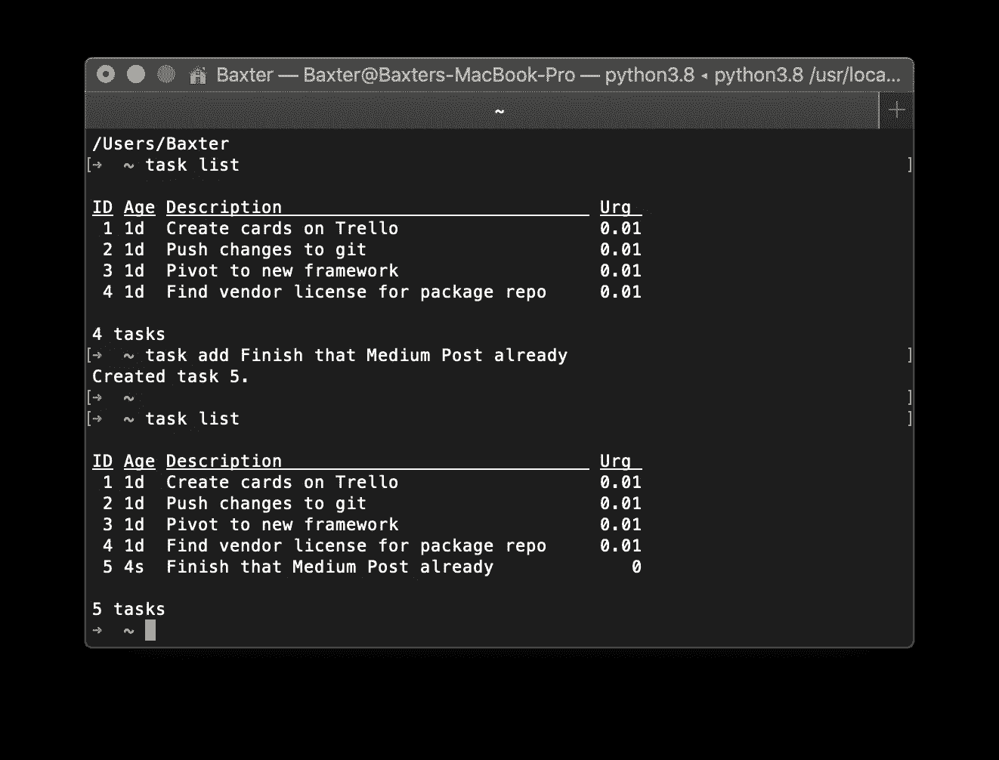
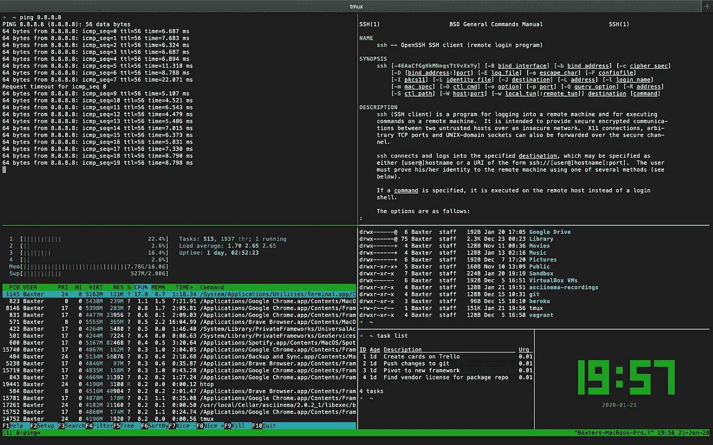

# 2020 年我最喜欢的自制软件包

> 原文：<https://betterprogramming.pub/my-top-homebrew-packages-for-2020-b6565d46de85>

## 成为超级用户，提高您的工作效率

家酿…或者有人称之为苹果酒

[*更新:我的 2020 年顶级自制软件包第二部分可以在这里找到！*](https://medium.com/better-programming/my-top-homebrew-packages-for-2020-part-2-8fbe66949701)

我喜欢并继续坚持使用 macOS 的主要原因之一是因为它是基于 Unix 的。在 Unix 上运行 macOS 使得向 Linux 的过渡更加无缝，我也发现 Unix 文件系统比 Windows 和 PowerShell 更加直观。

也就是说，macOS 版本的 Unix (Darwin)并非没有缺陷。例如，包管理器到底在哪里？

嗯，这就是自制软件的用武之地，但是在我们进入那个兔子洞之前，让我们先来看一下软件包管理器入门 101。

# 什么是包管理器？我应该用一个吗？

如果您是 macOS 或软件开发的新手，您可能想知道什么是包管理器，它的目的是什么。软件包管理器允许用户自动执行从系统安装、升级、配置和删除计算机程序的过程。

我估计 95%的 Mac 用户都不需要使用软件包管理器，甚至不关心他们在工作站上安装应用程序的速度。但是当你是一个拥有 500 个端点并且没有 MDM 的学区的管理员时(想想 JAMF)，像家酿这样的东西就真的派上用场了。

在终端上安装 Homebrew 允许您安装 CLI 工具。一旦您添加了`cask`扩展，您还能够通过 CLI 执行日常用户应用程序，使 onboarding/offboarding 和工作站配置像在终端中的几个命令一样简单。

你可以通过访问他们的主页了解更多关于家酿啤酒的信息。

让我们从我最喜欢的包开始。

# htop

`htop` 是一个交互式的系统监视器、流程查看器和流程管理器。如果你曾经在 Ubuntu 服务器上工作过，你应该对此很熟悉。Mac 只配有`top`。

基本上，它显示了计算机上运行的进程的频繁更新列表，通常按 CPU 使用量排序。使`htop`比标准`top`更好的是先进的 GUI，它使浏览过程变得直观和简单，并告诉你有多少内核，它们的负载是多少，以及它有多少内存。

# tldr

`tldr` 是普通 Unix 手册页的简化和社区驱动版本，开门见山。`Tldr`保留了许多标准手册页中多余的内容，并输出您可能正在寻找的命令。

普通手册页和 tldr 之间的区别显而易见

不过，给聪明人的忠告是，如果我是编码新手，我不会依赖`tldr`。如果你玩过黑暗灵魂，就把它当成其他玩家死时留下的信息。大部分都是有帮助的和正确的，但也有一些陈旧或奇怪的笔记。

# japan quarterly 日本季刊

`jq`是一个轻量级、灵活的命令行 JSON 处理器。如果您是一个命令行爱好者，或者发现自己在使用 API 而没有使用过 jq，那么您已经错过了。Jq 类似于 sed，但用于 JSON 数据。这意味着您可以使用它像 awk、sed 和 grep 一样轻松地对结构化数据进行切片、过滤、映射和转换。它对于解析大型 API 负载特别有用。

jq 对于 API 来说是强大、简单和伟大的

上面的 gif 是一个简单而强大的`jq`的例子，它将一个巨大的 JSON 数据负载从一个巨大的 iOS 照片元数据 blob 解析成一个清晰易读的输出。

# ncdu

`ncdu`是一个用于 Unix 系统的磁盘工具。它的名字指的是它与 du 实用程序相似的用途，但是`ncdu`在`[n]curses`编程库下使用基于文本的用户界面。用户可以使用箭头键浏览列表，并通过按“d”键删除占用过多空间的文件。

# 任务战士

`taskwarrior`是一个开源、跨平台、时间和任务管理工具。或者简而言之，为命令行构建的 TODO 列表。

作为一个命令行待办事项列表管理器，Taskwarrior 维护您通过命令管理的任务列表，允许您操作任务并按优先级、日期或项目进行组织。

尽可能使用命令行

有人可能会问*“既然已经有了具有易用图形用户界面和云同步功能的桌面版本，为什么还要麻烦地使用所有这些 CLI 工具？”*

看起来我想看起来像一个“leet 黑客”,因为我想整天盯着一个有绿色文本的黑色终端，但事实是，在终端内工作并使用基于 CLI 的工具使我的生产率在去年提高了十倍。这很大程度上与`tmux`有关。

# tmux

`tmux`是用于类 Unix 操作系统的终端多路复用器。想想 Visual Studio 代码，但严格地说是在 CLI 中。它允许在一个窗口中同时访问多个终端会话。这对于同时运行多个命令行程序非常有用。

在下面的截图中，我在一个终端窗口中运行了`ping`、`htop`、`man`、`ls`、`taskmanager`和`tty-clock`，这是一个临时定制的命令行 IDE。

如果您在服务器上工作并且缺少 IDE，tmux 可能是一个有价值的工具。

能够在一个窗口中运行我的命令行实用程序使我无需使用桌面应用程序就能集中精力。使用桌面应用程序是生产力的死亡(至少对我来说)。

任何时候你需要回到你的桌面，你都有可能被 YouTube、Instagram、脸书、Reddit、Twitter 等分散注意力。使用自制软件`tmux`让我的生产率和交付率提高了 10 倍。

虽然这很有趣，但我也发现当我需要 SSH 到另一个服务器并在不终止进程的情况下结束会话时,`tmux`非常有用。`Tmux`允许我启动一个会话，运行一个命令，退出服务器，返回时进程仍然保持不变。伟大的长期档案或传输。

# 结论

我希望你能看到自制软件的力量、灵活性和定制化，并使用 CLI 工具变得更有生产力，甚至更有创造力。

我的一些最有创意的想法和项目是在我从工作流程中去掉所有多余的脂肪，从头开始的时候产生的。有时候太多的工具只会使过程变得复杂——一个精简的、极简的工作流程是我们开始工作所需要的。

请务必在这里查看我的 2020 年顶级自制软件包的第 2 部分！