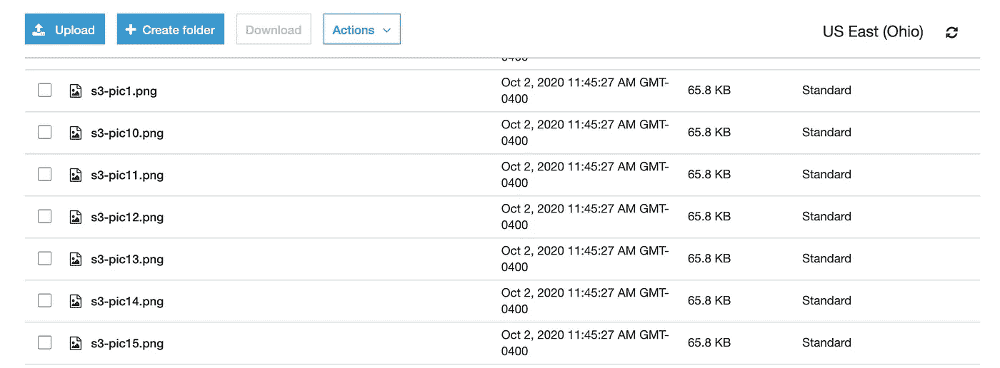
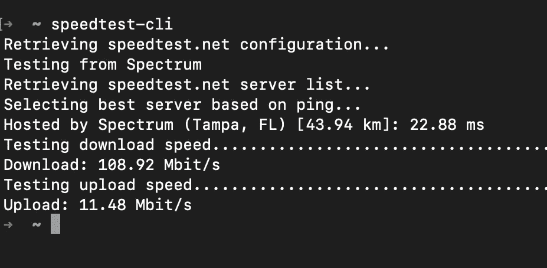
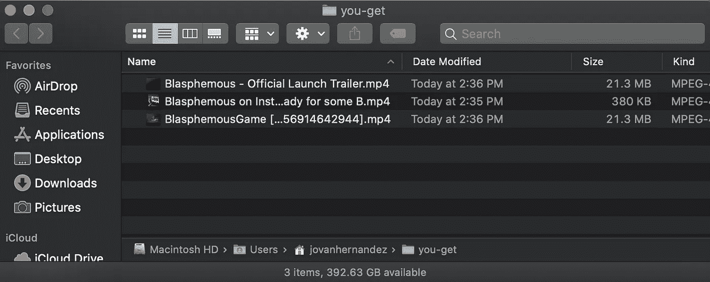
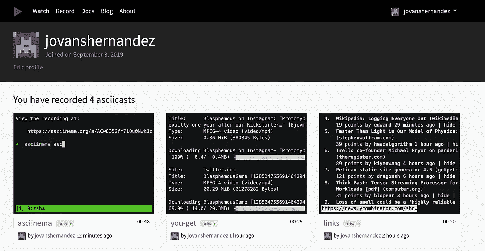

# 2020 年我最喜欢的自制软件(第二部分)

> 原文：<https://betterprogramming.pub/my-top-homebrew-packages-for-2020-part-2-8fbe66949701>

## 更多有用的工具，让您的工作变得更简单

我想，迟到总比不到好

考虑到我的上一篇文章如此受欢迎，我觉得这只是对 2020 年下半年我最喜欢的一些自制软件包提供一个后续。

在我之前关于家酿的文章中，我强调了一些我喜欢的包，比如 *htop，tldr，jq，ncdu，taskwarrior，*和 *tmux。*

在这篇文章中，我将重点介绍自我上一篇文章发表以来发布的一些新包，以及一些我可能忽略或错过的隐藏的宝石。话不多说，下面是我列出的 2020 年顶级自制软件清单的第二部分。

# AWS CLI

AWS CLI 包正如其名，是一个 CLI 工具，管理员和工程师可以用来管理他们的云基础设施。使用 API 命令，您可以自动化和批处理繁琐的任务，如启动和停止实例或管理 S3 存储桶中的数据。

将一个本地目录复制到我的一个 S3 桶需要几秒钟

如果你是一名云工程师或者使用亚马逊网络服务，你需要安装 AWS CLI 工具。人们普遍认为，AWS 的仪表盘是最糟糕的之一，服务混乱，警报模糊，显示的数据往往不准确或延迟。

我所有的本地测试文件都已经成功复制到我的 S3 存储桶中

我主要用它来管理我的 EC2 实例和 S3 桶。将数据本地移动到您的 S3 存储桶是相当容易的，而不是在缓慢的 AWS 控制台 GUI 中跋涉。试试吧！

# 链接

Links 是一个命令行工具，允许你通过你的终端浏览网站，只要有文本显示。

这听起来可能毫无意义，但实际上有几个用例浮现在脑海中。无论是通过终端进行研究，检查和测试网络编辑，甚至只是试图在工作中保持低调，浏览 Reddit 或 Fantasy Football 比分， [Links CLI](https://www.npmjs.com/package/get-links-cli) 工具都能派上用场。

一个秘密的方式来保持在您最喜爱的论坛和新闻网站上的最新信息

# Speedtest CLI

没有什么比网速慢和不确定瓶颈是什么更让人烦恼的了。如果你曾经在互联网上运行过速度测试，你可能会熟悉 Ookla 的 speed test，甚至会使用谷歌自己的浏览器内工具。有一个 brew 包可以让你直接在命令行中运行速度测试。就是它了。

在这里截图藏了我家 IP，不过你懂的

这为什么有用？嗯，它节省了时间和点击量，还减少了任何可能阻碍吞吐量的潜在层或瓶颈。在我做 IT 的日子里，我已经数不清有多少次在客户的工作站上工作，他们报告了网速问题，却发现他们的 Chrome 扩展由于恶意软件或后门下载而降低了速度。

另一个很好的用途是在没有桌面环境的服务器上工作。如果没有 GUI，如果你试图运行速度测试，你就不走运了，所以这个工具肯定会派上用场。

# 你-滚

[You-Get](https://you-get.org/) 类似于 wget 和 youtube-dl 的组合，但是对更多平台和网络格式有更灵活的支持。我经常用这个从推特、脸书甚至 Instagram 上抓取视频。

你得到是一个伟大的方式拉视频和照片来源，否则你通常不能“另存为…”

在上面的例子中，我实际上有来自 YouTube、Twitter 和 Instagram 的链接，这些链接从我最喜欢的游戏的社交媒体帐户中提取视频，亵渎神明。

Viola，来自你最喜欢的社交媒体平台的本地 mp4 视频供你存档。

注意:根据您的来源，您可能违反了某些平台的 T&C，因此请确保您了解从用户的个人资料或平台中抓取任何视频或图片的风险。

# asciinema

通过我的两个帖子，你可能想知道我是如何记录终端会话并为我的会话创建漂亮的 gif 的。这在一定程度上要归功于 T4 学院。

使用 asciinema 在终端中记录 htop 会话，然后将其转换为 gif 格式

Asciinema 可以让你记录你的终端会话，并将其保存在本地或上传到[asciinema.org](http://asciinema.org)，一个允许你记录和分享你的终端会话的云平台。

Asciinema.org 可以存储您保存的所有终端会话供以后使用。

这对于依赖于终端会话的教程来说非常好，所以不要录制和上传质量差、模糊的视频，试试 asciinema 吧。

# 结论

作为我关于自制软件包的最后一篇文章，我希望这个列表能够突出一些强大的，但可能不为人知的软件包，它们可能对你有用。

无论你是开发人员、工程师，还是苹果电脑的超级用户，我相信在自制软件中探索更多的东西对你的生产力甚至创造力都有好处。

让我知道你最依赖什么包来完成你的工作！