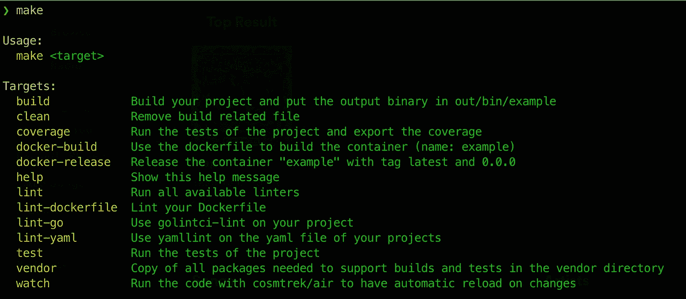

# 我的 Golang 项目最终 Makefile

> 原文：<https://betterprogramming.pub/my-ultimate-makefile-for-golang-projects-fcc8ca20c9bb>

## 在一个地方使用您需要的所有工具，提高您的工作效率


Todd Quackenbush 在 [Unsplash](https://unsplash.com?utm_source=medium&utm_medium=referral) 上拍摄的照片。

我喜欢使用 Go，因为它易于编码和构建。

但是像所有其他编程语言一样，您必须处理大量的工具。为了方便使用这些工具，我把所有东西都放在 makefile 中，这样我就可以从一个地方`build`、`lint`和`run`所有东西。

在构建了许多服务之后，我现在总是使用同一种 makefile 来帮助我正确地构建我的项目。在这篇文章中，我将分享我使用的目标以及它们为什么有用。

*注意:大部分目标使用 Docker，如果要使用这个 makefile，一定要有。*

# TL；速度三角形定位法(dead reckoning)



可用目标

如果你想马上看到代码，可以跳到本文的结尾或者这个要点。

# 构建并测试代码

处理代码和测试代码是开发人员日常工作的重要部分。

## 成为供应商

```
**vendor**:
	$(GOCMD) mod vendor
```

在我的项目中，我使用 [go 模块](https://golang.org/ref/mod#go-mod-vendor)作为我的依赖管理系统。这个目标只是调用系统下载依赖项，并将它们放在`/vendor`目录中。

## 创建版本

```
**build**:
	mkdir -p out/bin
	GO111MODULE=on **$(GOCMD) build -mod vendor -o** out/bin/$(BINARY_NAME) .
```

使用`vendor`的是一个基本的`go build` 任务。我们将二进制文件导出到`out/bin` 目录中。

## 进行测试/进行报道

我们使用`-race`选项运行测试，以检测我们是否有某种竞争条件。如果需要导出，结果将以`junit` 格式导出。

覆盖是用`go test`完成的，我们可以用不同的格式导出它(`.cov`或`.xml` ) *。*

## 制作手表

```
**watch**:
	$(eval PACKAGE_NAME=$(shell head -n 1 go.mod | cut -d ' ' -f2))
	**docker run -it --rm -w /go/src/$(PACKAGE_NAME) -v $(shell pwd):/go/src/$(PACKAGE_NAME) -p $(SERVICE_PORT):$(SERVICE_PORT) cosmtrek/air**
```

该目标用于在开发时重新加载您的应用程序。它使用 [cosmtrek/air](https://github.com/cosmtrek/air) 在您的代码发生变化时立即刷新应用程序，这在您开发 API 时非常完美。

*注意:不要忘记在* `*SERVICE_PORT*` *变量中指定正确的端口。*

# 棉短绒

如你所见，还有一堆 linter 目标。他们的所作所为显而易见:

*   `make lint-yaml`:在你项目的 YAML 文件中使用 [yamllint](https://yamllint.readthedocs.io/en/stable/) (我相信你有很多这样的文件)。
*   `make lint-go`:在你的项目中使用 [golintci-lint](https://golangci-lint.run/) 来 lint 你的 Go 代码。我推荐一个`.golangci.yml`，上面有你的配置。
*   `make lint-dockerfile`:皮棉你的 Dockerfile。

如果你想用一个命令启动所有的 linters，你可以运行`make lint`。

# 码头工人

```
**docker-build:**
 **docker build --rm --tag $(BINARY_NAME) .** **docker-release:**
	docker tag $(BINARY_NAME) $(DOCKER_REGISTRY)$(BINARY_NAME):latest
	docker tag $(BINARY_NAME) $(DOCKER_REGISTRY)$(BINARY_NAME):$(VERSION)
	# Push the docker images
	docker push $(DOCKER_REGISTRY)$(BINARY_NAME):latest
	docker push $(DOCKER_REGISTRY)$(BINARY_NAME):$(VERSION)
```

`docker-build`将在本地构建并标记您的 Docker 图像，`docker-release`将把这个图像推送到您的注册表。如果你用的是 Docker Hub，只要让变量`DOCKER_REGISTRY`为空，就能完美工作。

# 完整的 Makefile

## 你想学更多的东西，想看我的未来故事？

[订阅我的媒介账号](https://thomaspoignant.medium.com/subscribe)。