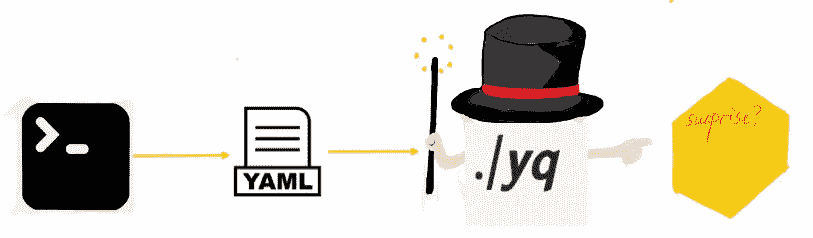
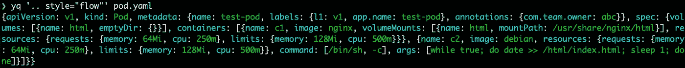

# 我的“yq”工具的备忘单

> 原文：<https://betterprogramming.pub/my-yq-cheatsheet-34f2b672ee58>

## 用 yq 解析 Kubernetes YAML



按作者

yq 是一个以 YAML 数据处理和高亮显示为主的工具。其目前的 4.x 版本在 3.x 的基础上进行了巨大的升级，使我们能够更高效地查询和操作 YAML。

虽然关于`jq`能起到类似于`yq`的作用的争论从未停止过，但我仍然相信`yq`在处理 Kubernetes 资源方面是仅次于 kubectl 的最强有力的工具，尤其是在操作 YAML 文件方面，是不可替代的。

为什么我抱着这样的信念？从下面关于`yq`处理的查询、更新和删除的演示和最佳实践中，你会得到答案。

# 基本信息

本文中我们所指的`yq`工具是 [mikefarah/yq](https://github.com/mikefarah/yq) ，而不是 [kislyuk/yq](https://github.com/kislyuk/yq) 。mikefarah/yq 拥有强大的操作符并提供更广泛的支持，而 kislyuk/yq 只能支持 YAML 读取。

`yq`在最新的 4.x 版本中做了巨大的改变，抛弃了那些类似`r, d`的子命令，取而代之的是用`yq eval`触发所有操作。

```
yq eval [expression] [yaml_file1]… [flags]
```

`query`、`update`、`delete`等操作在`expression`和可以使用的运算符上有所不同。并且由于`eval`是默认命令，所以`yq e '.metadata.name' a.yaml`和`yq '.metadata.name' a.yaml`如果没有声明是一样的。

`yq`以类似于树解析的方式解析 YAML 文件，将 YAML 文件分成不同的节点类型，这些节点类型相互嵌套。

这三种节点类型是

*   **标量**，常用节点，如`.metadata.name`，其值可以是`string`、`int`、`boolean`等。
*   **数组**，数组节点，比如`.spec.containers`和`.spec.volumes`都是数组。以`-`开头的每一项的值通常是 KV 结构的 YAML，或者是一个单独的字符串，比如容器中的 ENV 设置。
*   **映射**、`.metadata.labels`、`.metadata.annotations`都是典型的映射结构。

# **查询**

查询主要是遍历 YAML，或者换句话说，用`.(dot)`操作符搜索 YAML 文件中的键和值。

## 按字段查询

通过`.key1.key2.xxx`的表达式，我们可以得到 YAML 支持的所有数据格式，比如常见的`string`、`array`、`map`、`object`等。下面列出了一些合理的`yq`命令。

```
$ yq e '.metadata.name' pod.yaml
test-pod
$ yq e '.metadata.labels' pod.yaml *# return labels map* l1: v1
app.name: test-pod
$ yq e '.metadata pod.yaml *# return whole metadata field​* name: test-pod
labels:
l1: v1
app.name: test-pod
annotations:
com.team.owner: abc
```

通常，我们用双引号标记密钥，以忽略特殊字符引起的问题，如`app.name`。

## **数组/映射扩展查询**

与只有一个值的字符串不同，在 YAML 中，数组可以有多个表达式。在 YAML，用一个简单的键就可以得到完全相同的结果，通过一些特殊的处理，可以得到更多精度更高的结果。

*   钥匙后面有一个`[]`，可以取下返回地图的钥匙或`—`。

```
$ yq e '.metadata.labels[]' pod.yaml
v1
test-pod
$ yq e '.spec.containers[]' pod.yaml
name: c1
image: nginx
volumeMounts:
  - name: html
mountPath: /usr/share/nginx/html
name: c2
image: debian
```

*   使用 collect ( `[key/index]`)，可以从映射或数组中获取一个或多个键或索引值，如果索引或键不存在，则返回 null。

```
$ yq e '.metadata.labels["l1"]' pod.yaml
v1
*# Get multiple keys* $ yq e '.metadata.labels["l1", "app", "app.name"]' pod.yaml
v1
null
test-pod

$ yq e '.spec.containers[1]' pod.yaml
name: c2
image: debian
volumeMounts:
- name: html
mountPath: /html
command: ["/bin/sh", "-c"]
args:
- while true; do date >> /html/index.html; sleep 1; done
```

当我们需要搜索一个以上的键或索引时，可以选择`pick`操作符来获取 map/array 中键和索引的相应值。

```
$ yq e '.metadata.labels | pick(["com.team.owner", "l1", "app.name"])' pod.yaml
l1: v1
app.name: test-pod
```

`with_entries`操作符可以处理地图，让我们得到地图的键/值，然后进行后续处理。与`select`操作符配合使用，可以实现非常强大的过滤查询。

## 条件查询

`yq`支持两种常用的查询运算符`select`和`contains`，通常与`.key`查询结合使用。

*   `has(key)`，如果该键存在，则返回 true。
*   `contains(obj)`，返回真/假。`obj`可以是简单的字符串(查询任何匹配的键和值)、KV 组合、数组、对象等。
*   `select(.=="some pattern here")`。`.`指当前字段，如果存在，则返回；否则，返回`null`。`select`可以和比较运算符(`>`、`<`、`==`等)，或者布尔运算符(and、or、not 等)一起使用。)，也支持通配符(`*`)。

```
$ yq '.metadata.labels | has("l1")' pod.yaml
true
$ yq '.metadata.labels | contains({"l1":"v1"})' pod.yaml
true
*# combine select and has* $ yq '.metadata.labels | select(. | has("l1")) ' pod.yaml
l1: v1
app.name: test-pod
$ yq '.metadata.name | select(. == "test")' pod.yaml *# no match
# wildcard match* yq '.spec.containers[] | select(.name == "*1" )' pod.yaml
name: c1
image: nginx
volumeMounts:
- name: html
mountPath: /usr/share/nginx/html
*# select, with_entries and not，search for labels don't match* yq '.metadata.labels | with_entries(select(.key == "l1" |not))' pod.yaml
app.name: test-pod
```

对于更复杂的场景，比如匹配正则方程，`select`总是和字符串操作符结合在一起，比如`test`、`match`、`capture`等。

```
# test regular
yq '.spec.containers[] | select(.image | test("nginx|debian"))' pod.yaml # return all containers# capture
yq '.spec.containers[] | select(.command | .[] | capture("/bin/sh"))' pod.yaml
```

## **导线和变量**

当表达式变得复杂时，我们使用`pipe(|)`来逐层解析`yq`表达式。但是有两个问题需要回答。

*   如何读取前一层的信息？
*   如何比较不同图层之间的内容？例如验证`volumeMounts`与`spec.volumes`在容器中是否一致。

`yq`提供的运算符就是答案。

*   `parent`，可以返回上一层的节点内容。
*   `variable`，定义后续管道中使用的变量。

```
yq '.spec.volumes[] | .name |  parent' pod.yaml
name: html
emptyDir: {}

*# find all volumeMounts match the volumes* yq '.spec | .volumes[].name as $volumeName | .containers[] | select(.volumeMounts[] | .name == $volumeName)' pod.yaml
```

## 复杂流操作符

`yq`表达式还支持一组运算符(`map`、`flattern`、`groupby`、`union`、`reduce`等)。)进行管内处理，类似于函数式编程。`map`、`flattern`、`groupby`都是针对数组节点处理的，其中`flattern`和`groupby`很少使用，很难想象会在 Kubernetes 相关的 YAML 中使用。因此，我建议了解他们扮演什么角色，只在需要的时候检查他们的文档。

而，`map`是你应该掌握的运算符。它与`string`操作符或`math`操作符结合起来处理数组中的项，或者添加组合字符串。例如，将容器中的名称修改为大写。

```
yq e '.spec.containers | map(.name | upcase) ' pod.yaml
```

除了像`map`或者`groupby`这样的操作符，还有另外一组流操作符，我喜欢称之为“ **end-function 操作符”**，它们总是结束表达式管道。

这里有一个“端函数运算符”的表格

# 更新

查询、搜索和过滤现有文件可以满足我们的大部分需求。但是，如果我们需要更新或创建一个 YAML 呢？放松点，因为`yq`已经准备好了。

首先，让我们看一组相关的标志。

*   `-i/–inplace`。默认情况下，结果被发送到标准输出，可以使用`-i`对当前文件进行修改。而我们需要文件重定向操作符(`>`)来输出到一个新文件。
*   `-o/–output-format`。该输出格式默认为 YAML，但也支持`json/j`、`xml/x`和`props/p`。
*   `-I/–indent`，YAML 的缩进。默认值为 2，这也是 YAML 规范的标准。
*   `–from-file`，从文件中读取表达式。

## **更新/添加密钥**

`yq`支持通常模式的 YAML 更新`yq e -i '.key1 | .key2 … = new_value' file`。**如果要更新的字段不存在，则** `**update**` **操作变为** `**add**` **。**除了最常见的`=`运算符，`yq`还支持其他运算符，包括`|=` 。

它们在大多数情况下具有相同的效果，除了`|=`可以基于旧值进行更新。

```
# add suffix to pod’s name using |= operator
yq '.metadata.name |= . + "abc" | .metadata.name' pod.yaml
test-podabc
```

默认情况下，我们会在末尾添加新字段。但是在`index:0`处添加也是可行的，比如在`.spec`处添加`nodeName`字段。

```
yq  '.spec = {"nodeName":"master"} + .spec ' pod.yaml
```

对于向数组和地图添加新内容，我们可以使用`+`或`+=`操作符，比如在`.matadata.labels`中的起始位置添加一个新标签。

```
yq '.metadata.labels |= {"pos-1":"val-1"} + . ' pod.yaml
pos-1: val-1
l1: v1
app.name: test-pod
```

同时，可以使用一组字符串运算符(`sub/replace`、`split`、`join`、`upcase`、`downcase`等)进行更新。

## 从 ENV 读取变量更新

这是一个非常常见的操作，因为我们使用各种 bash/kubectl 命令来获取用于更新`yq`中的字段的有用信息。

```
USER="slaise"; yq '.metadata.name |= strenv(USER) + "-" + . | .metadata.name' pod.yamlslaise-test-pod
```

## **评论更新**

comment 运算符允许您通过以下三种方式更新注释。

*   `line_comment`更新某些行中的注释。
*   `head_comment`在 YAML 文件的开头添加一个注释，后跟一个空行。
*   `foot_comment`在 YAML 文件的末尾添加注释，上面有一个空行。

```
yq '.metadata.annotations["com.team.owner"] line_comment="owner squad"' pod.yaml
yq '. head_comment="Pod example start"'  pod.yaml
yq '. foot_comment="Pod example end"' pod.yaml
```

## **合并**

Merge 在`yq`中有双重含义:简单的是数学中的数字乘法，用来更新数值。复杂的是对象的合并——不同 YAML 节点的合并操作。后者在集群管理中非常有用，比如用户忘记设置 pod 中的`volumeMounts`字段，我们可以通过读取`volumes`值自动给容器加一，这样可以避免 YAML 检查后返回错误给用户，加快迭代速度。请参见下面的命令。

```
yq e '.spec.volumes as $volumes | .spec.containers[] | select(.name == "c2") | . * {"volumeMounts": {"name":$volumes[0].name}}' pod.yaml
```

这同样适用于在 CI/CD 中添加公共配置，例如与安全相关的`securityContext`，或者与资源使用相关的请求和限制。

## **一次更新多个密钥**

也可以使用`yq`和`with`操作器一次更新密钥。让我们看一个向 pod 添加`serviceAccount`和`restartPolicy`的例子。

```
yq 'with(.spec; .serviceAccount="test-sa" | .restartPolicy=false)' pod.yaml
```

并且`with`还可以一次更新所有数组项，例如，将`imagePullPolicy`添加到 pod 中的两个容器中。

```
yq 'with(.spec.containers[]; .imagePullPolicy="Never")' pod.yaml
```

# 删除

虽然删除可以单独使用，但它通常与查询和条件查询结合使用。支持删除的操作符有`substract`和`del`。

*   `del`是最常用的`delete`运算符，用于删除匹配的键。
*   `substract`是一个数学减法运算符，但也可用于从数组中删除项目。

## 删除字段

如果知道字段路径，可以直接删除，比如删除`.spec`中的`nodeName`。

```
yq -i 'del(.spec.nodeName)' pod.yaml
```

当然，我们可以在`select/match/has`之后执行`delete`。

```
# only deletes the labels when select matches
yq 'del(select(.metadata.name == "test-pod") | .metadata.labels)' pod.yaml
```

## **删除数组项**

删除 Pod 中的 nginx 容器。

```
yq '.spec.containers - [{"image":"nginx", "name":"c1", "volumeMounts":[{"name":"html","mountPath":"/usr/share/nginx/html"}]}]' pod.yaml
```

这里，您需要声明整个数组项的内容。太复杂了吧？而`select + del`可以让事情变得更简单。

```
yq 'del(.spec.containers[] | select(.image == "nginx"))' pod.yaml
```

# 输出

有一些标志可用于增强输出。

*   `-C`强制颜色输出。
*   `-in`将输出缩进设置为 n 个空格。
*   `-P`用于漂亮的印刷。
*   `-v`支持更详细的详细输出，可用于调试。

默认输出到 stdout 并在`pretty print`打印。但是`style`操作符可以将打印样式转换成其他 5 种格式，双份、单份、标签、文字和折叠。下面的例子输出一个 JSON 样式的字符串。



# **练习**

点击“保存”按钮，我们现在已经将上述所有知识包裹在脑海中，抓住了`yq`命令的精髓，即遍历 YAML 文件，结合过滤操作符，实现最终的查询、更新、删除。

让我们通过一个删除相关 YAML 文件的例子来实践它。

有一个 Github 存储库，用 gitops 管理成千上万的 YAML 文件。您被要求删除一些部署，它们分别属于一些被放弃的团队。所有这些部署都以`teamname + customize_name` 格式命名。

好，我们一步一步往下说。

*   定义一个包含这些团队名称的数组。
*   查询部署的 YAML，并查找包含这些名称的部署。
*   删除和修改原始文件。

然后`yq`命令如下。

```
yq -i '["team1*", "team2*", "team3*"] as $names | select(.kind == "Deployment" and $names | contains(.metadata.name)) | del(.)' *.yaml
```

如果任务是删除不包含某些名称的部署，那么`not`操作符可以完成。

```
yq -i '["team1*", "team2*", "team3*"] as $names | select(.kind == "Deployment" and $names | contains(.metadata.name) | not) | del(.)' *.yaml
```

# 结束了

`yq`命令作为集群治理的有效工具，可以解放我们的双手，将我们从枯燥的复制粘贴中解放出来。它是用 Go 编写的，这增加了我研究它的实现的兴趣。稍后，我还将尝试添加一些功能来满足自己的需求。

感谢阅读！