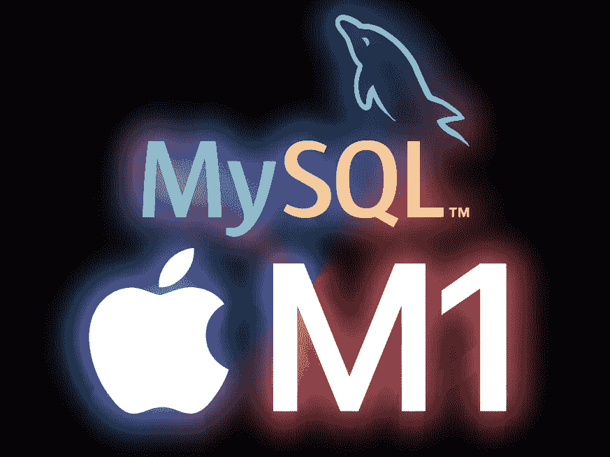
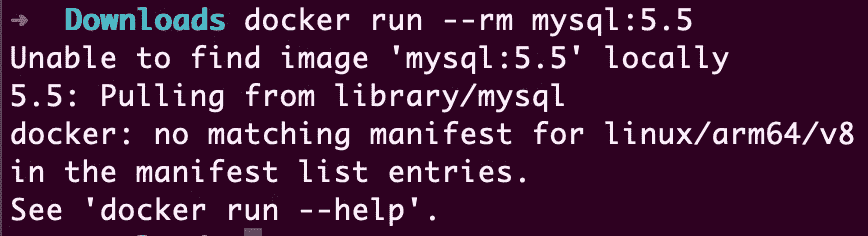

# MySQL 5.7 在 ARM/M1 Mac 上没有官方的 Docker 映像

> 原文：<https://betterprogramming.pub/mysql-5-7-does-not-have-an-official-docker-image-on-arm-m1-mac-e55cbe093d4c>

## 以下是你如何运行它的方法



MySQL 和 Apple M1 的徽标|由作者创作

如果你试图在一台新的 Mac 电脑上运行官方的 mysql:5.7 ，5.6 或者 5.5 版本的图片，你会得到这条消息:



Oracle 不正式支持 ARM 上的旧 MySQL 5.x 版本。您可以在他们的支持平台概述中看到:

 [## 支持的平台:MySQL 数据库

### 编辑描述

www.mysql.com](https://www.mysql.com/de/support/supportedplatforms/database.html) 

那么我们能做什么呢？

# 运行 MySQL 8

较新的 MySQL 8 在 ARM 上支持，docker 官方镜像也有支持。

但是，如果您的项目不打算迁移到较新的 MySQL 版本，您可能不应该在本地运行 MySQL 8 作为解决方法。

# 运行 MariaDB

MySQL 的分叉是[与其兄弟](https://mariadb.com/kb/en/compatibility-differences/)大部分兼容，可以作为替代品。而且[确实官方支持 ARM64](https://mariadb.com/docs/deploy/os-compatibility/#mariadb-community-server) 。

但是在这里，您必须意识到您的本地环境可能与真实环境不完全相同。

我无法回答的问题是选择哪个版本的 MySQL 5.7 支持最好。我尝试了最新的 10 版本(10.8)，它对我的用例非常有效。

# 非正式运行 MySQL 5.7

MySQL 的源代码是开放的，没有什么可以阻止你只为 ARM64 编译它。Debian 和 Ubuntu 为 arm 提供 mysql-server-5.7 映像已经有很多年了，尽管它们比 x86 的变体要过时一些。

那里也已经有预制的图像了。我非常幸运地使用了 [biarms/mysql:5.7](https://github.com/biarms/mysql) 图像。它具有与官方 docker 映像相同的选项和环境变量，因此它可以是一个替代产品。

[](https://github.com/biarms/mysql) [## GitHub — biarms/mysql:又一个面向 ARM 设备的 Docker MySQL 项目

### 这是 Mysql Docker 官方镜像的 Git repo 的一个分支。请参阅 Docker Hub 页面，获取完整的自述文件，网址为…

github.com](https://github.com/biarms/mysql) 

你甚至可以在本地标记它，这样它就可以代替官方的 Docker 图像。

```
# docker pull biarms/mysql:5.7
# docker tag biarms/mysql:5.7 mysql:5.7
```

然后，每个引用`mysql:5.7`的项目都会自动地不知不觉地使用 biarms 图像。

# 使用仿真运行 MySQL 5.7

由于性能的原因，这应该是最后的手段，但是如果您在其他地方需要相同的版本，而此时性能并不重要，docker 完全能够模拟 x86。

```
docker run --rm \
  --platform linux/amd64 \
  -e MYSQL_ROOT_PASSWORD=password \
  -p 3306:3306 \
  mysql:5.7
```

请注意，这个仿真在现有的 Linux VM 中使用了 [QEMU](https://www.qemu.org/) 。所以不是罗塞塔 2 在做翻译。但它的实用性令人惊讶。

# 在不同的机器上运行 Docker

这是欺骗，但它仍然是一个选项，特别是如果您有多个没有 x86 版本的映像。我有完整的指南来教你怎么做:

[](https://medium.marco.zone/seamless-vps-docker-dev-environment-33d970b80b42) [## VPS 上的无缝 docker 开发环境

### 使用云计算资源来提高项目的性能。

中等宏观区域](https://medium.marco.zone/seamless-vps-docker-dev-environment-33d970b80b42) 

# 结论

正如你所看到的，你有很多选择。尤其是非官方的方式大概是要走的路。

但是模拟的方式也很有趣。这意味着您可以在必要时运行一切，即使不是最理想的。