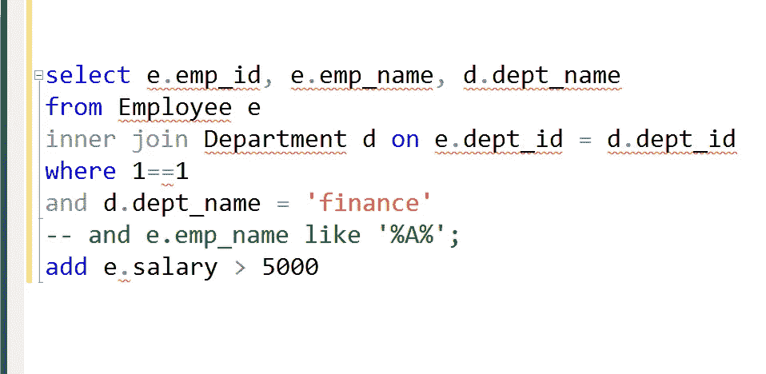
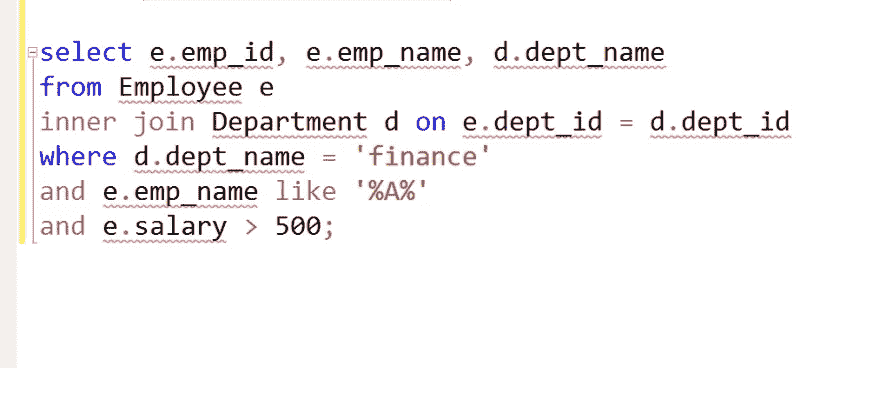
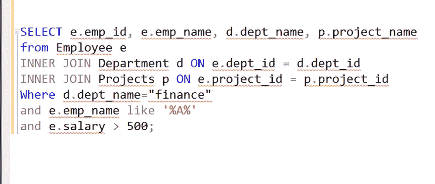
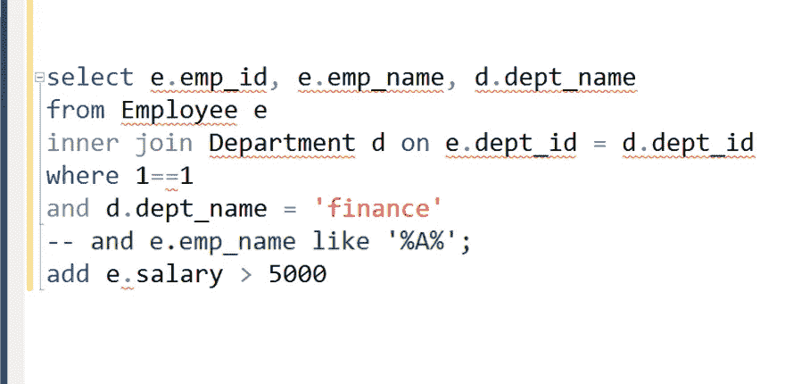
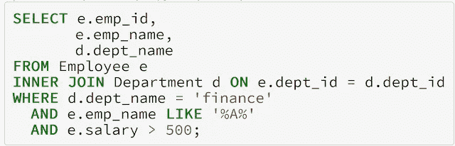

# 面向开发人员的 MySQL 查询最佳实践

> 原文：<https://betterprogramming.pub/mysql-best-practices-b103260f8b45>

## 如何编写 6 个月后可以阅读的 SQL 查询

作者图片

毫无疑问，写代码是艺术而不是科学。即使有经验，也不是每个程序员都能写出既可读又可维护的漂亮代码。

一般来说，当你学习编码的艺术时，编码会随着经验的增加而改进，比如更喜欢组合而不是继承，或者更喜欢接口而不是实现的编码，但是只有少数开发人员能够掌握这些技术。

同样的道理也适用于 SQL 查询。你构建查询的方式和你编写查询的方式对于向你的开发伙伴传达你的意图有很大的帮助。

每当我在来自多个开发人员的电子邮件中看到 SQL 查询，我都能看到他们写作风格的明显差异。**一些开发人员写得很整洁，并适当地缩进他们的查询，这使得发现关键细节很容易，例如，你从哪个表中提取了哪些列，条件是什么。**

*在现实项目中，SQL 查询很难成为一行程序*。学习编写 [*SQL 查询*](https://javarevisited.blogspot.com/2021/05/sql-and-database-phone-interview-questions.html) 的正确方法，当您稍后自己阅读它们或者与他人分享该查询以供审查或执行时，会产生很大的不同。

在本文中，我将向您展示我过去尝试过的几种风格，它们的优缺点，以及我认为的编写 SQL 查询的最佳方式。

除非你有一个很好的理由不使用我的风格，比如你有一个更好的风格或者你想坚持你的项目中使用的风格(一致性压倒一切)，否则没有理由不使用它。

顺便说一下，我希望您熟悉 SQL，并且知道 SQL 查询中不同的子句及其含义。如果您不是，最好通过参加如下的在线课程来获得一些 SQL 经验:

*   [从 0 到 1:SQL 和数据库——疯子玉米挑起的重担](https://medium.com/javarevisited/top-5-sql-and-database-courses-to-learn-online-48424533ac61)
*   [Jon Flanders 的 SQL 简介](https://medium.com/javarevisited/5-best-courses-to-learn-microsoft-sql-server-in-depth-e9f11b73c14a)

这是我强烈推荐给 SQL 初学者的两门课程。它们是很棒的课程，教你 SQL 基础知识。

是时候研究几种编写 SQL 查询的方法了，并找出哪一种是快速表达意图的最佳方式。

# 1.SQL 查询版本 1.0

## 赞成的意见

引入了混合大小写来将关键字与列名和表名分开，比如将`[SELECT](https://javarevisited.blogspot.com/2011/10/selct-command-sql-query-example.html)`写成大写，而将`Employee`写成原样。但是如果你不一致(例如，`SELECT`是大写的，而`from`是小写的)，那么使用这种风格是没有好处的。

## 骗局

*   混合案例
*   整个查询写在一行上，一旦表和列的数量增加，这一行就变得不可读。
*   添加新条件或在没有现有条件的情况下运行没有灵活性。

# SQL 查询版本 2.0

## 改进

SQL 查询被分成多行，这使得它更具可读性——是的，这一点很小，但却有很大的不同。

## 问题

*   混合案例
*   `[WHERE](https://www.java67.com/2019/06/difference-between-where-and-having-in-sql.html)` [子句](https://www.java67.com/2019/06/difference-between-where-and-having-in-sql.html)上的所有条件都在同一行，这意味着通过注释排除它们并不容易。

# SQL 查询版本 3.0(最佳)

## 赞成的意见

*   将 [SQL 查询](https://sqlrevisited.blogspot.com/2022/01/top-15-sql-query-interview-questions.html)分成多行使得它更具可读性。
*   使用适当的缩进可以很容易地找到数据源，比如表和连接。
*   将条件放在单独的行上，允许您通过对其中一个条件进行注释来运行查询，如下所示:

顺便说一下，如果您注意到了一个微妙的区别，我添加了`WHERE 1=1`，这意味着您可以对任何条件进行注释，而不需要注释`[WHERE](https://sqlrevisited.blogspot.com/2022/02/how-to-filter-data-in-sql-where-clause.html)`子句，这在早期版本的查询中是不可能的。

如果你是关键字大写的粉丝，也可以写同样的`[SQL query](http://www.java67.com/2018/02/5-free-database-and-sql-query-courses-programmers.html)`如下图。规则是相同的，但只是使用大写字母的关键字。

这就是关于如何编写一个可读且更易维护的 SQL 查询的全部内容**。请随意发表您对 SQL 查询的缩进和样式的看法。**

**这是一种更简单但非常强大的技术，对于提高包含多个连接的复杂 SQL 查询的可读性大有帮助，如我前面的例子所示。**

**如果你愿意，也可以在线使用各种 SQL 格式化程序，但是我建议你学习一种风格并坚持下去，而不是依赖格式化程序。**

**感谢阅读这篇文章。让我们知道你是如何编写 SQL 查询的，你使用哪种风格，你是否有自己的风格。**