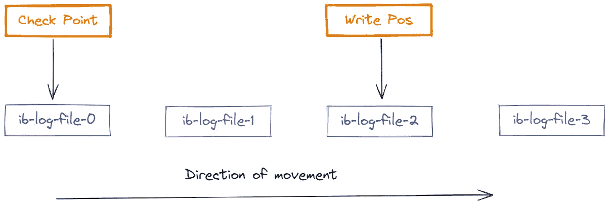
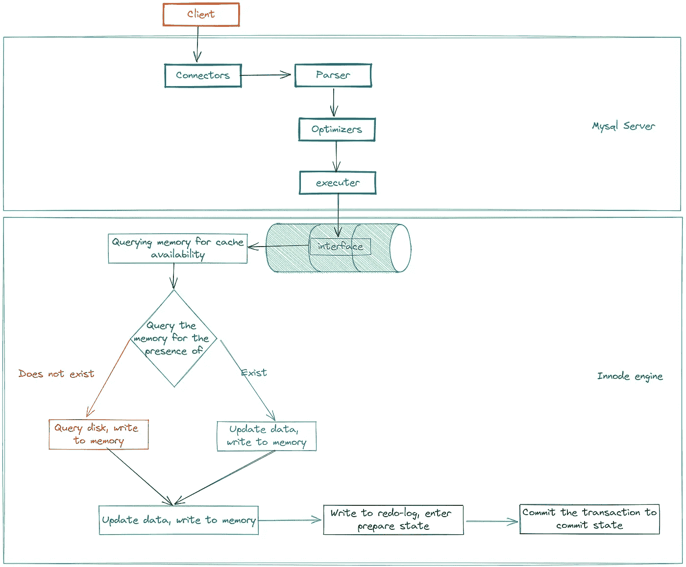

# MySQL 的 RedoLog 和 BinLog

> 原文：<https://betterprogramming.pub/mysqls-redolog-and-binlog-1a35bc052489>

## MySQL BinLog 的详细信息


[工位](https://unsplash.com/@workperch?utm_source=medium&utm_medium=referral)在 [Unsplash](https://unsplash.com?utm_source=medium&utm_medium=referral) 上拍照

# **重做日志**

我们知道，当 MySQL 写数据时，它可能会追加数据或定位一个已经存在的数据进行修改。

对于从磁盘随机读取和写入，这很慢，无法满足高 io 操作的情况。

为了提高写效率，我们可以先写到内存，空闲时再写到磁盘。

但这就产生了一个问题:内存中的数据不是持久的，所以如果停电，数据就会丢失？

为了解决数据丢失问题，MySQL 引入了重做日志来解决这个问题。

这被称为 WAL(预写日志记录)，这是针对非内存数据库提高 IO 效率的一种常见做法。

这使得在发生崩溃时依靠日志记录来恢复数据成为可能，从而确保数据的持久性。

# ***预写日志***

一种高效的数据库日志记录算法。对于非内存数据库，磁盘 I/O 操作是数据库效率的主要瓶颈。

在数据量相同的情况下，使用 WAL 日志记录的数据库系统在事务提交时的磁盘写操作只有传统回滚日志记录的一半左右，大大提高了数据库磁盘 I/O 操作的效率，从而提高了数据库性能。

**沃尔玛的优势**

*   读取和写入可以完全并发执行，而不会相互阻塞(但是写入仍然不是相互并发的)。
*   WAL 在大多数情况下性能更好(因为每次写入不需要写两个文件)。
*   磁盘 I/O 行为更加可预测。
*   使用更少的`fsync()`操作，减少系统脆弱性问题。

## **重做日志实现**

我们来看看 MySQL 到底是怎么做到的。

当需要更新记录时，InnoDB 引擎首先写入记录`redo log`并更新内存。在适当的时候，比如当磁盘空闲时，`redo log`中的数据会被刷新到磁盘。

在 InnoDB 引擎中`redo log`的大小是固定的，例如，它可以配置为一组四个文件，每个文件的大小为 1GB，因此总共可以记录 4GB 的操作。

`write pos`是记录的当前位置，写入时移动，`checkpoint`标记要擦除的当前位置，记录被擦除前更新到数据文件。

`checkpoint`标记要擦除的当前位置，记录在被擦除前被更新到数据文件，擦除时再次向一个方向移动。

如果 write pos 写完最后一个文件，它将移动到`ib-log-file-0`并再次开始写。



如果`write pos`追上`check point`，`redo log`已满，那么你不能执行新的更新，你必须在`check point`前进之前停止并擦除一些数据并将数据同步到磁盘。

## 如何查看重做日志参数？

每个 InnoDB 存储引擎至少有一个重做日志文件组，每个文件组至少有两个重做日志文件，默认为`ib-log-file-0`和`ib-log-file-1`。

```
show variables like '%innodb_log%';
```

## **Bin-Log**

`redo log`是特定于 InnoDB 引擎的，可以保证数据的安全，但是其他引擎是如何记录数据的呢？

在服务器级别，MySQL 有自己的日志，那就是`bin-log`(一个存档的日志)。你必须孤立地看待 MySQL。MySQL =服务器+不同的数据存储引擎，不是一个整体。

Binlog 记录对 MySQL 数据库表结构和表数据的所有更改的二进制日志，但不记录 select 和 show 查询。`bin-log`日志记录为事件，包括语句消耗的时间。

打开 Binlog 日志记录的两个最重要的场景如下:

*   父子复制:在一级库中启用 Binlog 功能，使一级库可以将 Binlog 传递给二级库，二级库可以获取 Binlog 并实现数据恢复，达到主从数据一致性。
*   数据恢复:通过`mysqlbinlog`等工具恢复数据。

Bin-log 文件有三种记录方式:`statement`、`row`和`mixed`，通常使用`row`方式。

## ***为什么有两个日志？***

MySQL 一开始没有 InnoDB 引擎，MySQL 自带的引擎是 MyISAM，但是 MyISAM 没有处理崩溃恢复数据的能力，而且`bin-log`日志只能用于存档。

InnoDB 是后来作为插件加入的，所以它实现了自己的日志系统来保护数据和应对崩溃恢复。

## ***bin 日志和重做日志的区别。***

在这里，我总结了五个要点:

*   内容是不同的:`redo log`是物理日志，内容基于磁盘上的页面，`bin-log`内容是二进制的，取决于 binlog_format 参数，可能基于 SQL 语句、数据本身或两者的混合。
*   不同级别:`redo log`与 InnoDB 和引擎一起工作，`bin-log`位于 MySQL 服务器级别，可用于所有引擎。
*   不同形式的磁盘存储:重做日志循环写入，`bin-log`累积，因此可用于数据恢复或主从同步
*   写入的时间是不同的:`bin-log`通常在一个事务提交时写入，或者在 N 个事务提交一次时写入，`redo log`在不同的时间写入，或者在每次一个事务提交时写入，或者由另一个线程事务写入，或者在磁盘刷新时每秒写入。(**注**:在`redo log`中未提交的事务也可能被刷新到磁盘)
*   角色不同:重做日志用于崩溃恢复，保证 MySQL 宕机不影响持久性；`bin-log`用于时间点恢复，确保服务器可以根据时间点恢复数据，此外`bin-log`还用于主从复制。

## ***两阶段提交***

因为`redo-log`在 InnoDB 层，而`bin-log`在服务器层，这就引入了一个新问题。

如果重做日志写入成功，并且`bin-log`在写入磁盘之前崩溃，则事务尚未提交，因此写入`redo-log`的新数据无效。

重启数据库进行数据恢复会将`redo-log`中的数据恢复到磁盘上，这会产生无效数据。

如您所知，在这种情况下，引入了两阶段提交。

在第一阶段，`redo-log`被写入并处于准备状态。服务器层保存`bin-log`数据并放到磁盘后，事务同时提交`redo-log`，使得`redo-log`被提交，保证了`redo-log`数据和`bin-log`数据的一致性。

# Update 语句的执行

有了前面的知识，现在可以探究一下`update`语句在 MySQL 中是如何执行的了。

假设我们现在执行 SQL : `update table_test set a = a+1 where id = 2;`



*   首先，客户端通过连接器连接并确定权限。
*   验证之后，SQL 通过语法分析器进行词法和语法分析(AST ),如果是更新语句，MySQL 将清空查询表`table_test`的所有查询缓存。(如您所见，不建议打开查询缓存)
*   优化器优化经验证的 SQL，计划匹配`id`索引，并生成执行计划。
*   执行器得到最终的 SQL，调用相应存储引擎的接口开始执行`update` SQL。
*   InnoDB 引擎打开一个事务，执行引擎首先从内存中查询是否存在带有`id=2`的数据，如果与相应的带有`field+1`的数据匹配，然后将其保存到内存中。如果它没有用`id=2`查询数据，那么它将转到磁盘，查询将以页为单位将数据读入内存，然后更新并保存到内存中。
*   InnoDB 引擎然后将数据行保存到`redo-log`，这是预先提交的，通知服务器的执行器它准备好提交事务。
*   执行器会生成相应的`bin-log`并写入磁盘。
*   提交事务，然后提交`redo-log`。
*   这是事务执行完成的地方。

*感谢您阅读本文。*

*敬请期待更多。*